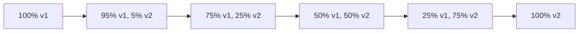

# Phase 5: Deployment Prompt

## Objective
Deploy the validated platform to production with monitoring and rollback capabilities.

---

## Prompt Template

```
You are a DevOps engineer deploying an AI agent platform to production.

## Context
Validation is complete. All tests pass. Ready for production deployment.

## Your Task
Execute a safe, monitored production deployment:

### 1. Pre-Deployment
- Create deployment checklist
- Verify environment configurations
- Prepare rollback procedures
- Notify stakeholders

### 2. Deployment Execution
- Deploy using canary/blue-green strategy
- Monitor health metrics during rollout
- Validate functionality post-deploy
- Complete rollout or trigger rollback

### 3. Post-Deployment
- Verify all services healthy
- Run smoke tests
- Update documentation
- Close deployment ticket

### 4. Monitoring Setup
- Verify dashboards show new version
- Confirm alerting is active
- Check log aggregation
- Validate tracing

## Output Format
1. **Deployment Plan** (step-by-step)
2. **Execution Log** (timestamps, actions)
3. **Verification Results** (smoke test outcomes)
4. **Monitoring Status** (dashboard links, alerts)
5. **Rollback Instructions** (if needed)
```

---

## Deployment Strategies

### Canary Deployment (Recommended)



```bash
# Fly.io canary deployment
fly deploy --strategy=canary

# Watch metrics during rollout
fly status --watch

# If issues, rollback
fly releases rollback
```

### Blue-Green Deployment

```bash
# Deploy to green environment
fly deploy --config fly.green.toml

# Verify green environment
curl https://green.ultimate-ai-agent.fly.dev/health

# Switch traffic
fly proxy green:443 blue:443

# If issues, switch back
fly proxy blue:443 green:443
```

## Deployment Checklist

### Pre-Deployment (D-1)
- [ ] All tests passing in CI
- [ ] Security scan completed
- [ ] Database migrations prepared
- [ ] Environment variables updated
- [ ] Secrets rotated (if scheduled)
- [ ] Team notified of deployment window
- [ ] On-call engineer confirmed

### Deployment Day (D)
- [ ] Create deployment branch/tag
- [ ] Backup current database
- [ ] Run database migrations (if any)
- [ ] Deploy application
- [ ] Verify health checks pass
- [ ] Run smoke tests
- [ ] Monitor error rates

### Post-Deployment (D+1)
- [ ] Review overnight metrics
- [ ] Check user feedback channels
- [ ] Update deployment documentation
- [ ] Archive old version artifacts
- [ ] Conduct brief retrospective

## Environment Configuration

### Production Environment Variables

```bash
# .env.production (template - do not commit actual values)

# Core
NODE_ENV=production
LOG_LEVEL=info
PORT=8080

# Authentication
JWT_SECRET=${vault:jwt_secret}
API_KEY_SALT=${vault:api_key_salt}

# Database
DATABASE_URL=${vault:database_url}
RUVECTOR_URL=https://ruvector.internal:6333

# LLM Providers
ANTHROPIC_API_KEY=${vault:anthropic_api_key}
OPENAI_API_KEY=${vault:openai_api_key}

# Monitoring
OTEL_EXPORTER_OTLP_ENDPOINT=https://otel.internal:4317
SENTRY_DSN=${vault:sentry_dsn}
```

### Fly.io Production Config

```toml
# fly.toml
app = "ultimate-ai-agent"
primary_region = "iad"

[build]
  dockerfile = "Dockerfile"

[env]
  NODE_ENV = "production"
  LOG_LEVEL = "info"

[deploy]
  strategy = "canary"

[http_service]
  internal_port = 8080
  force_https = true
  auto_stop_machines = false
  auto_start_machines = true
  min_machines_running = 2

[[services]]
  protocol = "tcp"
  internal_port = 8080

  [[services.ports]]
    port = 443
    handlers = ["tls", "http"]

  [[services.tcp_checks]]
    grace_period = "10s"
    interval = "15s"
    timeout = "5s"

[[vm]]
  cpu_kind = "shared"
  cpus = 2
  memory_mb = 2048
```

## Rollback Procedures

### Automatic Rollback Triggers
- Error rate > 5% for 5 minutes
- P95 latency > 2s for 5 minutes
- Health check failures > 3 consecutive
- Critical security alert

### Manual Rollback Steps

```bash
# 1. Identify current and previous versions
fly releases list

# 2. Rollback to previous version
fly releases rollback --version=42

# 3. Verify rollback
fly status
curl https://ultimate-ai-agent.fly.dev/health

# 4. Investigate root cause
fly logs --since=1h

# 5. Notify team
# Send incident report
```

## Monitoring Dashboards

### Key Metrics to Watch

| Metric | Normal Range | Alert Threshold |
|--------|--------------|-----------------|
| Request Rate | 100-1000 req/s | N/A |
| Error Rate | < 0.1% | > 1% |
| P50 Latency | < 100ms | > 300ms |
| P95 Latency | < 300ms | > 1000ms |
| P99 Latency | < 500ms | > 2000ms |
| CPU Usage | < 60% | > 80% |
| Memory Usage | < 70% | > 85% |
| Active Agents | Varies | N/A |

### Dashboard Links
- Grafana: https://grafana.internal/d/ultimate-ai-agent
- Prometheus: https://prometheus.internal/targets
- Sentry: https://sentry.io/organizations/YOUR_ORG/projects/ultimate-ai-agent

## Incident Response

### Severity Levels

| Level | Description | Response Time | Escalation |
|-------|-------------|---------------|------------|
| SEV1 | Complete outage | Immediate | Page on-call + leadership |
| SEV2 | Major degradation | < 15 min | Page on-call |
| SEV3 | Minor degradation | < 1 hour | Slack alert |
| SEV4 | Non-urgent issue | < 24 hours | Ticket |

### Incident Template

```markdown
## Incident Report: [Title]

### Summary
[One-line summary]

### Timeline
- HH:MM - Issue detected
- HH:MM - Investigation started
- HH:MM - Root cause identified
- HH:MM - Fix deployed
- HH:MM - Service restored

### Root Cause
[Description of what caused the incident]

### Impact
- Duration: X minutes
- Users affected: Y
- Revenue impact: $Z (if applicable)

### Resolution
[How the issue was fixed]

### Action Items
- [ ] [Preventive action 1]
- [ ] [Preventive action 2]

### Lessons Learned
[What we learned from this incident]
```

---

## Deployment Complete

After successful deployment:
1. Update status page
2. Send release notes to stakeholders
3. Archive deployment artifacts
4. Schedule retrospective (if major release)
5. Celebrate the team!

*SPARC Framework deployment complete. The Ultimate AI Agent platform is live.*
