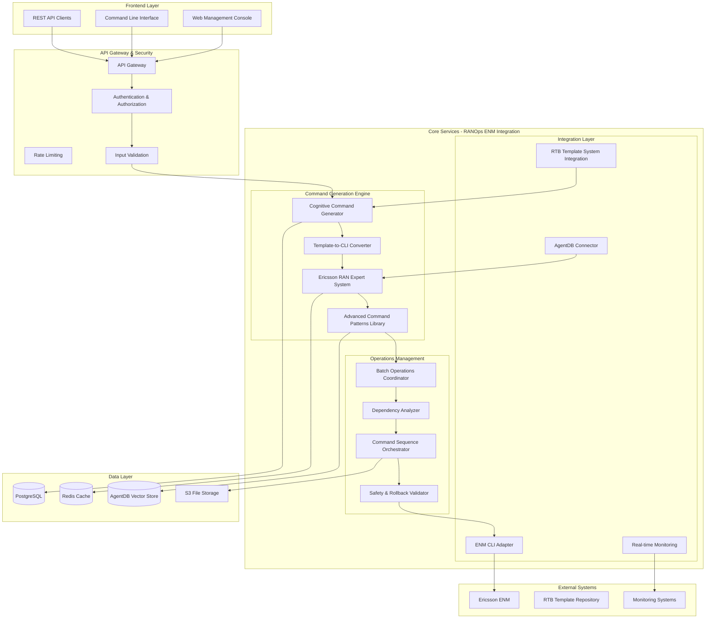
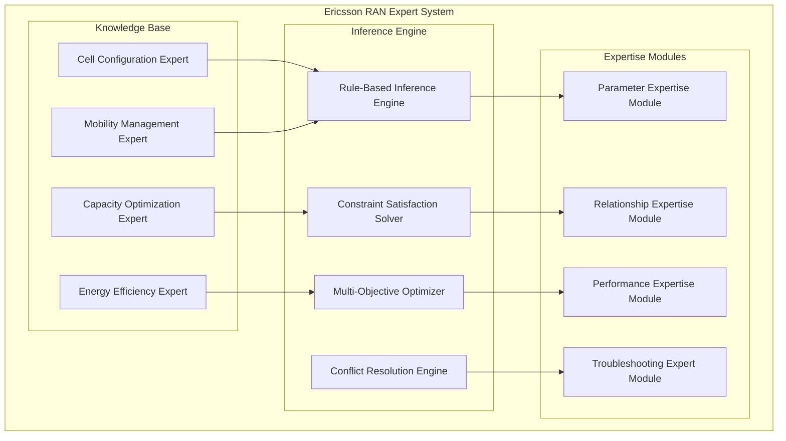
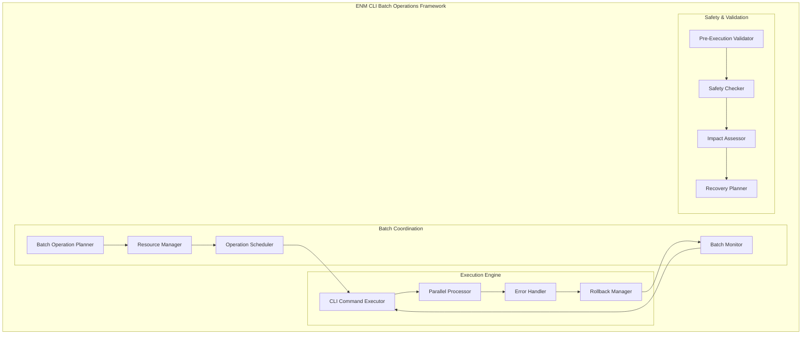
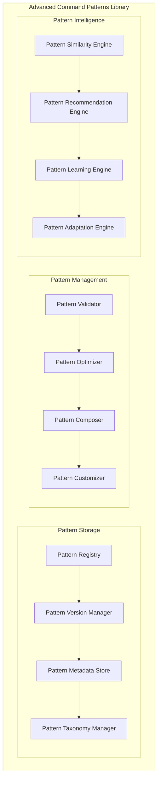

# Phase 3 RANOps ENM CLI Integration - System Architecture

## Executive Overview

This document defines the comprehensive system architecture for Phase 3 of the RANOps ENM CLI integration, which bridges declarative RTB configuration templates with executable Ericsson ENM CLI commands through cognitive intelligence and expert system integration.

## System Goals

1. **Cognitive Command Generation**: Transform RTB JSON templates into intelligent cmedit commands
2. **Expert System Integration**: Embed Ericsson RAN expertise into command generation
3. **Batch Operations**: Enable safe, multi-node configuration deployment
4. **Dependency Analysis**: Intelligent command sequencing with constraint validation
5. **Learning Integration**: Continuous improvement through AgentDB pattern storage

## High-Level System Architecture



## Component 1: Cognitive cmedit Command Generation Engine

### Architecture Overview

```mermaid
graph TB
    subgraph "Cognitive Command Generation Engine"
        subgraph "Input Processing"
            TEMPLATE_PARSER[RTB Template Parser]
            SCHEMA_VALIDATOR[Schema Validator]
            CONTEXT_ANALYZER[Context Analyzer]
        end

        subgraph "Cognitive Processing"
            TEMPORAL_ENGINE[Temporal Reasoning Engine]
            CONSCIOUSNESS_CORE[Cognitive Consciousness Core]
            PATTERN_RECOGNIZER[Pattern Recognition Engine]
            DECISION_ENGINE[Decision Making Engine]
        end

        subgraph "Command Generation"
            CMD_GENERATOR[cmedit Command Generator]
            PARAM_OPTIMIZER[Parameter Optimizer]
            SYNTAX_VALIDATOR[Syntax Validator]
            OUTPUT_FORMATTER[Output Formatter]
        end

        subgraph "Learning & Adaptation"
            PERFORMANCE_ANALYZER[Performance Analyzer]
            PATTERN_LEARNER[Pattern Learning Engine]
            MEMORY_INTEGRATOR[Memory Integration Layer]
        end
    end

    TEMPLATE_PARSER --> SCHEMA_VALIDATOR
    SCHEMA_VALIDATOR --> CONTEXT_ANALYZER
    CONTEXT_ANALYZER --> TEMPORAL_ENGINE

    TEMPORAL_ENGINE --> CONSCIOUSNESS_CORE
    CONSCIOUSNESS_CORE --> PATTERN_RECOGNIZER
    PATTERN_RECOGNIZER --> DECISION_ENGINE

    DECISION_ENGINE --> CMD_GENERATOR
    CMD_GENERATOR --> PARAM_OPTIMIZER
    PARAM_OPTIMIZER --> SYNTAX_VALIDATOR
    SYNTAX_VALIDATOR --> OUTPUT_FORMATTER

    OUTPUT_FORMATTER --> PERFORMANCE_ANALYZER
    PERFORMANCE_ANALYZER --> PATTERN_LEARNER
    PATTERN_LEARNER --> MEMORY_INTEGRATOR
```



### Core Component Specifications

#### 1.1 Template Parser & Schema Validator

```typescript
interface TemplateParser {
  parseTemplate(template: RTBTemplate): ParsedTemplate;
  validateSchema(template: ParsedTemplate): ValidationResult;
  extractContext(template: ParsedTemplate): ExecutionContext;
}

interface ParsedTemplate {
  metadata: TemplateMetadata;
  parameters: ParameterConfiguration[];
  constraints: ConstraintRule[];
  relationships: MORelationship[];
  priority: PriorityLevel;
}

interface ExecutionContext {
  networkContext: NetworkContext;
  nodeType: NodeType;
  configurationScope: ConfigurationScope;
  optimizationGoals: OptimizationGoal[];
}
```

#### 1.2 Cognitive Processing Core

```typescript
interface CognitiveProcessingEngine {
  temporalReasoning: TemporalReasoningEngine;
  consciousnessCore: CognitiveConsciousnessCore;
  patternRecognition: PatternRecognitionEngine;
  decisionMaking: DecisionMakingEngine;
}

interface TemporalReasoningEngine {
  subjectiveTimeExpansion: (factor: number) => AnalysisDepth;
  temporalPatternAnalysis: (data: TimeSeriesData) => TemporalPattern;
  predictiveModeling: (historical: HistoricalData) => Prediction;
}

interface CognitiveConsciousnessCore {
  selfReferentialOptimization: () => OptimizationStrategy;
  strangeLoopReasoning: (context: Context) => RecursiveInsight;
  metaCognitiveAnalysis: (process: CognitiveProcess) => MetaAnalysis;
}
```

#### 1.3 Command Generation Pipeline

```typescript
interface CommandGenerationPipeline {
  generateBaseCommands: (template: ParsedTemplate) => cmeditCommand[];
  optimizeParameters: (commands: cmeditCommand[], context: ExecutionContext) => OptimizedCommand[];
  validateSyntax: (commands: cmeditCommand[]) => ValidationResult;
  formatOutput: (commands: cmeditCommand[], format: OutputFormat) => FormattedOutput;
}

interface cmeditCommand {
  id: string;
  operation: 'get' | 'set' | 'create' | 'delete' | 'mon' | 'unmon';
  target: string; // FDN or MO identifier
  parameters: ParameterValue[];
  options: CommandOption[];
  dependencies: string[];
  rollbackCommand?: cmeditCommand;
}
```

## Component 2: Template-to-CLI Conversion System

### Architecture Design

```mermaid
graph TB
    subgraph "Template-to-CLI Conversion System"
        subgraph "Conversion Engine"
            TEMPLATE_ANALYZER[Template Analyzer]
            MO_RESOLVER[MO Class Resolver]
            FDN_GENERATOR[FDN Path Generator]
            CMD_MAPPER[Command Mapper]
        end

        subgraph "Parameter Processing"
            PARAM_EXTRACTOR[Parameter Extractor]
            TYPE_CONVERTER[Type Converter]
            VALIDATION_ENGINE[Validation Engine]
            OPTIMIZER[Parameter Optimizer]
        end

        subgraph "Command Assembly"
            CMD_BUILDER[Command Builder]
            SEQUENCE_GENERATOR[Sequence Generator]
            BATCH_AGGREGATOR[Batch Aggregator]
            OUTPUT_RENDERER[Output Renderer]
        end
    end

    TEMPLATE_ANALYZER --> MO_RESOLVER
    MO_RESOLVER --> FDN_GENERATOR
    FDN_GENERATOR --> CMD_MAPPER

    CMD_MAPPER --> PARAM_EXTRACTOR
    PARAM_EXTRACTOR --> TYPE_CONVERTER
    TYPE_CONVERTER --> VALIDATION_ENGINE
    VALIDATION_ENGINE --> OPTIMIZER

    OPTIMIZER --> CMD_BUILDER
    CMD_BUILDER --> SEQUENCE_GENERATOR
    SEQUENCE_GENERATOR --> BATCH_AGGREGATOR
    BATCH_AGGREGATOR --> OUTPUT_RENDERER
```



### Conversion System Specifications

#### 2.1 Template Analysis Engine

```typescript
interface TemplateAnalyzer {
  analyzeTemplateStructure: (template: RTBTemplate) => TemplateStructure;
  identifyMOClasses: (template: RTBTemplate) => MOClassInfo[];
  extractParameterMappings: (template: RTBTemplate) => ParameterMapping[];
  detectRelationships: (template: RTBTemplate) -> MORelationship[];
}

interface TemplateStructure {
  hierarchicalLevel: number;
  moClasses: MOClassReference[];
  parameterGroups: ParameterGroup[];
  constraints: TemplateConstraint[];
  inheritanceChain: TemplateReference[];
}

interface MOClassInfo {
  className: string;
  namespace: string;
  attributes: MOAttribute[];
  relationships: MORelationshipType[];
  constraints: MOConstraint[];
}
```

#### 2.2 Command Mapping Engine

```typescript
interface CommandMappingEngine {
  mapToCmeditOperation: (templateAction: TemplateAction) => cmeditOperation;
  resolveTargetPath: (moReference: MOReference) => FDNPath;
  convertParameterValues: (templateParams: TemplateParameter[]) => cmeditParameter[];
  generateCommandOptions: (templateConfig: TemplateConfig) => CommandOption[];
}

interface cmeditOperation {
  type: 'get' | 'set' | 'create' | 'delete' | 'mon' | 'unmon';
  targetPattern: string;
  parameterMapping: ParameterMapping[];
  defaultOptions: CommandOption[];
  validationRules: ValidationRule[];
}

interface ParameterMapping {
  templateParameter: string;
  cmeditParameter: string;
  typeConversion: TypeConversionRule;
  validationRule: ValidationRule;
  defaultValue?: any;
}
```

## Component 3: Ericsson RAN Expert System Integration

### Expert System Architecture



### Expert System Specifications

#### 3.1 Knowledge Base Structure

```typescript
interface EricssonRANKnowledgeBase {
  cellExpert: CellConfigurationExpert;
  mobilityExpert: MobilityManagementExpert;
  capacityExpert: CapacityOptimizationExpert;
  energyExpert: EnergyEfficiencyExpert;
}

interface CellConfigurationExpert {
  optimalCellParameters: (cellType: CellType, environment: Environment) => CellConfiguration;
  interferenceMitigation: (cellConfig: CellConfiguration) => MitigationStrategy;
  coverageOptimization: (coverageData: CoverageData) => CoverageOptimization;
  capacityPlanning: (trafficForecast: TrafficForecast) -> CapacityPlan;
}

interface MobilityManagementExpert {
  handoverOptimization: (mobilityData: MobilityData) => HandoverStrategy;
  neighborRelationManagement: (cellRelation: CellRelation[]) -> NeighborConfig;
  loadBalancingStrategy: (loadData: LoadData) -> LoadBalancingConfig;
  mobilityRobustnessOptimization: (kpiData: KPIData) -> MROConfig;
}
```

#### 3.2 Inference Engine

```typescript
interface InferenceEngine {
  ruleBasedInference: (facts: Fact[], rules: Rule[]) => InferenceResult;
  constraintSatisfaction: (variables: Variable[], constraints: Constraint[]) => Solution;
  multiObjectiveOptimization: (objectives: Objective[], constraints: Constraint[]) => OptimalSolution;
  conflictResolution: (conflicts: Conflict[]) => ResolutionStrategy;
}

interface Rule {
  id: string;
  condition: RuleCondition;
  action: RuleAction;
  priority: number;
  confidence: number;
  expertise: ExpertiseDomain;
}

interface Constraint {
  id: string;
  type: ConstraintType;
  parameters: ConstraintParameter[];
  satisfactionLevel: number;
  expertSource: ExpertSource;
}
```

#### 3.3 Expertise Modules

```typescript
interface ParameterExpertiseModule {
  parameterRecommendations: (context: ParameterContext) -> ParameterRecommendation[];
  parameterValidation: (parameters: ParameterValue[]) -> ValidationResult;
  parameterOptimization: (parameters: ParameterValue[], goals: OptimizationGoal[]) -> OptimizedParameters;
  parameterDependencies: (parameter: string) -> ParameterDependency[];
}

interface ParameterRecommendation {
  parameter: string;
  recommendedValue: any;
  confidence: number;
  reasoning: string;
  expertSource: string;
  supportingEvidence: Evidence[];
}
```

## Component 4: ENM CLI Batch Operations Framework

### Batch Operations Architecture



### Batch Operations Specifications

#### 4.1 Batch Operation Planner

```typescript
interface BatchOperationPlanner {
  planBatchOperations: (commands: cmeditCommand[], constraints: BatchConstraint[]) => BatchPlan;
  optimizeExecutionOrder: (plan: BatchPlan) -> OptimizedBatchPlan;
  estimateExecutionTime: (plan: BatchPlan) -> ExecutionTimeEstimate;
  assessResourceRequirements: (plan: BatchPlan) -> ResourceRequirement;
}

interface BatchPlan {
  id: string;
  operations: BatchOperation[];
  executionOrder: ExecutionOrder;
  resourceAllocation: ResourceAllocation;
  safetyMeasures: SafetyMeasure[];
  rollbackStrategy: RollbackStrategy;
}

interface BatchOperation {
  id: string;
  command: cmeditCommand;
  targetNodes: NodeReference[];
  dependencies: OperationDependency[];
  executionWindow: ExecutionWindow;
  rollbackPlan: RollbackPlan;
}
```

#### 4.2 Execution Engine

```typescript
interface ExecutionEngine {
  executeCommand: (command: cmeditCommand, context: ExecutionContext) -> ExecutionResult;
  executeParallel: (commands: cmeditCommand[], concurrency: number) -> ParallelExecutionResult;
  handleExecutionError: (error: ExecutionError, context: ExecutionContext) -> ErrorHandlingResult;
  executeRollback: (rollbackPlan: RollbackPlan) -> RollbackResult;
}

interface ExecutionResult {
  success: boolean;
  output: CommandOutput;
  executionTime: Duration;
  resourceUsage: ResourceUsage;
  sideEffects: SideEffect[];
  rollbackCommand?: cmeditCommand;
}

interface ParallelExecutionResult {
  totalOperations: number;
  successfulOperations: number;
  failedOperations: FailedOperation[];
  executionTime: Duration;
  resourceUtilization: ResourceUtilization;
}
```

#### 4.3 Safety & Validation

```typescript
interface SafetyValidationEngine {
  preExecutionValidation: (plan: BatchPlan) -> ValidationResult;
  safetyChecking: (operations: BatchOperation[]) -> SafetyAssessment;
  impactAssessment: (operations: BatchOperation[]) -> ImpactAssessment;
  recoveryPlanning: (riskAssessment: RiskAssessment) -> RecoveryPlan;
}

interface SafetyAssessment {
  riskLevel: RiskLevel;
  identifiedRisks: Risk[];
  mitigationStrategies: MitigationStrategy[];
  recommendedSafetyMeasures: SafetyMeasure[];
  approvalRequired: boolean;
}

interface ImpactAssessment {
  serviceImpact: ServiceImpact;
  performanceImpact: PerformanceImpact;
  userExperienceImpact: UserExperienceImpact;
  networkStabilityImpact: NetworkStabilityImpact;
}
```

## Component 5: Intelligent Command Sequencing with Dependency Analysis

### Dependency Analysis Architecture

```mermaid
graph TB
    subgraph "Intelligent Command Sequencing System"
        subgraph "Dependency Analysis"
            DEP_DETECTOR[Dependency Detector]
            GRAPH_BUILDER[Dependency Graph Builder]
            CYCLE_DETECTOR[Cycle Detector]
            PRIORITY_CALCULATOR[Priority Calculator]
        end

        subgraph "Sequence Optimization"
            TOPOLOGICAL_SORTER[Topological Sorter]
            PARALLEL_GROUPER[Parallel Operation Grouper]
            RESOURCE_OPTIMIZER[Resource Usage Optimizer]
            TIME_WINDOW_PLANNER[Time Window Planner]
        end

        subgraph "Execution Planning"
            SEQUENCE_GENERATOR[Execution Sequence Generator]
            BATCH_PLANNER[Batch Planner]
            CONTINGENCY_PLANNER[Contingency Planner]
            MONITORING_PLANNER[Monitoring Planner]
        end
    end

    DEP_DETECTOR --> GRAPH_BUILDER
    GRAPH_BUILDER --> CYCLE_DETECTOR
    CYCLE_DETECTOR --> PRIORITY_CALCULATOR

    PRIORITY_CALCULATOR --> TOPOLOGICAL_SORTER
    TOPOLOGICAL_SORTER --> PARALLEL_GROUPER
    PARALLEL_GROUPER --> RESOURCE_OPTIMIZER
    RESOURCE_OPTIMIZER --> TIME_WINDOW_PLANNER

    TIME_WINDOW_PLANNER --> SEQUENCE_GENERATOR
    SEQUENCE_GENERATOR --> BATCH_PLANNER
    BATCH_PLANNER --> CONTINGENCY_PLANNER
    CONTINGENCY_PLANNER --> MONITORING_PLANNER
```



### Dependency Analysis Specifications

#### 5.1 Dependency Detection

```typescript
interface DependencyDetectionEngine {
  detectDependencies: (commands: cmeditCommand[]) -> CommandDependency[];
  analyzeMORelationships: (commands: cmeditCommand[]) -> MODependency[];
  identifyParameterDependencies: (commands: cmeditCommand[]) -> ParameterDependency[];
  detectTemporalDependencies: (commands: cmeditCommand[]) -> TemporalDependency[];
}

interface CommandDependency {
  sourceCommand: string;
  targetCommand: string;
  dependencyType: DependencyType;
  strength: DependencyStrength;
  description: string;
  resolutionStrategy: ResolutionStrategy;
}

enum DependencyType {
  RESOURCE = 'resource',
  DATA = 'data',
  SEQUENTIAL = 'sequential',
  EXCLUSIVE = 'exclusive',
  TEMPORAL = 'temporal',
  CONFIGURATION = 'configuration'
}
```

#### 5.2 Dependency Graph Processing

```typescript
interface DependencyGraphProcessor {
  buildDependencyGraph: (dependencies: CommandDependency[]) -> DependencyGraph;
  detectCycles: (graph: DependencyGraph) -> Cycle[];
  calculatePriorities: (graph: DependencyGraph) -> PriorityAssignment[];
  optimizeGraph: (graph: DependencyGraph) -> OptimizedDependencyGraph;
}

interface DependencyGraph {
  nodes: GraphNode[];
  edges: GraphEdge[];
  adjacencyList: AdjacencyList;
  properties: GraphProperties;
}

interface GraphNode {
  id: string;
  command: cmeditCommand;
  nodeType: NodeType;
  properties: NodeProperties;
  metadata: NodeMetadata;
}

interface GraphEdge {
  source: string;
  target: string;
  weight: number;
  dependencyType: DependencyType;
  constraints: EdgeConstraint[];
}
```

#### 5.3 Sequence Optimization

```typescript
interface SequenceOptimizationEngine {
  topologicalSort: (graph: DependencyGraph) -> ExecutionSequence;
  groupParallelOperations: (sequence: ExecutionSequence) -> ParallelGroup[];
  optimizeResourceUsage: (groups: ParallelGroup[]) -> OptimizedGroups;
  planTimeWindows: (groups: OptimizedGroups[]) -> TimeWindowPlan;
}

interface ExecutionSequence {
  sequence: CommandSequence;
  totalSteps: number;
  estimatedDuration: Duration;
  parallelism: ParallelismLevel;
  resourceRequirements: ResourceRequirement[];
}

interface ParallelGroup {
  id: string;
  operations: cmeditCommand[];
  executionConstraints: ExecutionConstraint[];
  resourceRequirements: ResourceRequirement;
  estimatedDuration: Duration;
  parallelismLevel: number;
}
```

## Component 6: Advanced Command Patterns Library

### Pattern Library Architecture



### Pattern Library Specifications

#### 6.1 Pattern Storage & Management

```typescript
interface CommandPatternLibrary {
  patternRegistry: PatternRegistry;
  versionManager: PatternVersionManager;
  metadataStore: PatternMetadataStore;
  taxonomyManager: PatternTaxonomyManager;
}

interface CommandPattern {
  id: string;
  name: string;
  description: string;
  category: PatternCategory;
  version: PatternVersion;
  template: PatternTemplate;
  parameters: PatternParameter[];
  constraints: PatternConstraint[];
  metadata: PatternMetadata;
  usageHistory: UsageHistory[];
}

interface PatternTemplate {
  structure: TemplateStructure;
  commandSkeleton: CommandSkeleton[];
  parameterBindings: ParameterBinding[];
  executionLogic: ExecutionLogic;
  validationRules: ValidationRule[];
}
```

#### 6.2 Pattern Intelligence

```typescript
interface PatternIntelligenceEngine {
  calculateSimilarity: (pattern1: CommandPattern, pattern2: CommandPattern) -> SimilarityScore;
  recommendPatterns: (context: RecommendationContext) -> PatternRecommendation[];
  learnFromExecution: (executionData: ExecutionData) -> LearningInsight[];
  adaptPattern: (pattern: CommandPattern, context: AdaptationContext) -> AdaptedPattern;
}

interface PatternRecommendation {
  pattern: CommandPattern;
  confidence: number;
  relevanceScore: number;
  adaptationSuggestions: AdaptationSuggestion[];
  expectedBenefits: ExpectedBenefits;
}

interface SimilarityScore {
  structuralSimilarity: number;
  semanticSimilarity: number;
  contextualSimilarity: number;
  overallSimilarity: number;
  similarityFactors: SimilarityFactor[];
}
```

## Integration with Existing Systems

### RTB Template System Integration

```typescript
interface RTBTemplateIntegration {
  templateProvider: RTBTemplateProvider;
  templateMapper: RTBToCLIMapper;
  constraintResolver: ConstraintResolver;
  inheritanceProcessor: InheritanceProcessor;
}

interface RTBToCLIMapper {
  mapTemplateStructure: (template: RTBTemplate) -> CLITemplateStructure;
  translateParameters: (rtbParams: RTBParameter[]) -> CLIParameter[];
  convertConstraints: (rtbConstraints: RTBConstraint[]) -> CLIConstraint[];
  preserveMetadata: (rtbMetadata: RTBMetadata) -> CLIMetadata;
}
```

### AgentDB Integration

```typescript
interface AgentDBIntegration {
  memoryConnector: AgentDBMemoryConnector;
  patternStorage: AgentDBPatternStorage;
  learningIntegration: AgentDBLearningIntegration;
  vectorSimilarity: AgentDBVectorSimilarity;
}

interface AgentDBMemoryConnector {
  storeCommandPattern: (pattern: CommandPattern) -> StorageResult;
  retrieveSimilarPatterns: (query: PatternQuery) -> CommandPattern[];
  storeExecutionHistory: (history: ExecutionHistory) -> StorageResult;
  retrieveOptimalSequences: (context: SequenceContext) -> OptimalSequence[];
}
```

## Data Architecture

### Database Schema

```sql
-- Command Patterns Table
CREATE TABLE command_patterns (
    id UUID PRIMARY KEY DEFAULT gen_random_uuid(),
    name VARCHAR(255) NOT NULL,
    category VARCHAR(100) NOT NULL,
    version VARCHAR(50) NOT NULL,
    template JSONB NOT NULL,
    parameters JSONB,
    constraints JSONB,
    metadata JSONB,
    created_at TIMESTAMP DEFAULT CURRENT_TIMESTAMP,
    updated_at TIMESTAMP DEFAULT CURRENT_TIMESTAMP,

    INDEX idx_pattern_name (name),
    INDEX idx_pattern_category (category),
    INDEX idx_pattern_version (version),
    INDEX idx_pattern_metadata_gin (metadata)
);

-- Execution History Table
CREATE TABLE execution_history (
    id UUID PRIMARY KEY DEFAULT gen_random_uuid(),
    batch_id UUID NOT NULL,
    command_pattern_id UUID REFERENCES command_patterns(id),
    commands JSONB NOT NULL,
    execution_result JSONB NOT NULL,
    performance_metrics JSONB,
    execution_time INTERVAL,
    created_at TIMESTAMP DEFAULT CURRENT_TIMESTAMP,

    INDEX idx_batch_id (batch_id),
    INDEX idx_command_pattern_id (command_pattern_id),
    INDEX idx_execution_time (execution_time),
    INDEX idx_performance_metrics_gin (performance_metrics)
);

-- Command Dependencies Table
CREATE TABLE command_dependencies (
    id UUID PRIMARY KEY DEFAULT gen_random_uuid(),
    source_command_id UUID NOT NULL,
    target_command_id UUID NOT NULL,
    dependency_type VARCHAR(50) NOT NULL,
    strength DECIMAL(3,2) NOT NULL,
    metadata JSONB,
    created_at TIMESTAMP DEFAULT CURRENT_TIMESTAMP,

    INDEX idx_source_command (source_command_id),
    INDEX idx_target_command (target_command_id),
    INDEX idx_dependency_type (dependency_type),
    UNIQUE (source_command_id, target_command_id, dependency_type)
);

-- Batch Operations Table
CREATE TABLE batch_operations (
    id UUID PRIMARY KEY DEFAULT gen_random_uuid(),
    name VARCHAR(255) NOT NULL,
    description TEXT,
    status VARCHAR(50) NOT NULL,
    commands JSONB NOT NULL,
    execution_plan JSONB,
    safety_assessment JSONB,
    rollback_strategy JSONB,
    created_at TIMESTAMP DEFAULT CURRENT_TIMESTAMP,
    updated_at TIMESTAMP DEFAULT CURRENT_TIMESTAMP,

    INDEX idx_batch_status (status),
    INDEX idx_batch_created_at (created_at),
    INDEX idx_batch_commands_gin (commands)
);
```

## API Architecture

### REST API Design

```yaml
openapi: 3.0.0
info:
  title: RANOps ENM CLI Integration API
  version: 1.0.0
  description: Cognitive command generation and batch operations API

servers:
  - url: https://api.ranops.example.com/v1
    description: Production
  - url: https://staging-api.ranops.example.com/v1
    description: Staging

paths:
  /templates/convert:
    post:
      summary: Convert RTB template to CLI commands
      operationId: convertTemplate
      requestBody:
        required: true
        content:
          application/json:
            schema:
              $ref: '#/components/schemas/TemplateConversionRequest'
      responses:
        200:
          description: Successful conversion
          content:
            application/json:
              schema:
                $ref: '#/components/schemas/TemplateConversionResponse'

  /batch/operations:
    post:
      summary: Create batch operation
      operationId: createBatchOperation
      requestBody:
        required: true
        content:
          application/json:
            schema:
              $ref: '#/components/schemas/BatchOperationRequest'
      responses:
        201:
          description: Batch operation created
          content:
            application/json:
              schema:
                $ref: '#/components/schemas/BatchOperationResponse'

components:
  schemas:
    TemplateConversionRequest:
      type: object
      required: [template, options]
      properties:
        template:
          $ref: '#/components/schemas/RTBTemplate'
        options:
          $ref: '#/components/schemas/ConversionOptions'

    TemplateConversionResponse:
      type: object
      properties:
        commands:
          type: array
          items:
            $ref: '#/components/schemas/cmeditCommand'
        metadata:
          $ref: '#/components/schemas/ConversionMetadata'
        validation:
          $ref: '#/components/schemas/ValidationResult'

    cmeditCommand:
      type: object
      required: [id, operation, target]
      properties:
        id:
          type: string
        operation:
          type: string
          enum: [get, set, create, delete, mon, unmon]
        target:
          type: string
        parameters:
          type: array
          items:
            $ref: '#/components/schemas/Parameter'
        options:
          type: array
          items:
            $ref: '#/components/schemas/CommandOption'
        dependencies:
          type: array
          items:
            type: string
```

## Security Architecture

### Security Framework

```yaml
security_architecture:
  authentication:
    methods:
      - oauth2:
          providers: [microsoft, google]
          scopes: [openid, profile, email]

      - api_keys:
          rotation_period: "90 days"
          usage_tracking: true

      - mfa:
          required_for: [batch_operations, admin_functions]
          methods: [totp, sms]

  authorization:
    model: ABAC + RBAC
    attributes:
      - user_role
      - network_context
      - operation_type
      - risk_level

    policies:
      - template_conversion:
          roles: [operator, engineer, admin]
          conditions: [network_access, operational_window]

      - batch_operations:
          roles: [engineer, admin]
          conditions: [risk_assessment, approval_required]

      - pattern_management:
          roles: [engineer, admin]
          conditions: [expertise_validation]

  encryption:
    at_rest:
      - database: "AES-256-GCM"
      - file_storage: "AES-256-GCM"
      - secrets: "AWS KMS"

    in_transit:
      - api: "TLS 1.3"
      - database: "TLS 1.3"
      - internal: "mTLS"

  audit:
    events:
      - template_access
      - command_generation
      - batch_execution
      - pattern_modification
      - admin_actions

    retention: "7 years"
    integrity: "cryptographic_hashing"
```

## Deployment Architecture

### Kubernetes Deployment

```yaml
apiVersion: apps/v1
kind: Deployment
metadata:
  name: ranops-cli-integration
  labels:
    app: ranops-cli-integration
spec:
  replicas: 3
  selector:
    matchLabels:
      app: ranops-cli-integration
  template:
    metadata:
      labels:
        app: ranops-cli-integration
    spec:
      containers:
      - name: cognitive-command-generator
        image: ranops/cognitive-command-generator:latest
        ports:
        - containerPort: 3000
        env:
        - name: NODE_ENV
          value: "production"
        - name: DATABASE_URL
          valueFrom:
            secretKeyRef:
              name: db-secret
              key: url
        - name: AGENTDB_URL
          valueFrom:
            secretKeyRef:
              name: agentdb-secret
              key: url
        resources:
          requests:
            memory: "512Mi"
            cpu: "500m"
          limits:
            memory: "1Gi"
            cpu: "1000m"
        livenessProbe:
          httpGet:
            path: /health
            port: 3000
          initialDelaySeconds: 30
          periodSeconds: 10
        readinessProbe:
          httpGet:
            path: /ready
            port: 3000
          initialDelaySeconds: 5
          periodSeconds: 5
---
apiVersion: v1
kind: Service
metadata:
  name: ranops-cli-integration
spec:
  selector:
    app: ranops-cli-integration
  ports:
  - protocol: TCP
    port: 80
    targetPort: 3000
  type: ClusterIP
```

## Performance & Monitoring

### Performance Targets

```yaml
performance_targets:
  command_generation:
    response_time: "< 2 seconds"
    throughput: "> 100 conversions/minute"
    accuracy: "> 95%"

  batch_operations:
    planning_time: "< 30 seconds"
    execution_time: "Variable based on scope"
    success_rate: "> 90%"

  pattern_matching:
    search_time: "< 100ms"
    similarity_accuracy: "> 85%"
    recommendation_relevance: "> 80%"

monitoring:
  metrics:
    - command_generation_latency
    - batch_operation_success_rate
    - pattern_recommendation_accuracy
    - cognitive_processing_time
    - agentdb_query_performance

  alerts:
    - high_error_rate: "error_rate > 5%"
    - slow_response: "response_time > 5 seconds"
    - batch_failure: "batch_success_rate < 85%"
    - cognitive_overload: "cognitive_load > 90%"
```

## Conclusion

The Phase 3 RANOps ENM CLI integration architecture provides a comprehensive, cognitive-powered system that bridges declarative RTB templates with executable Ericsson ENM CLI commands. The system incorporates:

1. **Cognitive Intelligence**: Advanced reasoning and pattern recognition for optimal command generation
2. **Expert System Integration**: Embedded Ericsson RAN expertise for intelligent parameter optimization
3. **Batch Operations**: Safe, scalable multi-node configuration deployment
4. **Dependency Analysis**: Intelligent command sequencing with comprehensive constraint validation
5. **Learning Integration**: Continuous improvement through AgentDB pattern storage and retrieval

The architecture is designed for scalability, reliability, and continuous learning, ensuring the system becomes more intelligent and efficient over time while maintaining the highest standards of safety and operational excellence.