# Phase 4 API Design Architecture: Cognitive Consciousness Services

## Overview

The Phase 4 API architecture provides comprehensive interfaces for cognitive RAN optimization services, supporting RESTful operations, real-time WebSocket streams, and complex GraphQL queries. The API design enables seamless integration with existing systems while providing advanced cognitive capabilities.

## API Architecture Layers

```mermaid
graph TB
    subgraph "API Gateway Layer"
        GATEWAY[API Gateway]
        RATE_LIMIT[Rate Limiting]
        AUTH[Authentication & Authorization]
        LOAD_BALANCER[Load Balancer]
    end

    subgraph "REST API Layer"
        COGNITIVE_REST[Cognitive Optimization API]
        TEMPORAL_REST[Temporal Analysis API]
        EVAL_REST[Python Evaluation API]
        MEMORY_REST[AgentDB Memory API]
    end

    subgraph "WebSocket Streaming Layer"
        COGNITIVE_WS[Cognitive Streams]
        TEMPORAL_WS[Temporal Streams]
        CONSCIOUSNESS_WS[Consciousness Streams]
        PERFORMANCE_WS[Performance Streams]
    end

    subgraph "GraphQL Interface Layer"
        COGNITIVE_GQL[Cognitive Queries]
        ANALYTICS_GQL[Analytics Queries]
        HISTORICAL_GQL[Historical Data Queries]
        PREDICTION_GQL[Prediction Queries]
    end

    subgraph "Core Services"
        COGNITIVE_CORE[Cognitive Consciousness Core]
        TEMPORAL_CORE[Temporal Reasoning Engine]
        EVAL_ENGINE[Python Evaluation Engine]
        AGENTDB[AgentDB Integration]
    end

    GATEWAY --> COGNITIVE_REST
    GATEWAY --> TEMPORAL_REST
    GATEWAY --> EVAL_REST
    GATEWAY --> MEMORY_REST

    GATEWAY --> COGNITIVE_WS
    GATEWAY --> TEMPORAL_WS
    GATEWAY --> CONSCIOUSNESS_WS
    GATEWAY --> PERFORMANCE_WS

    GATEWAY --> COGNITIVE_GQL
    GATEWAY --> ANALYTICS_GQL
    GATEWAY --> HISTORICAL_GQL
    GATEWAY --> PREDICTION_GQL

    COGNITIVE_REST --> COGNITIVE_CORE
    TEMPORAL_REST --> TEMPORAL_CORE
    EVAL_REST --> EVAL_ENGINE
    MEMORY_REST --> AGENTDB
```



## 1. RESTful API Design

### 1.1 Cognitive Optimization API

```yaml
openapi: 3.0.3
info:
  title: Cognitive RAN Consciousness API
  version: 4.0.0
  description: Phase 4 Cognitive Consciousness & Python Custom Logic API
  contact:
    name: RAN Automation Team
    email: ran-automation@example.com
  license:
    name: MIT
    url: https://opensource.org/licenses/MIT

servers:
  - url: https://api.ran-automation.com/v4
    description: Production server
  - url: https://staging-api.ran-automation.com/v4
    description: Staging server
  - url: https://dev-api.ran-automation.com/v4
    description: Development server

security:
  - bearerAuth: []
  - apiKeyAuth: []

paths:
  /cognitive/optimization:
    post:
      summary: Execute cognitive optimization cycle
      operationId: executeCognitiveOptimization
      tags: [Cognitive Optimization]
      requestBody:
        required: true
        content:
          application/json:
            schema:
              $ref: '#/components/schemas/CognitiveOptimizationRequest'
      responses:
        '200':
          description: Cognitive optimization completed successfully
          content:
            application/json:
              schema:
                $ref: '#/components/schemas/CognitiveOptimizationResult'
        '400':
          $ref: '#/components/responses/BadRequest'
        '401':
          $ref: '#/components/responses/Unauthorized'
        '500':
          $ref: '#/components/responses/InternalServerError'
      security:
        - bearerAuth: []

    get:
      summary: List cognitive optimization history
      operationId: listCognitiveOptimizations
      tags: [Cognitive Optimization]
      parameters:
        - $ref: '#/components/parameters/Limit'
        - $ref: '#/components/parameters/Offset'
        - $ref: '#/components/parameters/StartDate'
        - $ref: '#/components/parameters/EndDate'
        - $ref: '#/components/parameters/Status'
      responses:
        '200':
          description: List of cognitive optimizations
          content:
            application/json:
              schema:
                $ref: '#/components/schemas/CognitiveOptimizationList'
      security:
        - bearerAuth: []

  /cognitive/optimization/{optimizationId}:
    get:
      summary: Get specific cognitive optimization details
      operationId: getCognitiveOptimization
      tags: [Cognitive Optimization]
      parameters:
        - $ref: '#/components/parameters/OptimizationId'
      responses:
        '200':
          description: Cognitive optimization details
          content:
            application/json:
              schema:
                $ref: '#/components/schemas/CognitiveOptimizationResult'
        '404':
          $ref: '#/components/responses/NotFound'
      security:
        - bearerAuth: []

  /temporal/analysis:
    post:
      summary: Perform temporal analysis with expansion
      operationId: performTemporalAnalysis
      tags: [Temporal Analysis]
      requestBody:
        required: true
        content:
          application/json:
            schema:
              $ref: '#/components/schemas/TemporalAnalysisRequest'
      responses:
        '200':
          description: Temporal analysis completed
          content:
            application/json:
              schema:
                $ref: '#/components/schemas/TemporalAnalysisResult'
        '400':
          $ref: '#/components/responses/BadRequest'
        '500':
          $ref: '#/components/responses/InternalServerError'
      security:
        - bearerAuth: []

  /evaluation/python:
    post:
      summary: Generate and execute Python evaluation function
      operationId: executePythonEvaluation
      tags: [Python Evaluation]
      requestBody:
        required: true
        content:
          application/json:
            schema:
              $ref: '#/components/schemas/PythonEvaluationRequest'
      responses:
        '200':
          description: Python evaluation completed
          content:
            application/json:
              schema:
                $ref: '#/components/schemas/PythonEvaluationResult'
        '400':
          $ref: '#/components/responses/BadRequest'
        '500':
          $ref: '#/components/responses/InternalServerError'
      security:
        - bearerAuth: []

  /memory/patterns:
    post:
      summary: Store cognitive pattern in AgentDB
      operationId: storeCognitivePattern
      tags: [AgentDB Memory]
      requestBody:
        required: true
        content:
          application/json:
            schema:
              $ref: '#/components/schemas/StorePatternRequest'
      responses:
        '201':
          description: Pattern stored successfully
          content:
            application/json:
              schema:
                $ref: '#/components/schemas/StorePatternResult'
        '400':
          $ref: '#/components/responses/BadRequest'
        '500':
          $ref: '#/components/responses/InternalServerError'
      security:
        - bearerAuth: []

    get:
      summary: Search similar patterns in AgentDB
      operationId: searchSimilarPatterns
      tags: [AgentDB Memory]
      parameters:
        - $ref: '#/components/parameters/Query'
        - $ref: '#/components/parameters/Threshold'
        - $ref: '#/components/parameters/Limit'
        - $ref: '#/components/parameters/PatternType'
      responses:
        '200':
          description: Similar patterns found
          content:
            application/json:
              schema:
                $ref: '#/components/schemas/SimilarPatternsResult'
      security:
        - bearerAuth: []

  /consciousness/status:
    get:
      summary: Get current consciousness evolution status
      operationId: getConsciousnessStatus
      tags: [Consciousness Evolution]
      responses:
        '200':
          description: Current consciousness status
          content:
            application/json:
              schema:
                $ref: '#/components/schemas/ConsciousnessStatus'
      security:
        - bearerAuth: []

  /consciousness/evolve:
    post:
      summary: Trigger consciousness evolution
      operationId: evolveConsciousness
      tags: [Consciousness Evolution]
      requestBody:
        required: true
        content:
          application/json:
            schema:
              $ref: '#/components/schemas/ConsciousnessEvolutionRequest'
      responses:
        '200':
          description: Consciousness evolution completed
          content:
            application/json:
              schema:
                $ref: '#/components/schemas/ConsciousnessEvolutionResult'
        '400':
          $ref: '#/components/responses/BadRequest'
        '500':
          $ref: '#/components/responses/InternalServerError'
      security:
        - bearerAuth: []

components:
  securitySchemes:
    bearerAuth:
      type: http
      scheme: bearer
      bearerFormat: JWT
      description: JWT token for authentication

    apiKeyAuth:
      type: apiKey
      in: header
      name: X-API-Key
      description: API key for service-to-service authentication

  schemas:
    CognitiveOptimizationRequest:
      type: object
      required: [systemState, optimizationTargets]
      properties:
        systemState:
          $ref: '#/components/schemas/SystemState'
        optimizationTargets:
          type: array
          items:
            $ref: '#/components/schemas/OptimizationTarget'
        temporalExpansion:
          type: number
          default: 1000
          minimum: 10
          maximum: 10000
          description: Subjective time expansion factor
        consciousnessLevel:
          type: number
          default: 1.0
          minimum: 0.1
          maximum: 1.0
          description: Current consciousness level (0.1-1.0)
        strangeLoopEnabled:
          type: boolean
          default: true
          description: Enable strange-loop cognition
        maxRecursionDepth:
          type: integer
          default: 10
          minimum: 1
          maximum: 20
          description: Maximum recursion depth for strange-loop optimization
        priority:
          type: string
          enum: [low, medium, high, critical]
          default: medium
          description: Optimization priority

    SystemState:
      type: object
      required: [networkId, timestamp, kpis]
      properties:
        networkId:
          type: string
          description: Unique network identifier
        timestamp:
          type: integer
          format: int64
          description: Unix timestamp of state capture
        kpis:
          type: object
          description: Key Performance Indicators
          additionalProperties:
            type: number
        alarms:
          type: array
          items:
            $ref: '#/components/schemas/Alarm'
          description: Active alarms
        configuration:
          type: object
          description: Current network configuration
        topology:
          type: object
          description: Network topology information

    OptimizationTarget:
      type: object
      required: [type, objective]
      properties:
        type:
          type: string
          enum: [energy, mobility, coverage, capacity, quality, performance]
          description: Type of optimization target
        objective:
          type: string
          description: Optimization objective
        parameters:
          type: object
          description: Target-specific parameters
        constraints:
          type: object
          description: Optimization constraints
        priority:
          type: integer
          minimum: 1
          maximum: 10
          description: Target priority (1-10)

    CognitiveOptimizationResult:
      type: object
      required: [success, optimizationId, timestamp]
      properties:
        success:
          type: boolean
          description: Whether optimization was successful
        optimizationId:
          type: string
          description: Unique optimization identifier
        timestamp:
          type: integer
          format: int64
          description: Optimization completion timestamp
        consciousnessLevel:
          type: number
          description: Consciousness level during optimization
        evolutionScore:
          type: number
          description: Consciousness evolution score
        temporalInsights:
          $ref: '#/components/schemas/TemporalInsights'
        strangeLoopResults:
          $ref: '#/components/schemas/StrangeLoopResults'
        recommendations:
          type: array
          items:
            $ref: '#/components/schemas/OptimizationRecommendation'
          description: Generated optimization recommendations
        performanceMetrics:
          $ref: '#/components/schemas/PerformanceMetrics'
        executionSummary:
          $ref: '#/components/schemas/ExecutionSummary'
        error:
          $ref: '#/components/schemas/ErrorInfo'
          description: Error details if optimization failed

    TemporalInsights:
      type: object
      properties:
        expansionFactor:
          type: integer
          description: Applied time expansion factor
        analysisDepth:
          type: string
          enum: [shallow, medium, deep, maximum]
          description: Temporal analysis depth
        patterns:
          type: array
          items:
            $ref: '#/components/schemas/TemporalPattern'
          description: Discovered temporal patterns
        predictions:
          type: array
          items:
            $ref: '#/components/schemas/TemporalPrediction'
          description: Temporal predictions
        confidence:
          type: number
          minimum: 0
          maximum: 1
          description: Overall confidence in temporal analysis
        accuracy:
          type: number
          minimum: 0
          maximum: 1
          description: Temporal analysis accuracy

    StrangeLoopResults:
      type: object
      properties:
        iterations:
          type: integer
          description: Number of strange-loop iterations
        selfReferenceQuality:
          type: number
          minimum: 0
          maximum: 1
          description: Quality of self-reference optimization
        optimizationPotential:
          type: number
          minimum: 0
          maximum: 1
          description: Measured optimization potential
        metaOptimization:
          $ref: '#/components/schemas/MetaOptimizationResult'
        recursivePatterns:
          type: array
          items:
            $ref: '#/components/schemas/RecursivePattern'
          description: Discovered recursive patterns
        convergenceStatus:
          type: string
          enum: [converged, diverging, oscillating, incomplete]
          description: Convergence status of strange-loop optimization

    OptimizationRecommendation:
      type: object
      required: [id, type, description]
      properties:
        id:
          type: string
          description: Unique recommendation identifier
        type:
          type: string
          enum: [parameter_adjustment, feature_activation, configuration_change]
          description: Type of recommendation
        description:
          type: string
          description: Detailed recommendation description
        impact:
          type: object
          properties:
            energy:
              type: number
              description: Expected energy impact (%)
            performance:
              type: number
              description: Expected performance impact (%)
            quality:
              type: number
              description: Expected quality impact (%)
        confidence:
          type: number
          minimum: 0
          maximum: 1
          description: Confidence in recommendation
        priority:
          type: integer
          minimum: 1
          maximum: 10
          description: Recommendation priority
        riskLevel:
          type: string
          enum: [low, medium, high, critical]
          description: Risk level of implementation
        implementationPlan:
          $ref: '#/components/schemas/ImplementationPlan'
        rollbackPlan:
          $ref: '#/components/schemas/RollbackPlan'

    ImplementationPlan:
      type: object
      properties:
        steps:
          type: array
          items:
            $ref: '#/components/schemas/ImplementationStep'
          description: Implementation steps
        estimatedDuration:
          type: integer
          description: Estimated implementation duration (seconds)
        dependencies:
          type: array
          items:
            type: string
          description: Implementation dependencies
        resources:
          type: array
          items:
            type: string
          description: Required resources

    ImplementationStep:
      type: object
      required: [id, action, description]
      properties:
        id:
          type: string
          description: Step identifier
        action:
          type: string
          description: Action to perform
        description:
          type: string
          description: Step description
        target:
          type: string
          description: Target of the action
        parameters:
          type: object
          description: Action parameters
        expectedResult:
          type: string
          description: Expected result of step
        timeout:
          type: integer
          description: Step timeout (seconds)
        retryPolicy:
          $ref: '#/components/schemas/RetryPolicy'

    RollbackPlan:
      type: object
      properties:
        available:
          type: boolean
          description: Whether rollback is available
        steps:
          type: array
          items:
            $ref: '#/components/schemas/ImplementationStep'
          description: Rollback steps
        estimatedDuration:
          type: integer
          description: Estimated rollback duration (seconds)
        riskAssessment:
          type: string
          description: Rollback risk assessment

    PerformanceMetrics:
      type: object
      properties:
        executionTime:
          type: integer
          description: Total execution time (milliseconds)
        cpuUtilization:
          type: number
          description: CPU utilization percentage
        memoryUtilization:
          type: number
          description: Memory utilization percentage
        networkLatency:
          type: number
          description: Network latency (milliseconds)
        successRate:
          type: number
          minimum: 0
          maximum: 1
          description: Success rate of operations
        cognitiveLoad:
          type: number
          minimum: 0
          maximum: 1
          description: Cognitive system load
        temporalExpansionEfficiency:
          type: number
          minimum: 0
          maximum: 1
          description: Efficiency of temporal expansion

    ExecutionSummary:
      type: object
      properties:
        totalActions:
          type: integer
          description: Total number of actions executed
        successfulActions:
          type: integer
          description: Number of successful actions
        failedActions:
          type: integer
          description: Number of failed actions
        executionTime:
          type: integer
          description: Total execution time (milliseconds)
        resourceUtilization:
          $ref: '#/components/schemas/ResourceUtilization'

    ResourceUtilization:
      type: object
      properties:
        cpu:
          type: number
          description: CPU utilization (%)
        memory:
          type: number
          description: Memory utilization (%)
        network:
          type: number
          description: Network utilization (%)
        storage:
          type: number
          description: Storage utilization (%)

    ErrorInfo:
      type: object
      properties:
        code:
          type: string
          description: Error code
        message:
          type: string
          description: Error message
        details:
          type: object
          description: Additional error details
        timestamp:
          type: integer
          format: int64
          description: Error timestamp
        stackTrace:
          type: string
          description: Error stack trace

    Alarm:
      type: object
      properties:
        id:
          type: string
          description: Alarm identifier
        severity:
          type: string
          enum: [critical, major, minor, warning]
          description: Alarm severity
        source:
          type: string
          description: Alarm source
        message:
          type: string
          description: Alarm message
        timestamp:
          type: integer
          format: int64
          description: Alarm timestamp

    TemporalAnalysisRequest:
      type: object
      required: [analysisTarget]
      properties:
        analysisTarget:
          $ref: '#/components/schemas/AnalysisTarget'
        expansionFactor:
          type: number
          default: 1000
          minimum: 10
          maximum: 10000
          description: Subjective time expansion factor
        analysisDepth:
          type: string
          enum: [shallow, medium, deep, maximum]
          default: deep
          description: Temporal analysis depth
        timeHorizon:
          type: integer
          description: Time horizon for analysis (seconds)
        patterns:
          type: array
          items:
            type: string
          description: Specific patterns to analyze
        includePredictions:
          type: boolean
          default: true
          description: Include temporal predictions

    AnalysisTarget:
      type: object
      required: [type, identifier]
      properties:
        type:
          type: string
          enum: [network, cell, cluster, service, component]
          description: Type of analysis target
        identifier:
          type: string
          description: Target identifier
        timeRange:
          $ref: '#/components/schemas/TimeRange'
        parameters:
          type: object
          description: Analysis parameters

    TimeRange:
      type: object
      required: [startTime, endTime]
      properties:
        startTime:
          type: integer
          format: int64
          description: Start time (Unix timestamp)
        endTime:
          type: integer
          format: int64
          description: End time (Unix timestamp)

    TemporalAnalysisResult:
      type: object
      required: [success, analysisId]
      properties:
        success:
          type: boolean
          description: Whether analysis was successful
        analysisId:
          type: string
          description: Unique analysis identifier
        timestamp:
          type: integer
          format: int64
          description: Analysis completion timestamp
        expansionFactor:
          type: integer
          description: Applied expansion factor
        analysisDepth:
          type: string
          description: Analysis depth achieved
        patterns:
          type: array
          items:
            $ref: '#/components/schemas/TemporalPattern'
          description: Discovered temporal patterns
        insights:
          type: array
          items:
            $ref: '#/components/schemas/TemporalInsight'
          description: Temporal insights
        predictions:
          type: array
          items:
            $ref: '#/components/schemas/TemporalPrediction'
          description: Temporal predictions
        confidence:
          type: number
          minimum: 0
          maximum: 1
          description: Overall confidence score
        accuracy:
          type: number
          minimum: 0
          maximum: 1
          description: Analysis accuracy
        performanceMetrics:
          $ref: '#/components/schemas/PerformanceMetrics'

    TemporalPattern:
      type: object
      required: [id, type, confidence]
      properties:
        id:
          type: string
          description: Pattern identifier
        type:
          type: string
          description: Pattern type
        description:
          type: string
          description: Pattern description
        confidence:
          type: number
          minimum: 0
          maximum: 1
          description: Pattern confidence
        frequency:
          type: number
          description: Pattern frequency
        strength:
          type: number
          description: Pattern strength
        timeRange:
          $ref: '#/components/schemas/TimeRange'
        metadata:
          type: object
          description: Pattern metadata

    TemporalInsight:
      type: object
      required: [description, confidence]
      properties:
        description:
          type: string
          description: Insight description
        confidence:
          type: number
          minimum: 0
          maximum: 1
          description: Insight confidence
        actionable:
          type: boolean
          description: Whether insight is actionable
        impact:
          type: string
          description: Expected impact
        recommendations:
          type: array
          items:
            type: string
          description: Recommended actions

    TemporalPrediction:
      type: object
      required: [metric, predictedValue, timeHorizon]
      properties:
        metric:
          type: string
          description: Predicted metric
        predictedValue:
          type: number
          description: Predicted value
        confidence:
          type: number
          minimum: 0
          maximum: 1
          description: Prediction confidence
        timeHorizon:
          type: integer
          description: Prediction time horizon (seconds)
        upperBound:
          type: number
          description: Upper confidence bound
        lowerBound:
          type: number
          description: Lower confidence bound

    PythonEvaluationRequest:
      type: object
      required: [constraint, context]
      properties:
        constraint:
          $ref: '#/components/schemas/XMLConstraint'
        context:
          $ref: '#/components/schemas/EvaluationContext'
        options:
          $ref: '#/components/schemas/EvaluationOptions'

    XMLConstraint:
      type: object
      required: [xmlContent, constraintType]
      properties:
        xmlContent:
          type: string
          description: XML constraint content
        constraintType:
          type: string
          description: Type of constraint
        schema:
          type: string
          description: XML schema reference
        parameters:
          type: object
          description: Constraint parameters

    EvaluationContext:
      type: object
      properties:
        systemState:
          $ref: '#/components/schemas/SystemState'
        temporalContext:
          $ref: '#/components/schemas/TemporalContext'
        consciousnessLevel:
          type: number
          minimum: 0.1
          maximum: 1.0
          description: Consciousness level for evaluation
        memoryPatterns:
          type: array
          items:
            type: string
          description: Memory patterns to use
        environment:
          type: object
          description: Evaluation environment variables

    TemporalContext:
      type: object
      properties:
        expansionFactor:
          type: number
          description: Temporal expansion factor
        currentTime:
          type: integer
          format: int64
          description: Current timestamp
        historicalData:
          type: object
          description: Historical data reference
        futurePredictions:
          type: object
          description: Future predictions reference

    EvaluationOptions:
      type: object
      properties:
        timeout:
          type: integer
          default: 30000
          description: Evaluation timeout (milliseconds)
        enableCognitiveEnhancement:
          type: boolean
          default: true
          description: Enable cognitive enhancement
        maxIterations:
          type: integer
          default: 100
          description: Maximum iterations
        debugMode:
          type: boolean
          default: false
          description: Enable debug mode

    PythonEvaluationResult:
      type: object
      required: [success, evaluationId]
      properties:
        success:
          type: boolean
          description: Whether evaluation was successful
        evaluationId:
          type: string
          description: Unique evaluation identifier
        timestamp:
          type: integer
          format: int64
          description: Evaluation completion timestamp
        result:
          type: object
          description: Evaluation result
        generatedFunction:
          type: string
          description: Generated Python function
        executionTime:
          type: integer
          description: Execution time (milliseconds)
        confidence:
          type: number
          minimum: 0
          maximum: 1
          description: Result confidence
        cognitiveInsights:
          type: array
          items:
            $ref: '#/components/schemas/CognitiveInsight'
          description: Cognitive insights from evaluation
        performanceMetrics:
          $ref: '#/components/schemas/PerformanceMetrics'
        error:
          $ref: '#/components/schemas/ErrorInfo'

    CognitiveInsight:
      type: object
      properties:
        type:
          type: string
          description: Insight type
        description:
          type: string
          description: Insight description
        confidence:
          type: number
          minimum: 0
          maximum: 1
          description: Insight confidence
        source:
          type: string
          description: Insight source
        metadata:
          type: object
          description: Insight metadata

    StorePatternRequest:
      type: object
      required: [pattern, category]
      properties:
        pattern:
          $ref: '#/components/schemas/CognitivePattern'
        category:
          type: string
          enum: [temporal, recursive, optimization, causal]
          description: Pattern category
        metadata:
          type: object
          description: Pattern metadata
        tags:
          type: array
          items:
            type: string
          description: Pattern tags

    CognitivePattern:
      type: object
      required: [id, type, data]
      properties:
        id:
          type: string
          description: Pattern identifier
        type:
          type: string
          description: Pattern type
        data:
          type: object
          description: Pattern data
        confidence:
          type: number
          minimum: 0
          maximum: 1
          description: Pattern confidence
        timestamp:
          type: integer
          format: int64
          description: Pattern timestamp
        source:
          type: string
          description: Pattern source
        metadata:
          type: object
          description: Pattern metadata

    StorePatternResult:
      type: object
      required: [success, patternId]
      properties:
        success:
          type: boolean
          description: Whether pattern was stored successfully
        patternId:
          type: string
          description: Stored pattern identifier
        timestamp:
          type: integer
          format: int64
          description: Storage timestamp
        performanceMetrics:
          $ref: '#/components/schemas/PerformanceMetrics'
        error:
          $ref: '#/components/schemas/ErrorInfo'

    SimilarPatternsResult:
      type: object
      required: [patterns, totalCount]
      properties:
        patterns:
          type: array
          items:
            $ref: '#/components/schemas/SimilarPattern'
          description: Similar patterns found
        totalCount:
          type: integer
          description: Total number of patterns found
        query:
          type: string
          description: Original query
        threshold:
          type: number
          description: Similarity threshold used
        performanceMetrics:
          $ref: '#/components/schemas/PerformanceMetrics'

    SimilarPattern:
      type: object
      required: [id, similarity]
      properties:
        id:
          type: string
          description: Pattern identifier
        similarity:
          type: number
          minimum: 0
          maximum: 1
          description: Similarity score
        pattern:
          $ref: '#/components/schemas/CognitivePattern'
        metadata:
          type: object
          description: Match metadata

    ConsciousnessStatus:
      type: object
      required: [level, evolutionScore, lastUpdate]
      properties:
        level:
          type: number
          minimum: 0
          maximum: 1
          description: Current consciousness level
        evolutionScore:
          type: number
          minimum: 0
          maximum: 1
          description: Consciousness evolution score
        lastUpdate:
          type: integer
          format: int64
          description: Last update timestamp
        activeStrangeLoops:
          type: array
          items:
            type: string
          description: Active strange-loop patterns
        learningPatternsCount:
          type: integer
          description: Number of learning patterns
        temporalExpansionFactor:
          type: number
          description: Current temporal expansion factor
        selfAwareness:
          type: boolean
          description: Self-awareness status
        performance:
          $ref: '#/components/schemas/ConsciousnessPerformance'

    ConsciousnessPerformance:
      type: object
      properties:
        reasoningSpeed:
          type: number
          description: Reasoning speed (ops/sec)
        patternRecognition:
          type: number
          description: Pattern recognition accuracy
        adaptationRate:
          type: number
          description: Adaptation rate
        memoryUtilization:
          type: number
          description: Memory utilization (%)
        cognitiveLoad:
          type: number
          description: Cognitive system load

    ConsciousnessEvolutionRequest:
      type: object
      required: [experience, learningPatterns]
      properties:
        experience:
          $ref: '#/components/schemas/ConsciousnessExperience'
        learningPatterns:
          type: array
          items:
            $ref: '#/components/schemas/LearningPattern'
          description: Learning patterns to integrate
        evolutionStrategy:
          type: string
          enum: [gradual, rapid, adaptive]
          default: adaptive
          description: Evolution strategy
        targetLevel:
          type: number
          minimum: 0.1
          maximum: 1.0
          description: Target consciousness level

    ConsciousnessExperience:
      type: object
      required: [type, data]
      properties:
        type:
          type: string
          enum: [optimization, learning, adaptation, healing]
          description: Experience type
        data:
          type: object
          description: Experience data
        outcome:
          type: object
          description: Experience outcome
        timestamp:
          type: integer
          format: int64
          description: Experience timestamp
        context:
          type: object
          description: Experience context

    LearningPattern:
      type: object
      required: [id, pattern]
      properties:
        id:
          type: string
          description: Learning pattern identifier
        pattern:
          type: object
          description: Pattern data
        effectiveness:
          type: number
          minimum: 0
          maximum: 1
          description: Pattern effectiveness
        frequency:
          type: integer
          description: Pattern frequency
        lastApplied:
          type: integer
          format: int64
          description: Last application timestamp
        metadata:
          type: object
          description: Pattern metadata

    ConsciousnessEvolutionResult:
      type: object
      required: [success, evolutionId]
      properties:
        success:
          type: boolean
          description: Whether evolution was successful
        evolutionId:
          type: string
          description: Unique evolution identifier
        timestamp:
          type: integer
          format: int64
          description: Evolution completion timestamp
        previousLevel:
          type: number
          description: Previous consciousness level
        currentLevel:
          type: number
          description: Current consciousness level
        evolutionProgress:
          type: number
          minimum: 0
          maximum: 1
          description: Evolution progress
        improvements:
          type: array
          items:
            type: string
          description: Consciousness improvements
        performanceMetrics:
          $ref: '#/components/schemas/PerformanceMetrics'
        error:
          $ref: '#/components/schemas/ErrorInfo'

    CognitiveOptimizationList:
      type: object
      required: [optimizations, totalCount]
      properties:
        optimizations:
          type: array
          items:
            $ref: '#/components/schemas/CognitiveOptimizationSummary'
          description: List of optimizations
        totalCount:
          type: integer
          description: Total number of optimizations
        limit:
          type: integer
          description: Query limit
        offset:
          type: integer
          description: Query offset
        filters:
          type: object
          description: Applied filters

    CognitiveOptimizationSummary:
      type: object
      required: [id, timestamp, status]
      properties:
        id:
          type: string
          description: Optimization identifier
        timestamp:
          type: integer
          format: int64
          description: Optimization timestamp
        status:
          type: string
          enum: [pending, running, completed, failed]
          description: Optimization status
        consciousnessLevel:
          type: number
          description: Consciousness level
        evolutionScore:
          type: number
          description: Evolution score
        performance:
          $ref: '#/components/schemas/PerformanceMetrics'

    RecursivePattern:
      type: object
      properties:
        id:
          type: string
          description: Pattern identifier
        pattern:
          type: object
          description: Pattern data
        selfReference:
          type: boolean
          description: Whether pattern is self-referential
        optimizationPotential:
          type: number
          minimum: 0
          maximum: 1
          description: Optimization potential
        applicationHistory:
          type: array
          items:
            type: number
          description: Application history
        effectiveness:
          type: number
          minimum: 0
          maximum: 1
          description: Pattern effectiveness

    MetaOptimizationResult:
      type: object
      properties:
        strategyOptimized:
          type: boolean
          description: Whether strategy was optimized
        optimizationRecommendations:
          type: array
          items:
            type: string
          description: Optimization recommendations
        expectedImprovement:
          type: number
          description: Expected improvement percentage
        confidence:
          type: number
          minimum: 0
          maximum: 1
          description: Confidence in optimization

    RetryPolicy:
      type: object
      properties:
        maxAttempts:
          type: integer
          default: 3
          description: Maximum retry attempts
        backoffStrategy:
          type: string
          enum: [linear, exponential, fixed]
          default: exponential
          description: Backoff strategy
        baseDelay:
          type: integer
          default: 1000
          description: Base delay (milliseconds)
        maxDelay:
          type: integer
          default: 30000
          description: Maximum delay (milliseconds)

  parameters:
    OptimizationId:
      name: optimizationId
      in: path
      required: true
      schema:
        type: string
      description: Optimization identifier

    Limit:
      name: limit
      in: query
      schema:
        type: integer
        default: 50
        minimum: 1
        maximum: 1000
      description: Maximum number of results to return

    Offset:
      name: offset
      in: query
      schema:
        type: integer
        default: 0
        minimum: 0
      description: Number of results to skip

    StartDate:
      name: startDate
      in: query
      schema:
        type: string
        format: date-time
      description: Start date for filtering

    EndDate:
      name: endDate
      in: query
      schema:
        type: string
        format: date-time
      description: End date for filtering

    Status:
      name: status
      in: query
      schema:
        type: string
        enum: [pending, running, completed, failed]
      description: Filter by status

    Query:
      name: query
      in: query
      required: true
      schema:
        type: string
      description: Search query

    Threshold:
      name: threshold
      in: query
      schema:
        type: number
        default: 0.8
        minimum: 0
        maximum: 1
      description: Similarity threshold

    PatternType:
      name: patternType
      in: query
      schema:
        type: string
        enum: [temporal, recursive, optimization, causal]
      description: Filter by pattern type

  responses:
    BadRequest:
      description: Bad request
      content:
        application/json:
          schema:
            $ref: '#/components/schemas/ErrorInfo'

    Unauthorized:
      description: Unauthorized
      content:
        application/json:
          schema:
            $ref: '#/components/schemas/ErrorInfo'

    NotFound:
      description: Resource not found
      content:
        application/json:
          schema:
            $ref: '#/components/schemas/ErrorInfo'

    InternalServerError:
      description: Internal server error
      content:
        application/json:
          schema:
            $ref: '#/components/schemas/ErrorInfo'
```

## 2. WebSocket Streaming API

### 2.1 Real-time Cognitive Streams

```typescript
interface CognitiveWebSocketAPI {
  // Stream cognitive optimization progress
  streamCognitiveOptimization(
    sessionId: string,
    optimizationRequest: CognitiveOptimizationRequest
  ): WebSocketStream<CognitiveOptimizationEvent>;

  // Stream temporal reasoning results
  streamTemporalReasoning(
    sessionId: string,
    analysisRequest: TemporalAnalysisRequest
  ): WebSocketStream<TemporalReasoningEvent>;

  // Stream consciousness evolution
  streamConsciousnessEvolution(
    sessionId: string,
    evolutionRequest?: ConsciousnessEvolutionRequest
  ): WebSocketStream<ConsciousnessEvolutionEvent>;

  // Stream Python evaluation progress
  streamPythonEvaluation(
    sessionId: string,
    evaluationRequest: PythonEvaluationRequest
  ): WebSocketStream<PythonEvaluationEvent>;

  // Stream AgentDB memory operations
  streamMemoryOperations(
    sessionId: string
  ): WebSocketStream<MemoryOperationEvent>;

  // Stream strange-loop optimization progress
  streamStrangeLoopOptimization(
    sessionId: string,
    optimizationRequest: CognitiveOptimizationRequest
  ): WebSocketStream<StrangeLoopOptimizationEvent>;

  // Stream performance metrics
  streamPerformanceMetrics(
    sessionId: string,
    metricsRequest?: PerformanceMetricsRequest
  ): WebSocketStream<PerformanceMetricsEvent>;
}

// WebSocket Event Types
interface CognitiveOptimizationEvent {
  type: 'optimization_started' | 'optimization_progress' | 'optimization_completed' | 'optimization_failed';
  sessionId: string;
  optimizationId: string;
  timestamp: number;
  data: any;
  progress?: number;
  status?: string;
  error?: ErrorInfo;
}

interface TemporalReasoningEvent {
  type: 'temporal_analysis_started' | 'temporal_progress' | 'temporal_completed' | 'temporal_failed';
  sessionId: string;
  analysisId: string;
  timestamp: number;
  data: any;
  expansionProgress?: number;
  patternsDiscovered?: TemporalPattern[];
  currentDepth?: string;
  error?: ErrorInfo;
}

interface ConsciousnessEvolutionEvent {
  type: 'consciousness_evolution_started' | 'evolution_progress' | 'evolution_completed' | 'evolution_failed';
  sessionId: string;
  evolutionId: string;
  timestamp: number;
  data: any;
  currentLevel?: number;
  evolutionProgress?: number;
  improvements?: string[];
  error?: ErrorInfo;
}

interface PythonEvaluationEvent {
  type: 'evaluation_started' | 'function_generated' | 'evaluation_progress' | 'evaluation_completed' | 'evaluation_failed';
  sessionId: string;
  evaluationId: string;
  timestamp: number;
  data: any;
  generatedFunction?: string;
  executionProgress?: number;
  cognitiveInsights?: CognitiveInsight[];
  error?: ErrorInfo;
}

interface MemoryOperationEvent {
  type: 'pattern_stored' | 'pattern_searched' | 'pattern_retrieved' | 'memory_synced' | 'memory_failed';
  sessionId: string;
  operationId: string;
  timestamp: number;
  data: any;
  patternId?: string;
  searchResults?: SimilarPattern[];
  syncStatus?: string;
  error?: ErrorInfo;
}

interface StrangeLoopOptimizationEvent {
  type: 'strange_loop_started' | 'iteration_completed' | 'convergence_detected' | 'strange_loop_completed' | 'strange_loop_failed';
  sessionId: string;
  optimizationId: string;
  timestamp: number;
  data: any;
  currentIteration?: number;
  selfReferenceQuality?: number;
  convergenceStatus?: string;
  recursivePatterns?: RecursivePattern[];
  error?: ErrorInfo;
}

interface PerformanceMetricsEvent {
  type: 'metrics_update' | 'performance_alert' | 'metrics_collection_failed';
  sessionId: string;
  timestamp: number;
  data: any;
  metrics?: PerformanceMetrics;
  alerts?: PerformanceAlert[];
  error?: ErrorInfo;
}

interface PerformanceAlert {
  metric: string;
  threshold: number;
  currentValue: number;
  severity: 'low' | 'medium' | 'high' | 'critical';
  message: string;
  timestamp: number;
}
```

### 2.2 WebSocket Connection Management

```typescript
class WebSocketManager {
  private connections: Map<string, WebSocketConnection> = new Map();
  private subscriptions: Map<string, Subscription> = new Map();
  private heartbeatInterval: NodeJS.Timeout;

  constructor(
    private maxConnections: number = 1000,
    private heartbeatTimeout: number = 30000
  ) {
    this.startHeartbeat();
  }

  async connect(
    sessionId: string,
    endpoint: string,
    authentication: AuthenticationToken
  ): Promise<WebSocketConnection> {
    // Validate authentication
    await this.validateAuthentication(authentication);

    // Check connection limits
    if (this.connections.size >= this.maxConnections) {
      throw new Error('Maximum connections exceeded');
    }

    // Create WebSocket connection
    const connection = new WebSocketConnection({
      sessionId,
      endpoint,
      authentication,
      heartbeatInterval: this.heartbeatTimeout
    });

    // Register connection
    this.connections.set(sessionId, connection);

    // Setup event handlers
    this.setupConnectionHandlers(connection);

    return connection;
  }

  async subscribe(
    sessionId: string,
    subscriptionRequest: SubscriptionRequest
  ): Promise<Subscription> {
    const connection = this.connections.get(sessionId);
    if (!connection) {
      throw new Error('Connection not found');
    }

    const subscription = new Subscription({
      id: this.generateSubscriptionId(),
      sessionId,
      endpoint: subscriptionRequest.endpoint,
      filters: subscriptionRequest.filters,
      created: Date.now()
    });

    this.subscriptions.set(subscription.id, subscription);

    // Start streaming
    await this.startStreaming(subscription);

    return subscription;
  }

  private async startStreaming(subscription: Subscription): Promise<void> {
    switch (subscription.endpoint) {
      case 'cognitive_optimization':
        await this.streamCognitiveOptimization(subscription);
        break;
      case 'temporal_reasoning':
        await this.streamTemporalReasoning(subscription);
        break;
      case 'consciousness_evolution':
        await this.streamConsciousnessEvolution(subscription);
        break;
      case 'python_evaluation':
        await this.streamPythonEvaluation(subscription);
        break;
      case 'memory_operations':
        await this.streamMemoryOperations(subscription);
        break;
      case 'strange_loop_optimization':
        await this.streamStrangeLoopOptimization(subscription);
        break;
      case 'performance_metrics':
        await this.streamPerformanceMetrics(subscription);
        break;
      default:
        throw new Error(`Unknown endpoint: ${subscription.endpoint}`);
    }
  }

  private async validateAuthentication(token: AuthenticationToken): Promise<void> {
    // Implement JWT validation
    // Check token expiration
    // Validate user permissions
    // Rate limiting check
  }

  private setupConnectionHandlers(connection: WebSocketConnection): void {
    connection.on('message', (message) => this.handleMessage(connection, message));
    connection.on('close', () => this.handleConnectionClose(connection));
    connection.on('error', (error) => this.handleConnectionError(connection, error));
  }

  private startHeartbeat(): void {
    this.heartbeatInterval = setInterval(() => {
      this.connections.forEach((connection) => {
        if (connection.isStale()) {
          this.closeConnection(connection.sessionId, 'Heartbeat timeout');
        } else {
          connection.sendHeartbeat();
        }
      });
    }, this.heartbeatTimeout / 2);
  }
}
```

## 3. GraphQL Interface

### 3.1 Cognitive GraphQL Schema

```graphql
# Cognitive RAN Consciousness GraphQL Schema
# Version: 4.0.0

scalar DateTime
scalar JSON
scalar Upload

# Root Types
type Query {
  # Cognitive Optimization Queries
  cognitiveOptimizations(
    filter: CognitiveOptimizationFilter
    pagination: PaginationInput
    sort: SortInput
  ): CognitiveOptimizationConnection!

  cognitiveOptimization(id: ID!): CognitiveOptimization

  # Temporal Analysis Queries
  temporalAnalyses(
    filter: TemporalAnalysisFilter
    pagination: PaginationInput
  ): TemporalAnalysisConnection!

  temporalAnalysis(id: ID!): TemporalAnalysis

  # Consciousness Evolution Queries
  consciousnessEvolution(sessionId: String): ConsciousnessEvolution

  consciousnessHistory(
    filter: ConsciousnessHistoryFilter
    pagination: PaginationInput
  ): ConsciousnessEvolutionConnection!

  # Memory Pattern Queries
  cognitivePatterns(
    filter: PatternFilter
    pagination: PaginationInput
  ): PatternConnection!

  cognitivePattern(id: ID!): CognitivePattern

  searchSimilarPatterns(
    query: String!
    threshold: Float = 0.8
    limit: Int = 50
    patternType: PatternType
  ): [SimilarPattern!]!

  # Python Evaluation Queries
  pythonEvaluations(
    filter: EvaluationFilter
    pagination: PaginationInput
  ): EvaluationConnection!

  pythonEvaluation(id: ID!): PythonEvaluation

  # Performance Metrics Queries
  performanceMetrics(
    filter: PerformanceMetricsFilter
    timeRange: TimeRangeInput
  ): [PerformanceMetrics!]!

  systemHealth: SystemHealth!

  # Analytics Queries
  analytics(
    type: AnalyticsType!
    timeRange: TimeRangeInput
    filters: AnalyticsFilters
  ): AnalyticsResult!

  # Prediction Queries
  predictions(
    target: PredictionTarget!
    timeHorizon: Int!
    confidence: Float = 0.8
  ): [Prediction!]!
}

type Mutation {
  # Cognitive Optimization Mutations
  executeCognitiveOptimization(
    input: CognitiveOptimizationInput!
  ): CognitiveOptimization!

  stopOptimization(id: ID!): Boolean!

  # Temporal Analysis Mutations
  performTemporalAnalysis(
    input: TemporalAnalysisInput!
  ): TemporalAnalysis!

  # Consciousness Evolution Mutations
  evolveConsciousness(
    input: ConsciousnessEvolutionInput!
  ): ConsciousnessEvolution!

  resetConsciousness(sessionId: String): Boolean!

  # Memory Pattern Mutations
  storeCognitivePattern(
    input: StorePatternInput!
  ): CognitivePattern!

  updateCognitivePattern(
    id: ID!
    input: UpdatePatternInput!
  ): CognitivePattern!

  deleteCognitivePattern(id: ID!): Boolean!

  # Python Evaluation Mutations
  generatePythonEvaluation(
    input: PythonEvaluationInput!
  ): PythonEvaluation!

  # Configuration Mutations
  updateSystemConfiguration(
    input: SystemConfigurationInput!
  ): SystemConfiguration!

  # Batch Operations Mutations
  executeBatchOperation(
    input: BatchOperationInput!
  ): BatchOperationResult!
}

type Subscription {
  # Real-time Cognitive Events
  cognitiveOptimizationEvents(
    sessionId: String!
  ): CognitiveOptimizationEvent!

  temporalReasoningEvents(
    sessionId: String!
  ): TemporalReasoningEvent!

  consciousnessEvolutionEvents(
    sessionId: String!
  ): ConsciousnessEvolutionEvent!

  pythonEvaluationEvents(
    sessionId: String!
  ): PythonEvaluationEvent!

  memoryOperationEvents(
    sessionId: String!
  ): MemoryOperationEvent!

  strangeLoopOptimizationEvents(
    sessionId: String!
  ): StrangeLoopOptimizationEvent!

  performanceMetricsEvents(
    sessionId: String!
    metrics: [String!]
  ): PerformanceMetricsEvent!

  # System Events
  systemHealthEvents: SystemHealthEvent!

  alertEvents(severity: [AlertSeverity!]): AlertEvent!
}

# Core Types
type CognitiveOptimization {
  id: ID!
  timestamp: DateTime!
  status: OptimizationStatus!
  consciousnessLevel: Float!
  evolutionScore: Float!
  systemState: SystemState!
  optimizationTargets: [OptimizationTarget!]!
  temporalAnalysis: TemporalAnalysis
  strangeLoopResults: StrangeLoopResults
  recommendations: [OptimizationRecommendation!]!
  performanceMetrics: PerformanceMetrics!
  executionSummary: ExecutionSummary!
  error: ErrorInfo
  metadata: JSON
}

type TemporalAnalysis {
  id: ID!
  timestamp: DateTime!
  expansionFactor: Int!
  analysisDepth: AnalysisDepth!
  patterns: [TemporalPattern!]!
  insights: [TemporalInsight!]!
  predictions: [TemporalPrediction!]!
  confidence: Float!
  accuracy: Float!
  performanceMetrics: PerformanceMetrics!
}

type ConsciousnessEvolution {
  id: ID!
  sessionId: String!
  timestamp: DateTime!
  previousLevel: Float!
  currentLevel: Float!
  evolutionProgress: Float!
  improvements: [String!]!
  learningPatterns: [LearningPattern!]!
  performance: ConsciousnessPerformance!
  evolutionStrategy: EvolutionStrategy!
  metadata: JSON
}

type CognitivePattern {
  id: ID!
  type: PatternType!
  category: PatternCategory!
  data: JSON!
  confidence: Float!
  timestamp: DateTime!
  source: String!
  effectiveness: Float!
  frequency: Int!
  lastApplied: DateTime
  metadata: JSON
  tags: [String!]!
}

type PythonEvaluation {
  id: ID!
  timestamp: DateTime!
  constraint: XMLConstraint!
  context: EvaluationContext!
  result: JSON!
  generatedFunction: String!
  executionTime: Int!
  confidence: Float!
  cognitiveInsights: [CognitiveInsight!]!
  performanceMetrics: PerformanceMetrics!
  error: ErrorInfo
}

type PerformanceMetrics {
  timestamp: DateTime!
  executionTime: Int!
  cpuUtilization: Float!
  memoryUtilization: Float!
  networkLatency: Float!
  successRate: Float!
  cognitiveLoad: Float!
  temporalExpansionEfficiency: Float!
  resourceUtilization: ResourceUtilization!
  customMetrics: JSON
}

# Input Types
input CognitiveOptimizationInput {
  systemState: SystemStateInput!
  optimizationTargets: [OptimizationTargetInput!]!
  temporalExpansion: Int = 1000
  consciousnessLevel: Float = 1.0
  strangeLoopEnabled: Boolean = true
  maxRecursionDepth: Int = 10
  priority: Priority = MEDIUM
  options: OptimizationOptions
}

input TemporalAnalysisInput {
  analysisTarget: AnalysisTargetInput!
  expansionFactor: Int = 1000
  analysisDepth: AnalysisDepth = DEEP
  timeHorizon: Int
  patterns: [String!]
  includePredictions: Boolean = true
  options: TemporalAnalysisOptions
}

input ConsciousnessEvolutionInput {
  experience: ConsciousnessExperienceInput!
  learningPatterns: [LearningPatternInput!]!
  evolutionStrategy: EvolutionStrategy = ADAPTIVE
  targetLevel: Float
  options: EvolutionOptions
}

input StorePatternInput {
  pattern: CognitivePatternInput!
  category: PatternCategory!
  metadata: JSON
  tags: [String!]
}

input PythonEvaluationInput {
  constraint: XMLConstraintInput!
  context: EvaluationContextInput!
  options: EvaluationOptions
}

# Filter Types
input CognitiveOptimizationFilter {
  status: OptimizationStatus
  consciousnessLevel: FloatComparison
  evolutionScore: FloatComparison
  dateRange: TimeRangeInput
  systemState: SystemStateFilter
  priority: Priority
}

input TemporalAnalysisFilter {
  expansionFactor: IntComparison
  analysisDepth: AnalysisDepth
  confidence: FloatComparison
  accuracy: FloatComparison
  dateRange: TimeRangeInput
}

input PatternFilter {
  type: PatternType
  category: PatternCategory
  confidence: FloatComparison
  effectiveness: FloatComparison
  dateRange: TimeRangeInput
  tags: [String!]
}

input PerformanceMetricsFilter {
  executionTime: IntComparison
  cpuUtilization: FloatComparison
  memoryUtilization: FloatComparison
  cognitiveLoad: FloatComparison
  dateRange: TimeRangeInput
}

# Comparison Types
input FloatComparison {
  eq: Float
  ne: Float
  gt: Float
  gte: Float
  lt: Float
  lte: Float
  between: [Float!]
}

input IntComparison {
  eq: Int
  ne: Int
  gt: Int
  gte: Int
  lt: Int
  lte: Int
  between: [Int!]
}

# Time Types
input TimeRangeInput {
  startTime: DateTime!
  endTime: DateTime!
}

# Pagination
input PaginationInput {
  first: Int = 50
  after: String
  last: Int
  before: String
}

type PageInfo {
  hasNextPage: Boolean!
  hasPreviousPage: Boolean!
  startCursor: String
  endCursor: String
}

# Connection Types
type CognitiveOptimizationConnection {
  edges: [CognitiveOptimizationEdge!]!
  pageInfo: PageInfo!
  totalCount: Int!
}

type CognitiveOptimizationEdge {
  node: CognitiveOptimization!
  cursor: String!
}

type TemporalAnalysisConnection {
  edges: [TemporalAnalysisEdge!]!
  pageInfo: PageInfo!
  totalCount: Int!
}

type TemporalAnalysisEdge {
  node: TemporalAnalysis!
  cursor: String!
}

type PatternConnection {
  edges: [PatternEdge!]!
  pageInfo: PageInfo!
  totalCount: Int!
}

type PatternEdge {
  node: CognitivePattern!
  cursor: String!
}

type EvaluationConnection {
  edges: [EvaluationEdge!]!
  pageInfo: PageInfo!
  totalCount: Int!
}

type EvaluationEdge {
  node: PythonEvaluation!
  cursor: String!
}

type ConsciousnessEvolutionConnection {
  edges: [ConsciousnessEvolutionEdge!]!
  pageInfo: PageInfo!
  totalCount: Int!
}

type ConsciousnessEvolutionEdge {
  node: ConsciousnessEvolution!
  cursor: String!
}

# Enums
enum OptimizationStatus {
  PENDING
  RUNNING
  COMPLETED
  FAILED
  CANCELLED
}

enum AnalysisDepth {
  SHALLOW
  MEDIUM
  DEEP
  MAXIMUM
}

enum PatternType {
  TEMPORAL
  RECURSIVE
  OPTIMIZATION
  CAUSAL
  STRANGE_LOOP
}

enum PatternCategory {
  ENERGY
  MOBILITY
  COVERAGE
  CAPACITY
  QUALITY
  PERFORMANCE
}

enum EvolutionStrategy {
  GRADUAL
  RAPID
  ADAPTIVE
}

enum Priority {
  LOW
  MEDIUM
  HIGH
  CRITICAL
}

enum AnalyticsType {
  PERFORMANCE
  COGNITIVE
  TEMPORAL
  MEMORY
  PREDICTION
}

enum AlertSeverity {
  LOW
  MEDIUM
  HIGH
  CRITICAL
}

# System Types
type SystemHealth {
  overall: HealthStatus!
  components: [ComponentHealth!]!
  alerts: [Alert!]!
  lastCheck: DateTime!
  uptime: Int!
}

type ComponentHealth {
  name: String!
  status: HealthStatus!
  metrics: ComponentMetrics!
  lastCheck: DateTime!
  issues: [String!]!
}

type Alert {
  id: ID!
  severity: AlertSeverity!
  component: String!
  message: String!
  timestamp: DateTime!
  acknowledged: Boolean!
  resolved: Boolean!
}

# Error Types
type ErrorInfo {
  code: String!
  message: String!
  details: JSON
  timestamp: DateTime!
  stackTrace: String
}

# Analytics Types
type AnalyticsResult {
  type: AnalyticsType!
  timeRange: TimeRange!
  data: JSON!
  insights: [AnalyticsInsight!]!
  recommendations: [String!]!
  confidence: Float!
  generatedAt: DateTime!
}

type AnalyticsInsight {
  type: String!
  description: String!
  impact: String!
  confidence: Float!
  data: JSON!
}

# Event Types (for Subscriptions)
type CognitiveOptimizationEvent {
  type: CognitiveOptimizationEventType!
  sessionId: String!
  optimizationId: ID!
  timestamp: DateTime!
  data: JSON!
  progress: Float
  status: OptimizationStatus
  error: ErrorInfo
}

type TemporalReasoningEvent {
  type: TemporalReasoningEventType!
  sessionId: String!
  analysisId: ID!
  timestamp: DateTime!
  data: JSON!
  expansionProgress: Float
  patternsDiscovered: [TemporalPattern!]
  currentDepth: AnalysisDepth
  error: ErrorInfo
}

type ConsciousnessEvolutionEvent {
  type: ConsciousnessEvolutionEventType!
  sessionId: String!
  evolutionId: ID!
  timestamp: DateTime!
  data: JSON!
  currentLevel: Float
  evolutionProgress: Float
  improvements: [String!]
  error: ErrorInfo
}
```

## 4. API Gateway & Security

### 4.1 API Gateway Configuration

```typescript
interface APIGatewayConfig {
  authentication: AuthenticationConfig;
  rateLimiting: RateLimitingConfig;
  loadBalancing: LoadBalancingConfig;
  caching: CachingConfig;
  monitoring: MonitoringConfig;
}

class APIGateway {
  constructor(
    private config: APIGatewayConfig,
    private services: ServiceRegistry
  ) {
    this.setupMiddleware();
    this.setupRoutes();
  }

  private setupMiddleware(): void {
    // Authentication middleware
    this.use(this.authenticationMiddleware);

    // Rate limiting middleware
    this.use(this.rateLimitingMiddleware);

    // Request logging middleware
    this.use(this.loggingMiddleware);

    // CORS middleware
    this.use(this.corsMiddleware);

    // Request validation middleware
    this.use(this.validationMiddleware);

    // Response caching middleware
    this.use(this.cachingMiddleware);
  }

  private async authenticationMiddleware(
    req: Request,
    res: Response,
    next: NextFunction
  ): Promise<void> {
    try {
      // Extract authentication token
      const token = this.extractToken(req);

      // Validate token
      const authResult = await this.validateToken(token);

      // Attach user context to request
      req.user = authResult.user;
      req.permissions = authResult.permissions;
      req.sessionId = authResult.sessionId;

      next();
    } catch (error) {
      res.status(401).json({
        error: 'Authentication failed',
        message: error.message
      });
    }
  }

  private async rateLimitingMiddleware(
    req: Request,
    res: Response,
    next: NextFunction
  ): Promise<void> {
    const key = this.getRateLimitKey(req);
    const limit = this.getRateLimit(req);

    const current = await this.incrementCounter(key);

    if (current > limit) {
      res.status(429).json({
        error: 'Rate limit exceeded',
        retryAfter: this.getRetryAfter(key)
      });
      return;
    }

    next();
  }

  private setupRoutes(): void {
    // REST API routes
    this.setupRESTRoutes();

    // WebSocket routes
    this.setupWebSocketRoutes();

    // GraphQL routes
    this.setupGraphQLRoutes();

    // Health check routes
    this.setupHealthCheckRoutes();
  }

  private setupRESTRoutes(): void {
    // Cognitive optimization routes
    this.router.post('/api/v4/cognitive/optimization',
      this.authenticate,
      this.validateRequest(CognitiveOptimizationRequestSchema),
      this.handleCognitiveOptimization
    );

    this.router.get('/api/v4/cognitive/optimization/:id',
      this.authenticate,
      this.handleGetCognitiveOptimization
    );

    // Temporal analysis routes
    this.router.post('/api/v4/temporal/analysis',
      this.authenticate,
      this.validateRequest(TemporalAnalysisRequestSchema),
      this.handleTemporalAnalysis
    );

    // Python evaluation routes
    this.router.post('/api/v4/evaluation/python',
      this.authenticate,
      this.validateRequest(PythonEvaluationRequestSchema),
      this.handlePythonEvaluation
    );

    // AgentDB memory routes
    this.router.post('/api/v4/memory/patterns',
      this.authenticate,
      this.validateRequest(StorePatternRequestSchema),
      this.handleStorePattern
    );

    this.router.get('/api/v4/memory/patterns',
      this.authenticate,
      this.handleSearchPatterns
    );

    // Consciousness routes
    this.router.get('/api/v4/consciousness/status',
      this.authenticate,
      this.handleGetConsciousnessStatus
    );

    this.router.post('/api/v4/consciousness/evolve',
      this.authenticate,
      this.validateRequest(ConsciousnessEvolutionRequestSchema),
      this.handleConsciousnessEvolution
    );
  }

  private setupWebSocketRoutes(): void {
    this.wsRouter.ws('/api/v4/ws/cognitive/:sessionId',
      this.authenticateWebSocket,
      this.handleCognitiveWebSocket
    );

    this.wsRouter.ws('/api/v4/ws/temporal/:sessionId',
      this.authenticateWebSocket,
      this.handleTemporalWebSocket
    );

    this.wsRouter.ws('/api/v4/ws/consciousness/:sessionId',
      this.authenticateWebSocket,
      this.handleConsciousnessWebSocket
    );
  }

  private setupGraphQLRoutes(): void {
    this.graphqlRouter.post('/api/v4/graphql',
      this.authenticate,
      this.graphqlMiddleware,
      this.handleGraphQLRequest
    );

    this.graphqlRouter.get('/api/v4/graphql',
      this.authenticate,
      this.graphqlPlaygroundMiddleware
    );
  }
}
```

### 4.2 Security Implementation

```typescript
interface SecurityConfig {
  jwt: JWTConfig;
  encryption: EncryptionConfig;
  accessControl: AccessControlConfig;
  auditLogging: AuditLoggingConfig;
}

class SecurityManager {
  constructor(
    private config: SecurityConfig,
    private agentdb: AgentDBIntegration
  ) {
    this.initializeSecurity();
  }

  private async initializeSecurity(): Promise<void> {
    // Initialize JWT service
    await this.initializeJWTService();

    // Setup encryption keys
    await this.setupEncryption();

    // Configure access control
    await this.configureAccessControl();

    // Setup audit logging
    await this.setupAuditLogging();
  }

  async authenticateRequest(token: string): Promise<AuthenticationResult> {
    try {
      // Verify JWT token
      const payload = await this.verifyJWT(token);

      // Check token expiration
      if (this.isTokenExpired(payload)) {
        throw new Error('Token expired');
      }

      // Get user permissions
      const permissions = await this.getUserPermissions(payload.userId);

      // Check session validity
      const sessionValid = await this.validateSession(payload.sessionId);
      if (!sessionValid) {
        throw new Error('Invalid session');
      }

      return {
        user: payload,
        permissions,
        sessionId: payload.sessionId,
        authenticated: true
      };

    } catch (error) {
      // Log authentication failure
      await this.logAuthenticationFailure(token, error);
      throw error;
    }
  }

  async authorizeOperation(
    user: User,
    operation: string,
    resource: string
  ): Promise<AuthorizationResult> {
    // Check user permissions
    const hasPermission = await this.checkPermission(user, operation, resource);
    if (!hasPermission) {
      throw new Error('Insufficient permissions');
    }

    // Check resource ownership if applicable
    const canAccess = await this.checkResourceAccess(user, resource);
    if (!canAccess) {
      throw new Error('Access denied to resource');
    }

    // Check cognitive access level for sensitive operations
    const cognitiveLevel = await this.getCognitiveAccessLevel(user);
    const requiredLevel = this.getRequiredCognitiveLevel(operation);
    if (cognitiveLevel < requiredLevel) {
      throw new Error('Insufficient cognitive access level');
    }

    return {
      authorized: true,
      cognitiveLevel,
      permissions: user.permissions
    };
  }

  async encryptSensitiveData(data: any): Promise<EncryptedData> {
    const key = await this.getEncryptionKey();
    const iv = crypto.randomBytes(16);

    const cipher = crypto.createCipher('aes-256-gcm', key);
    cipher.setAAD(Buffer.from('cognitive-data'));

    let encrypted = cipher.update(JSON.stringify(data), 'utf8', 'hex');
    encrypted += cipher.final('hex');

    const tag = cipher.getAuthTag();

    return {
      encrypted,
      iv: iv.toString('hex'),
      tag: tag.toString('hex'),
      algorithm: 'aes-256-gcm'
    };
  }

  async decryptSensitiveData(encryptedData: EncryptedData): Promise<any> {
    const key = await this.getEncryptionKey();
    const iv = Buffer.from(encryptedData.iv, 'hex');
    const tag = Buffer.from(encryptedData.tag, 'hex');

    const decipher = crypto.createDecipher('aes-256-gcm', key);
    decipher.setAAD(Buffer.from('cognitive-data'));
    decipher.setAuthTag(tag);

    let decrypted = decipher.update(encryptedData.encrypted, 'hex', 'utf8');
    decrypted += decipher.final('utf8');

    return JSON.parse(decrypted);
  }

  async auditLog(
    user: User,
    action: string,
    resource: string,
    result: any,
    metadata?: any
  ): Promise<void> {
    const auditEntry = {
      timestamp: new Date().toISOString(),
      userId: user.id,
      sessionId: user.sessionId,
      action,
      resource,
      result: typeof result === 'object' ? 'success' : result,
      metadata,
      ip: user.ip,
      userAgent: user.userAgent
    };

    // Store audit entry in AgentDB
    await this.agentdb.storeAuditEntry(auditEntry);

    // Also log to file for compliance
    await this.logToFile(auditEntry);
  }
}
```

This comprehensive API design provides robust interfaces for cognitive RAN optimization services, supporting real-time streaming, complex queries, and secure operations while maintaining high performance and scalability.