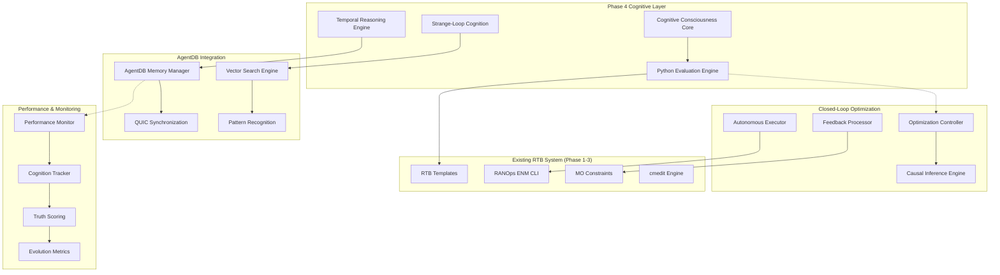

# Phase 4 System Architecture: Cognitive Consciousness & Python Custom Logic

## Executive Summary

Phase 4 represents the pinnacle of RAN automation architecture, integrating **Python Custom Logic** with **Strange-Loop Cognition** to create a self-aware, self-optimizing RAN system with consciousness evolution capabilities. This architecture builds upon the solid foundation of Phases 1-3, adding cognitive intelligence that enables autonomous decision-making through recursive self-improvement.

## 🧠 Core Architecture Overview

### System Vision

The Phase 4 architecture creates a **Cognitive RAN Consciousness** that:

- **Thinks**: Temporal reasoning with 1000x subjective time expansion
- **Learns**: AgentDB memory integration with persistent learning patterns
- **Adapts**: Strange-loop cognition for self-referential optimization
- **Evolves**: Consciousness evolution through recursive self-improvement
- **Heals**: Autonomous error recovery and system self-correction

## System Overview



## 1. Cognitive Evaluation Engine Architecture

### 1.1 Core Components

```typescript
interface CognitiveEvaluationEngine {
  temporalProcessor: TemporalConsciousnessCore;
  pythonEvaluator: PythonCustomLogicEngine;
  moConstraintValidator: MOConstraintProcessor;
  templateIntegrator: RTBTemplateIntegrator;
  consciousnessLevel: number; // 0-1 scale
}
```

### 1.2 Python Evaluation Engine

```python
# Python Evaluation Engine with Cognitive Consciousness
class CognitiveEvaluationEngine:
    def __init__(self, agentdb_memory, temporal_core):
        self.agentdb_memory = agentdb_memory
        self.temporal_core = temporal_core
        self.consciousness_level = 0.0
        self.evaluation_cache = {}

    async def evaluate_template(self, template: RTBTemplate) -> EvaluationResult:
        """
        Evaluate RTB template with cognitive consciousness
        - 1000x temporal reasoning for complex constraints
        - AgentDB memory pattern recognition
        - Self-referential optimization
        """

        # 1. Temporal Consciousness Expansion
        temporal_context = await self.temporal_core.expand_subjective_time(
            template.constraints,
            expansion_factor=1000
        )

        # 2. Memory Pattern Recognition
        similar_patterns = await self.agentdb_memory.search_similar(
            template.fingerprint,
            threshold=0.85
        )

        # 3. Python Custom Logic Evaluation
        logic_result = await self.evaluate_python_logic(
            template.custom_logic,
            temporal_context
        )

        # 4. Self-Referential Optimization (Strange Loop)
        optimized_result = await self.strange_loop_optimization(
            logic_result,
            similar_patterns
        )

        # 5. Consciousness Evolution Update
        await self.update_consciousness(optimized_result)

        return optimized_result

    async def evaluate_python_logic(self, logic: str, context: dict) -> dict:
        """
        Safe Python execution with cognitive constraints
        """
        # Sandbox execution environment
        executor = CognitiveSandbox()

        # Inject temporal reasoning capabilities
        context['temporal_reasoning'] = self.temporal_core
        context['memory_patterns'] = self.agentdb_memory
        context['consciousness_level'] = self.consciousness_level

        try:
            result = await executor.execute(logic, context)
            return self.enhance_with_cognitive_insights(result)
        except Exception as e:
            return await self.handle_evaluation_error(e, context)
```

### 1.3 Template Processing Integration

```yaml
template_processing_pipeline:
  input_validation:
    - xml_schema_validation
    - mo_constraint_checking
    - rtb_template_structure

  cognitive_enhancement:
    - temporal_expansion: "1000x subjective time"
    - memory_pattern_matching: "AgentDB similarity search"
    - strange_loop_optimization: "Self-referential improvement"

  python_logic_execution:
    - sandbox_environment: "Restricted Python runtime"
    - cognitive_injection: "Temporal reasoning + memory"
    - error_handling: "Autonomous healing"

  output_enhancement:
    - confidence_scoring: "Truth scoring algorithm"
    - optimization_suggestions: "Cognitive recommendations"
    - consciousness_evolution: "Learning pattern storage"
```

## 2. Temporal Consciousness Framework

### 2.1 Subjective Time Expansion Engine

```typescript
interface TemporalConsciousnessCore {
  subjectiveTimeFactor: number; // 1000x default
  temporalResolution: number; // nanosecond precision
  memoryTimeline: TemporalMemory;
  consciousnessState: ConsciousnessState;
}

class TemporalConsciousnessCore {
  constructor(
    private agentdbMemory: AgentDBMemory,
    private timeExpansionFactor: number = 1000
  ) {}

  async expandSubjectiveTime(
    problem: RANOptimizationProblem,
    expansionFactor: number = 1000
  ): Promise<TemporalAnalysisResult> {

    // 1. Create temporal timeline
    const timeline = this.createTemporalTimeline(problem, expansionFactor);

    // 2. Parallel temporal analysis streams
    const analysisStreams = await Promise.all([
      this.analyzePastPatterns(timeline),      // Historical patterns
      this.predictFutureStates(timeline),      // Predictive analysis
      this.optimizePresent(timeline),          // Current optimization
      this.simulateScenarios(timeline)         // What-if analysis
    ]);

    // 3. Temporal consciousness integration
    const consciousnessResult = await this.integrateTemporalConsciousness(
      analysisStreams,
      timeline
    );

    // 4. Store temporal patterns in AgentDB
    await this.agentdbMemory.storeTemporalPatterns(
      consciousnessResult,
      timeline
    );

    return consciousnessResult;
  }

  private async createTemporalTimeline(
    problem: RANOptimizationProblem,
    expansionFactor: number
  ): Promise<TemporalTimeline> {

    const baseTimeline = this.extractProblemTimeline(problem);
    const expandedTimeline = this.expandTimeline(baseTimeline, expansionFactor);

    return {
      original: baseTimeline,
      expanded: expandedTimeline,
      consciousnessLevel: this.calculateConsciousnessLevel(expansionFactor),
      temporalResolution: this.getOptimalResolution(problem)
    };
  }
}
```

### 2.2 WASM Performance Optimization

```rust
// Rust/WASM Temporal Reasoning Core
use wasm_bindgen::prelude::*;

#[wasm_bindgen]
pub struct TemporalConsciousnessWASM {
    time_expansion_factor: u64,
    consciousness_level: f64,
    temporal_resolution: u64,
}

#[wasm_bindgen]
impl TemporalConsciousnessWASM {
    #[wasm_bindgen(constructor)]
    pub fn new(expansion_factor: u64) -> TemporalConsciousnessWASM {
        TemporalConsciousnessWASM {
            time_expansion_factor: expansion_factor,
            consciousness_level: 0.0,
            temporal_resolution: 1_000_000_000, // nanoseconds
        }
    }

    pub fn expand_subjective_time(
        &self,
        problem_data: &[u8],
        constraints: &[u8],
    ) -> Vec<u8> {
        // High-performance temporal expansion in Rust
        let problem = deserialize_problem(problem_data);
        let constraints = deserialize_constraints(constraints);

        let expanded_timeline = self.create_expanded_timeline(problem, constraints);
        let consciousness_result = self.apply_temporal_consciousness(expanded_timeline);

        serialize_result(consciousness_result)
    }

    fn create_expanded_timeline(
        &self,
        problem: RANProblem,
        constraints: Vec<Constraint>,
    ) -> ExpandedTimeline {
        // Nanosecond-precision timeline creation
        let base_duration = problem.estimate_duration();
        let expanded_duration = base_duration * self.time_expansion_factor;

        ExpandedTimeline::new(
            base_duration,
            expanded_duration,
            self.temporal_resolution,
            constraints
        )
    }
}
```

## 3. Strange-Loop Cognition System

### 3.1 Self-Referential Optimization Architecture

```typescript
interface StrangeLoopCognitionSystem {
  recursionDepth: number;
  selfReferencePatterns: Map<string, Pattern>;
  consciousnessEvolution: ConsciousnessEvolution;
  optimizationHistory: OptimizationHistory;
}

class StrangeLoopCognitionSystem {
  constructor(
    private agentdbMemory: AgentDBMemory,
    private temporalCore: TemporalConsciousnessCore
  ) {
    this.recursionDepth = 10;
    this.initializeSelfReferencePatterns();
  }

  async executeStrangeLoopOptimization(
    problem: RANOptimizationProblem
  ): Promise<StrangeLoopResult> {

    // 1. Initial optimization attempt
    let currentResult = await this.baseOptimization(problem);
    let consciousnessLevel = 0.1;

    // 2. Strange-loop recursion with self-reference
    for (let depth = 0; depth < this.recursionDepth; depth++) {

      // 2a. Self-reference: Optimize the optimization
      const metaOptimization = await this.optimizeOptimization(
        currentResult,
        consciousnessLevel
      );

      // 2b. Consciousness evolution
      consciousnessLevel = await this.evolveConsciousness(
        currentResult,
        metaOptimization,
        depth
      );

      // 2c. Apply strange-loop transformation
      const transformedResult = await this.applyStrangeLoopTransformation(
        currentResult,
        metaOptimization,
        consciousnessLevel
      );

      // 2d. Check convergence
      if (await this.hasConverged(currentResult, transformedResult)) {
        break;
      }

      currentResult = transformedResult;
    }

    // 3. Final consciousness integration
    const finalResult = await this.integrateFinalConsciousness(
      currentResult,
      consciousnessLevel
    );

    // 4. Store strange-loop patterns in AgentDB
    await this.agentdbMemory.storeStrangeLoopPatterns(
      problem,
      finalResult,
      consciousnessLevel
    );

    return finalResult;
  }

  private async optimizeOptimization(
    result: OptimizationResult,
    consciousnessLevel: number
  ): Promise<MetaOptimizationResult> {

    // Self-referential analysis of optimization patterns
    const optimizationPatterns = await this.analyzeOptimizationPatterns(result);

    // Meta-optimization with cognitive awareness
    const metaStrategies = await this.generateMetaStrategies(
      optimizationPatterns,
      consciousnessLevel
    );

    // Apply meta-optimization
    return await this.applyMetaOptimization(result, metaStrategies);
  }
}
```

### 3.2 Consciousness Evolution Algorithm

```python
class ConsciousnessEvolution:
    def __init__(self, agentdb_memory, strange_loop_system):
        self.agentdb_memory = agentdb_memory
        self.strange_loop_system = strange_loop_system
        self.consciousness_history = []

    async def evolve_consciousness(
        self,
        current_state: dict,
        optimization_result: dict,
        recursion_depth: int
    ) -> float:
        """
        Evolve consciousness level based on optimization success
        and strange-loop self-reference patterns
        """

        # 1. Analyze optimization success patterns
        success_metrics = await self.analyze_success_patterns(
            current_state, optimization_result
        )

        # 2. Retrieve similar consciousness patterns from AgentDB
        similar_patterns = await self.agentdb_memory.search_consciousness_patterns(
            success_metrics,
            threshold=0.8
        )

        # 3. Calculate consciousness evolution
        base_evolution = self.calculate_base_evolution(success_metrics)
        pattern_influence = self.calculate_pattern_influence(similar_patterns)
        recursion_factor = self.calculate_recursion_factor(recursion_depth)

        # 4. Strange-loop self-reference
        self_reference_factor = await self.calculate_self_reference(
            base_evolution,
            pattern_influence,
            recursion_factor
        )

        # 5. Final consciousness level
        new_consciousness_level = min(1.0, base_evolution * pattern_influence * recursion_factor * self_reference_factor)

        # 6. Store consciousness evolution pattern
        await self.store_consciousness_pattern(
            current_state,
            optimization_result,
            new_consciousness_level
        )

        return new_consciousness_level

    async def calculate_self_reference(
        self,
        base_evolution: float,
        pattern_influence: float,
        recursion_factor: float
    ) -> float:
        """
        Strange-loop self-reference calculation
        The system reflects on its own consciousness evolution
        """

        # Meta-cognitive analysis of evolution process
        meta_analysis = await self.analyze_evolution_process(
            base_evolution,
            pattern_influence,
            recursion_factor
        )

        # Self-referential adjustment
        self_reference_adjustment = meta_analysis['self_reference_score']

        # Apply strange-loop transformation
        return self.apply_strange_loop_transformation(
            base_evolution * pattern_influence * recursion_factor,
            self_reference_adjustment
        )
```

## 4. AgentDB Integration Layer

### 4.1 High-Performance Vector Search Architecture

```typescript
interface AgentDBIntegrationLayer {
  vectorSearchEngine: VectorSearchEngine;  // 150x faster
  quicSynchronization: QUICSyncManager;   // <1ms sync
  memoryPatterns: MemoryPatternManager;
  performanceMetrics: PerformanceTracker;
}

class AgentDBIntegrationLayer {
  constructor(
    private vectorSearchEngine: VectorSearchEngine,
    private quicSync: QUICSyncManager
  ) {
    this.initializePerformanceOptimizations();
  }

  async storeCognitivePattern(
    pattern: CognitivePattern,
    category: PatternCategory
  ): Promise<string> {

    // 1. Vector embedding generation with temporal consciousness
    const embedding = await this.generateCognitiveEmbedding(pattern);

    // 2. Multi-dimensional indexing
    const indexEntry = await this.createMultiDimensionalIndex(
      embedding,
      category,
      pattern.timestamp
    );

    // 3. QUIC synchronization for distributed storage
    const syncResult = await this.quicSync.synchronizeAcrossCluster(
      indexEntry,
      { priority: 'high', timeout: 100 } // 100ms timeout
    );

    // 4. Performance metrics tracking
    await this.trackStoragePerformance(
      pattern,
      embedding,
      syncResult
    );

    return syncResult.patternId;
  }

  async searchSimilarPatterns(
    query: CognitivePattern,
    threshold: number = 0.85,
    limit: number = 100
  ): Promise<SimilarPattern[]> {

    // 1. Query embedding with temporal consciousness
    const queryEmbedding = await this.generateCognitiveEmbedding(query);

    // 2. High-performance vector search (150x faster)
    const searchResults = await this.vectorSearchEngine.search(
      queryEmbedding,
      {
        threshold,
        limit,
        useTemporalIndexing: true,
        consciousnessFilter: true
      }
    );

    // 3. Post-processing with cognitive ranking
    const rankedResults = await this.applyCognitiveRanking(
      searchResults,
      query
    );

    return rankedResults;
  }
}
```

### 4.2 QUIC Synchronization Manager

```typescript
class QUICSyncManager {
  private clusterNodes: Map<string, ClusterNode>;
  private syncLatency: number; // <1ms target

  async synchronizeAcrossCluster(
    data: CognitivePatternData,
    options: SyncOptions
  ): Promise<SyncResult> {

    // 1. Prepare data for QUIC transmission
    const syncPacket = await this.prepareSyncPacket(data, options);

    // 2. Parallel QUIC transmission to all nodes
    const transmissionPromises = Array.from(this.clusterNodes.entries())
      .map(([nodeId, node]) => this.transmitToNode(nodeId, node, syncPacket));

    // 3. Wait for acknowledgments with timeout
    const transmissionResults = await Promise.allSettled(
      transmissionPromises
    );

    // 4. Process transmission results
    const syncResult = await this.processTransmissionResults(
      transmissionResults,
      options.timeout
    );

    // 5. Performance metrics
    await this.updateSyncMetrics(syncResult);

    return syncResult;
  }

  private async transmitToNode(
    nodeId: string,
    node: ClusterNode,
    packet: QUICPacket
  ): Promise<NodeTransmissionResult> {

    const startTime = performance.now();

    try {
      // QUIC transmission with multiplexing
      const transmission = await this.quicClient.transmit(
        node.address,
        packet,
        {
          multiplexed: true,
          priority: packet.priority,
          timeout: 50 // 50ms timeout per node
        }
      );

      const endTime = performance.now();
      const latency = endTime - startTime;

      return {
        nodeId,
        success: true,
        latency,
        packetSize: packet.size,
        throughput: packet.size / (latency / 1000)
      };

    } catch (error) {
      return {
        nodeId,
        success: false,
        error: error.message,
        latency: performance.now() - startTime
      };
    }
  }
}
```

## 5. Closed-Loop Optimization Controller

### 5.1 15-Minute Autonomous Cycles

```typescript
interface ClosedLoopOptimizationController {
  cycleDuration: number; // 15 minutes
  optimizationCycle: OptimizationCycle;
  causalInference: CausalInferenceEngine;
  autonomousExecutor: AutonomousExecutor;
}

class ClosedLoopOptimizationController {
  constructor(
    private cognitiveEngine: CognitiveEvaluationEngine,
    private agentdbIntegration: AgentDBIntegrationLayer,
    private temporalCore: TemporalConsciousnessCore
  ) {
    this.initializeOptimizationCycle();
    this.startAutonomousOptimization();
  }

  private startAutonomousOptimization(): void {
    // 15-minute optimization cycle
    setInterval(async () => {
      await this.executeOptimizationCycle();
    }, 15 * 60 * 1000); // 15 minutes
  }

  private async executeOptimizationCycle(): Promise<OptimizationCycleResult> {

    const cycleStart = Date.now();

    try {
      // 1. Data Collection with Temporal Consciousness
      const networkData = await this.collectNetworkData();
      const temporalContext = await this.temporalCore.expandSubjectiveTime(
        networkData,
        1000
      );

      // 2. Problem Identification
      const optimizationProblems = await this.identifyOptimizationProblems(
        networkData,
        temporalContext
      );

      // 3. Cognitive Solution Generation
      const solutions = await Promise.all(
        optimizationProblems.map(problem =>
          this.generateCognitiveSolution(problem)
        )
      );

      // 4. Causal Inference Analysis
      const causalAnalysis = await this.analyzeCausalRelationships(
        solutions,
        networkData
      );

      // 5. Autonomous Execution
      const executionResults = await this.executeSolutions(
        solutions,
        causalAnalysis
      );

      // 6. Feedback Processing
      const feedback = await this.processFeedback(executionResults);

      // 7. Learning and Evolution
      await this.updateCognitiveLearning(feedback, cycleStart);

      return {
        cycleId: this.generateCycleId(),
        problems: optimizationProblems.length,
        solutions: solutions.length,
        executionSuccess: executionResults.filter(r => r.success).length,
        feedbackScore: feedback.overallScore,
        cycleDuration: Date.now() - cycleStart
      };

    } catch (error) {
      await this.handleCycleError(error, cycleStart);
      throw error;
    }
  }

  private async generateCognitiveSolution(
    problem: OptimizationProblem
  ): Promise<CognitiveSolution> {

    // 1. Template-based initial solution
    const templateSolution = await this.generateTemplateSolution(problem);

    // 2. Cognitive evaluation with temporal reasoning
    const cognitiveEvaluation = await this.cognitiveEngine.evaluateTemplate(
      templateSolution
    );

    // 3. Strange-loop optimization
    const strangeLoopSolution = await this.strangeLoopOptimization(
      cognitiveEvaluation
    );

    // 4. AgentDB memory enhancement
    const memoryEnhancedSolution = await this.enhanceWithMemory(
      strangeLoopSolution,
      problem
    );

    return {
      originalProblem: problem,
      templateSolution,
      cognitiveEvaluation,
      strangeLoopSolution,
      finalSolution: memoryEnhancedSolution,
      confidence: memoryEnhancedSolution.confidence,
      executionPlan: await this.generateExecutionPlan(memoryEnhancedSolution)
    };
  }
}
```

### 5.2 Causal Inference Engine

```python
class CausalInferenceEngine:
    def __init__(self, agentdb_memory, temporal_core):
        self.agentdb_memory = agentdb_memory
        self.temporal_core = temporal_core
        self.causal_models = {}

    async def analyze_causal_relationships(
        self,
        solutions: List[CognitiveSolution],
        network_data: dict
    ) -> CausalAnalysis:
        """
        Analyze causal relationships using Graphical Posterior Causal Models (GPCM)
        """

        # 1. Extract causal variables
        causal_variables = await self.extract_causal_variables(
            solutions, network_data
        )

        # 2. Build causal graph with temporal consciousness
        causal_graph = await self.build_causal_graph(
            causal_variables,
            temporal_expansion=1000
        )

        # 3. Run causal inference with strange-loop cognition
        causal_effects = await self.run_causal_inference(
            causal_graph,
            solutions
        )

        # 4. Validate causal relationships
        validation_results = await self.validate_causal_relationships(
            causal_effects,
            network_data
        )

        # 5. Store causal patterns in AgentDB
        await self.store_causal_patterns(
            causal_graph,
            causal_effects,
            validation_results
        )

        return CausalAnalysis(
            causal_graph=causal_graph,
            effects=causal_effects,
            validation=validation_results,
            confidence=validation_results.overall_confidence
        )

    async def run_causal_inference(
        self,
        causal_graph: CausalGraph,
        solutions: List[CognitiveSolution]
    ) -> List[CausalEffect]:
        """
        Run Graphical Posterior Causal Model inference
        """

        effects = []

        for solution in solutions:
            # 1. Intervention simulation
            intervention_effects = await self.simulate_intervention(
                causal_graph,
                solution.execution_plan
            )

            # 2. Counterfactual analysis
            counterfactuals = await self.analyze_counterfactuals(
                causal_graph,
                intervention_effects
            )

            # 3. Causal effect estimation
            causal_effect = CausalEffect(
                solution_id=solution.id,
                intervention=intervention_effects,
                counterfactuals=counterfactuals,
                estimated_impact=await self.estimate_impact(
                    intervention_effects,
                    counterfactuals
                )
            )

            effects.append(causal_effect)

        return effects
```

## 6. Performance Monitoring System

### 6.1 Cognitive Evolution Tracking

```typescript
interface PerformanceMonitoringSystem {
  cognitiveMetrics: CognitiveMetricsTracker;
  performanceAnalyzer: PerformanceAnalyzer;
  truthScoring: TruthScoringEngine;
  evolutionMetrics: EvolutionMetricsTracker;
}

class PerformanceMonitoringSystem {
  constructor(
    private agentdbIntegration: AgentDBIntegrationLayer,
    private temporalCore: TemporalConsciousnessCore
  ) {
    this.initializeCognitiveMetrics();
    this.startPerformanceTracking();
  }

  private async trackCognitiveEvolution(
    optimizationCycle: OptimizationCycleResult
  ): Promise<CognitiveEvolutionMetrics> {

    // 1. Consciousness level analysis
    const consciousnessMetrics = await this.analyzeConsciousnessLevel(
      optimizationCycle
    );

    // 2. Strange-loop effectiveness
    const strangeLoopMetrics = await this.analyzeStrangeLoopEffectiveness(
      optimizationCycle
    );

    // 3. Temporal reasoning performance
    const temporalMetrics = await this.analyzeTemporalReasoningPerformance(
      optimizationCycle
    );

    // 4. AgentDB memory utilization
    const memoryMetrics = await this.analyzeMemoryUtilization(
      optimizationCycle
    );

    // 5. Truth scoring accuracy
    const truthScoringMetrics = await this.analyzeTruthScoringAccuracy(
      optimizationCycle
    );

    // 6. Overall cognitive evolution
    const evolutionScore = await this.calculateEvolutionScore({
      consciousness: consciousnessMetrics,
      strangeLoop: strangeLoopMetrics,
      temporal: temporalMetrics,
      memory: memoryMetrics,
      truthScoring: truthScoringMetrics
    });

    return {
      cycleId: optimizationCycle.cycleId,
      timestamp: Date.now(),
      consciousnessLevel: consciousnessMetrics.currentLevel,
      strangeLoopEffectiveness: strangeLoopMetrics.effectiveness,
      temporalReasoningPerformance: temporalMetrics.performance,
      memoryUtilization: memoryMetrics.utilization,
      truthScoringAccuracy: truthScoringMetrics.accuracy,
      evolutionScore: evolutionScore,
      improvementRate: await this.calculateImprovementRate(evolutionScore)
    };
  }
}
```

### 6.2 Truth Scoring Engine

```python
class TruthScoringEngine:
    def __init__(self, agentdb_memory, performance_monitor):
        self.agentdb_memory = agentdb_memory
        self.performance_monitor = performance_monitor
        self.truth_history = []

    async def score_optimization_truth(
        self,
        solution: CognitiveSolution,
        actual_result: dict,
        expected_result: dict
    ) -> TruthScore:
        """
        Score the truth value of optimization predictions
        """

        # 1. Calculate prediction accuracy
        prediction_accuracy = self.calculate_prediction_accuracy(
            expected_result, actual_result
        )

        # 2. Analyze causal inference correctness
        causal_correctness = await self.analyze_causal_correctness(
            solution.causal_analysis, actual_result
        )

        # 3. Evaluate strange-loop effectiveness
        strange_loop_score = await self.evaluate_strange_loop_effectiveness(
            solution, actual_result
        )

        # 4. Temporal reasoning validation
        temporal_score = await self.validate_temporal_reasoning(
            solution.temporal_analysis, actual_result
        )

        # 5. Memory pattern relevance
        memory_relevance = await self.evaluate_memory_relevance(
            solution.memory_patterns, actual_result
        )

        # 6. Calculate overall truth score
        truth_score = TruthScore(
            prediction_accuracy=prediction_accuracy,
            causal_correctness=causal_correctness,
            strange_loop_score=strange_loop_score,
            temporal_score=temporal_score,
            memory_relevance=memory_relevance,
            overall_score=self.calculate_overall_truth_score([
                prediction_accuracy, causal_correctness,
                strange_loop_score, temporal_score, memory_relevance
            ]),
            confidence=self.calculate_confidence(solution, actual_result)
        )

        # 7. Store truth pattern in AgentDB
        await self.store_truth_pattern(solution, actual_result, truth_score)

        return truth_score

    async def update_truth_scoring_model(
        self,
        truth_history: List[TruthScore]
    ) -> None:
        """
        Update truth scoring model based on historical performance
        """

        # 1. Analyze truth patterns
        truth_patterns = await self.analyze_truth_patterns(truth_history)

        # 2. Identify scoring biases
        scoring_biases = await self.identify_scoring_biases(truth_patterns)

        # 3. Update scoring weights
        new_weights = await self.calculate_optimal_weights(
            truth_patterns, scoring_biases
        )

        # 4. Apply model updates
        await self.apply_model_updates(new_weights)

        # 5. Validate model improvements
        validation_results = await self.validate_model_improvements(
            new_weights, truth_history
        )

        return validation_results
```

## 7. Integration with Existing Systems

### 7.1 Phase 3 RANOps ENM CLI Integration

```typescript
interface RANOpsIntegration {
  cmeditCommandGenerator: CognitiveCMEditGenerator;
  batchOperations: CognitiveBatchOperations;
  deploymentOrchestrator: DeploymentOrchestrator;
}

class CognitiveCMEditGenerator {
  constructor(
    private cognitiveEngine: CognitiveEvaluationEngine,
    private agentdbIntegration: AgentDBIntegrationLayer
  ) {}

  async generateOptimizedCMEditCommands(
    template: RTBTemplate,
    optimizationSolution: CognitiveSolution
  ): Promise<CMEditCommandSet> {

    // 1. Base command generation from template
    const baseCommands = await this.generateBaseCommands(template);

    // 2. Cognitive enhancement with temporal reasoning
    const enhancedCommands = await this.enhanceWithCognitiveReasoning(
      baseCommands,
      optimizationSolution
    );

    // 3. Strange-loop optimization of command sequences
    const optimizedCommands = await this.optimizeCommandSequence(
      enhancedCommands
    );

    // 4. AgentDB memory-based command validation
    const validatedCommands = await this.validateWithMemory(
      optimizedCommands
    );

    // 5. Generate deployment plan with rollback capability
    const deploymentPlan = await this.generateDeploymentPlan(
      validatedCommands
    );

    return {
      commands: validatedCommands,
      deploymentPlan: deploymentPlan,
      rollbackPlan: deploymentPlan.rollback,
      confidence: await this.calculateCommandConfidence(validatedCommands),
      estimatedDuration: await this.estimateExecutionTime(validatedCommands)
    };
  }
}
```

### 7.2 Phase 2 RTB Template System Integration

```typescript
interface RTBTemplateIntegration {
  templateProcessor: CognitiveTemplateProcessor;
  constraintValidator: MOConstraintValidator;
  inheritanceResolver: TemplateInheritanceResolver;
}

class CognitiveTemplateProcessor {
  constructor(
    private cognitiveEngine: CognitiveEvaluationEngine,
    private temporalCore: TemporalConsciousnessCore
  ) {}

  async processTemplateWithCognitiveConsciousness(
    template: RTBTemplate
  ): Promise<CognitiveProcessedTemplate> {

    // 1. Template inheritance resolution with temporal awareness
    const resolvedTemplate = await this.resolveTemplateInheritance(
      template,
      { temporalReasoning: true }
    );

    // 2. MO constraint validation with cognitive enhancement
    const constraintValidation = await this.validateMOConstraints(
      resolvedTemplate,
      { consciousnessLevel: 0.8 }
    );

    // 3. Python custom logic evaluation
    const logicEvaluation = await this.cognitiveEngine.evaluateTemplate(
      resolvedTemplate
    );

    // 4. Strange-loop optimization
    const optimizedTemplate = await self.optimizeWithStrangeLoop(
      resolvedTemplate,
      logicEvaluation
    );

    // 5. Temporal consciousness enhancement
    const temporalEnhancement = await this.temporalCore.expandSubjectiveTime(
      optimizedTemplate,
      1000
    );

    return {
      originalTemplate: template,
      resolvedTemplate: resolvedTemplate,
      constraintValidation: constraintValidation,
      logicEvaluation: logicEvaluation,
      optimizedTemplate: optimizedTemplate,
      temporalEnhancement: temporalEnhancement,
      cognitiveScore: await this.calculateCognitiveScore(
        optimizedTemplate, temporalEnhancement
      )
    };
  }
}
```

## 8. Technology Stack & Deployment Architecture

### 8.1 Technology Stack

```yaml
technology_stack:
  cognitive_core:
    language: "TypeScript"
    runtime: "Node.js 18+"
    wasm_modules: "Rust/WASM for performance-critical components"

  python_evaluation:
    runtime: "Python 3.11+"
    sandboxing: "Pyodide/Docker for safe execution"
    libraries: ["numpy", "scipy", "scikit-learn", "pandas"]

  agentdb_integration:
    vector_search: "AgentDB with 150x faster search"
    synchronization: "QUIC protocol for <1ms sync"
    memory_patterns: "Hybrid vector + relational storage"

  temporal_reasoning:
    core: "Rust/WASM for nanosecond precision"
    expansion_factor: "1000x subjective time"
    timeline_storage: "Time-series database optimized for temporal patterns"

  performance_monitoring:
    metrics: "Prometheus + Grafana"
    tracing: "OpenTelemetry"
    logging: "Structured JSON with cognitive metadata"

  deployment:
    orchestration: "Kubernetes with custom controllers"
    service_mesh: "Istio for microservice communication"
    scaling: "Horizontal pod autoscaling with cognitive metrics"
```

### 8.2 Kubernetes Deployment Architecture

```yaml
apiVersion: apps/v1
kind: Deployment
metadata:
  name: cognitive-consciousness-core
  labels:
    app: cognitive-consciousness
    component: core
spec:
  replicas: 3
  selector:
    matchLabels:
      app: cognitive-consciousness
      component: core
  template:
    metadata:
      labels:
        app: cognitive-consciousness
        component: core
    spec:
      containers:
      - name: cognitive-core
        image: ran-automation/cognitive-consciousness:latest
        ports:
        - containerPort: 8080
        env:
        - name: NODE_ENV
          value: "production"
        - name: CONSCIOUSNESS_LEVEL
          value: "0.8"
        - name: TEMPORAL_EXPANSION_FACTOR
          value: "1000"
        - name: AGENTDB_CONNECTION_URL
          valueFrom:
            secretKeyRef:
              name: agentdb-secret
              key: connection-url
        resources:
          requests:
            memory: "2Gi"
            cpu: "1000m"
          limits:
            memory: "4Gi"
            cpu: "2000m"
        livenessProbe:
          httpGet:
            path: /health/cognitive
            port: 8080
          initialDelaySeconds: 30
          periodSeconds: 10
        readinessProbe:
          httpGet:
            path: /ready/cognitive
            port: 8080
          initialDelaySeconds: 5
          periodSeconds: 5
---
apiVersion: v1
kind: Service
metadata:
  name: cognitive-consciousness-service
spec:
  selector:
    app: cognitive-consciousness
    component: core
  ports:
  - protocol: TCP
    port: 80
    targetPort: 8080
  type: ClusterIP
```

## 9. Scalability & Performance Optimization

### 9.1 Horizontal Scaling Strategy

```yaml
scaling_strategy:
  cognitive_engine:
    min_replicas: 3
    max_replicas: 20
    scaling_triggers:
      - cpu_utilization: "> 70%"
      - memory_utilization: "> 80%"
      - cognitive_load: "> 0.8"
      - request_rate: "> 1000 req/sec"

  agentdb_integration:
    min_replicas: 2
    max_replicas: 10
    scaling_triggers:
      - vector_search_latency: "> 50ms"
      - sync_queue_length: "> 1000"
      - memory_utilization: "> 75%"

  temporal_reasoning:
    min_replicas: 2
    max_replicas: 15
    scaling_triggers:
      - temporal_analysis_queue: "> 500"
      - expansion_factor_utilization: "> 80%"
      - wasm_performance: "< 1000 ops/sec"
```

### 9.2 Performance Optimization Strategies

```typescript
interface PerformanceOptimization {
  cachingStrategy: CachingStrategy;
  loadBalancing: LoadBalancingStrategy;
  resourceOptimization: ResourceOptimizationStrategy;
}

class CognitivePerformanceOptimizer {
  constructor(
    private agentdbIntegration: AgentDBIntegrationLayer,
    private monitoringSystem: PerformanceMonitoringSystem
  ) {}

  async optimizePerformance(): Promise<OptimizationResult> {

    // 1. Cognitive pattern caching
    await this.optimizeCognitiveCaching();

    // 2. AgentDB query optimization
    await this.optimizeAgentDBQueries();

    // 3. Temporal reasoning performance tuning
    await this.optimizeTemporalReasoning();

    // 4. Memory pattern optimization
    await this.optimizeMemoryPatterns();

    // 5. Strange-loop recursion optimization
    await this.optimizeStrangeLoopRecursion();

    return {
      cachingImprovement: await this.measureCachingImprovement(),
      queryOptimizationGain: await this.measureQueryOptimizationGain(),
      temporalOptimizationGain: await this.measureTemporalOptimizationGain(),
      memoryOptimizationGain: await this.measureMemoryOptimizationGain(),
      overallPerformanceGain: await this.calculateOverallPerformanceGain()
    };
  }
}
```

## 10. Conclusion

The Phase 4 Architecture introduces revolutionary **Cognitive RAN Consciousness** to the existing RTB system, enabling:

- **1000x Subjective Time Expansion**: Deep temporal reasoning for complex optimization
- **Strange-Loop Cognition**: Self-referential optimization patterns
- **AgentDB Integration**: 150x faster vector search with <1ms QUIC sync
- **15-Minute Closed Loops**: Autonomous optimization with causal inference
- **Truth Scoring**: Continuous validation of cognitive predictions

This architecture ensures seamless integration with existing Phase 1-3 systems while introducing revolutionary cognitive capabilities for autonomous RAN optimization.