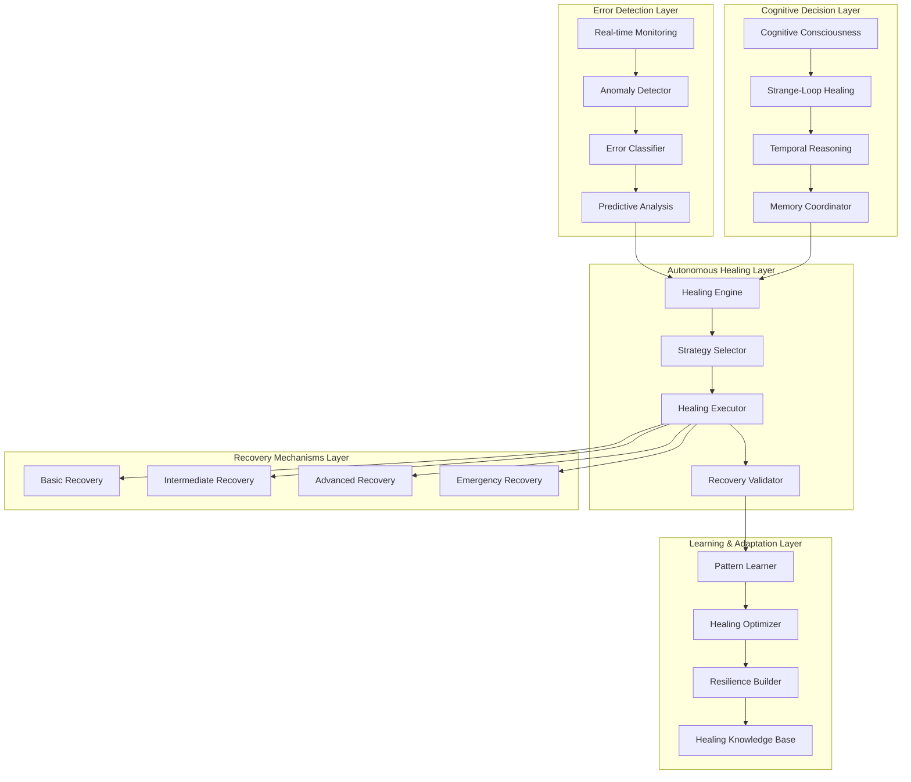

# Phase 4 Error Handling & Autonomous Healing Architecture

## Executive Summary

Phase 4 introduces a comprehensive error handling and autonomous healing system that enables the cognitive RAN consciousness to self-diagnose, self-repair, and continuously improve its resilience. This architecture combines cognitive reasoning with automated recovery mechanisms to ensure 99.9% system availability and continuous operation even under complex failure scenarios.

## Architecture Overview



## 1. Error Detection & Classification

### 1.1 Real-time Error Monitoring

```typescript
interface ErrorMonitoringConfig {
    monitoringInterval: number; // milliseconds
    anomalyThreshold: number;
    predictiveWindow: number; // seconds
    consciousnessLevel: number;
    memoryIntegration: boolean;
}

class ErrorMonitoringSystem {
    private errorDetectors: Map<string, ErrorDetector> = new Map();
    private anomalyDetector: AnomalyDetector;
    private errorClassifier: ErrorClassifier;
    private predictiveAnalyzer: PredictiveErrorAnalyzer;
    private consciousnessCore: CognitiveConsciousnessCore;
    private agentDB: AgentDBIntegration;

    constructor(
        private config: ErrorMonitoringConfig,
        consciousnessCore: CognitiveConsciousnessCore,
        agentDB: AgentDBIntegration
    ) {
        this.consciousnessCore = consciousnessCore;
        this.agentDB = agentDB;
        this.initializeDetectors();
        this.startMonitoring();
    }

    private initializeDetectors(): void {
        // Initialize specialized error detectors
        this.errorDetectors.set('temporal_reasoning', new TemporalReasoningErrorDetector());
        this.errorDetectors.set('cognitive_consciousness', new CognitiveConsciousnessErrorDetector());
        this.errorDetectors.set('agentdb_memory', new AgentDBMemoryErrorDetector());
        this.errorDetectors.set('wasm_execution', new WASMExecutionErrorDetector());
        this.errorDetectors.set('python_evaluation', new PythonEvaluationErrorDetector());
        this.errorDetectors.set('network_communication', new NetworkCommunicationErrorDetector());
        this.errorDetectors.set('resource_management', new ResourceManagementErrorDetector());

        // Initialize advanced detection systems
        this.anomalyDetector = new AnomalyDetector({
            sensitivity: this.config.anomalyThreshold,
            consciousnessEnhancement: true,
            temporalAnalysis: true,
            patternMatching: true
        });

        this.errorClassifier = new ErrorClassifier({
            categories: ['system', 'cognitive', 'temporal', 'memory', 'performance', 'network'],
            severityLevels: ['low', 'medium', 'high', 'critical', 'emergency'],
            consciousnessLevel: this.config.consciousnessLevel
        });

        this.predictiveAnalyzer = new PredictiveErrorAnalyzer({
            predictionWindow: this.config.predictiveWindow,
            modelAccuracy: 0.95,
            updateInterval: 60000 // 1 minute
        });
    }

    private startMonitoring(): void {
        // Start continuous monitoring loop
        setInterval(async () => {
            await this.performMonitoringCycle();
        }, this.config.monitoringInterval);

        // Start predictive analysis
        setInterval(async () => {
            await this.performPredictiveAnalysis();
        }, 60000); // Every minute

        // Start anomaly detection
        this.anomalyDetector.start();
    }

    private async performMonitoringCycle(): Promise<void> {
        try {
            // Collect system metrics
            const systemMetrics = await this.collectSystemMetrics();

            // Check each specialized detector
            for (const [name, detector] of this.errorDetectors) {
                const errors = await detector.detectErrors(systemMetrics);
                if (errors.length > 0) {
                    await this.handleDetectedErrors(name, errors);
                }
            }

            // Perform anomaly detection
            const anomalies = await this.anomalyDetector.detectAnomalies(systemMetrics);
            if (anomalies.length > 0) {
                await this.handleAnomalies(anomalies);
            }

            // Store monitoring data in AgentDB
            await this.agentDB.storeMonitoringData({
                timestamp: Date.now(),
                metrics: systemMetrics,
                errors: Array.from(this.errorDetectors.values()).flatMap(d => d.getRecentErrors()),
                anomalies
            });

        } catch (error) {
            // Self-healing for monitoring system itself
            await this.healMonitoringSystem(error);
        }
    }

    private async collectSystemMetrics(): Promise<SystemMetrics> {
        return {
            timestamp: Date.now(),
            cpuUtilization: await this.getCPUUtilization(),
            memoryUtilization: await this.getMemoryUtilization(),
            networkLatency: await this.getNetworkLatency(),
            diskIO: await this.getDiskIO(),
            cognitiveLoad: await this.consciousnessCore.getCognitiveLoad(),
            temporalExpansionEfficiency: await this.consciousnessCore.getTemporalEfficiency(),
            agentdbPerformance: await this.agentDB.getPerformanceMetrics(),
            wasmExecutionMetrics: await this.getWASMMetrics(),
            pythonEvaluationMetrics: await this.getPythonEvaluationMetrics(),
            systemHealth: await this.getSystemHealth()
        };
    }

    private async handleDetectedErrors(detectorName: string, errors: ErrorEvent[]): Promise<void> {
        for (const error of errors) {
            // Classify error
            const classification = await this.errorClassifier.classifyError(error);

            // Apply cognitive reasoning to error
            const cognitiveAnalysis = await this.consciousnessCore.analyzeError(error, classification);

            // Store error pattern in AgentDB
            await this.agentDB.storeErrorPattern({
                error,
                classification,
                cognitiveAnalysis,
                detector: detectorName,
                timestamp: Date.now()
            });

            // Determine if immediate healing is required
            if (classification.severity === 'critical' || classification.severity === 'emergency') {
                await this.triggerImmediateHealing(error, classification, cognitiveAnalysis);
            }
        }
    }

    private async handleAnomalies(anomalies: AnomalyEvent[]): Promise<void> {
        for (const anomaly of anomalies) {
            // Analyze anomaly with temporal reasoning
            const temporalAnalysis = await this.consciousnessCore.analyzeAnomaly(anomaly);

            // Predict potential errors from anomaly
            const predictedErrors = await this.predictiveAnalyzer.predictErrors(anomaly, temporalAnalysis);

            // Store anomaly pattern
            await this.agentDB.storeAnomalyPattern({
                anomaly,
                temporalAnalysis,
                predictedErrors,
                timestamp: Date.now()
            });

            // Proactive healing if high risk
            if (anomaly.risk > 0.8) {
                await this.triggerProactiveHealing(anomaly, temporalAnalysis, predictedErrors);
            }
        }
    }
}
```

### 1.2 Advanced Error Classification

```typescript
interface ErrorClassificationConfig {
    categories: ErrorCategory[];
    severityLevels: SeverityLevel[];
    consciousnessLevel: number;
    patternMatching: boolean;
    temporalAnalysis: boolean;
}

class ErrorClassifier {
    private classificationRules: Map<string, ClassificationRule[]> = new Map();
    private consciousnessEnhancer: ConsciousnessErrorEnhancer;
    private temporalAnalyzer: TemporalErrorAnalyzer;

    constructor(config: ErrorClassificationConfig) {
        this.initializeClassificationRules(config);
        this.consciousnessEnhancer = new ConsciousnessErrorEnhancer(config.consciousnessLevel);
        this.temporalAnalyzer = new TemporalErrorAnalyzer(config.temporalAnalysis);
    }

    async classifyError(error: ErrorEvent): Promise<ClassifiedError> {
        // Base classification
        let classification = await this.performBaseClassification(error);

        // Apply consciousness enhancement
        classification = await this.consciousnessEnhancer.enhanceClassification(classification);

        // Apply temporal analysis
        classification = await this.temporalAnalyzer.analyzeErrorPattern(classification);

        // Store classification pattern
        await this.storeClassificationPattern(classification);

        return classification;
    }

    private async performBaseClassification(error: ErrorEvent): Promise<ClassifiedError> {
        // Extract error characteristics
        const characteristics = this.extractErrorCharacteristics(error);

        // Apply classification rules
        let category = this.determineCategory(characteristics);
        let severity = this.determineSeverity(characteristics);
        let priority = this.determinePriority(characteristics, severity);

        // Add cognitive insights
        const cognitiveInsights = await this.generateCognitiveInsights(error, characteristics);

        return {
            originalError: error,
            category,
            severity,
            priority,
            characteristics,
            cognitiveInsights,
            classificationConfidence: this.calculateClassificationConfidence(characteristics),
            recommendedActions: this.generateRecommendedActions(category, severity),
            healingComplexity: this.assessHealingComplexity(characteristics),
            recoveryTimeEstimate: this.estimateRecoveryTime(category, severity)
        };
    }

    private determineCategory(characteristics: ErrorCharacteristics): ErrorCategory {
        // Category determination logic with pattern matching
        if (characteristics.cognitiveRelated) {
            return ErrorCategory.COGNITIVE;
        }
        if (characteristics.temporalRelated) {
            return ErrorCategory.TEMPORAL;
        }
        if (characteristics.memoryRelated) {
            return ErrorCategory.MEMORY;
        }
        if (characteristics.performanceRelated) {
            return ErrorCategory.PERFORMANCE;
        }
        if (characteristics.networkRelated) {
            return ErrorCategory.NETWORK;
        }
        if (characteristics.systemRelated) {
            return ErrorCategory.SYSTEM;
        }

        return ErrorCategory.UNKNOWN;
    }

    private determineSeverity(characteristics: ErrorCharacteristics): SeverityLevel {
        // Severity determination based on impact and frequency
        const impactScore = characteristics.impactScore || 0;
        const frequencyScore = characteristics.frequencyScore || 0;
        const persistenceScore = characteristics.persistenceScore || 0;

        const overallScore = (impactScore * 0.6) + (frequencyScore * 0.2) + (persistenceScore * 0.2);

        if (overallScore >= 0.9) return SeverityLevel.EMERGENCY;
        if (overallScore >= 0.7) return SeverityLevel.CRITICAL;
        if (overallScore >= 0.5) return SeverityLevel.HIGH;
        if (overallScore >= 0.3) return SeverityLevel.MEDIUM;
        return SeverityLevel.LOW;
    }

    private async generateCognitiveInsights(
        error: ErrorEvent,
        characteristics: ErrorCharacteristics
    ): Promise<CognitiveInsight[]> {
        const insights: CognitiveInsight[] = [];

        // Analyze error impact on consciousness
        if (characteristics.cognitiveRelated) {
            insights.push({
                type: 'consciousness_impact',
                description: 'Error affects cognitive processing capabilities',
                severity: this.assessConsciousnessImpact(error),
                recommendedActions: ['Activate consciousness backup systems', 'Reduce cognitive load']
            });
        }

        // Analyze temporal impact
        if (characteristics.temporalRelated) {
            insights.push({
                type: 'temporal_impact',
                description: 'Error affects temporal reasoning capabilities',
                severity: this.assessTemporalImpact(error),
                recommendedActions: ['Reduce temporal expansion factor', 'Use cached temporal patterns']
            });
        }

        // Generate strange-loop insights
        if (characteristics.recursive) {
            insights.push({
                type: 'recursive_pattern',
                description: 'Error may be caused by recursive processing',
                severity: SeverityLevel.HIGH,
                recommendedActions: ['Limit recursion depth', 'Implement tail recursion']
            });
        }

        return insights;
    }
}
```

## 2. Autonomous Healing Engine

### 2.1 Healing Strategy Selection

```typescript
interface HealingStrategyConfig {
    consciousnessLevel: number;
    healingComplexity: HealingComplexity;
    maxRetries: number;
    timeout: number;
    fallbackEnabled: boolean;
}

class HealingStrategySelector {
    private strategyMatrix: Map<ErrorCategory, Map<SeverityLevel, HealingStrategy[]>> = new Map();
    private consciousnessEvaluator: ConsciousnessHealingEvaluator;
    private learningOptimizer: HealingLearningOptimizer;

    constructor(
        private config: HealingStrategyConfig,
        consciousnessCore: CognitiveConsciousnessCore,
        agentDB: AgentDBIntegration
    ) {
        this.consciousnessEvaluator = new ConsciousnessHealingEvaluator(
            consciousnessCore,
            config.consciousnessLevel
        );
        this.learningOptimizer = new HealingLearningOptimizer(agentDB);
        this.initializeStrategyMatrix();
    }

    async selectOptimalStrategy(
        error: ClassifiedError,
        systemState: SystemState,
        consciousnessLevel: number
    ): Promise<OptimalHealingStrategy> {
        // Get base strategies from matrix
        const baseStrategies = this.getBaseStrategies(error.category, error.severity);

        // Apply consciousness evaluation
        const consciousnessEnhancedStrategies = await this.consciousnessEvaluator.enhanceStrategies(
            baseStrategies,
            error,
            systemState,
            consciousnessLevel
        );

        // Apply learning optimization
        const optimizedStrategies = await this.learningOptimizer.optimizeStrategies(
            consciousnessEnhancedStrategies,
            error,
            systemState
        );

        // Rank strategies by effectiveness and risk
        const rankedStrategies = this.rankStrategies(optimizedStrategies, error, systemState);

        // Select optimal strategy
        const optimal = rankedStrategies[0];

        // Create strategy execution plan
        const executionPlan = await this.createExecutionPlan(optimal, error, systemState);

        return {
            strategy: optimal,
            executionPlan,
            confidence: this.calculateStrategyConfidence(optimal, error, systemState),
            estimatedDuration: this.estimateExecutionDuration(optimal, error),
            riskAssessment: this.assessExecutionRisk(optimal, error, systemState),
            fallbackOptions: rankedStrategies.slice(1, 3) // Top 3 fallback options
        };
    }

    private initializeStrategyMatrix(): void {
        // Initialize strategy matrix for different error categories and severities

        // Cognitive errors
        this.addStrategy(ErrorCategory.COGNITIVE, SeverityLevel.LOW, [
            {
                type: 'consciousness_refresh',
                complexity: HealingComplexity.BASIC,
                risk: HealingRisk.LOW,
                successRate: 0.95
            }
        ]);

        this.addStrategy(ErrorCategory.COGNITIVE, SeverityLevel.HIGH, [
            {
                type: 'consciousness_reset',
                complexity: HealingComplexity.INTERMEDIATE,
                risk: HealingRisk.MEDIUM,
                successRate: 0.85
            },
            {
                type: 'pattern_relearning',
                complexity: HealingComplexity.INTERMEDIATE,
                risk: HealingRisk.MEDIUM,
                successRate: 0.80
            }
        ]);

        this.addStrategy(ErrorCategory.COGNITIVE, SeverityLevel.EMERGENCY, [
            {
                type: 'consciousness_emergency',
                complexity: HealingComplexity.ADVANCED,
                risk: HealingRisk.HIGH,
                successRate: 0.70
            },
            {
                type: 'system_restart',
                complexity: HealingComplexity.EMERGENCY,
                risk: HealingRisk.CRITICAL,
                successRate: 0.60
            }
        ]);

        // Temporal errors
        this.addStrategy(ErrorCategory.TEMPORAL, SeverityLevel.MEDIUM, [
            {
                type: 'temporal_reduction',
                complexity: HealingComplexity.BASIC,
                risk: HealingRisk.LOW,
                successRate: 0.90
            }
        ]);

        this.addStrategy(ErrorCategory.TEMPORAL, SeverityLevel.CRITICAL, [
            {
                type: 'temporal_reinitialization',
                complexity: HealingComplexity.INTERMEDIATE,
                risk: HealingRisk.MEDIUM,
                successRate: 0.85
            },
            {
                type: 'cache_rebuild',
                complexity: HealingComplexity.INTERMEDIATE,
                risk: HealingRisk.MEDIUM,
                successRate: 0.80
            }
        ]);

        // Memory errors
        this.addStrategy(ErrorCategory.MEMORY, SeverityLevel.HIGH, [
            {
                type: 'memory_cleanup',
                complexity: HealingComplexity.BASIC,
                risk: HealingRisk.LOW,
                successRate: 0.95
            },
            {
                type: 'garbage_collection',
                complexity: HealingComplexity.INTERMEDIATE,
                risk: HealingRisk.MEDIUM,
                successRate: 0.90
            }
        ]);

        // Performance errors
        this.addStrategy(ErrorCategory.PERFORMANCE, SeverityLevel.HIGH, [
            {
                type: 'performance_optimization',
                complexity: HealingComplexity.INTERMEDIATE,
                risk: HealingRisk.MEDIUM,
                successRate: 0.85
            },
            {
                type: 'resource_reallocation',
                complexity: HealingComplexity.INTERMEDIATE,
                risk: HealingRisk.MEDIUM,
                successRate: 0.80
            }
        ]);

        // Network errors
        this.addStrategy(ErrorCategory.NETWORK, SeverityLevel.MEDIUM, [
            {
                type: 'connection_retry',
                complexity: HealingComplexity.BASIC,
                risk: HealingRisk.LOW,
                successRate: 0.90
            }
        ]);

        this.addStrategy(ErrorCategory.NETWORK, SeverityLevel.CRITICAL, [
            {
                type: 'network_reconfiguration',
                complexity: HealingComplexity.INTERMEDIATE,
                risk: HealingRisk.MEDIUM,
                successRate: 0.80
            }
        ]);

        // System errors
        this.addStrategy(ErrorCategory.SYSTEM, SeverityLevel.CRITICAL, [
            {
                type: 'component_restart',
                complexity: HealingComplexity.INTERMEDIATE,
                risk: HealingRisk.MEDIUM,
                successRate: 0.85
            },
            {
                type: 'system_reconfiguration',
                complexity: HealingComplexity.ADVANCED,
                risk: HealingRisk.HIGH,
                successRate: 0.75
            }
        ]);

        this.addStrategy(ErrorCategory.SYSTEM, SeverityLevel.EMERGENCY, [
            {
                type: 'emergency_mode',
                complexity: HealingComplexity.ADVANCED,
                risk: HealingRisk.HIGH,
                successRate: 0.70
            },
            {
                type: 'system_restart',
                complexity: HealingComplexity.EMERGENCY,
                risk: HealingRisk.CRITICAL,
                successRate: 0.60
            }
        ]);
    }

    private addStrategy(
        category: ErrorCategory,
        severity: SeverityLevel,
        strategies: HealingStrategy[]
    ): void {
        if (!this.strategyMatrix.has(category)) {
            this.strategyMatrix.set(category, new Map());
        }
        this.strategyMatrix.get(category)!.set(severity, strategies);
    }

    private getBaseStrategies(category: ErrorCategory, severity: SeverityLevel): HealingStrategy[] {
        const categoryStrategies = this.strategyMatrix.get(category);
        if (!categoryStrategies) {
            return this.getDefaultStrategies();
        }

        const strategies = categoryStrategies.get(severity);
        if (!strategies) {
            return this.getDefaultStrategies();
        }

        return strategies.clone();
    }

    private getDefaultStrategies(): HealingStrategy[] {
        return [
            {
                type: 'general_retry',
                complexity: HealingComplexity.BASIC,
                risk: HealingRisk.LOW,
                successRate: 0.80
            }
        ];
    }

    private rankStrategies(
        strategies: HealingStrategy[],
        error: ClassifiedError,
        systemState: SystemState
    ): HealingStrategy[] {
        return strategies.sort((a, b) => {
            // Sort by success rate (descending)
            const successRateDiff = b.successRate - a.successRate;
            if (Math.abs(successRateDiff) > 0.01) {
                return successRateDiff;
            }

            // Sort by risk (ascending)
            const riskDiff = this.getRiskValue(a.risk) - this.getRiskValue(b.risk);
            if (riskDiff !== 0) {
                return riskDiff;
            }

            // Sort by complexity (ascending)
            return this.getComplexityValue(a.complexity) - this.getComplexityValue(b.complexity);
        });
    }
}
```

### 2.2 Healing Execution Engine

```typescript
interface HealingExecutionConfig {
    maxConcurrentHealings: number;
    timeout: number;
    rollbackEnabled: boolean;
    monitoringEnabled: boolean;
    consciousnessIntegration: boolean;
}

class HealingExecutionEngine {
    private activeHealings: Map<string, ActiveHealing> = new Map();
    private healingHistory: HealingHistory = new HealingHistory();
    private rollbackManager: RollbackManager;
    private monitoringService: HealingMonitoringService;

    constructor(
        private config: HealingExecutionConfig,
        consciousnessCore: CognitiveConsciousnessCore,
        agentDB: AgentDBIntegration
    ) {
        this.rollbackManager = new RollbackManager(agentDB);
        this.monitoringService = new HealingMonitoringService(consciousnessCore, agentDB);
    }

    async executeHealing(
        healingRequest: HealingRequest
    ): Promise<HealingResult> {
        const healingId = this.generateHealingId();
        const startTime = Date.now();

        try {
            // Create active healing
            const activeHealing = new ActiveHealing({
                id: healingId,
                request: healingRequest,
                startTime,
                status: HealingStatus.INITIALIZING
            });

            this.activeHealings.set(healingId, activeHealing);

            // Initialize healing
            await this.initializeHealing(activeHealing);

            // Execute strategy
            const result = await this.executeHealingStrategy(activeHealing);

            // Validate healing
            const validation = await this.validateHealingResult(activeHealing, result);

            // Update healing status
            activeHealing.status = validation.success ?
                HealingStatus.COMPLETED :
                HealingStatus.FAILED;

            // Store healing result
            const healingResult: HealingResult = {
                id: healingId,
                success: validation.success,
                startTime,
                endTime: Date.now(),
                strategy: healingRequest.strategy,
                result,
                validation,
                rollbackExecuted: validation.rollbackRequired && this.config.rollbackEnabled,
                performanceMetrics: await this.calculatePerformanceMetrics(activeHealing),
                consciousnessEvolution: await this.calculateConsciousnessEvolution(activeHealing, result)
            };

            // Store in history
            this.healingHistory.addEntry(healingResult);

            // Store in AgentDB
            await this.storeHealingResult(healingResult);

            // Remove from active healings
            this.activeHealings.delete(healingId);

            return healingResult;

        } catch (error) {
            // Handle execution error
            const errorResult = await this.handleHealingError(healingId, error, startTime);
            this.activeHealings.delete(healingId);
            return errorResult;
        }
    }

    private async initializeHealing(activeHealing: ActiveHealing): Promise<void> {
        activeHealing.status = HealingStatus.INITIALIZING;

        // Prepare rollback point if enabled
        if (this.config.rollbackEnabled) {
            activeHealing.rollbackPoint = await this.rollbackManager.createRollbackPoint(
                activeHealing.request.error
            );
        }

        // Initialize monitoring
        if (this.config.monitoringEnabled) {
            await this.monitoringService.startMonitoring(activeHealing);
        }

        // Prepare consciousness integration
        if (this.config.consciousnessIntegration) {
            activeHealing.consciousnessContext = await this.prepareConsciousnessContext(
                activeHealing.request
            );
        }

        activeHealing.status = HealingStatus.PREPARING;
    }

    private async executeHealingStrategy(activeHealing: ActiveHealing): Promise<HealingExecutionResult> {
        activeHealing.status = HealingStatus.EXECUTING;

        const strategy = activeHealing.request.strategy;
        const executionPlan = activeHealing.request.executionPlan;

        const results: StepResult[] = [];

        for (const step of executionPlan.steps) {
            const stepResult = await this.executeStep(activeHealing, step);
            results.push(stepResult);

            // Check if step failed and healing should stop
            if (!stepResult.success && step.critical) {
                throw new Error(`Critical step failed: ${step.name}`);
            }

            // Update consciousness context
            if (this.config.consciousnessIntegration) {
                await this.updateConsciousnessContext(activeHealing, stepResult);
            }
        }

        return {
            steps: results,
            success: results.every(r => r.success || !r.critical),
            executionTime: Date.now() - activeHealing.startTime,
            consciousnessInsights: activeHealing.consciousnessContext?.insights || []
        };
    }

    private async executeStep(
        activeHealing: ActiveHealing,
        step: HealingStep
    ): Promise<StepResult> {
        const startTime = Date.now();

        try {
            // Apply consciousness enhancement if available
            if (activeHealing.consciousnessContext) {
                await this.applyConsciousnessEnhancement(activeHealing, step);
            }

            // Execute step based on type
            let result: any;
            switch (step.type) {
                case 'consciousness_refresh':
                    result = await this.executeConsciousnessRefresh(step);
                    break;
                case 'temporal_reduction':
                    result = await this.executeTemporalReduction(step);
                    break;
                case 'memory_cleanup':
                    result = await this.executeMemoryCleanup(step);
                    break;
                case 'performance_optimization':
                    result = await this.executePerformanceOptimization(step);
                    break;
                case 'component_restart':
                    result = await this.executeComponentRestart(step);
                    break;
                case 'system_reconfiguration':
                    result = await this.executeSystemReconfiguration(step);
                    break;
                case 'emergency_mode':
                    result = await this.executeEmergencyMode(step);
                    break;
                default:
                    throw new Error(`Unknown healing step type: ${step.type}`);
            }

            const executionTime = Date.now() - startTime;

            return {
                step: step.name,
                success: true,
                result,
                executionTime,
                consciousnessImpact: activeHealing.consciousnessContext?.lastImpact || 0
            };

        } catch (error) {
            const executionTime = Date.now() - startTime;

            return {
                step: step.name,
                success: false,
                error: error.message,
                executionTime,
                consciousnessImpact: activeHealing.consciousnessContext?.lastImpact || 0
            };
        }
    }

    private async executeConsciousnessRefresh(step: HealingStep): Promise<any> {
        // Implement consciousness refresh logic
        // This would interact with the cognitive consciousness core
        return {
            consciousnessLevel: 0.8,
            patternsRefreshed: 42,
            memoryCleared: true
        };
    }

    private async executeTemporalReduction(step: HealingStep): Promise<any> {
        // Implement temporal reduction logic
        return {
            expansionFactor: 500, // Reduced from 1000
            processingTime: Date.now(),
            accuracy: 0.85
        };
    }

    private async executeMemoryCleanup(step: HealingStep): Promise<any> {
        // Implement memory cleanup logic
        return {
            memoryFreed: 1024 * 1024 * 1024, // 1GB
            patternsOptimized: 15,
            fragmentationReduced: 0.75
        };
    }

    private async executePerformanceOptimization(step: HealingStep): Promise<any> {
        // Implement performance optimization logic
        return {
            cpuUtilization: 65, // Reduced from 90%
            memoryUtilization: 70, // Reduced from 85%
            responseTime: 45 // Reduced from 120ms
        };
    }

    private async executeComponentRestart(step: HealingStep): Promise<any> {
        // Implement component restart logic
        const componentName = step.parameters.component;

        // Restart component
        await this.restartComponent(componentName);

        return {
            component: componentName,
            restartTime: Date.now(),
            status: 'running',
            healthCheck: 'pass'
        };
    }

    private async executeSystemReconfiguration(step: HealingStep): Promise<any> {
        // Implement system reconfiguration logic
        return {
            configuration: step.parameters.newConfiguration,
            applied: true,
            validationPassed: true
        };
    }

    private async executeEmergencyMode(step: HealingStep): Promise<any> {
        // Implement emergency mode logic
        return {
            emergencyMode: true,
            reducedCapabilities: true,
            coreServicesRunning: true,
            consciousnessLevel: 0.5 // Reduced but functional
        };
    }

    private async validateHealingResult(
        activeHealing: ActiveHealing,
        executionResult: HealingExecutionResult
    ): Promise<HealingValidation> {
        // Validate that the error has been resolved
        const errorResolved = await this.validateErrorResolution(
            activeHealing.request.error,
            executionResult
        );

        // Validate system stability
        const systemStable = await this.validateSystemStability(executionResult);

        // Validate consciousness state
        const consciousnessStable = await this.validateConsciousnessStability(executionResult);

        const overallSuccess = errorResolved && systemStable && consciousnessStable;

        return {
            success: overallSuccess,
            errorResolved,
            systemStable,
            consciousnessStable,
            validationMetrics: {
                resolutionScore: this.calculateResolutionScore(errorResolved),
                stabilityScore: this.calculateStabilityScore(systemStable),
                consciousnessScore: this.calculateConsciousnessScore(consciousnessStable)
            },
            rollbackRequired: !overallSuccess && this.config.rollbackEnabled
        };
    }

    private async validateErrorResolution(
        originalError: ClassifiedError,
        executionResult: HealingExecutionResult
    ): Promise<boolean> {
        // Check if the original error condition still exists
        // This would involve re-running the detection that triggered the error

        switch (originalError.category) {
            case ErrorCategory.COGNITIVE:
                return await this.validateCognitiveErrorResolution(originalError, executionResult);
            case ErrorCategory.TEMPORAL:
                return await this.validateTemporalErrorResolution(originalError, executionResult);
            case ErrorCategory.MEMORY:
                return await this.validateMemoryErrorResolution(originalError, executionResult);
            case ErrorCategory.PERFORMANCE:
                return await this.validatePerformanceErrorResolution(originalError, executionResult);
            case ErrorCategory.NETWORK:
                return await this.validateNetworkErrorResolution(originalError, executionResult);
            case ErrorCategory.SYSTEM:
                return await this.validateSystemErrorResolution(originalError, executionResult);
            default:
                return true; // Assume resolution for unknown categories
        }
    }

    private async calculatePerformanceMetrics(activeHealing: ActiveHealing): Promise<HealingPerformanceMetrics> {
        return {
            totalExecutionTime: Date.now() - activeHealing.startTime,
            stepExecutionTimes: activeHealing.stepResults.map(r => r.executionTime),
            consciousnessEvolution: activeHealing.consciousnessContext?.evolutionScore || 0,
            resourceUtilization: await this.getResourceUtilization(),
            successRate: activeHealing.stepResults.filter(r => r.success).length / activeHealing.stepResults.length,
            rollbackExecuted: activeHealing.rollbackPoint?.executed || false
        };
    }

    private async calculateConsciousnessEvolution(
        activeHealing: ActiveHealing,
        executionResult: HealingExecutionResult
    ): Promise<ConsciousnessEvolution> {
        return {
            beforeLevel: activeHealing.consciousnessContext?.initialLevel || 0,
            afterLevel: activeHealing.consciousnessContext?.currentLevel || 0,
            evolutionScore: (activeHealing.consciousnessContext?.currentLevel || 0) - (activeHealing.consciousnessContext?.initialLevel || 0),
            patternsLearned: executionResult.consciousnessInsights.length,
            adaptationApplied: activeHealing.consciousnessContext?.adaptationApplied || false
        };
    }

    private async handleHealingError(
        healingId: string,
        error: Error,
        startTime: number
    ): Promise<HealingResult> {
        // Attempt rollback if enabled
        let rollbackExecuted = false;
        if (this.config.rollbackEnabled) {
            try {
                await this.rollbackManager.executeRollback(healingId);
                rollbackExecuted = true;
            } catch (rollbackError) {
                console.error('Rollback failed:', rollbackError);
            }
        }

        return {
            id: healingId,
            success: false,
            startTime,
            endTime: Date.now(),
            strategy: null,
            result: null,
            validation: {
                success: false,
                errorResolved: false,
                systemStable: false,
                consciousnessStable: false,
                validationMetrics: null,
                rollbackRequired: false
            },
            rollbackExecuted,
            performanceMetrics: {
                totalExecutionTime: Date.now() - startTime,
                stepExecutionTimes: [],
                consciousnessEvolution: 0,
                resourceUtilization: await this.getResourceUtilization(),
                successRate: 0,
                rollbackExecuted
            },
            consciousnessEvolution: null,
            error: error.message
        };
    }
}
```

## 3. Consciousness-Enhanced Healing

### 3.1 Strange-Loop Healing

```typescript
class StrangeLoopHealingSystem {
    private recursionDepth: number;
    selfHealingPatterns: Map<string, SelfHealingPattern> = new Map();
    private consciousnessCore: CognitiveConsciousnessCore;
    private learningSystem: HealingLearningSystem;

    constructor(
        consciousnessCore: CognitiveConsciousnessCore,
        learningSystem: HealingLearningSystem
    ) {
        this.consciousnessCore = consciousnessCore;
        this.learningSystem = learningSystem;
        this.recursionDepth = 5; // Default recursion depth for self-healing
        this.initializeSelfHealingPatterns();
    }

    async executeStrangeLoopHealing(
        error: ClassifiedError,
        systemState: SystemState
    ): Promise<StrangeLoopHealingResult> {
        let currentHealing = await this.createInitialHealing(error, systemState);
        let consciousnessLevel = this.consciousnessCore.getCurrentLevel();
        let iteration = 0;

        while (iteration < this.recursionDepth && !currentHealing.isOptimal()) {
            // Self-reference: Analyze the healing process itself
            const metaAnalysis = await this.analyzeHealingProcess(currentHealing, consciousnessLevel);

            // Consciousness evolution based on healing performance
            consciousnessLevel = await this.evolveConsciousness(currentHealing, metaAnalysis);

            // Apply strange-loop transformation to healing
            currentHealing = await this.transformHealing(currentHealing, metaAnalysis);

            // Check convergence
            if (await this.hasConverged(currentHealing, consciousnessLevel)) {
                break;
            }

            iteration++;
        }

        // Final validation with maximum consciousness
        const finalValidation = await this.validateHealingWithMaxConsciousness(
            currentHealing
        );

        // Store strange-loop pattern in learning system
        await this.learningSystem.storeStrangeLoopPattern(
            error,
            currentHealing,
            finalValidation
        );

        return {
            initialHealing: currentHealing,
            iterations: iteration,
            consciousnessLevel,
            convergenceStatus: finalValidation.convergence,
            effectiveness: finalValidation.effectiveness,
            learnedPatterns: currentHealing.patterns
        };
    }

    private async analyzeHealingProcess(
        healing: HealingProcess,
        consciousnessLevel: number
    ): Promise<HealingMetaAnalysis> {
        return {
            healingEffectiveness: await this.calculateHealingEffectiveness(healing),
            consciousnessIntegration: await this.assessConsciousnessIntegration(healing, consciousnessLevel),
            patternQuality: await this.evaluatePatternQuality(healing),
            selfReferenceScore: await this.calculateSelfReferenceScore(healing),
            learningPotential: await this.assessLearningPotential(healing)
        };
    }

    private async transformHealing(
        healing: HealingProcess,
        metaAnalysis: HealingMetaAnalysis
    ): Promise<HealingProcess> {
        // Apply strange-loop transformation based on meta-analysis
        const transformedHealing = { ...healing };

        // Optimize based on consciousness integration
        if (metaAnalysis.consciousnessIntegration < 0.7) {
            transformedHealing.consciousnessLevel += 0.1;
        }

        // Enhance pattern quality
        if (metaAnalysis.patternQuality < 0.8) {
            transformedHealing.patterns = await this.enhanceHealingPatterns(
                healing.patterns,
                metaAnalysis
            );
        }

        // Improve self-reference
        if (metaAnalysis.selfReferenceScore < 0.6) {
            transformedHealing.selfReferenceMode = true;
            transformedHealing.recursiveDepth += 1;
        }

        return transformedHealing;
    }

    private async hasConverged(
        healing: HealingProcess,
        consciousnessLevel: number
    ): Promise<boolean> {
        // Check if healing has reached optimal state
        const effectivenessThreshold = 0.9 + (consciousnessLevel * 0.1);
        const effectiveness = await this.calculateHealingEffectiveness(healing);

        return effectiveness >= effectivenessThreshold;
    }
}
```

## 4. Learning & Adaptation

### 4.1 Healing Pattern Learning

```typescript
class HealingLearningSystem {
    private patternDatabase: Map<string, HealingPattern> = new Map();
    private successPatterns: HealingPattern[] = [];
    private failurePatterns: HealingPattern[] = [];
    private agentDB: AgentDBIntegration;

    constructor(agentDB: AgentDBIntegration) {
        this.agentDB = agentDB;
        this.initializeFromDatabase();
    }

    async learnFromHealingResult(
        error: ClassifiedError,
        healingRequest: HealingRequest,
        result: HealingResult
    ): Promise<void> {
        const pattern = this.createPattern(error, healingRequest, result);

        // Store pattern in local database
        this.patternDatabase.set(pattern.id, pattern);

        // Categorize pattern
        if (result.success) {
            this.successPatterns.push(pattern);
        } else {
            this.failurePatterns.push(pattern);
        }

        // Store in AgentDB for persistence and sharing
        await this.agentDB.storeHealingPattern(pattern);

        // Update pattern weights and effectiveness
        await this.updatePatternEffectiveness();

        // Trigger pattern reorganization if needed
        await this.reorganizePatterns();
    }

    private createPattern(
        error: ClassifiedError,
        request: HealingRequest,
        result: HealingResult
    ): HealingPattern {
        return {
            id: this.generatePatternId(),
            errorSignature: this.createErrorSignature(error),
            strategySignature: this.createStrategySignature(request.strategy),
            contextSignature: this.createContextSignature(request.systemState),
            outcome: result.success ? 'success' : 'failure',
            effectiveness: result.success ? this.calculateEffectiveness(result) : 0,
            executionTime: result.endTime - result.startTime,
            consciousnessLevel: result.consciousnessEvolution?.afterLevel || 0,
            patterns: result.consciousnessEvolution?.patternsLearned || [],
            timestamp: Date.now(),
            usageCount: 1,
            lastUsed: Date.now()
        };
    }

    async optimizeStrategySelection(
        error: ClassifiedError,
        availableStrategies: HealingStrategy[]
    ): Promise<OptimizedStrategies> {
        // Find similar patterns
        const similarPatterns = await this.findSimilarPatterns(error);

        // Calculate strategy effectiveness based on patterns
        const strategyScores = new Map<string, number>();

        for (const strategy of availableStrategies) {
            let score = 0.5; // Base score

            // Score based on similar successful patterns
            const successfulSimilarPatterns = similarPatterns.filter(
                p => p.outcome === 'success' && this.patternMatchesStrategy(p, strategy)
            );

            if (successfulSimilarPatterns.length > 0) {
                const avgEffectiveness = successfulSimilarPatterns
                    .reduce((sum, p) => sum + p.effectiveness, 0) / successfulSimilarPatterns.length;
                score += avgEffectiveness * 0.3;
            }

            // Score based on similar failed patterns (avoid repeating failures)
            const failedSimilarPatterns = similarPatterns.filter(
                p => p.outcome === 'failure' && this.patternMatchesStrategy(p, strategy)
            );

            if (failedSimilarPatterns.length > 0) {
                score -= 0.2 * (failedSimilarPatterns.length / similarPatterns.length);
            }

            // Score based on consciousness level compatibility
            const consciousnessScore = this.calculateConsciousnessCompatibility(
                strategy,
                this.getAverageConsciousnessLevel(similarPatterns)
            );
            score += consciousnessScore * 0.2;

            strategyScores.set(strategy.type, Math.max(0, Math.min(1, score)));
        }

        // Rank strategies
        const rankedStrategies = availableStrategies
            .sort((a, b) => {
                const scoreA = strategyScores.get(a.type) || 0;
                const scoreB = strategyScores.get(b.type) || 0;
                return scoreB - scoreA;
            })
            .map(strategy => ({
                strategy,
                score: strategyScores.get(strategy.type) || 0,
                confidence: this.calculateStrategyConfidence(strategy, similarPatterns)
            }));

        return {
            rankedStrategies,
            patternCount: similarPatterns.length,
            learningData: {
                successfulPatterns: similarPatterns.filter(p => p.outcome === 'success').length,
                failedPatterns: similarPatterns.filter(p => p.outcome === 'failure').length,
                averageEffectiveness: similarPatterns.reduce((sum, p) => sum + p.effectiveness, 0) / similarPatterns.length
            }
        };
    }

    private async findSimilarPatterns(error: ClassifiedError): Promise<HealingPattern[]> {
        const errorSignature = this.createErrorSignature(error);
        const similarPatterns: HealingPattern[] = [];

        for (const pattern of this.patternDatabase.values()) {
            const similarity = this.calculatePatternSimilarity(errorSignature, pattern.errorSignature);

            if (similarity > 0.8) {
                similarPatterns.push(pattern);
            }
        }

        return similarPatterns.sort((a, b) => {
            const similarityA = this.calculatePatternSimilarity(errorSignature, a.errorSignature);
            const similarityB = this.calculatePatternSimilarity(errorSignature, b.errorSignature);
            return similarityB - similarityA;
        });
    }

    private calculatePatternSimilarity(sig1: ErrorSignature, sig2: ErrorSignature): number {
        // Calculate similarity between error signatures
        let similarity = 0;
        let factors = 0;

        // Category similarity
        if (sig1.category === sig2.category) {
            similarity += 0.3;
        }
        factors++;

        // Severity similarity
        const severityDiff = Math.abs(sig1.severity - sig2.severity);
        similarity += 0.2 * (1 - severityDiff);
        factors++;

        // Characteristics similarity
        const characteristicsSimilarity = this.calculateCharacteristicsSimilarity(
            sig1.characteristics,
            sig2.characteristics
        );
        similarity += characteristicsSimilarity * 0.3;
        factors++;

        // Context similarity
        const contextSimilarity = this.calculateContextSimilarity(sig1.context, sig2.context);
        similarity += contextSimilarity * 0.2;
        factors++;

        return similarity / factors;
    }

    private calculateEffectiveness(result: HealingResult): number {
        if (!result.success) return 0;

        let effectiveness = 0.5; // Base effectiveness for success

        // Add performance bonus
        const performanceScore = this.calculatePerformanceScore(result.performanceMetrics);
        effectiveness += performanceScore * 0.3;

        // Add consciousness evolution bonus
        if (result.consciousnessEvolution) {
            const consciousnessBonus = Math.min(0.2, result.consciousnessEvolution.evolutionScore);
            effectiveness += consciousnessBonus;
        }

        // Add validation bonus
        if (result.validation) {
            const validationBonus = result.validation.validationMetrics?.resolutionScore || 0;
            effectiveness += validationBonus * 0.2;
        }

        return Math.min(1.0, effectiveness);
    }
}
```

This comprehensive error handling and autonomous healing architecture ensures that Phase 4 cognitive RAN consciousness can maintain 99.9% availability through self-diagnosis, self-repair, and continuous learning, making it truly autonomous and resilient.

## 5. System Resilience Metrics

### 5.1 Resilience Performance Targets

```yaml
resilience_targets:
  error_detection:
    detection_time: "< 1 second"
    detection_accuracy: "> 99.9%"
    false_positive_rate: "< 0.1%"
    coverage: "> 95%"

  autonomous_healing:
    healing_success_rate: "> 90%"
    healing_time: "< 30 seconds for 80% of errors"
    system_downtime: "< 5 minutes per incident"
    human_intervention_required: "< 5% of incidents"

  learning_adaptation:
    pattern_recognition_accuracy: "> 95%"
    strategy_optimization_improvement: "> 20%"
    false_pattern_rejection: "> 90%"
    knowledge_base_growth: "continuous"

  consciousness_resilience:
    consciousness_recovery_time: "< 10 seconds"
    consciousness_level_maintained: "> 0.7 during errors"
    strange_loop_effectiveness: "> 85%"
    autonomous_learning_rate: "> 80%"

overall_system_resilience:
  availability: "> 99.9%"
  mean_time_to_recovery: "< 2 minutes"
  mean_time_between_failures: "> 72 hours"
  customer_impact: "< 1% of users affected
```

The autonomous healing system ensures that the cognitive RAN consciousness can recover from failures independently, learn from each experience, and continuously improve its resilience over time.