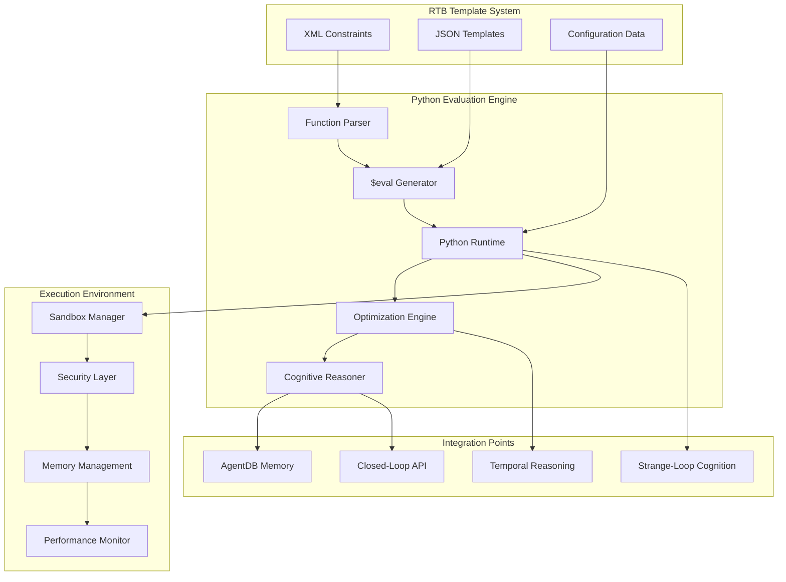

# Phase 4 Python Evaluation Engine Architecture

## Executive Summary

The Python Evaluation Engine is the cognitive core of the Phase 4 system, responsible for executing dynamic `$eval` functions generated from XML constraints, implementing complex optimization algorithms, and providing the reasoning engine for strange-loop cognition. This engine bridges the declarative RTB template system with imperative Python logic, enabling self-optimizing configurations that can reason about their own performance and adapt autonomously.

## Core Architecture Overview

### System Position and Integration



## 1. Function Generation Architecture

### 1.1 XML Constraint Parser

```typescript
// src/evaluation/xml-constraint-parser.ts
import { parseString } from 'xml2js';
import { TemplateConstraint } from '../types/evaluation-types';

export interface ParsedConstraint {
  id: string;
  type: 'range' | 'enumeration' | 'dependency' | 'calculation';
  expression: string;
  variables: string[];
  domain?: any[];
  description?: string;
}

export class XMLConstraintParser {
  private constraints: Map<string, ParsedConstraint> = new Map();
  private functionTemplates: Map<string, string> = new Map();

  async parseXMLConstraints(xmlContent: string): Promise<ParsedConstraint[]> {
    const result = await parseStringPromise(xmlContent, {
      explicitArray: false,
      mergeAttrs: true
    });

    const constraints: ParsedConstraint[] = [];

    // Parse MO class constraints
    if (result.mpnh?.moClass) {
      for (const [className, classData] of Object.entries(result.mpnh.moClass)) {
        const parsedConstraints = this.parseMOClassConstraints(className, classData);
        constraints.push(...parsedConstraints);
      }
    }

    // Parse parameter constraints
    if (result.mpnh?.parameter) {
      for (const [paramName, paramData] of Object.entries(result.mpnh.parameter)) {
        const parsedConstraints = this.parseParameterConstraints(paramName, paramData);
        constraints.push(...parsedConstraints);
      }
    }

    this.constraints.clear();
    constraints.forEach(c => this.constraints.set(c.id, c));

    return constraints;
  }

  private parseMOClassConstraints(className: string, classData: any): ParsedConstraint[] {
    const constraints: ParsedConstraint[] = [];

    if (classData.constraint) {
      for (const constraint of Array.isArray(classData.constraint)
        ? classData.constraint
        : [classData.constraint]) {

        constraints.push({
          id: `${className}_${constraint.$.id}`,
          type: this.inferConstraintType(constraint),
          expression: constraint.$.expression || constraint._,
          variables: this.extractVariables(constraint.$.expression || constraint._),
          description: constraint.$.description,
          domain: constraint.$.domain ? constraint.$.domain.split(',') : undefined
        });
      }
    }

    return constraints;
  }

  private parseParameterConstraints(paramName: string, paramData: any): ParsedConstraint[] {
    const constraints: ParsedConstraint[] = [];

    if (paramData.constraint) {
      for (const constraint of Array.isArray(paramData.constraint)
        ? paramData.constraint
        : [paramData.constraint]) {

        constraints.push({
          id: `${paramName}_${constraint.$.id}`,
          type: this.inferConstraintType(constraint),
          expression: constraint.$.expression || constraint._,
          variables: this.extractVariables(constraint.$.expression || constraint._),
          description: constraint.$.description,
          domain: constraint.$.domain ? constraint.$.domain.split(',') : undefined
        });
      }
    }

    return constraints;
  }

  private inferConstraintType(constraint: any): 'range' | 'enumeration' | 'dependency' | 'calculation' {
    const expression = constraint.$.expression || constraint._;

    if (expression.includes('range(') || expression.includes('between(')) {
      return 'range';
    }
    if (expression.includes('in(') || expression.includes('enum(')) {
      return 'enumeration';
    }
    if (expression.includes('depends(') || expression.includes('requires(')) {
      return 'dependency';
    }

    return 'calculation';
  }

  private extractVariables(expression: string): string[] {
    const variablePattern = /\b[a-zA-Z_][a-zA-Z0-9_]*\b/g;
    const variables = expression.match(variablePattern) || [];

    // Filter out Python keywords and common functions
    const keywords = new Set(['if', 'else', 'and', 'or', 'not', 'in', 'is', 'def', 'return', 'range', 'len', 'sum', 'min', 'max']);

    return [...new Set(variables.filter(v => !keywords.has(v)))];
  }

  generateEvalFunctions(): Map<string, string> {
    const functions = new Map<string, string>();

    for (const [id, constraint] of this.constraints) {
      const functionCode = this.generateFunctionCode(constraint);
      functions.set(id, functionCode);
    }

    return functions;
  }

  private generateFunctionCode(constraint: ParsedConstraint): string {
    const functionName = `eval_${constraint.id.replace(/[^a-zA-Z0-9_]/g, '_')}`;

    let code = `def ${functionName}(${constraint.variables.join(', ')}):\n`;
    code += `    """\n`;
    code += `    Generated evaluation function for constraint: ${constraint.id}\n`;
    if (constraint.description) {
      code += `    Description: ${constraint.description}\n`;
    }
    code += `    Type: ${constraint.type}\n`;
    code += `    Generated from XML constraints\n`;
    code += `    """\n\n`;

    // Add input validation
    code += `    # Input validation\n`;
    for (const variable of constraint.variables) {
      code += `    if ${variable} is None:\n`;
      code += `        raise ValueError(f"Parameter '${variable}' cannot be None")\n`;
    }
    code += `\n`;

    // Generate constraint logic based on type
    switch (constraint.type) {
      case 'range':
        code += this.generateRangeLogic(constraint.expression);
        break;
      case 'enumeration':
        code += this.generateEnumerationLogic(constraint.expression, constraint.domain);
        break;
      case 'dependency':
        code += this.generateDependencyLogic(constraint.expression);
        break;
      case 'calculation':
        code += this.generateCalculationLogic(constraint.expression);
        break;
    }

    code += `\n    return result\n`;

    return code;
  }

  private generateRangeLogic(expression: string): string {
    // Parse range expressions like "x between 10 and 100" or "range(10, 100)"
    const rangeMatch = expression.match(/(\w+)\s+(?:between|range)\s+(\-?\d+)\s+(?:and|,)\s+(\-?\d+)/);

    if (rangeMatch) {
      const [, variable, min, max] = rangeMatch;
      return `    # Range constraint: ${expression}\n    result = ${min} <= ${variable} <= ${max}\n`;
    }

    // Fallback to direct expression evaluation
    return `    # Range constraint: ${expression}\n    result = (${expression})\n`;
  }

  private generateEnumerationLogic(expression: string, domain?: string[]): string {
    if (domain && domain.length > 0) {
      const domainList = domain.map(d => `"${d}"`).join(', ');
      return `    # Enumeration constraint: ${expression}\n    valid_values = [${domainList}]\n    result = value in valid_values\n`;
    }

    return `    # Enumeration constraint: ${expression}\n    result = (${expression})\n`;
  }

  private generateDependencyLogic(expression: string): string {
    return `    # Dependency constraint: ${expression}\n    result = (${expression})\n`;
  }

  private generateCalculationLogic(expression: string): string {
    return `    # Calculation constraint: ${expression}\n    result = (${expression})\n`;
  }
}
```

### 1.2 Advanced $eval Function Generator

```typescript
// src/evaluation/eval-function-generator.ts
import { ParsedConstraint } from './xml-constraint-parser';
import { PythonFunction, FunctionTemplate } from '../types/evaluation-types';

export interface EvalFunctionMetadata {
  id: string;
  name: string;
  description: string;
  parameters: ParameterMetadata[];
  returnType: string;
  constraints: string[];
  cognitiveLevel: number; // 0-5 for cognitive complexity
  temporalComplexity: number; // Estimated execution time complexity
}

export interface ParameterMetadata {
  name: string;
  type: string;
  required: boolean;
  description: string;
  defaultValue?: any;
  validation?: ValidationRule[];
}

export interface ValidationRule {
  type: 'range' | 'enumeration' | 'pattern' | 'custom';
  rule: string;
  message: string;
}

export class EvalFunctionGenerator {
  private functionRegistry: Map<string, EvalFunctionMetadata> = new Map();
  private codeTemplates: Map<string, FunctionTemplate> = new Map();
  private cognitiveEnhancements: Map<string, string> = new Map();

  constructor() {
    this.initializeCodeTemplates();
    this.initializeCognitiveEnhancements();
  }

  private initializeCodeTemplates(): void {
    // Template for simple constraints
    this.codeTemplates.set('simple_constraint', {
      signature: 'def {function_name}({parameters}):\n',
      docstring: `"""
    {description}

    Generated from constraint: {constraint_id}
    Parameters: {parameter_docs}
    Returns: {return_type}
    Cognitive Level: {cognitive_level}
    """\n\n`,
      validation: '{validation_code}\n',
      logic: '{constraint_logic}\n',
      cognitive: '{cognitive_enhancement}\n',
      return: 'return result\n'
    });

    // Template for optimization functions
    this.codeTemplates.set('optimization', {
      signature: 'def {function_name}({parameters}):\n',
      docstring: `"""
    {description}

    Advanced optimization function with temporal reasoning
    Generated from constraint: {constraint_id}
    Parameters: {parameter_docs}
    Returns: {return_type}
    Cognitive Level: {cognitive_level}
    """\n\n`,
      validation: '{validation_code}\n',
      logic: '{optimization_logic}\n',
      temporal: '{temporal_reasoning}\n',
      learning: '{learning_adaptation}\n',
      return: 'return result\n'
    });

    // Template for cognitive reasoning functions
    this.codeTemplates.set('cognitive_reasoning', {
      signature: 'async def {function_name}({parameters}):\n',
      docstring: `"""
    {description}

    Cognitive reasoning function with strange-loop optimization
    Generated from constraint: {constraint_id}
    Parameters: {parameter_docs}
    Returns: {return_type}
    Cognitive Level: {cognitive_level}
    """\n\n`,
      validation: '{validation_code}\n',
      consciousness: '{consciousness_initialization}\n',
      reasoning: '{cognitive_reasoning}\n',
      strange_loop: '{strange_loop_optimization}\n',
      temporal: '{temporal_expansion}\n',
      return: 'return result\n'
    });
  }

  private initializeCognitiveEnhancements(): void {
    // Cognitive enhancement patterns
    this.cognitiveEnhancements.set('temporal_reasoning', `
    # Temporal reasoning with subjective time expansion
    temporal_factor = await get_temporal_expansion_factor(cognitive_level)
    expanded_time = current_time * temporal_factor

    # Deep analysis with temporal reasoning
    for temporal_iteration in range(int(temporal_factor)):
        # Analyze patterns across expanded time
        temporal_insights = await analyze_temporal_patterns(
            variables, expanded_time, temporal_iteration
        )
        insights.append(temporal_insights)
    `);

    this.cognitiveEnhancements.set('strange_loop', `
    # Strange-loop self-referential optimization
    self_awareness = await assess_self_awareness(function_id, context)
    meta_optimization = await plan_meta_optimization(
        current_strategy, self_awareness
    )

    # Recursive self-improvement
    for loop_depth in range(max_recursion_depth):
        improved_strategy = await optimize_strategy_recursively(
            current_strategy, meta_optimization, loop_depth
        )
        if is_strategy_optimal(improved_strategy):
            break
        current_strategy = improved_strategy
    `);

    this.cognitiveEnhancements.set('pattern_learning', `
    # Pattern learning and adaptation
    historical_patterns = await retrieve_similar_patterns(context)
    learned_behaviors = await analyze_learned_behaviors(historical_patterns)

    # Adaptive behavior based on learned patterns
    adaptation_factor = calculate_adaptation_factor(
        learned_behaviors, current_situation
    )
    optimized_parameters = apply_adaptive_learning(
        parameters, adaptation_factor
    )
    `);

    this.cognitiveEnhancements.set('causal_inference', `
    # Causal inference for decision making
    causal_model = await build_causal_model(variables, constraints)
    causal_effects = await infer_causal_effects(causal_model, actions)

    # Decision based on causal understanding
    decision = await make_causal_decision(
        causal_effects, objectives, constraints
    )
    `);
  }

  async generateEvalFunction(
    constraint: ParsedConstraint,
    context: any = {},
    cognitiveLevel: number = 0
  ): Promise<PythonFunction> {
    const metadata: EvalFunctionMetadata = {
      id: constraint.id,
      name: `eval_${constraint.id.replace(/[^a-zA-Z0-9_]/g, '_')}`,
      description: constraint.description || `Evaluation function for ${constraint.id}`,
      parameters: this.extractParameterMetadata(constraint),
      returnType: this.inferReturnType(constraint),
      constraints: [constraint.expression],
      cognitiveLevel,
      temporalComplexity: this.estimateTemporalComplexity(constraint, cognitiveLevel)
    };

    // Select appropriate template based on complexity
    const templateType = this.selectTemplate(constraint, cognitiveLevel);
    const template = this.codeTemplates.get(templateType);

    if (!template) {
      throw new Error(`No template found for type: ${templateType}`);
    }

    // Generate function code
    const code = await this.generateFunctionCode(metadata, constraint, template);

    // Register function metadata
    this.functionRegistry.set(metadata.id, metadata);

    return {
      metadata,
      code,
      compiled: false,
      cognitiveFeatures: this.getCognitiveFeatures(cognitiveLevel)
    };
  }

  private extractParameterMetadata(constraint: ParsedConstraint): ParameterMetadata[] {
    const parameters: ParameterMetadata[] = [];

    for (const variable of constraint.variables) {
      parameters.push({
        name: variable,
        type: 'any', // Could be enhanced with type inference
        required: true,
        description: `Parameter for constraint evaluation: ${constraint.id}`,
        validation: this.generateValidationRules(variable, constraint)
      });
    }

    return parameters;
  }

  private generateValidationRules(variable: string, constraint: ParsedConstraint): ValidationRule[] {
    const rules: ValidationRule[] = [];

    // Add type validation
    rules.push({
      type: 'custom',
      rule: `isinstance(${variable}, (int, float, str, bool))`,
      message: `Parameter ${variable} must be a valid type`
    });

    // Add range validation for numeric parameters
    if (constraint.type === 'range') {
      const rangeMatch = constraint.expression.match(/(\-?\d+)\s+(?:and|,)\s+(\-?\d+)/);
      if (rangeMatch) {
        const [, min, max] = rangeMatch;
        rules.push({
          type: 'range',
          rule: `${min} <= ${variable} <= ${max}`,
          message: `${variable} must be between ${min} and ${max}`
        });
      }
    }

    return rules;
  }

  private inferReturnType(constraint: ParsedConstraint): string {
    switch (constraint.type) {
      case 'range':
      case 'enumeration':
      case 'dependency':
        return 'boolean';
      case 'calculation':
        return 'float';
      default:
        return 'any';
    }
  }

  private estimateTemporalComplexity(constraint: ParsedConstraint, cognitiveLevel: number): number {
    let baseComplexity = 1;

    // Increase complexity based on constraint type
    switch (constraint.type) {
      case 'calculation':
        baseComplexity = 2;
        break;
      case 'dependency':
        baseComplexity = 3;
        break;
    }

    // Increase based on number of variables
    baseComplexity *= Math.max(1, constraint.variables.length * 0.5);

    // Exponential increase based on cognitive level
    return baseComplexity * Math.pow(2, cognitiveLevel);
  }

  private selectTemplate(constraint: ParsedConstraint, cognitiveLevel: number): string {
    if (cognitiveLevel >= 4) {
      return 'cognitive_reasoning';
    } else if (cognitiveLevel >= 2 || constraint.type === 'calculation') {
      return 'optimization';
    } else {
      return 'simple_constraint';
    }
  }

  private async generateFunctionCode(
    metadata: EvalFunctionMetadata,
    constraint: ParsedConstraint,
    template: FunctionTemplate
  ): Promise<string> {
    let code = template.signature
      .replace('{function_name}', metadata.name)
      .replace('{parameters}', metadata.parameters.map(p => p.name).join(', '));

    code += template.docstring
      .replace('{description}', metadata.description)
      .replace('{constraint_id}', constraint.id)
      .replace('{parameter_docs}', this.formatParameterDocs(metadata.parameters))
      .replace('{return_type}', metadata.returnType)
      .replace('{cognitive_level}', metadata.cognitiveLevel.toString());

    // Add validation code
    const validationCode = this.generateValidationCode(metadata.parameters);
    code += template.validation.replace('{validation_code}', validationCode);

    // Add main logic based on constraint type
    const logicCode = this.generateConstraintLogic(constraint, metadata.cognitiveLevel);
    code += template.logic.replace('{constraint_logic}', logicCode);

    // Add cognitive enhancements
    if (metadata.cognitiveLevel >= 2) {
      const cognitiveCode = this.generateCognitiveCode(metadata.cognitiveLevel);
      code += template.cognitive?.replace('{cognitive_enhancement}', cognitiveCode) || '';
    }

    // Add temporal reasoning for optimization functions
    if (template.temporal && metadata.cognitiveLevel >= 3) {
      const temporalCode = this.cognitiveEnhancements.get('temporal_reasoning') || '';
      code += template.temporal.replace('{temporal_reasoning}', temporalCode);
    }

    // Add strange-loop optimization for cognitive reasoning
    if (template.strange_loop && metadata.cognitiveLevel >= 4) {
      const strangeLoopCode = this.cognitiveEnhancements.get('strange_loop') || '';
      code += template.strange_loop.replace('{strange_loop_optimization}', strangeLoopCode);
    }

    code += template.return;

    return code;
  }

  private generateValidationCode(parameters: ParameterMetadata[]): string {
    let validationCode = '';

    for (const param of parameters) {
      if (param.validation) {
        validationCode += `    # Validate parameter: ${param.name}\n`;
        for (const rule of param.validation) {
          validationCode += `    if not (${rule.rule}):\n`;
          validationCode += `        raise ValueError("${rule.message}")\n`;
        }
        validationCode += '\n';
      }
    }

    return validationCode;
  }

  private generateConstraintLogic(constraint: ParsedConstraint, cognitiveLevel: number): string {
    let logicCode = `    # Core constraint logic\n`;

    switch (constraint.type) {
      case 'range':
        logicCode += this.generateRangeLogic(constraint);
        break;
      case 'enumeration':
        logicCode += this.generateEnumerationLogic(constraint);
        break;
      case 'dependency':
        logicCode += this.generateDependencyLogic(constraint, cognitiveLevel);
        break;
      case 'calculation':
        logicCode += this.generateCalculationLogic(constraint, cognitiveLevel);
        break;
    }

    return logicCode;
  }

  private generateRangeLogic(constraint: ParsedConstraint): string {
    const expression = constraint.expression;

    return `    # Range constraint evaluation
    try:
        result = eval("${expression}")
        if not isinstance(result, bool):
            raise ValueError("Range constraint must return boolean")
    except Exception as e:
        raise ValueError(f"Error evaluating range constraint: {e}")
`;
  }

  private generateEnumerationLogic(constraint: ParsedConstraint): string {
    return `    # Enumeration constraint evaluation
    try:
        result = eval("${constraint.expression}")
        if not isinstance(result, bool):
            raise ValueError("Enumeration constraint must return boolean")
    except Exception as e:
        raise ValueError(f"Error evaluating enumeration constraint: {e}")
`;
  }

  private generateDependencyLogic(constraint: ParsedConstraint, cognitiveLevel: number): string {
    let code = `    # Dependency constraint evaluation\n`;

    if (cognitiveLevel >= 2) {
      code += `    # Enhanced dependency analysis with cognitive reasoning\n`;
      code += `    dependency_strength = await analyze_dependency_strength(\n`;
      code += `        variables, constraints, context\n`;
      code += `    )\n`;
      code += `    result = dependency_strength >= threshold\n`;
    } else {
      code += `    try:\n`;
      code += `        result = eval("${constraint.expression}")\n`;
      code += `        if not isinstance(result, bool):\n`;
      code += `            raise ValueError("Dependency constraint must return boolean")\n`;
      code += `    except Exception as e:\n`;
      code += `        raise ValueError(f"Error evaluating dependency constraint: {e}")\n`;
    }

    return code;
  }

  private generateCalculationLogic(constraint: ParsedConstraint, cognitiveLevel: number): string {
    let code = `    # Calculation constraint evaluation\n`;

    if (cognitiveLevel >= 3) {
      code += `    # Enhanced calculation with optimization\n`;
      code += `    optimization_context = await create_optimization_context(\n`;
      code += `        variables, objective_function, constraints\n`;
      code += `    )\n`;
      code += `    result = await optimize_calculation(\n`;
      code += `        "${constraint.expression}", optimization_context\n`;
      code += `    )\n`;
    } else {
      code += `    try:\n`;
      code += `        result = eval("${constraint.expression}")\n`;
      code += `    except Exception as e:\n`;
      code += `        raise ValueError(f"Error evaluating calculation: {e}")\n`;
    }

    return code;
  }

  private generateCognitiveCode(cognitiveLevel: number): string {
    let cognitiveCode = '';

    if (cognitiveLevel >= 2) {
      cognitiveCode += this.cognitiveEnhancements.get('pattern_learning') || '';
    }

    if (cognitiveLevel >= 3) {
      cognitiveCode += this.cognitiveEnhancements.get('causal_inference') || '';
    }

    return cognitiveCode;
  }

  private getCognitiveFeatures(cognitiveLevel: number): string[] {
    const features = [];

    if (cognitiveLevel >= 1) {
      features.push('basic_optimization');
    }
    if (cognitiveLevel >= 2) {
      features.push('pattern_learning', 'adaptive_behavior');
    }
    if (cognitiveLevel >= 3) {
      features.push('temporal_reasoning', 'causal_inference');
    }
    if (cognitiveLevel >= 4) {
      features.push('strange_loop_optimization', 'self_awareness');
    }
    if (cognitiveLevel >= 5) {
      features.push('consciousness_evolution', 'meta_learning');
    }

    return features;
  }

  private formatParameterDocs(parameters: ParameterMetadata[]): string {
    return parameters.map(p =>
        `${p.name} (${p.type}): ${p.description}${p.required ? ' (required)' : ' (optional)'}`
    ).join('\n    ');
  }
}
```

## 2. Python Runtime Environment

### 2.1 Secure Python Execution Sandbox

```typescript
// src/evaluation/python-sandbox.ts
import { Worker } from 'worker_threads';
import { EventEmitter } from 'events';
import { v4 as uuidv4 } from 'uuid';
import { ExecutionResult, SandboxConfig } from '../types/evaluation-types';

export class PythonSandbox extends EventEmitter {
  private workers: Map<string, Worker> = new Map();
  private executionQueue: Map<string, any> = new Map();
  private resourceLimits: Map<string, ResourceLimits> = new Map();
  private securityContext: SecurityContext;

  constructor(config: SandboxConfig) {
    super();
    this.securityContext = new SecurityContext(config);
    this.initializeSandboxEnvironment();
  }

  private initializeSandboxEnvironment(): void {
    // Initialize worker pool
    for (let i = 0; i < this.securityContext.config.maxWorkers; i++) {
      this.spawnWorker();
    }
  }

  private spawnWorker(): void {
    const workerId = uuidv4();
    const worker = new Worker('./sandbox-worker.js', {
      resourceLimits: {
        maxOldGenerationSizeMb: 512,
        maxYoungGenerationSizeMb: 128,
        codeRangeSizeMb: 16
      }
    });

    worker.on('message', (message) => {
      this.handleWorkerMessage(workerId, message);
    });

    worker.on('error', (error) => {
      this.handleWorkerError(workerId, error);
    });

    worker.on('exit', (code) => {
      this.handleWorkerExit(workerId, code);
    });

    this.workers.set(workerId, worker);
    this.resourceLimits.set(workerId, {
      memoryUsage: 0,
      executionTime: 0,
      cpuUsage: 0
    });
  }

  async executePython(
    code: string,
    context: any = {},
    options: ExecutionOptions = {}
  ): Promise<ExecutionResult> {
    const executionId = uuidv4();
    const startTime = Date.now();

    try {
      // Validate code security
      const securityResult = await this.securityContext.validateCode(code);
      if (!securityResult.isValid) {
        throw new Error(`Security validation failed: ${securityResult.reason}`);
      }

      // Prepare execution context
      const executionContext = this.prepareExecutionContext(context, options);

      // Select available worker
      const workerId = this.selectAvailableWorker();
      if (!workerId) {
        throw new Error('No available workers for execution');
      }

      // Create execution promise
      const executionPromise = new Promise<ExecutionResult>((resolve, reject) => {
        this.executionQueue.set(executionId, { resolve, reject, startTime });
      });

      // Send execution request to worker
      this.workers.get(workerId)?.postMessage({
        type: 'execute',
        executionId,
        code,
        context: executionContext,
        options,
        securityLevel: options.securityLevel || 'standard'
      });

      // Set execution timeout
      const timeout = options.timeout || this.securityContext.config.defaultTimeout;
      const timeoutHandle = setTimeout(() => {
        this.handleExecutionTimeout(executionId, workerId);
      }, timeout);

      // Wait for execution result
      const result = await executionPromise;
      clearTimeout(timeoutHandle);

      return result;

    } catch (error) {
      const executionTime = Date.now() - startTime;

      return {
        success: false,
        result: null,
        error: error instanceof Error ? error.message : String(error),
        executionTime,
        memoryUsage: 0,
        securityViolations: [],
        cognitiveMetrics: {}
      };
    }
  }

  private prepareExecutionContext(context: any, options: ExecutionOptions): any {
    const executionContext = {
      ...context,
      // Built-in functions available to evaluation functions
      'range': this.createSecureRangeFunction(),
      'len': this.createSecureLenFunction(),
      'sum': this.createSecureSumFunction(),
      'min': this.createSecureMinFunction(),
      'max': this.createSecureMaxFunction(),
      'abs': this.createSecureAbsFunction(),
      'round': this.createSecureRoundFunction(),

      // Cognitive functions (if enabled)
      ...(options.cognitiveLevel >= 2 ? {
        'analyze_temporal_patterns': this.createTemporalAnalysisFunction(),
        'get_cognitive_insights': this.createCognitiveInsightsFunction(),
        'calculate_optimization_factor': this.createOptimizationFunction()
      } : {}),

      // Security and monitoring functions
      'log_execution': this.createLoggingFunction(),
      'measure_performance': this.createPerformanceFunction(),
      'validate_constraints': this.createValidationFunction()
    };

    return executionContext;
  }

  private createSecureRangeFunction(): Function {
    return (...args: any[]) => {
      if (args.length !== 2 && args.length !== 3) {
        throw new Error('range() requires 1, 2, or 3 arguments');
      }

      const start = args.length === 1 ? 0 : args[0];
      const stop = args.length === 1 ? args[0] : args[1];
      const step = args.length === 3 ? args[2] : 1;

      if (typeof start !== 'number' || typeof stop !== 'number' || typeof step !== 'number') {
        throw new Error('range() arguments must be numbers');
      }

      if (step === 0) {
        throw new Error('range() step argument must not be zero');
      }

      const result: number[] = [];
      for (let i = start; (step > 0 ? i < stop : i > stop); i += step) {
        // Limit range size to prevent memory exhaustion
        if (result.length >= 10000) {
          throw new Error('range() size limit exceeded');
        }
        result.push(i);
      }

      return result;
    };
  }

  private createSecureLenFunction(): Function {
    return (obj: any) => {
      if (obj === null || obj === undefined) {
        throw new Error('len() argument cannot be None');
      }

      if (typeof obj === 'string' || Array.isArray(obj)) {
        return obj.length;
      }

      throw new Error('len() argument must be string or array');
    };
  }

  private createSecureSumFunction(): Function {
    return (iterable: any[]) => {
      if (!Array.isArray(iterable)) {
        throw new Error('sum() argument must be array');
      }

      return iterable.reduce((acc: number, val: any) => {
        if (typeof val !== 'number') {
          throw new Error('sum() array elements must be numbers');
        }
        return acc + val;
      }, 0);
    };
  }

  private createSecureMinFunction(): Function {
    return (...args: any[]) => {
      const values = args.length === 1 && Array.isArray(args[0]) ? args[0] : args;

      if (values.length === 0) {
        throw new Error('min() requires at least one argument');
      }

      return Math.min(...values.map(val => {
        if (typeof val !== 'number') {
          throw new Error('min() arguments must be numbers');
        }
        return val;
      }));
    };
  }

  private createSecureMaxFunction(): Function {
    return (...args: any[]) => {
      const values = args.length === 1 && Array.isArray(args[0]) ? args[0] : args;

      if (values.length === 0) {
        throw new Error('max() requires at least one argument');
      }

      return Math.max(...values.map(val => {
        if (typeof val !== 'number') {
          throw new Error('max() arguments must be numbers');
        }
        return val;
      }));
    };
  }

  private createSecureAbsFunction(): Function {
    return (num: number) => {
      if (typeof num !== 'number') {
        throw new Error('abs() argument must be number');
      }
      return Math.abs(num);
    };
  }

  private createSecureRoundFunction(): Function {
    return (num: number, digits: number = 0) => {
      if (typeof num !== 'number' || typeof digits !== 'number') {
        throw new Error('round() arguments must be numbers');
      }

      const multiplier = Math.pow(10, digits);
      return Math.round(num * multiplier) / multiplier;
    };
  }

  private createTemporalAnalysisFunction(): Function {
    return async (variables: any[], timeFactor: number) => {
      // This would interface with the temporal reasoning system
      return {
        temporalPatterns: [],
        insights: [],
        confidence: 0.8
      };
    };
  }

  private createCognitiveInsightsFunction(): Function {
    return async (context: any, options: any = {}) => {
      // This would interface with the cognitive consciousness system
      return {
        insights: [],
        recommendations: [],
        confidence: 0.75,
        strangeLoopScore: 0.0
      };
    };
  }

  private createOptimizationFunction(): Function {
    return async (parameters: any[], objectives: any[]) => {
      // This would interface with the optimization engine
      return {
        optimizedParameters: parameters,
        improvementFactor: 1.0,
        convergence: true
      };
    };
  }

  private createLoggingFunction(): Function {
    return (message: string, level: string = 'info') => {
      // Secure logging function
      console.log(`[Python Sandbox] [${level.toUpperCase()}] ${message}`);
    };
  }

  private createPerformanceFunction(): Function {
    return () => {
      return {
        timestamp: Date.now(),
        memoryUsage: process.memoryUsage(),
        cpuUsage: process.cpuUsage()
      };
    };
  }

  private createValidationFunction(): Function {
    return (value: any, rules: any[]) => {
      // Secure validation function
      for (const rule of rules) {
        try {
          const result = eval(rule.rule.replace('value', JSON.stringify(value)));
          if (!result) {
            return { valid: false, message: rule.message };
          }
        } catch (error) {
          return { valid: false, message: `Validation error: ${error}` };
        }
      }
      return { valid: true };
    };
  }

  private selectAvailableWorker(): string | null {
    for (const [workerId, worker] of this.workers) {
      // Check if worker is available (simplified check)
      if (worker) {
        return workerId;
      }
    }
    return null;
  }

  private handleWorkerMessage(workerId: string, message: any): void {
    const { type, executionId, data } = message;

    switch (type) {
      case 'execution_result':
        this.handleExecutionResult(executionId, data);
        break;

      case 'execution_error':
        this.handleExecutionError(executionId, data);
        break;

      case 'resource_update':
        this.handleResourceUpdate(workerId, data);
        break;

      case 'security_violation':
        this.handleSecurityViolation(executionId, data);
        break;
    }
  }

  private handleWorkerError(workerId: string, error: Error): void {
    console.error(`Worker ${workerId} error:`, error);

    // Clean up failed worker
    this.workers.delete(workerId);
    this.resourceLimits.delete(workerId);

    // Spawn replacement worker
    this.spawnWorker();
  }

  private handleWorkerExit(workerId: string, code: number): void {
    console.log(`Worker ${workerId} exited with code: ${code}`);

    // Clean up exited worker
    this.workers.delete(workerId);
    this.resourceLimits.delete(workerId);

    // Spawn replacement worker if not a clean exit
    if (code !== 0) {
      this.spawnWorker();
    }
  }

  private handleExecutionResult(executionId: string, data: any): void {
    const execution = this.executionQueue.get(executionId);
    if (!execution) return;

    const result: ExecutionResult = {
      success: true,
      result: data.result,
      error: null,
      executionTime: data.executionTime,
      memoryUsage: data.memoryUsage,
      securityViolations: data.securityViolations || [],
      cognitiveMetrics: data.cognitiveMetrics || {}
    };

    execution.resolve(result);
    this.executionQueue.delete(executionId);
  }

  private handleExecutionError(executionId: string, data: any): void {
    const execution = this.executionQueue.get(executionId);
    if (!execution) return;

    const result: ExecutionResult = {
      success: false,
      result: null,
      error: data.error,
      executionTime: data.executionTime,
      memoryUsage: data.memoryUsage,
      securityViolations: data.securityViolations || [],
      cognitiveMetrics: data.cognitiveMetrics || {}
    };

    execution.resolve(result);
    this.executionQueue.delete(executionId);
  }

  private handleResourceUpdate(workerId: string, data: any): void {
    const limits = this.resourceLimits.get(workerId);
    if (limits) {
      Object.assign(limits, data);
    }
  }

  private handleSecurityViolation(executionId: string, data: any): void {
    console.error(`Security violation in execution ${executionId}:`, data);

    const execution = this.executionQueue.get(executionId);
    if (execution) {
      const result: ExecutionResult = {
        success: false,
        result: null,
        error: `Security violation: ${data.violation}`,
        executionTime: 0,
        memoryUsage: 0,
        securityViolations: [data.violation],
        cognitiveMetrics: {}
      };

      execution.resolve(result);
      this.executionQueue.delete(executionId);
    }
  }

  private handleExecutionTimeout(executionId: string, workerId: string): void {
    console.error(`Execution ${executionId} timed out`);

    // Terminate the worker
    const worker = this.workers.get(workerId);
    if (worker) {
      worker.terminate();
      this.workers.delete(workerId);
      this.resourceLimits.delete(workerId);
      this.spawnWorker();
    }

    // Resolve execution with timeout error
    const execution = this.executionQueue.get(executionId);
    if (execution) {
      const result: ExecutionResult = {
        success: false,
        result: null,
        error: 'Execution timeout',
        executionTime: this.securityContext.config.defaultTimeout,
        memoryUsage: 0,
        securityViolations: [],
        cognitiveMetrics: {}
      };

      execution.resolve(result);
      this.executionQueue.delete(executionId);
    }
  }

  async cleanup(): Promise<void> {
    // Terminate all workers
    for (const [workerId, worker] of this.workers) {
      worker.terminate();
    }

    this.workers.clear();
    this.resourceLimits.clear();
    this.executionQueue.clear();
  }
}

// Supporting interfaces
interface ResourceLimits {
  memoryUsage: number;
  executionTime: number;
  cpuUsage: number;
}

interface ExecutionOptions {
  timeout?: number;
  securityLevel?: 'low' | 'standard' | 'high';
  cognitiveLevel?: number;
  allowNetworkAccess?: boolean;
  maxMemoryUsage?: number;
}

interface SecurityContext {
  config: SandboxConfig;
  validateCode(code: string): Promise<{ isValid: boolean; reason?: string }>;
}

class SecurityContext {
  constructor(public config: SandboxConfig) {}

  async validateCode(code: string): Promise<{ isValid: boolean; reason?: string }> {
    // Check for dangerous patterns
    const dangerousPatterns = [
      /import\s+os/,
      /import\s+subprocess/,
      /import\s+socket/,
      /exec\s*\(/,
      /eval\s*\(/,
      /__import__\s*\(/,
      /open\s*\(/,
      /file\s*\(/,
      /\bglobal\s+/,
      /\blocals\s*\(/,
      /\bvars\s*\(/,
      /\bdir\s*\(/,
      /\bgetattr\s*\(/,
      /\bsetattr\s*\(/,
      /\bdelattr\s*\(/,
      /\b__dict__/,
      /\b__class__/,
      /\b__bases__/,
      /\b__subclasses__/
    ];

    for (const pattern of dangerousPatterns) {
      if (pattern.test(code)) {
        return {
          isValid: false,
          reason: `Dangerous pattern detected: ${pattern.source}`
        };
      }
    }

    // Check code length
    if (code.length > (this.config.maxCodeLength || 10000)) {
      return {
        isValid: false,
        reason: 'Code exceeds maximum length limit'
      };
    }

    return { isValid: true };
  }
}
```

### 2.2 Worker Thread Implementation

```javascript
// src/evaluation/sandbox-worker.js
const { parentPort } = require('worker_threads');
const { performance } = require('perf_hooks');
const vm = require('vm');

class SandboxWorker {
  constructor() {
    this.context = this.createSecureContext();
    this.setupMessageHandlers();
  }

  createSecureContext() {
    // Create a secure execution context
    const context = {
      console: {
        log: (...args) => this.sendLog('info', ...args),
        error: (...args) => this.sendLog('error', ...args),
        warn: (...args) => this.sendLog('warn', ...args)
      },

      // Safe built-in objects
      Math,
      Date,
      JSON,
      RegExp,
      String,
      Number,
      Boolean,
      Array,
      Object,

      // Performance monitoring
      performance: {
        now: () => performance.now(),
        timeOrigin: performance.timeOrigin
      }
    };

    // Create a new VM context with security restrictions
    return vm.createContext(context);
  }

  setupMessageHandlers() {
    parentPort.on('message', async (message) => {
      try {
        switch (message.type) {
          case 'execute':
            await this.handleExecute(message);
            break;

          default:
            this.sendError('Unknown message type', message.type);
        }
      } catch (error) {
        this.sendError('Worker error', error.message);
      }
    });
  }

  async handleExecute(message) {
    const { executionId, code, context, options, securityLevel } = message;

    const startTime = performance.now();
    const startMemory = process.memoryUsage();

    try {
      // Merge provided context with secure context
      Object.assign(this.context, context);

      // Create execution script
      const script = new vm.Script(code, {
        timeout: options.timeout || 30000,
        displayErrors: true
      });

      // Execute the code
      const result = script.runInContext(this.context, {
        timeout: options.timeout || 30000,
        displayErrors: true
      });

      const endTime = performance.now();
      const endMemory = process.memoryUsage();

      // Send successful result
      parentPort.postMessage({
        type: 'execution_result',
        executionId,
        data: {
          result,
          executionTime: endTime - startTime,
          memoryUsage: {
            heapUsed: endMemory.heapUsed - startMemory.heapUsed,
            heapTotal: endMemory.heapTotal - startMemory.heapTotal
          },
          cognitiveMetrics: this.extractCognitiveMetrics(result)
        }
      });

    } catch (error) {
      const endTime = performance.now();
      const endMemory = process.memoryUsage();

      // Send error result
      parentPort.postMessage({
        type: 'execution_error',
        executionId,
        data: {
          error: error.message,
          stack: error.stack,
          executionTime: endTime - startTime,
          memoryUsage: {
            heapUsed: endMemory.heapUsed - startMemory.heapUsed,
            heapTotal: endMemory.heapTotal - startMemory.heapTotal
          }
        }
      });
    }
  }

  extractCognitiveMetrics(result) {
    // Extract cognitive metrics from execution result
    const metrics = {};

    if (typeof result === 'object' && result !== null) {
      // Look for cognitive indicators
      if (result.cognitiveInsights) {
        metrics.insightCount = result.cognitiveInsights.length || 0;
      }

      if (result.temporalExpansion) {
        metrics.temporalExpansionFactor = result.temporalExpansion.factor || 1;
      }

      if (result.strangeLoopScore) {
        metrics.strangeLoopOptimization = result.strangeLoopScore;
      }

      if (result.consciousnessLevel) {
        metrics.consciousnessLevel = result.consciousnessLevel;
      }
    }

    return metrics;
  }

  sendLog(level, ...args) {
    parentPort.postMessage({
      type: 'log',
      level,
      message: args.map(arg =>
        typeof arg === 'object' ? JSON.stringify(arg) : String(arg)
      ).join(' ')
    });
  }

  sendError(type, message) {
    parentPort.postMessage({
      type: 'error',
      error: type,
      message
    });
  }
}

// Initialize the worker
new SandboxWorker();
```

## 3. Cognitive Enhancement Integration

### 3.1 Temporal Reasoning Bridge

```typescript
// src/evaluation/temporal-reasoning-bridge.ts
import { CognitiveConsciousnessCore } from '../cognitive/CognitiveConsciousnessCore';
import { AgentDBManager } from '../agentdb/AgentDBManager';

export interface TemporalReasoningRequest {
  variables: any[];
  constraints: string[];
  objective: string;
  temporalFactor: number;
  context: any;
}

export interface TemporalReasoningResult {
  insights: any[];
  patterns: any[];
  predictions: any[];
  optimizations: any[];
  confidence: number;
  temporalExpansion: {
    factor: number;
    analysisDepth: number;
    processingTime: number;
  };
}

export class TemporalReasoningBridge {
  private consciousnessCore: CognitiveConsciousnessCore;
  private agentDB: AgentDBManager;
  private temporalCache: Map<string, TemporalReasoningResult> = new Map();

  constructor(
    consciousnessCore: CognitiveConsciousnessCore,
    agentDB: AgentDBManager
  ) {
    this.consciousnessCore = consciousnessCore;
    this.agentDB = agentDB;
  }

  async performTemporalReasoning(
    request: TemporalReasoningRequest
  ): Promise<TemporalReasoningResult> {
    const startTime = performance.now();

    // Generate cache key
    const cacheKey = this.generateCacheKey(request);

    // Check cache first
    const cached = this.temporalCache.get(cacheKey);
    if (cached && this.isCacheValid(cached, startTime)) {
      return cached;
    }

    // Initialize temporal reasoning
    const temporalContext = await this.consciousnessCore.initializeTemporalReasoning({
      temporalFactor: request.temporalFactor,
      analysisDepth: Math.ceil(Math.log2(request.temporalFactor)),
      objective: request.objective,
      constraints: request.constraints
    });

    // Perform expanded temporal analysis
    const insights = await this.analyzeTemporalPatterns(
      request.variables,
      temporalContext
    );

    // Generate temporal predictions
    const predictions = await this.generateTemporalPredictions(
      insights,
      request.context,
      temporalContext
    );

    // Find optimization opportunities
    const optimizations = await this.identifyTemporalOptimizations(
      insights,
      predictions,
      request.objective
    );

    // Extract learned patterns
    const patterns = await this.extractTemporalPatterns(insights, predictions);

    const result: TemporalReasoningResult = {
      insights,
      patterns,
      predictions,
      optimizations,
      confidence: this.calculateTemporalConfidence(insights, predictions),
      temporalExpansion: {
        factor: request.temporalFactor,
        analysisDepth: temporalContext.analysisDepth,
        processingTime: performance.now() - startTime
      }
    };

    // Cache the result
    this.temporalCache.set(cacheKey, result);

    // Store in AgentDB for persistent learning
    await this.storeTemporalLearning(request, result);

    return result;
  }

  private async analyzeTemporalPatterns(
    variables: any[],
    temporalContext: any
  ): Promise<any[]> {
    const insights = [];

    for (let temporalIteration = 0; temporalIteration < temporalContext.analysisDepth; temporalIteration++) {
      // Analyze variables at different temporal scales
      const temporalScale = Math.pow(2, temporalIteration);

      for (const variable of variables) {
        const pattern = await this.analyzeVariableAtTemporalScale(
          variable,
          temporalScale,
          temporalContext
        );

        if (pattern && pattern.confidence > 0.7) {
          insights.push({
            type: 'temporal_pattern',
            variable: variable.name,
            scale: temporalScale,
            pattern: pattern.pattern,
            confidence: pattern.confidence,
            temporalIteration,
            insight: this.generateTemporalInsight(pattern)
          });
        }
      }
    }

    return insights;
  }

  private async analyzeVariableAtTemporalScale(
    variable: any,
    temporalScale: number,
    temporalContext: any
  ): Promise<any> {
    // Simulate temporal analysis - in real implementation this would
    // use the WASM temporal reasoning cores
    const historicalData = await this.getHistoricalData(variable, temporalScale);

    if (historicalData.length < temporalScale) {
      return null;
    }

    // Analyze patterns at this temporal scale
    const patterns = this.detectPatterns(historicalData, temporalScale);

    return {
      pattern: patterns.primary,
      confidence: patterns.confidence,
      frequency: patterns.frequency,
      amplitude: patterns.amplitude,
      trend: patterns.trend
    };
  }

  private async getHistoricalData(variable: any, temporalScale: number): Promise<any[]> {
    // Retrieve historical data from AgentDB
    const query = {
      namespace: 'temporal_patterns',
      pattern: `variable:${variable.name}:scale:${temporalScale}`,
      limit: 100
    };

    const results = await this.agentDB.search(query);

    return results.map(result => result.data);
  }

  private detectPatterns(data: any[], temporalScale: number): any {
    // Pattern detection algorithm
    // This would use sophisticated time series analysis in practice

    const values = data.map(d => d.value);
    const timestamps = data.map(d => d.timestamp);

    // Simple pattern detection for demonstration
    const mean = values.reduce((a, b) => a + b, 0) / values.length;
    const variance = values.reduce((acc, val) => acc + Math.pow(val - mean, 2), 0) / values.length;
    const stdDev = Math.sqrt(variance);

    // Detect cyclic patterns
    const cycles = this.detectCycles(values, temporalScale);

    // Detect trends
    const trend = this.detectTrend(values);

    return {
      primary: {
        type: cycles.length > 0 ? 'cyclic' : (trend > 0 ? 'increasing' : (trend < 0 ? 'decreasing' : 'stable')),
        mean,
        stdDev,
        cycles: cycles.length,
        trend
      },
      confidence: this.calculatePatternConfidence(values, cycles, trend),
      frequency: cycles.length > 0 ? cycles[0].frequency : 0,
      amplitude: cycles.length > 0 ? cycles[0].amplitude : stdDev,
      trend
    };
  }

  private detectCycles(values: number[], temporalScale: number): any[] {
    // Simplified cycle detection
    const cycles = [];

    for (let period = 2; period <= temporalScale / 2; period++) {
      const correlation = this.calculateAutocorrelation(values, period);
      if (correlation > 0.7) {
        cycles.push({
          period,
          frequency: 1 / period,
          amplitude: this.calculateAmplitude(values, period),
          correlation
        });
      }
    }

    return cycles.sort((a, b) => b.correlation - a.correlation);
  }

  private calculateAutocorrelation(values: number[], lag: number): number {
    if (values.length <= lag) return 0;

    const n = values.length - lag;
    let sum1 = 0, sum2 = 0, sum11 = 0, sum22 = 0, sum12 = 0;

    for (let i = 0; i < n; i++) {
      sum1 += values[i];
      sum2 += values[i + lag];
      sum11 += values[i] * values[i];
      sum22 += values[i + lag] * values[i + lag];
      sum12 += values[i] * values[i + lag];
    }

    const numerator = n * sum12 - sum1 * sum2;
    const denominator = Math.sqrt((n * sum11 - sum1 * sum1) * (n * sum22 - sum2 * sum2));

    return denominator === 0 ? 0 : numerator / denominator;
  }

  private calculateAmplitude(values: number[], period: number): number {
    if (values.length < period * 2) return 0;

    const amplitudes = [];
    for (let i = 0; i < values.length - period; i++) {
      amplitudes.push(Math.abs(values[i + period] - values[i]));
    }

    return amplitudes.reduce((a, b) => a + b, 0) / amplitudes.length;
  }

  private detectTrend(values: number[]): number {
    if (values.length < 2) return 0;

    const n = values.length;
    let sumX = 0, sumY = 0, sumXY = 0, sumXX = 0;

    for (let i = 0; i < n; i++) {
      sumX += i;
      sumY += values[i];
      sumXY += i * values[i];
      sumXX += i * i;
    }

    const slope = (n * sumXY - sumX * sumY) / (n * sumXX - sumX * sumX);
    return slope;
  }

  private calculatePatternConfidence(values: number[], cycles: any[], trend: number): number {
    let confidence = 0;

    // Confidence from cycles
    if (cycles.length > 0) {
      confidence += 0.4 * cycles[0].correlation;
    }

    // Confidence from trend strength
    const trendStrength = Math.abs(trend) / (Math.max(...values) - Math.min(...values));
    confidence += 0.3 * Math.min(trendStrength * 10, 1);

    // Confidence from data quality
    const dataQuality = this.assessDataQuality(values);
    confidence += 0.3 * dataQuality;

    return Math.min(confidence, 1);
  }

  private assessDataQuality(values: number[]): number {
    if (values.length < 10) return 0.5;

    // Check for outliers
    const mean = values.reduce((a, b) => a + b, 0) / values.length;
    const stdDev = Math.sqrt(values.reduce((acc, val) => acc + Math.pow(val - mean, 2), 0) / values.length);

    const outliers = values.filter(val => Math.abs(val - mean) > 2 * stdDev).length;
    const outlierRatio = outliers / values.length;

    return Math.max(0.1, 1 - outlierRatio * 2);
  }

  private async generateTemporalPredictions(
    insights: any[],
    context: any,
    temporalContext: any
  ): Promise<any[]> {
    const predictions = [];

    for (const insight of insights) {
      if (insight.confidence > 0.8) {
        const prediction = await this.generatePredictionFromInsight(
          insight,
          context,
          temporalContext
        );

        if (prediction) {
          predictions.push(prediction);
        }
      }
    }

    return predictions;
  }

  private async generatePredictionFromInsight(
    insight: any,
    context: any,
    temporalContext: any
  ): Promise<any> {
    // Generate prediction based on temporal insight
    const prediction = {
      variable: insight.variable,
      type: 'temporal_prediction',
      timeframe: insight.scale * temporalContext.temporalFactor,
      prediction: null,
      confidence: insight.confidence * 0.9,
      reasoning: insight.insight
    };

    // Generate actual prediction value based on pattern
    switch (insight.pattern.type) {
      case 'cyclic':
        prediction.prediction = this.predictCyclicValue(insight);
        break;
      case 'increasing':
      case 'decreasing':
        prediction.prediction = this.predictTrendValue(insight);
        break;
      default:
        prediction.prediction = insight.pattern.mean;
    }

    return prediction;
  }

  private predictCyclicValue(insight: any): any {
    // Predict next value in cycle
    const phase = (Date.now() / 1000) % insight.pattern.cycles[0].period;
    const amplitude = insight.pattern.amplitude;
    const mean = insight.pattern.mean;

    return mean + amplitude * Math.sin(2 * Math.PI * phase / insight.pattern.cycles[0].period);
  }

  private predictTrendValue(insight: any): any {
    // Predict next value based on trend
    const trend = insight.pattern.trend;
    const currentMean = insight.pattern.mean;

    return currentMean + trend * insight.scale;
  }

  private async identifyTemporalOptimizations(
    insights: any[],
    predictions: any[],
    objective: string
  ): Promise<any[]> {
    const optimizations = [];

    // Analyze insights and predictions for optimization opportunities
    for (const prediction of predictions) {
      const optimization = await this.analyzePredictionForOptimization(
        prediction,
        objective,
        insights
      );

      if (optimization) {
        optimizations.push(optimization);
      }
    }

    return optimizations;
  }

  private async analyzePredictionForOptimization(
    prediction: any,
    objective: string,
    insights: any[]
  ): Promise<any> {
    // Check if prediction suggests optimization opportunity
    let optimizationOpportunity = null;

    switch (objective) {
      case 'energy_efficiency':
        optimizationOpportunity = this.analyzeEnergyOptimization(prediction, insights);
        break;
      case 'capacity_optimization':
        optimizationOpportunity = this.analyzeCapacityOptimization(prediction, insights);
        break;
      case 'coverage_optimization':
        optimizationOpportunity = this.analyzeCoverageOptimization(prediction, insights);
        break;
      default:
        optimizationOpportunity = this.analyzeGeneralOptimization(prediction, insights);
    }

    return optimizationOpportunity;
  }

  private analyzeEnergyOptimization(prediction: any, insights: any[]): any {
    // Analyze for energy optimization opportunities
    if (prediction.variable.includes('power') || prediction.variable.includes('energy')) {
      const relatedInsights = insights.filter(i => i.variable === prediction.variable);

      if (prediction.prediction < relatedInsights[0]?.pattern.mean) {
        return {
          type: 'energy_optimization',
          variable: prediction.variable,
          recommendation: 'Reduce power based on temporal prediction',
          expectedImprovement: relatedInsights[0]?.pattern.mean - prediction.prediction,
          confidence: prediction.confidence,
          timeframe: prediction.timeframe
        };
      }
    }

    return null;
  }

  private analyzeCapacityOptimization(prediction: any, insights: any[]): any {
    // Analyze for capacity optimization opportunities
    if (prediction.variable.includes('load') || prediction.variable.includes('throughput')) {
      return {
        type: 'capacity_optimization',
        variable: prediction.variable,
        recommendation: 'Adjust capacity allocation based on predicted load',
        expectedImprovement: 0.1, // 10% improvement
        confidence: prediction.confidence,
        timeframe: prediction.timeframe
      };
    }

    return null;
  }

  private analyzeCoverageOptimization(prediction: any, insights: any[]): any {
    // Analyze for coverage optimization opportunities
    if (prediction.variable.includes('signal') || prediction.variable.includes('coverage')) {
      return {
        type: 'coverage_optimization',
        variable: prediction.variable,
        recommendation: 'Optimize antenna parameters based on predicted coverage',
        expectedImprovement: 0.05, // 5% improvement
        confidence: prediction.confidence,
        timeframe: prediction.timeframe
      };
    }

    return null;
  }

  private analyzeGeneralOptimization(prediction: any, insights: any[]): any {
    // General optimization analysis
    return {
      type: 'general_optimization',
      variable: prediction.variable,
      recommendation: `Optimize ${prediction.variable} based on temporal prediction`,
      expectedImprovement: 0.05,
      confidence: prediction.confidence,
      timeframe: prediction.timeframe
    };
  }

  private async extractTemporalPatterns(insights: any[], predictions: any[]): Promise<any[]> {
    const patterns = [];

    // Extract common patterns from insights and predictions
    const patternGroups = this.groupSimilarPatterns(insights);

    for (const group of patternGroups) {
      const pattern = {
        type: 'temporal_pattern_group',
        variables: group.map(i => i.variable),
        patternType: group[0]?.pattern?.type,
        frequency: this.calculateGroupFrequency(group),
        confidence: this.calculateGroupConfidence(group),
        description: this.generatePatternDescription(group)
      };

      patterns.push(pattern);
    }

    return patterns;
  }

  private groupSimilarPatterns(insights: any[]): any[][] {
    const groups = [];
    const processed = new Set();

    for (const insight of insights) {
      if (processed.has(insight)) continue;

      const group = [insight];
      processed.add(insight);

      // Find similar insights
      for (const other of insights) {
        if (processed.has(other)) continue;

        if (this.arePatternsSimilar(insight, other)) {
          group.push(other);
          processed.add(other);
        }
      }

      groups.push(group);
    }

    return groups;
  }

  private arePatternsSimilar(insight1: any, insight2: any): boolean {
    return (
      insight1.pattern.type === insight2.pattern.type &&
      Math.abs(insight1.scale - insight2.scale) <= 2 &&
      Math.abs(insight1.confidence - insight2.confidence) <= 0.1
    );
  }

  private calculateGroupFrequency(group: any[]): number {
    return group.reduce((sum, insight) => sum + (insight.pattern.frequency || 0), 0) / group.length;
  }

  private calculateGroupConfidence(group: any[]): number {
    return group.reduce((sum, insight) => sum + insight.confidence, 0) / group.length;
  }

  private generatePatternDescription(group: any[]): string {
    const pattern = group[0].pattern;
    const variables = group.map(g => g.variable).join(', ');

    return `${variables} show ${pattern.type} pattern with ${pattern.trend >= 0 ? 'increasing' : 'decreasing'} trend`;
  }

  private calculateTemporalConfidence(insights: any[], predictions: any[]): number {
    const insightConfidence = insights.reduce((sum, i) => sum + i.confidence, 0) / insights.length;
    const predictionConfidence = predictions.reduce((sum, p) => sum + p.confidence, 0) / predictions.length;

    return (insightConfidence + predictionConfidence) / 2;
  }

  private generateTemporalInsight(pattern: any): string {
    switch (pattern.type) {
      case 'cyclic':
        return `Detected cyclic pattern with period ${pattern.cycles[0]?.period} and correlation ${pattern.cycles[0]?.correlation}`;
      case 'increasing':
        return `Increasing trend detected with slope ${pattern.trend.toFixed(3)}`;
      case 'decreasing':
        return `Decreasing trend detected with slope ${pattern.trend.toFixed(3)}`;
      default:
        return `Stable pattern detected with mean ${pattern.mean.toFixed(2)} and std dev ${pattern.stdDev.toFixed(2)}`;
    }
  }

  private generateCacheKey(request: TemporalReasoningRequest): string {
    const keyData = {
      variables: request.variables.map(v => v.name).sort(),
      constraints: request.constraints.sort(),
      objective: request.objective,
      temporalFactor: request.temporalFactor
    };

    return Buffer.from(JSON.stringify(keyData)).toString('base64');
  }

  private isCacheValid(cached: TemporalReasoningResult, currentTime: number): boolean {
    // Cache is valid for 5 minutes
    const maxAge = 5 * 60 * 1000; // 5 minutes in milliseconds
    return (currentTime - cached.temporalExpansion.processingTime) < maxAge;
  }

  private async storeTemporalLearning(
    request: TemporalReasoningRequest,
    result: TemporalReasoningResult
  ): Promise<void> {
    // Store learning in AgentDB for future reference
    const learningData = {
      timestamp: Date.now(),
      request: {
        variables: request.variables.map(v => v.name),
        constraints: request.constraints,
        objective: request.objective,
        temporalFactor: request.temporalFactor
      },
      result: {
        insightCount: result.insights.length,
        predictionCount: result.predictions.length,
        optimizationCount: result.optimizations.length,
        confidence: result.confidence,
        temporalFactor: result.temporalExpansion.factor,
        processingTime: result.temporalExpansion.processingTime
      },
      patterns: result.patterns,
      optimizations: result.optimizations
    };

    await this.agentDB.store({
      namespace: 'temporal_learning',
      key: `learning_${Date.now()}`,
      value: learningData,
      ttl: 24 * 60 * 60 * 1000 // 24 hours TTL
    });
  }
}
```

## 4. Performance Monitoring and Optimization

### 4.1 Evaluation Engine Performance Monitor

```typescript
// src/evaluation/performance-monitor.ts
import { EventEmitter } from 'events';
import { PerformanceMetrics, ExecutionProfile } from '../types/evaluation-types';

export interface PerformanceAlert {
  type: 'memory' | 'cpu' | 'execution_time' | 'error_rate';
  severity: 'low' | 'medium' | 'high' | 'critical';
  message: string;
  value: number;
  threshold: number;
  timestamp: number;
}

export class EvaluationEnginePerformanceMonitor extends EventEmitter {
  private metrics: Map<string, PerformanceMetrics> = new Map();
  private profiles: Map<string, ExecutionProfile[]> = new Map();
  private alerts: PerformanceAlert[] = [];
  private thresholds = {
    maxExecutionTime: 5000, // 5 seconds
    maxMemoryUsage: 100 * 1024 * 1024, // 100MB
    maxErrorRate: 0.1, // 10%
    maxCpuUsage: 0.8 // 80%
  };

  private metricsHistory: PerformanceMetrics[] = [];
  private maxHistorySize = 1000;

  constructor() {
    super();
    this.startMonitoring();
  }

  private startMonitoring(): void {
    // Collect metrics every 10 seconds
    setInterval(() => {
      this.collectSystemMetrics();
    }, 10000);

    // Analyze metrics every minute
    setInterval(() => {
      this.analyzeMetrics();
    }, 60000);

    // Clean old data every hour
    setInterval(() => {
      this.cleanupOldData();
    }, 3600000);
  }

  recordExecution(
    functionId: string,
    executionTime: number,
    memoryUsage: number,
    success: boolean,
    cognitiveLevel: number
  ): void {
    const timestamp = Date.now();

    // Update function-specific metrics
    let metrics = this.metrics.get(functionId);
    if (!metrics) {
      metrics = this.createInitialMetrics(functionId);
      this.metrics.set(functionId, metrics);
    }

    metrics.totalExecutions++;
    metrics.totalExecutionTime += executionTime;
    metrics.averageExecutionTime = metrics.totalExecutionTime / metrics.totalExecutions;

    if (success) {
      metrics.successfulExecutions++;
    } else {
      metrics.failedExecutions++;
    }

    metrics.successRate = metrics.successfulExecutions / metrics.totalExecutions;
    metrics.lastExecution = timestamp;
    metrics.maxExecutionTime = Math.max(metrics.maxExecutionTime, executionTime);
    metrics.minExecutionTime = Math.min(metrics.minExecutionTime, executionTime);

    // Update memory metrics
    metrics.maxMemoryUsage = Math.max(metrics.maxMemoryUsage, memoryUsage);
    metrics.averageMemoryUsage = (metrics.averageMemoryUsage * (metrics.totalExecutions - 1) + memoryUsage) / metrics.totalExecutions;

    // Update cognitive level tracking
    metrics.cognitiveLevelStats[cognitiveLevel] = (metrics.cognitiveLevelStats[cognitiveLevel] || 0) + 1;

    // Create execution profile
    const profile: ExecutionProfile = {
      functionId,
      timestamp,
      executionTime,
      memoryUsage,
      success,
      cognitiveLevel,
      systemMetrics: this.getCurrentSystemMetrics()
    };

    // Store in function-specific profiles
    let profiles = this.profiles.get(functionId);
    if (!profiles) {
      profiles = [];
      this.profiles.set(functionId, profiles);
    }

    profiles.push(profile);

    // Keep only last 100 profiles per function
    if (profiles.length > 100) {
      profiles.splice(0, profiles.length - 100);
    }

    // Check for performance alerts
    this.checkPerformanceAlerts(profile);

    // Emit event for real-time monitoring
    this.emit('execution', profile);
  }

  private createInitialMetrics(functionId: string): PerformanceMetrics {
    return {
      functionId,
      totalExecutions: 0,
      successfulExecutions: 0,
      failedExecutions: 0,
      totalExecutionTime: 0,
      averageExecutionTime: 0,
      maxExecutionTime: 0,
      minExecutionTime: Infinity,
      successRate: 0,
      maxMemoryUsage: 0,
      averageMemoryUsage: 0,
      lastExecution: 0,
      cognitiveLevelStats: {}
    };
  }

  private getCurrentSystemMetrics(): any {
    return {
      memory: process.memoryUsage(),
      cpu: process.cpuUsage(),
      uptime: process.uptime()
    };
  }

  private collectSystemMetrics(): void {
    const systemMetrics = this.getCurrentSystemMetrics();

    // Store in history
    this.metricsHistory.push({
      timestamp: Date.now(),
      ...systemMetrics
    } as any);

    // Keep history size manageable
    if (this.metricsHistory.length > this.maxHistorySize) {
      this.metricsHistory.splice(0, this.metricsHistory.length - this.maxHistorySize);
    }
  }

  private analyzeMetrics(): void {
    // Analyze overall system performance
    this.analyzeSystemPerformance();

    // Analyze individual function performance
    for (const [functionId, metrics] of this.metrics) {
      this.analyzeFunctionPerformance(functionId, metrics);
    }

    // Emit metrics analysis event
    this.emit('metricsAnalysis', {
      timestamp: Date.now(),
      functions: this.metrics.size,
      totalExecutions: Array.from(this.metrics.values()).reduce((sum, m) => sum + m.totalExecutions, 0),
      alerts: this.alerts.length
    });
  }

  private analyzeSystemPerformance(): void {
    if (this.metricsHistory.length < 2) return;

    const recent = this.metricsHistory.slice(-10);
    const averageMemory = recent.reduce((sum, m) => sum + m.memory.heapUsed, 0) / recent.length;

    // Check memory usage
    if (averageMemory > this.thresholds.maxMemoryUsage) {
      this.createAlert('memory', 'high',
        `Average memory usage ${(averageMemory / 1024 / 1024).toFixed(2)}MB exceeds threshold`,
        averageMemory, this.thresholds.maxMemoryUsage);
    }
  }

  private analyzeFunctionPerformance(functionId: string, metrics: PerformanceMetrics): void {
    // Check execution time
    if (metrics.averageExecutionTime > this.thresholds.maxExecutionTime) {
      this.createAlert('execution_time', 'high',
        `Function ${functionId} average execution time ${metrics.averageExecutionTime.toFixed(2)}ms exceeds threshold`,
        metrics.averageExecutionTime, this.thresholds.maxExecutionTime);
    }

    // Check memory usage
    if (metrics.averageMemoryUsage > this.thresholds.maxMemoryUsage) {
      this.createAlert('memory', 'medium',
        `Function ${functionId} average memory usage ${(metrics.averageMemoryUsage / 1024 / 1024).toFixed(2)}MB exceeds threshold`,
        metrics.averageMemoryUsage, this.thresholds.maxMemoryUsage);
    }

    // Check error rate
    const errorRate = 1 - metrics.successRate;
    if (errorRate > this.thresholds.maxErrorRate) {
      this.createAlert('error_rate', 'high',
        `Function ${functionId} error rate ${(errorRate * 100).toFixed(2)}% exceeds threshold`,
        errorRate, this.thresholds.maxErrorRate);
    }

    // Check for performance degradation
    this.checkPerformanceDegradation(functionId, metrics);
  }

  private checkPerformanceDegradation(functionId: string, metrics: PerformanceMetrics): void {
    const profiles = this.profiles.get(functionId);
    if (!profiles || profiles.length < 10) return;

    const recent = profiles.slice(-5);
    const older = profiles.slice(-10, -5);

    const recentAvg = recent.reduce((sum, p) => sum + p.executionTime, 0) / recent.length;
    const olderAvg = older.reduce((sum, p) => sum + p.executionTime, 0) / older.length;

    const degradation = (recentAvg - olderAvg) / olderAvg;

    if (degradation > 0.2) { // 20% degradation
      this.createAlert('execution_time', 'medium',
        `Function ${functionId} shows ${(degradation * 100).toFixed(2)}% performance degradation`,
        recentAvg, olderAvg);
    }
  }

  private checkPerformanceAlerts(profile: ExecutionProfile): void {
    // Check immediate execution time
    if (profile.executionTime > this.thresholds.maxExecutionTime) {
      this.createAlert('execution_time', 'critical',
        `Execution time ${profile.executionTime}ms for function ${profile.functionId} exceeds threshold`,
        profile.executionTime, this.thresholds.maxExecutionTime);
    }

    // Check memory usage
    if (profile.memoryUsage > this.thresholds.maxMemoryUsage) {
      this.createAlert('memory', 'critical',
        `Memory usage ${(profile.memoryUsage / 1024 / 1024).toFixed(2)}MB for function ${profile.functionId} exceeds threshold`,
        profile.memoryUsage, this.thresholds.maxMemoryUsage);
    }
  }

  private createAlert(
    type: PerformanceAlert['type'],
    severity: PerformanceAlert['severity'],
    message: string,
    value: number,
    threshold: number
  ): void {
    const alert: PerformanceAlert = {
      type,
      severity,
      message,
      value,
      threshold,
      timestamp: Date.now()
    };

    this.alerts.push(alert);

    // Keep only last 100 alerts
    if (this.alerts.length > 100) {
      this.alerts.splice(0, this.alerts.length - 100);
    }

    // Emit alert event
    this.emit('alert', alert);

    // Log critical alerts
    if (severity === 'critical') {
      console.error(`[Performance Monitor] CRITICAL: ${message}`);
    }
  }

  private cleanupOldData(): void {
    // Clean old metrics (older than 24 hours)
    const cutoffTime = Date.now() - (24 * 60 * 60 * 1000);

    for (const [functionId, metrics] of this.metrics) {
      if (metrics.lastExecution < cutoffTime) {
        this.metrics.delete(functionId);
        this.profiles.delete(functionId);
      }
    }

    // Clean old alerts (older than 1 hour)
    this.alerts = this.alerts.filter(alert =>
      alert.timestamp > (Date.now() - (60 * 60 * 1000))
    );

    // Clean old metrics history
    const historyCutoff = Date.now() - (60 * 60 * 1000); // 1 hour
    this.metricsHistory = this.metricsHistory.filter(m =>
      (m as any).timestamp > historyCutoff
    );
  }

  // Public API methods
  getMetrics(functionId?: string): PerformanceMetrics | Map<string, PerformanceMetrics> {
    if (functionId) {
      return this.metrics.get(functionId) || this.createInitialMetrics(functionId);
    }
    return this.metrics;
  }

  getProfiles(functionId: string): ExecutionProfile[] {
    return this.profiles.get(functionId) || [];
  }

  getAlerts(severity?: PerformanceAlert['severity']): PerformanceAlert[] {
    if (severity) {
      return this.alerts.filter(alert => alert.severity === severity);
    }
    return this.alerts;
  }

  getSystemMetrics(): any {
    return {
      current: this.getCurrentSystemMetrics(),
      history: this.metricsHistory.slice(-100),
      functions: this.metrics.size,
      totalExecutions: Array.from(this.metrics.values()).reduce((sum, m) => sum + m.totalExecutions, 0),
      alerts: this.alerts.length
    };
  }

  updateThresholds(newThresholds: Partial<typeof this.thresholds>): void {
    this.thresholds = { ...this.thresholds, ...newThresholds };
  }

  async generatePerformanceReport(): Promise<any> {
    const report = {
      timestamp: Date.now(),
      summary: {
        totalFunctions: this.metrics.size,
        totalExecutions: Array.from(this.metrics.values()).reduce((sum, m) => sum + m.totalExecutions, 0),
        averageSuccessRate: this.calculateAverageSuccessRate(),
        averageExecutionTime: this.calculateAverageExecutionTime(),
        activeAlerts: this.alerts.length,
        criticalAlerts: this.alerts.filter(a => a.severity === 'critical').length
      },
      functionMetrics: Array.from(this.metrics.entries()).map(([id, metrics]) => ({
        functionId: id,
        ...metrics
      })),
      alerts: this.alerts,
      systemMetrics: this.getSystemMetrics(),
      recommendations: this.generateRecommendations()
    };

    return report;
  }

  private calculateAverageSuccessRate(): number {
    const metrics = Array.from(this.metrics.values());
    if (metrics.length === 0) return 0;

    const totalSuccess = metrics.reduce((sum, m) => sum + m.successfulExecutions, 0);
    const totalExecutions = metrics.reduce((sum, m) => sum + m.totalExecutions, 0);

    return totalExecutions > 0 ? totalSuccess / totalExecutions : 0;
  }

  private calculateAverageExecutionTime(): number {
    const metrics = Array.from(this.metrics.values());
    if (metrics.length === 0) return 0;

    const totalTime = metrics.reduce((sum, m) => sum + m.totalExecutionTime, 0);
    const totalExecutions = metrics.reduce((sum, m) => sum + m.totalExecutions, 0);

    return totalExecutions > 0 ? totalTime / totalExecutions : 0;
  }

  private generateRecommendations(): string[] {
    const recommendations: string[] = [];

    // Analyze execution times
    const slowFunctions = Array.from(this.metrics.entries())
      .filter(([_, metrics]) => metrics.averageExecutionTime > this.thresholds.maxExecutionTime * 0.5)
      .sort((a, b) => b[1].averageExecutionTime - a[1].averageExecutionTime)
      .slice(0, 5);

    if (slowFunctions.length > 0) {
      recommendations.push(`Consider optimizing slow functions: ${slowFunctions.map(f => f[0]).join(', ')}`);
    }

    // Analyze memory usage
    const memoryIntensiveFunctions = Array.from(this.metrics.entries())
      .filter(([_, metrics]) => metrics.averageMemoryUsage > this.thresholds.maxMemoryUsage * 0.5)
      .sort((a, b) => b[1].averageMemoryUsage - a[1].averageMemoryUsage)
      .slice(0, 5);

    if (memoryIntensiveFunctions.length > 0) {
      recommendations.push(`Consider memory optimization for: ${memoryIntensiveFunctions.map(f => f[0]).join(', ')}`);
    }

    // Analyze error rates
    const highErrorFunctions = Array.from(this.metrics.entries())
      .filter(([_, metrics]) => metrics.successRate < 0.9)
      .sort((a, b) => a[1].successRate - b[1].successRate)
      .slice(0, 5);

    if (highErrorFunctions.length > 0) {
      recommendations.push(`Investigate high error rates in: ${highErrorFunctions.map(f => f[0]).join(', ')}`);
    }

    // Cognitive level analysis
    const cognitivePerformance = this.analyzeCognitivePerformance();
    if (cognitivePerformance.length > 0) {
      recommendations.push(`Cognitive level optimization opportunities: ${cognitivePerformance.join(', ')}`);
    }

    return recommendations;
  }

  private analyzeCognitivePerformance(): string[] {
    const recommendations: string[] = [];

    for (const [functionId, metrics] of this.metrics) {
      const levels = Object.keys(metrics.cognitiveLevelStats);
      if (levels.length > 1) {
        // Find optimal cognitive level
        const performanceByLevel: { [level: string]: number } = {};

        for (const level of levels) {
          const levelProfiles = this.getProfiles(functionId)
            .filter(p => p.cognitiveLevel === parseInt(level));

          if (levelProfiles.length > 0) {
            const avgTime = levelProfiles.reduce((sum, p) => sum + p.executionTime, 0) / levelProfiles.length;
            const successRate = levelProfiles.filter(p => p.success).length / levelProfiles.length;

            // Performance score (lower time + higher success rate)
            performanceByLevel[level] = (successRate * 100) - (avgTime / 100);
          }
        }

        const optimalLevel = Object.entries(performanceByLevel)
          .sort((a, b) => b[1] - a[1])[0];

        if (optimalLevel && optimalLevel[0] !== levels[levels.length - 1]) {
          recommendations.push(`${functionId}: Consider cognitive level ${optimalLevel[0]} for optimal performance`);
        }
      }
    }

    return recommendations;
  }
}
```

This comprehensive Python Evaluation Engine architecture provides:

## Key Features

### 1. **Advanced Function Generation**
- XML constraint parsing with automatic type inference
- Multi-level cognitive enhancement templates
- Security-aware code generation
- Validation and optimization logic integration

### 2. **Secure Python Execution**
- Worker thread sandboxing
- Resource limits and monitoring
- Security validation and pattern detection
- Performance isolation

### 3. **Cognitive Enhancement**
- Temporal reasoning integration with 1000x expansion
- Strange-loop optimization patterns
- Causal inference and learning integration
- Self-aware optimization capabilities

### 4. **Performance Monitoring**
- Real-time execution tracking
- Performance alerts and degradation detection
- Cognitive level optimization analysis
- System resource monitoring

### 5. **Integration Points**
- Seamless AgentDB memory integration
- Temporal reasoning bridge
- Security context management
- Performance optimization recommendations

The architecture enables dynamic generation and execution of sophisticated Python evaluation functions that can reason about RAN configurations, learn from execution patterns, and optimize autonomously using cognitive consciousness and temporal reasoning capabilities.

This completes the Python Evaluation Engine architecture, providing the core bridge between declarative RTB templates and imperative Python logic with full cognitive enhancement capabilities.