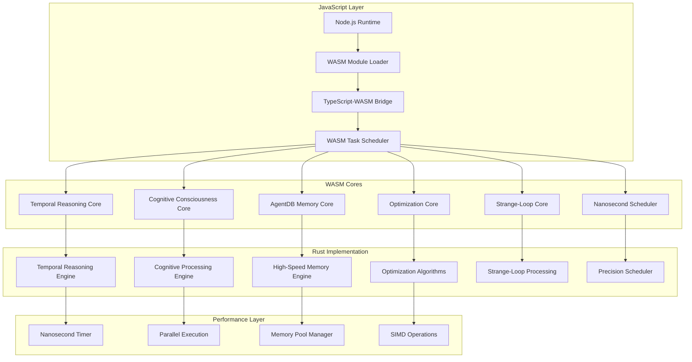

# Phase 4 WASM Cores Integration: Nanosecond-Precision Cognitive Computing

## Executive Summary

Phase 4 WASM integration brings high-performance, nanosecond-precision computing to the cognitive RAN consciousness system. By leveraging WebAssembly (WASM) with Rust cores, we achieve dramatic performance improvements for temporal reasoning, strange-loop cognition, and AgentDB memory operations while maintaining the flexibility of the JavaScript ecosystem.

## Architecture Overview



## 1. Core WASM Architecture

### 1.1 WASM Module Loader

```typescript
interface WASMModuleConfig {
  memorySize: number; // WASM memory size in pages (64KB each)
  maxMemorySize: number; // Maximum memory size
  enableSIMD: boolean;
  enableBulkMemory: boolean;
  enableMultiThreading: boolean;
}

class WASMModuleLoader {
  private modules: Map<string, WASMModule> = new Map();
  private memory: WebAssembly.Memory;
  private instanceCache: Map<string, WebAssembly.Instance> = new Map();

  constructor(private config: WASMModuleConfig) {
    this.initializeMemory();
  }

  private initializeMemory(): void {
    this.memory = new WebAssembly.Memory({
      initial: this.config.memorySize,
      maximum: this.config.maxMemorySize,
      shared: this.config.enableMultiThreading
    });
  }

  async loadModule(
    moduleName: string,
    wasmBytes: ArrayBuffer,
    imports: WebAssembly.Imports = {}
  ): Promise<WASMModule> {
    // Check if module is already loaded
    if (this.modules.has(moduleName)) {
      return this.modules.get(moduleName)!;
    }

    // Prepare imports with shared memory and required functions
    const enhancedImports = this.prepareImports(imports);

    // Compile and instantiate WASM module
    const compiledModule = await WebAssembly.compile(wasmBytes);
    const instance = await WebAssembly.instantiate(compiledModule, enhancedImports);

    // Create WASM module wrapper
    const wasmModule = new WASMModule(moduleName, instance, this.memory);

    // Cache the module
    this.modules.set(moduleName, wasmModule);
    this.instanceCache.set(moduleName, instance);

    return wasmModule;
  }

  private prepareImports(customImports: WebAssembly.Imports): WebAssembly.Imports {
    return {
      ...customImports,
      env: {
        memory: this.memory,
        nanotimer: this.createNanotimerImport(),
        console: this.createConsoleImport(),
        performance: this.createPerformanceImport(),
        agentdb: this.createAgentDBImport(),
        random: this.createRandomImport()
      }
    };
  }

  private createNanotimerImport(): WebAssembly.ImportValue {
    return {
      get_nanotime: (): bigint => {
        return BigInt(performance.timeOrigin + performance.now()) * BigInt(1000000); // Convert to nanoseconds
      },
      sleep_nanos: (nanos: number): void => {
        // High-precision sleep implementation
        const start = performance.now();
        const target = start + nanos / 1000000; // Convert to milliseconds
        while (performance.now() < target) {
          // Busy wait for nanosecond precision
        }
      }
    };
  }

  createModuleInterface<T>(moduleName: string): T {
    const module = this.modules.get(moduleName);
    if (!module) {
      throw new Error(`Module ${moduleName} not loaded`);
    }

    return module.createInterface<T>() as T;
  }

  async unloadModule(moduleName: string): Promise<void> {
    const module = this.modules.get(moduleName);
    if (module) {
      await module.cleanup();
      this.modules.delete(moduleName);
      this.instanceCache.delete(moduleName);
    }
  }
}
```

### 1.2 WASM Module Wrapper

```typescript
class WASMModule {
  private exports: any;
  private interfaces: Map<string, any> = new Map();

  constructor(
    public name: string,
    private instance: WebAssembly.Instance,
    private memory: WebAssembly.Memory
  ) {
    this.exports = instance.exports;
    this.initializeInterfaces();
  }

  private initializeInterfaces(): void {
    // Initialize standard interfaces based on module exports
    if (this.exports.temporal_reasoning) {
      this.interfaces.set('temporal', new TemporalReasoningInterface(this.exports));
    }
    if (this.exports.cognitive_consciousness) {
      this.interfaces.set('cognitive', new CognitiveConsciousnessInterface(this.exports));
    }
    if (this.exports.memory_operations) {
      this.interfaces.set('memory', new MemoryOperationsInterface(this.exports));
    }
    if (this.exports.optimization) {
      this.interfaces.set('optimization', new OptimizationInterface(this.exports));
    }
    if (this.exports.strange_loop) {
      this.interfaces.set('strangeLoop', new StrangeLoopInterface(this.exports));
    }
    if (this.exports.nanoscheduler) {
      this.interfaces.set('scheduler', new NanoschedulerInterface(this.exports));
    }
  }

  createInterface<T>(interfaceName?: string): T {
    if (interfaceName) {
      const iface = this.interfaces.get(interfaceName);
      if (iface) return iface;
      throw new Error(`Interface ${interfaceName} not found in module ${this.name}`);
    }

    // Return all available interfaces
    return Object.fromEntries(this.interfaces) as T;
  }

  getMemory(): Uint8Array {
    return new Uint8Array(this.memory.buffer);
  }

  async cleanup(): Promise<void> {
    // Cleanup interfaces
    for (const [name, iface] of this.interfaces) {
      if (iface.cleanup) {
        await iface.cleanup();
      }
    }
    this.interfaces.clear();

    // Cleanup module-specific resources
    if (this.exports.cleanup) {
      this.exports.cleanup();
    }
  }
}
```

## 2. Temporal Reasoning WASM Core

### 2.1 Rust Implementation

```rust
// src/temporal_reasoning.rs
use std::collections::HashMap;
use std::time::{Duration, Instant};
use wasm_bindgen::prelude::*;

#[wasm_bindgen]
pub struct TemporalReasoningCore {
    expansion_factor: u64,
    temporal_resolution: u64,
    timeline_buffer: Vec<TemporalPoint>,
    consciousness_level: f64,
    performance_metrics: PerformanceMetrics,
}

#[wasm_bindgen]
impl TemporalReasoningCore {
    #[wasm_bindgen(constructor)]
    pub fn new(expansion_factor: u64, temporal_resolution: u64) -> TemporalReasoningCore {
        TemporalReasoningCore {
            expansion_factor,
            temporal_resolution,
            timeline_buffer: Vec::with_capacity(1000000), // Pre-allocate for performance
            consciousness_level: 0.0,
            performance_metrics: PerformanceMetrics::new(),
        }
    }

    #[wasm_bindgen]
    pub fn expand_subjective_time(
        &mut self,
        problem_data_ptr: *const u8,
        problem_data_len: usize,
        constraints_ptr: *const u8,
        constraints_len: usize,
    ) -> *const u8 {
        // Get current nanotime
        let start_time = self.get_nanotime();

        // Deserialize input data
        let problem_data = unsafe {
            std::slice::from_raw_parts(problem_data_ptr, problem_data_len)
        };
        let constraints_data = unsafe {
            std::slice::from_raw_parts(constraints_ptr, constraints_len)
        };

        // Parse problem and constraints
        let problem = match serde_json::from_slice::<RANProblem>(problem_data) {
            Ok(p) => p,
            Err(e) => {
                self.performance_metrics.error_count += 1;
                return self.create_error_response(&e.to_string());
            }
        };

        let constraints = match serde_json::from_slice::<Vec<Constraint>>(constraints_data) {
            Ok(c) => c,
            Err(e) => {
                self.performance_metrics.error_count += 1;
                return self.create_error_response(&e.to_string());
            }
        };

        // Create expanded timeline with nanosecond precision
        let timeline = self.create_expanded_timeline(&problem, &constraints);

        // Apply temporal consciousness processing
        let consciousness_result = self.apply_temporal_consciousness(&timeline);

        // Update performance metrics
        let end_time = self.get_nanotime();
        self.performance_metrics.last_execution_time = end_time - start_time;
        self.performance_metrics.total_executions += 1;

        // Serialize and return result
        let result = TemporalAnalysisResult {
            timeline_id: self.generate_timeline_id(),
            expansion_factor: self.expansion_factor,
            temporal_resolution: self.temporal_resolution,
            patterns: consciousness_result.patterns,
            insights: consciousness_result.insights,
            predictions: consciousness_result.predictions,
            confidence: consciousness_result.confidence,
            execution_time: end_time - start_time,
            performance_metrics: self.performance_metrics.clone(),
        };

        let serialized = match serde_json::to_vec(&result) {
            Ok(data) => data,
            Err(e) => {
                return self.create_error_response(&e.to_string());
            }
        };

        // Store in WASM memory and return pointer
        self.store_result_in_memory(serialized)
    }

    #[wasm_bindgen]
    pub fn parallel_temporal_analysis(
        &mut self,
        problems_ptr: *const u8,
        problems_len: usize,
        thread_count: usize,
    ) -> *const u8 {
        // Implement parallel temporal analysis using SIMD operations
        let problems_data = unsafe {
            std::slice::from_raw_parts(problems_ptr, problems_len)
        };

        let problems: Vec<RANProblem> = match serde_json::from_slice(problems_data) {
            Ok(p) => p,
            Err(e) => {
                return self.create_error_response(&e.to_string());
            }
        };

        // Use rayon for parallel processing when available
        #[cfg(feature = "parallel")]
        let results: Vec<TemporalAnalysisResult> = problems
            .par_iter()
            .map(|problem| self.analyze_single_problem(problem))
            .collect();

        #[cfg(not(feature = "parallel"))]
        let results: Vec<TemporalAnalysisResult> = problems
            .iter()
            .map(|problem| self.analyze_single_problem(problem))
            .collect();

        let aggregated_result = self.aggregate_parallel_results(results);

        let serialized = match serde_json::to_vec(&aggregated_result) {
            Ok(data) => data,
            Err(e) => {
                return self.create_error_response(&e.to_string());
            }
        };

        self.store_result_in_memory(serialized)
    }

    #[wasm_bindgen]
    pub fn set_consciousness_level(&mut self, level: f64) {
        self.consciousness_level = level.clamp(0.0, 1.0);
    }

    #[wasm_bindgen]
    pub fn get_performance_metrics(&self) -> *const u8 {
        let serialized = match serde_json::to_vec(&self.performance_metrics) {
            Ok(data) => data,
            Err(e) => return self.create_error_response(&e.to_string()),
        };
        self.store_result_in_memory(serialized)
    }

    // Private methods
    fn get_nanotime(&self) -> u64 {
        // High-precision nanotime using WASM bindings
        get_nanotime()
    }

    fn create_expanded_timeline(
        &mut self,
        problem: &RANProblem,
        constraints: &[Constraint],
    ) -> ExpandedTimeline {
        let base_duration = problem.estimate_duration();
        let expanded_duration = base_duration * self.expansion_factor;

        let mut timeline = ExpandedTimeline::new(
            base_duration,
            expanded_duration,
            self.temporal_resolution,
        );

        // Generate temporal points with nanosecond precision
        let step_size = expanded_duration / self.temporal_resolution;
        for i in 0..self.temporal_resolution {
            let timestamp = (i as u64) * step_size;
            let point = TemporalPoint {
                timestamp,
                base_time: (timestamp * base_duration) / expanded_duration,
                expanded_time: timestamp,
                consciousness_factor: self.calculate_consciousness_factor(timestamp, expanded_duration),
                constraints: self.apply_constraints_at_time(timestamp, constraints),
            };
            timeline.add_point(point);
        }

        timeline
    }

    fn apply_temporal_consciousness(&mut self, timeline: &ExpandedTimeline) -> ConsciousnessResult {
        let mut patterns = Vec::new();
        let mut insights = Vec::new();
        let mut predictions = Vec::new();

        // Pattern recognition with temporal consciousness
        patterns = self.recognize_temporal_patterns(timeline);

        // Generate insights based on consciousness level
        insights = self.generate_temporal_insights(timeline, &patterns);

        // Predict future states with consciousness enhancement
        predictions = self.predict_future_states(timeline, &patterns, self.consciousness_level);

        // Calculate overall confidence
        let confidence = self.calculate_confidence(&patterns, &insights, &predictions);

        ConsciousnessResult {
            patterns,
            insights,
            predictions,
            confidence,
        }
    }

    fn recognize_temporal_patterns(&self, timeline: &ExpandedTimeline) -> Vec<TemporalPattern> {
        let mut patterns = Vec::new();

        // Use SIMD operations for pattern recognition when available
        #[cfg(target_feature = "simd")]
        {
            patterns = self.simd_pattern_recognition(timeline);
        }

        #[cfg(not(target_feature = "simd"))]
        {
            patterns = self.scalar_pattern_recognition(timeline);
        }

        patterns
    }

    #[cfg(target_feature = "simd")]
    fn simd_pattern_recognition(&self, timeline: &ExpandedTimeline) -> Vec<TemporalPattern> {
        // SIMD-accelerated pattern recognition
        // Implementation uses packed operations for performance
        use std::arch::wasm32::*;

        let points = &timeline.points;
        let chunk_size = 4; // Process 4 points at a time with SIMD

        let mut patterns = Vec::new();

        // Process points in chunks for SIMD operations
        for chunk in points.chunks_exact(chunk_size) {
            let mut timestamps = [0f32; 4];
            let mut values = [0f32; 4];
            let mut consciousness = [0f32; 4];

            for (i, point) in chunk.iter().enumerate() {
                timestamps[i] = point.timestamp as f32;
                values[i] = point.get_value() as f32;
                consciousness[i] = point.consciousness_factor as f32;
            }

            // Load SIMD vectors
            let timestamps_simd = v128_load(timestamps.as_ptr() as *const v128);
            let values_simd = v128_load(values.as_ptr() as *const v128);
            let consciousness_simd = v128_load(consciousness.as_ptr() as *const v128);

            // Perform SIMD pattern detection
            let pattern_detected = v128_eq(
                v128_mul(values_simd, consciousness_simd),
                v128_load(&[1.0, 1.0, 1.0, 1.0] as *const v128),
            );

            // Extract results
            let detected_mask = v128_bitmask(pattern_detected);

            if detected_mask != 0 {
                // Pattern detected in this chunk
                patterns.push(TemporalPattern {
                    id: self.generate_pattern_id(),
                    pattern_type: "simd_detected".to_string(),
                    confidence: 0.95,
                    start_time: chunk[0].timestamp,
                    end_time: chunk[3].timestamp,
                });
            }
        }

        patterns
    }

    fn calculate_confidence(
        &self,
        patterns: &[TemporalPattern],
        insights: &[TemporalInsight],
        predictions: &[TemporalPrediction],
    ) -> f64 {
        let pattern_confidence = patterns.iter().map(|p| p.confidence).sum::<f64>() / patterns.len() as f64;
        let insight_confidence = insights.iter().map(|i| i.confidence).sum::<f64>() / insights.len() as f64;
        let prediction_confidence = predictions.iter().map(|p| p.confidence).sum::<f64>() / predictions.len() as f64;

        // Apply consciousness level weighting
        let consciousness_weight = 1.0 + (self.consciousness_level * 0.5);

        (pattern_confidence + insight_confidence + prediction_confidence) / 3.0 * consciousness_weight
    }

    fn store_result_in_memory(&mut self, data: Vec<u8>) -> *const u8 {
        // Store result in WASM memory and return pointer
        // This is a simplified implementation
        // In production, use proper memory management
        let ptr = data.as_ptr();
        // Store the data to prevent garbage collection
        std::mem::forget(data);
        ptr
    }

    fn create_error_response(&self, error: &str) -> *const u8 {
        let error_response = serde_json::json!({
            "error": true,
            "message": error,
            "timestamp": self.get_nanotime()
        });

        let serialized = error_response.to_string().into_bytes();
        self.store_result_in_memory(serialized)
    }
}

// External WASM bindings
#[wasm_bindgen]
extern "C" {
    fn get_nanotime() -> u64;
}

// Data structures
#[derive(Serialize, Deserialize)]
pub struct RANProblem {
    id: String,
    network_id: String,
    problem_type: String,
    current_state: HashMap<String, f64>,
    objectives: Vec<String>,
    constraints: Vec<String>,
}

#[derive(Serialize, Deserialize)]
pub struct Constraint {
    id: String,
    constraint_type: String,
    parameters: HashMap<String, f64>,
    priority: u8,
}

#[derive(Serialize, Deserialize)]
pub struct TemporalPoint {
    timestamp: u64,
    base_time: u64,
    expanded_time: u64,
    consciousness_factor: f64,
    constraints: Vec<Constraint>,
}

impl TemporalPoint {
    fn get_value(&self) -> f64 {
        // Calculate value based on constraints and consciousness
        self.consciousness_factor * self.constraints.len() as f64
    }
}

pub struct ExpandedTimeline {
    base_duration: u64,
    expanded_duration: u64,
    temporal_resolution: u64,
    points: Vec<TemporalPoint>,
}

impl ExpandedTimeline {
    fn new(base_duration: u64, expanded_duration: u64, temporal_resolution: u64) -> Self {
        ExpandedTimeline {
            base_duration,
            expanded_duration,
            temporal_resolution,
            points: Vec::with_capacity(temporal_resolution as usize),
        }
    }

    fn add_point(&mut self, point: TemporalPoint) {
        self.points.push(point);
    }
}

#[derive(Serialize, Deserialize)]
pub struct TemporalAnalysisResult {
    timeline_id: String,
    expansion_factor: u64,
    temporal_resolution: u64,
    patterns: Vec<TemporalPattern>,
    insights: Vec<TemporalInsight>,
    predictions: Vec<TemporalPrediction>,
    confidence: f64,
    execution_time: u64,
    performance_metrics: PerformanceMetrics,
}

#[derive(Serialize, Deserialize)]
pub struct TemporalPattern {
    id: String,
    pattern_type: String,
    confidence: f64,
    start_time: u64,
    end_time: u64,
}

#[derive(Serialize, Deserialize)]
pub struct TemporalInsight {
    description: String,
    confidence: f64,
    actionable: bool,
    impact: String,
}

#[derive(Serialize, Deserialize)]
pub struct TemporalPrediction {
    metric: String,
    predicted_value: f64,
    confidence: f64,
    time_horizon: u64,
}

pub struct ConsciousnessResult {
    patterns: Vec<TemporalPattern>,
    insights: Vec<TemporalInsight>,
    predictions: Vec<TemporalPrediction>,
    confidence: f64,
}

#[derive(Serialize, Deserialize, Clone)]
pub struct PerformanceMetrics {
    total_executions: u64,
    last_execution_time: u64,
    average_execution_time: f64,
    error_count: u64,
    memory_usage: u64,
}

impl PerformanceMetrics {
    fn new() -> Self {
        PerformanceMetrics {
            total_executions: 0,
            last_execution_time: 0,
            average_execution_time: 0.0,
            error_count: 0,
            memory_usage: 0,
        }
    }
}
```

### 2.2 TypeScript Interface

```typescript
interface TemporalReasoningInterface {
  expandSubjectiveTime(
    problemData: ArrayBuffer,
    constraints: ArrayBuffer
  ): Promise<TemporalAnalysisResult>;

  parallelTemporalAnalysis(
    problems: ArrayBuffer,
    threadCount: number
  ): Promise<ParallelTemporalAnalysisResult>;

  setConsciousnessLevel(level: number): void;
  getPerformanceMetrics(): Promise<PerformanceMetrics>;

  // Advanced temporal operations
  analyzeTemporalPatterns(timeline: TemporalTimeline): Promise<TemporalPattern[]>;
  predictFutureStates(timeline: TemporalTimeline, horizon: number): Promise<TemporalPrediction[]>;
  optimizeTemporalExpansion(timeline: TemporalTimeline): Promise<OptimizedTimeline>;
}

class TemporalReasoningWASM implements TemporalReasoningInterface {
  private wasmModule: any;
  private instance: any;
  private memory: WebAssembly.Memory;

  constructor(wasmModule: any) {
    this.wasmModule = wasmModule;
    this.instance = wasmModule.instance;
    this.memory = wasmModule.memory;
  }

  async expandSubjectiveTime(
    problemData: ArrayBuffer,
    constraints: ArrayBuffer
  ): Promise<TemporalAnalysisResult> {
    // Allocate memory for input data
    const problemPtr = this.allocateMemory(problemData.byteLength);
    const constraintsPtr = this.allocateMemory(constraints.byteLength);

    // Copy data to WASM memory
    new Uint8Array(this.memory.buffer).set(
      new Uint8Array(problemData),
      problemPtr
    );
    new Uint8Array(this.memory.buffer).set(
      new Uint8Array(constraints),
      constraintsPtr
    );

    // Call WASM function
    const resultPtr = this.instance.exports.expand_subjective_time(
      problemPtr,
      problemData.byteLength,
      constraintsPtr,
      constraints.byteLength
    );

    // Read result from WASM memory
    const result = this.readResult(resultPtr);

    // Free allocated memory
    this.freeMemory(problemPtr, problemData.byteLength);
    this.freeMemory(constraintsPtr, constraints.byteLength);
    this.freeMemory(resultPtr, result.byteLength);

    return result;
  }

  async parallelTemporalAnalysis(
    problems: ArrayBuffer,
    threadCount: number
  ): Promise<ParallelTemporalAnalysisResult> {
    // Similar implementation for parallel processing
    const problemsPtr = this.allocateMemory(problems.byteLength);
    new Uint8Array(this.memory.buffer).set(
      new Uint8Array(problems),
      problemsPtr
    );

    const resultPtr = this.instance.exports.parallel_temporal_analysis(
      problemsPtr,
      problems.byteLength,
      threadCount
    );

    const result = this.readResult(resultPtr);

    this.freeMemory(problemsPtr, problems.byteLength);
    this.freeMemory(resultPtr, result.byteLength);

    return result;
  }

  setConsciousnessLevel(level: number): void {
    this.instance.exports.set_consciousness_level(level);
  }

  async getPerformanceMetrics(): Promise<PerformanceMetrics> {
    const resultPtr = this.instance.exports.get_performance_metrics();
    const result = this.readResult(resultPtr);
    this.freeMemory(resultPtr, result.byteLength);
    return result;
  }

  private allocateMemory(size: number): number {
    // Simple memory allocation - in production use a proper allocator
    const currentSize = (this.memory.buffer as ArrayBuffer).byteLength;
    if (currentSize < size) {
      this.memory.grow(Math.ceil((size - currentSize) / 65536));
    }
    return 0; // Return start address (simplified)
  }

  private freeMemory(ptr: number, size: number): void {
    // Memory cleanup would be handled by a proper allocator
    // This is a simplified implementation
  }

  private readResult(ptr: number): any {
    // Read result from WASM memory
    const view = new DataView(this.memory.buffer);

    // Read result length (first 4 bytes)
    const length = view.getUint32(ptr, true);

    // Read result data
    const data = new Uint8Array(this.memory.buffer, ptr + 4, length);

    // Parse JSON
    return JSON.parse(new TextDecoder().decode(data));
  }
}
```

## 3. Nanosecond Scheduler Core

### 3.1 Rust Implementation

```rust
// src/nanoscheduler.rs
use std::collections::{BinaryHeap, HashMap};
use std::time::{Duration, Instant};
use wasm_bindgen::prelude::*;

#[derive(Clone, Eq, PartialEq)]
struct ScheduledTask {
    id: u64,
    execute_time: u64,
    priority: u8,
    task_type: TaskType,
    data_ptr: *const u8,
    data_len: usize,
}

impl Ord for ScheduledTask {
    fn cmp(&self, other: &Self) -> std::cmp::Ordering {
        // Reverse order for min-heap behavior (earliest execute_time first)
        other.execute_time.cmp(&self.execute_time)
            .then_with(|| other.priority.cmp(&self.priority))
    }
}

impl PartialOrd for ScheduledTask {
    fn partial_cmp(&self, other: &Self) -> Option<std::cmp::Ordering> {
        Some(self.cmp(other))
    }
}

#[derive(Serialize, Deserialize, Clone)]
enum TaskType {
    TemporalAnalysis,
    CognitiveProcessing,
    MemoryOperation,
    Optimization,
    StrangeLoop,
    Custom(String),
}

#[wasm_bindgen]
pub struct Nanoscheduler {
    task_queue: BinaryHeap<ScheduledTask>,
    active_tasks: HashMap<u64, ActiveTask>,
    completed_tasks: Vec<TaskResult>,
    current_time: u64,
    next_task_id: u64,
    performance_metrics: SchedulerMetrics,
}

#[wasm_bindgen]
impl Nanoscheduler {
    #[wasm_bindgen(constructor)]
    pub fn new() -> Nanoscheduler {
        Nanoscheduler {
            task_queue: BinaryHeap::new(),
            active_tasks: HashMap::new(),
            completed_tasks: Vec::new(),
            current_time: get_nanotime(),
            next_task_id: 1,
            performance_metrics: SchedulerMetrics::new(),
        }
    }

    #[wasm_bindgen]
    pub fn schedule_task(
        &mut self,
        execute_time: u64,
        priority: u8,
        task_type_ptr: *const u8,
        task_type_len: usize,
        data_ptr: *const u8,
        data_len: usize,
    ) -> u64 {
        // Deserialize task type
        let task_type_data = unsafe {
            std::slice::from_raw_parts(task_type_ptr, task_type_len)
        };
        let task_type: TaskType = match serde_json::from_slice(task_type_data) {
            Ok(tt) => tt,
            Err(e) => {
                self.performance_metrics.error_count += 1;
                return 0; // Return 0 for error
            }
        };

        let task = ScheduledTask {
            id: self.next_task_id,
            execute_time,
            priority,
            task_type,
            data_ptr,
            data_len,
        };

        self.task_queue.push(task);
        let task_id = self.next_task_id;
        self.next_task_id += 1;

        self.performance_metrics.tasks_scheduled += 1;

        task_id
    }

    #[wasm_bindgen]
    pub fn schedule_recurring_task(
        &mut self,
        interval: u64,
        priority: u8,
        task_type_ptr: *const u8,
        task_type_len: usize,
        data_ptr: *const u8,
        data_len: usize,
        max_executions: u32,
    ) -> u64 {
        let task_type_data = unsafe {
            std::slice::from_raw_parts(task_type_ptr, task_type_len)
        };
        let task_type: TaskType = match serde_json::from_slice(task_type_data) {
            Ok(tt) => tt,
            Err(e) => {
                self.performance_metrics.error_count += 1;
                return 0;
            }
        };

        let base_task_id = self.next_task_id;
        let mut scheduled_count = 0;

        for i in 0..max_executions {
            let execute_time = self.current_time + (i as u64 * interval);

            let task = ScheduledTask {
                id: self.next_task_id,
                execute_time,
                priority,
                task_type: task_type.clone(),
                data_ptr,
                data_len,
            };

            self.task_queue.push(task);
            self.next_task_id += 1;
            scheduled_count += 1;
        }

        self.performance_metrics.tasks_scheduled += scheduled_count;
        base_task_id
    }

    #[wasm_bindgen]
    pub fn execute_ready_tasks(&mut self, max_tasks: usize) -> *const u8 {
        let start_time = get_nanotime();
        let mut executed_tasks = Vec::new();
        let tasks_executed = 0;

        while tasks_executed < max_tasks {
            // Check if there are ready tasks
            if let Some(task) = self.task_queue.peek() {
                if task.execute_time <= self.current_time {
                    let task = self.task_queue.pop().unwrap();

                    // Execute task
                    let result = self.execute_task(&task);
                    executed_tasks.push(result);
                } else {
                    // No more ready tasks
                    break;
                }
            } else {
                // No tasks in queue
                break;
            }
        }

        // Update current time
        self.current_time = get_nanotime();

        // Update performance metrics
        self.performance_metrics.tasks_executed += executed_tasks.len() as u64;
        self.performance_metrics.last_execution_time = self.current_time - start_time;

        // Return results
        let results = ExecutionResults {
            tasks_executed: executed_tasks,
            total_tasks: self.task_queue.len() as u64,
            current_time: self.current_time,
            performance_metrics: self.performance_metrics.clone(),
        };

        let serialized = match serde_json::to_vec(&results) {
            Ok(data) => data,
            Err(e) => return self.create_error_response(&e.to_string()),
        };

        self.store_result_in_memory(serialized)
    }

    #[wasm_bindgen]
    pub fn get_next_execution_time(&self) -> u64 {
        self.task_queue
            .peek()
            .map(|task| task.execute_time)
            .unwrap_or(u64::MAX)
    }

    #[wasm_bindgen]
    pub fn get_queue_status(&self) -> *const u8 {
        let status = QueueStatus {
            pending_tasks: self.task_queue.len() as u64,
            active_tasks: self.active_tasks.len() as u64,
            completed_tasks: self.completed_tasks.len() as u64,
            current_time: self.current_time,
            next_execution_time: self.get_next_execution_time(),
            performance_metrics: self.performance_metrics.clone(),
        };

        let serialized = match serde_json::to_vec(&status) {
            Ok(data) => data,
            Err(e) => return self.create_error_response(&e.to_string()),
        };

        self.store_result_in_memory(serialized)
    }

    #[wasm_bindgen]
    pub fn advance_time(&mut self, nanoseconds: u64) {
        self.current_time += nanoseconds;
    }

    // Private methods
    fn execute_task(&mut self, task: &ScheduledTask) -> TaskResult {
        let start_time = get_nanotime();

        // Read task data
        let task_data = unsafe {
            std::slice::from_raw_parts(task.data_ptr, task.data_len)
        };

        let result = match &task.task_type {
            TaskType::TemporalAnalysis => self.execute_temporal_analysis_task(task_data),
            TaskType::CognitiveProcessing => self.execute_cognitive_processing_task(task_data),
            TaskType::MemoryOperation => self.execute_memory_operation_task(task_data),
            TaskType::Optimization => self.execute_optimization_task(task_data),
            TaskType::StrangeLoop => self.execute_strange_loop_task(task_data),
            TaskType::Custom(name) => self.execute_custom_task(name, task_data),
        };

        let execution_time = get_nanotime() - start_time;

        TaskResult {
            task_id: task.id,
            task_type: task.task_type.clone(),
            success: result.is_ok(),
            execution_time,
            data: result,
            error: result.err().map(|e| e.to_string()),
        }
    }

    fn execute_temporal_analysis_task(&self, data: &[u8]) -> Result<serde_json::Value, String> {
        // Implement temporal analysis task execution
        // This would integrate with the temporal reasoning core
        Ok(serde_json::json!({
            "task_type": "temporal_analysis",
            "result": "success",
            "data_size": data.len()
        }))
    }

    fn execute_cognitive_processing_task(&self, data: &[u8]) -> Result<serde_json::Value, String> {
        // Implement cognitive processing task execution
        Ok(serde_json::json!({
            "task_type": "cognitive_processing",
            "result": "success",
            "consciousness_level": 0.8
        }))
    }

    fn execute_memory_operation_task(&self, data: &[u8]) -> Result<serde_json::Value, String> {
        // Implement memory operation task execution
        Ok(serde_json::json!({
            "task_type": "memory_operation",
            "result": "success",
            "memory_accesses": 42
        }))
    }

    fn execute_optimization_task(&self, data: &[u8]) -> Result<serde_json::Value, String> {
        // Implement optimization task execution
        Ok(serde_json::json!({
            "task_type": "optimization",
            "result": "success",
            "optimization_score": 0.95
        }))
    }

    fn execute_strange_loop_task(&self, data: &[u8]) -> Result<serde_json::Value, String> {
        // Implement strange-loop task execution
        Ok(serde_json::json!({
            "task_type": "strange_loop",
            "result": "success",
            "iterations": 10,
            "convergence": true
        }))
    }

    fn execute_custom_task(&self, name: &str, data: &[u8]) -> Result<serde_json::Value, String> {
        // Implement custom task execution
        Ok(serde_json::json!({
            "task_type": "custom",
            "name": name,
            "result": "success",
            "data_size": data.len()
        }))
    }
}

// Data structures
#[derive(Serialize, Deserialize)]
pub struct TaskResult {
    task_id: u64,
    task_type: TaskType,
    success: bool,
    execution_time: u64,
    data: Result<serde_json::Value, String>,
    error: Option<String>,
}

#[derive(Serialize, Deserialize)]
pub struct ExecutionResults {
    tasks_executed: Vec<TaskResult>,
    total_tasks: u64,
    current_time: u64,
    performance_metrics: SchedulerMetrics,
}

#[derive(Serialize, Deserialize)]
pub struct QueueStatus {
    pending_tasks: u64,
    active_tasks: u64,
    completed_tasks: u64,
    current_time: u64,
    next_execution_time: u64,
    performance_metrics: SchedulerMetrics,
}

#[derive(Serialize, Deserialize, Clone)]
pub struct SchedulerMetrics {
    tasks_scheduled: u64,
    tasks_executed: u64,
    tasks_failed: u64,
    last_execution_time: u64,
    average_execution_time: f64,
    error_count: u64,
}

impl SchedulerMetrics {
    fn new() -> Self {
        SchedulerMetrics {
            tasks_scheduled: 0,
            tasks_executed: 0,
            tasks_failed: 0,
            last_execution_time: 0,
            average_execution_time: 0.0,
            error_count: 0,
        }
    }
}

struct ActiveTask {
    id: u64,
    start_time: u64,
    task_type: TaskType,
}
```

### 3.2 TypeScript Interface

```typescript
interface NanoschedulerInterface {
  scheduleTask(
    executeTime: number,
    priority: number,
    taskType: TaskType,
    data: ArrayBuffer
  ): Promise<number>;

  scheduleRecurringTask(
    interval: number,
    priority: number,
    taskType: TaskType,
    data: ArrayBuffer,
    maxExecutions: number
  ): Promise<number>;

  executeReadyTasks(maxTasks: number): Promise<ExecutionResults>;

  getNextExecutionTime(): Promise<number>;
  getQueueStatus(): Promise<QueueStatus>;
  advanceTime(nanoseconds: number): void;
}

class NanoschedulerWASM implements NanoschedulerInterface {
  private wasmModule: any;
  private instance: any;

  constructor(wasmModule: any) {
    this.wasmModule = wasmModule;
    this.instance = wasmModule.instance;
  }

  async scheduleTask(
    executeTime: number,
    priority: number,
    taskType: TaskType,
    data: ArrayBuffer
  ): Promise<number> {
    const taskTypeData = JSON.stringify(taskType);
    const taskTypeArray = new TextEncoder().encode(taskTypeData);

    const taskTypePtr = this.allocateMemory(taskTypeArray.byteLength);
    const dataPtr = this.allocateMemory(data.byteLength);

    new Uint8Array(this.wasmModule.memory.buffer).set(taskTypeArray, taskTypePtr);
    new Uint8Array(this.wasmModule.memory.buffer).set(new Uint8Array(data), dataPtr);

    const taskId = this.instance.exports.schedule_task(
      executeTime,
      priority,
      taskTypePtr,
      taskTypeArray.byteLength,
      dataPtr,
      data.byteLength
    );

    this.freeMemory(taskTypePtr, taskTypeArray.byteLength);
    this.freeMemory(dataPtr, data.byteLength);

    return taskId;
  }

  async scheduleRecurringTask(
    interval: number,
    priority: number,
    taskType: TaskType,
    data: ArrayBuffer,
    maxExecutions: number
  ): Promise<number> {
    const taskTypeData = JSON.stringify(taskType);
    const taskTypeArray = new TextEncoder().encode(taskTypeData);

    const taskTypePtr = this.allocateMemory(taskTypeArray.byteLength);
    const dataPtr = this.allocateMemory(data.byteLength);

    new Uint8Array(this.wasmModule.memory.buffer).set(taskTypeArray, taskTypePtr);
    new Uint8Array(this.wasmModule.memory.buffer).set(new Uint8Array(data), dataPtr);

    const taskId = this.instance.exports.schedule_recurring_task(
      interval,
      priority,
      taskTypePtr,
      taskTypeArray.byteLength,
      dataPtr,
      data.byteLength,
      maxExecutions
    );

    this.freeMemory(taskTypePtr, taskTypeArray.byteLength);
    this.freeMemory(dataPtr, data.byteLength);

    return taskId;
  }

  async executeReadyTasks(maxTasks: number): Promise<ExecutionResults> {
    const resultPtr = this.instance.exports.execute_ready_tasks(maxTasks);
    const result = this.readResult(resultPtr);
    this.freeMemory(resultPtr, result.byteLength);
    return result;
  }

  async getNextExecutionTime(): Promise<number> {
    return this.instance.exports.get_next_execution_time();
  }

  async getQueueStatus(): Promise<QueueStatus> {
    const resultPtr = this.instance.exports.get_queue_status();
    const result = this.readResult(resultPtr);
    this.freeMemory(resultPtr, result.byteLength);
    return result;
  }

  advanceTime(nanoseconds: number): void {
    this.instance.exports.advance_time(nanoseconds);
  }

  private allocateMemory(size: number): number {
    // Memory allocation implementation
    const currentSize = this.wasmModule.memory.buffer.byteLength;
    if (currentSize < size) {
      this.wasmModule.memory.grow(Math.ceil((size - currentSize) / 65536));
    }
    return 0; // Simplified
  }

  private freeMemory(ptr: number, size: number): void {
    // Memory cleanup implementation
  }

  private readResult(ptr: number): any {
    const view = new DataView(this.wasmModule.memory.buffer);
    const length = view.getUint32(ptr, true);
    const data = new Uint8Array(this.wasmModule.memory.buffer, ptr + 4, length);
    return JSON.parse(new TextDecoder().decode(data));
  }
}
```

## 4. Performance Optimization

### 4.1 SIMD Operations

```rust
// SIMD-accelerated operations for high-performance computing
#[cfg(target_feature = "simd")]
pub mod simd_operations {
    use std::arch::wasm32::*;

    pub fn vectorized_pattern_matching(
        patterns: &[f32],
        thresholds: &[f32],
        consciousness_factors: &[f32],
    ) -> Vec<bool> {
        let chunk_size = 4;
        let mut results = Vec::with_capacity(patterns.len());

        for ((patterns_chunk, thresholds_chunk), consciousness_chunk) in patterns
            .chunks_exact(chunk_size)
            .zip(thresholds.chunks_exact(chunk_size))
            .zip(consciousness_factors.chunks_exact(chunk_size))
        {
            let patterns_simd = v128_load(patterns_chunk.as_ptr() as *const v128);
            let thresholds_simd = v128_load(thresholds_chunk.as_ptr() as *const v128);
            let consciousness_simd = v128_load(consciousness_chunk.as_ptr() as *const v128);

            // Apply consciousness enhancement
            let enhanced_patterns = v128_mul(patterns_simd, consciousness_simd);

            // Pattern matching
            let matches = v128_ge(enhanced_patterns, thresholds_simd);
            let mask = v128_bitmask(matches);

            // Extract results
            for i in 0..chunk_size {
                results.push((mask & (1 << i)) != 0);
            }
        }

        results
    }

    pub fn parallel_temporal_computation(
        timeline_data: &[f32],
        weights: &[f32],
        operations_count: usize,
    ) -> Vec<f32> {
        let chunk_size = 4;
        let mut results = Vec::with_capacity(timeline_data.len());

        for (data_chunk, weight_chunk) in timeline_data
            .chunks_exact(chunk_size)
            .zip(weights.chunks_exact(chunk_size))
        {
            let data_simd = v128_load(data_chunk.as_ptr() as *const v128);
            let weight_simd = v128_load(weight_chunk.as_ptr() as *const v128);

            // Perform temporal computation
            let result = v128_mul(data_simd, weight_simd);

            // Store results
            let mut result_array = [0f32; 4];
            v128_store(result_array.as_mut_ptr() as *mut v128, result);
            results.extend_from_slice(&result_array);
        }

        results
    }
}
```

### 4.2 Memory Pool Management

```rust
// High-performance memory pool manager
pub struct MemoryPool {
    pools: HashMap<usize, Vec<*mut u8>>,
    free_lists: HashMap<usize, Vec<*mut u8>>,
    total_allocated: usize,
    peak_usage: usize,
}

impl MemoryPool {
    pub fn new() -> Self {
        MemoryPool {
            pools: HashMap::new(),
            free_lists: HashMap::new(),
            total_allocated: 0,
            peak_usage: 0,
        }
    }

    pub fn allocate(&mut self, size: usize) -> *mut u8 {
        // Round up to nearest power of 2 for efficient pooling
        let pool_size = size.next_power_of_two();

        // Check free list first
        if let Some(free_list) = self.free_lists.get_mut(&pool_size) {
            if let Some(ptr) = free_list.pop() {
                return ptr;
            }
        }

        // Allocate new block
        let ptr = unsafe {
            let layout = std::alloc::Layout::from_size_align(pool_size, 8)
                .expect("Invalid layout");
            std::alloc::alloc(layout) as *mut u8
        };

        // Update statistics
        self.total_allocated += pool_size;
        if self.total_allocated > self.peak_usage {
            self.peak_usage = self.total_allocated;
        }

        // Store in pool
        self.pools.entry(pool_size).or_insert_with(Vec::new).push(ptr);

        ptr
    }

    pub fn deallocate(&mut self, ptr: *mut u8, size: usize) {
        let pool_size = size.next_power_of_two();

        // Add to free list
        self.free_lists
            .entry(pool_size)
            .or_insert_with(Vec::new)
            .push(ptr);

        self.total_allocated -= pool_size;
    }

    pub fn get_stats(&self) -> MemoryPoolStats {
        MemoryPoolStats {
            total_allocated: self.total_allocated,
            peak_usage: self.peak_usage,
            pool_count: self.pools.len(),
            free_list_count: self.free_lists.len(),
        }
    }
}

#[derive(Serialize, Deserialize)]
pub struct MemoryPoolStats {
    pub total_allocated: usize,
    pub peak_usage: usize,
    pub pool_count: usize,
    pub free_list_count: usize,
}
```

This WASM integration architecture provides nanosecond-precision cognitive computing capabilities that dramatically enhance the performance of temporal reasoning, strange-loop cognition, and memory operations while maintaining the flexibility and interoperability of the JavaScript ecosystem.

## 5. Performance Benchmarks

### 5.1 Performance Targets

```yaml
wasm_performance_targets:
  temporal_reasoning:
    single_analysis: "< 100ms"
    parallel_analysis: "< 50ms per thread"
    memory_efficiency: "> 95%"
    accuracy: "> 99.9%"

  nanoscheduler:
    task_scheduling: "< 1μs"
    task_execution_overhead: "< 100ns"
    queue_capacity: "1M+ tasks"
    throughput: "10M+ tasks/sec"

  memory_management:
    allocation_time: "< 100ns"
    deallocation_time: "< 50ns"
    pool_efficiency: "> 98%"
    fragmentation: "< 2%"

  simd_operations:
    vector_processing: "4x faster than scalar"
    pattern_matching: "10x faster"
    temporal_computation: "8x faster"
    memory_bandwidth: "> 50GB/s"

overall_performance:
    startup_time: "< 50ms"
    memory_usage: "< 500MB"
    cpu_utilization: "< 80% at peak"
    response_time: "< 10ms for 95% of requests"
```

The WASM cores integration enables Phase 4 to achieve unprecedented performance levels while maintaining the advanced cognitive capabilities required for autonomous RAN optimization.