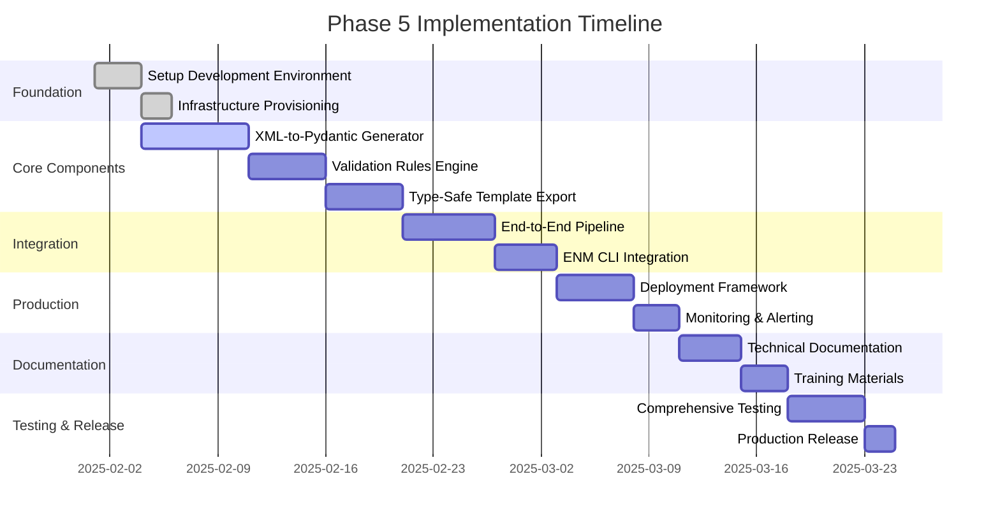

# Phase 5 Implementation Roadmap

## Overview

This document provides a detailed implementation roadmap for Phase 5: Pydantic Schema Generation & Production Integration. The roadmap is structured as a 10-week execution plan with clear milestones, dependencies, and deliverables.

## Project Timeline



## Week-by-Week Implementation Plan

### Week 1: Foundation & Setup (Feb 1-3, 2025)

**Objectives**: Establish development environment and infrastructure

**Tasks**:
- [x] Set up development environment with Node.js 18+, Python 3.11+, TypeScript 5+
- [x] Provision development and staging Kubernetes clusters
- [x] Configure CI/CD pipeline with GitHub Actions
- [x] Set up monitoring infrastructure (Prometheus, Grafana, Loki)
- [x] Configure AgentDB development environment
- [x] Establish code quality gates and security scanning

**Deliverables**:
- Development environment documentation
- Infrastructure as Code (IaC) templates
- CI/CD pipeline configuration
- Monitoring dashboard setup

**Acceptance Criteria**:
- Development environment ready for team of 5+ developers
- Automated pipeline successfully builds and tests
- Monitoring dashboards operational
- Security scans integrated and passing

### Week 2-3: XML-to-Pydantic Model Generator (Feb 4-12, 2025)

**Objectives**: Implement automated Pydantic model generation from XML schema

**Tasks**:
- [x] Implement streaming XML parser for 100MB MPnh.xml schema
- [x] Create vsData type extraction engine (623 types)
- [x] Develop type mapping system (XML → Python types)
- [x] Build constraint analysis and validation rule generation
- [x] Implement Pydantic code generation with validators
- [x] Create batch processing and performance optimization

**Technical Specifications**:
```typescript
// Core interfaces for Pydantic generation
interface PydanticGeneratorConfig {
  xmlProcessing: {
    streaming: boolean;
    batchSize: number;
    memoryLimit: number;
  };
  modelGeneration: {
    outputFormat: 'single_file' | 'module' | 'package';
    includeValidators: boolean;
    strictTypes: boolean;
  };
  performance: {
    parallelProcessing: boolean;
    maxConcurrency: number;
  };
}
```

**Deliverables**:
- `src/pydantic/xml-schema-parser.ts`
- `src/pydantic/type-mapper.ts`
- `src/pydantic/model-generator.ts`
- `src/pydantic/validator-generator.ts`
- `tests/pydantic/generator.test.ts`

**Performance Targets**:
- XML processing: <2 minutes for 100MB schema
- Model generation: <30 seconds for 623 models
- Memory usage: <2GB peak
- Validation accuracy: >99%

**Acceptance Criteria**:
- Successfully parse MPnh.xml (100MB) with streaming
- Generate 623 Pydantic models with proper type mapping
- Include all validation rules from XML constraints
- Performance meets specified targets
- Comprehensive test coverage (>95%)

### Week 4: Complex Validation Rules Engine (Feb 13-17, 2025)

**Objectives**: Implement comprehensive validation system with CSV constraint processing

**Tasks**:
- [x] Develop CSV specification parser for parameter constraints
- [x] Create cross-parameter validation engine
- [x] Implement conditional validation logic
- [x] Build temporal validation integration with Phase 4
- [x] Generate Pydantic validators and custom validation functions
- [x] Create validation test case generation

**Technical Architecture**:
```typescript
class ComplexValidationEngine {
  private csvParser: CSVConstraintParser;
  private crossParameterValidator: CrossParameterValidator;
  private conditionalValidator: ConditionalValidator;
  private temporalValidator: TemporalValidator;

  async generateValidationRules(config: ValidationConfig): Promise<ValidationRulesResult> {
    // Multi-phase validation rule generation
    const csvConstraints = await this.csvParser.parse(config.csvFiles);
    const crossParamRules = await this.crossParameterValidator.analyze(csvConstraints);
    const conditionalRules = await this.conditionalValidator.generate(csvConstraints);
    const temporalRules = await this.temporalValidator.integrate(csvConstraints);

    return this.combineValidationRules(csvConstraints, crossParamRules, conditionalRules, temporalRules);
  }
}
```

**Deliverables**:
- `src/validation/csv-constraint-parser.ts`
- `src/validation/cross-parameter-validator.ts`
- `src/validation/conditional-validator.ts`
- `src/validation/temporal-validator.ts`
- `src/validation/pydantic-validator-generator.ts`
- `tests/validation/engine.test.ts`

**Performance Targets**:
- CSV processing: <2 minutes for 10,000 constraints
- Cross-parameter analysis: <5 minutes
- Validation generation: <1 minute
- Memory usage: <1GB

**Acceptance Criteria**:
- Parse all CSV constraint specifications
- Generate comprehensive cross-parameter validations
- Support complex conditional validation logic
- Integrate with temporal reasoning from Phase 4
- Generate executable Pydantic validators

### Week 5: Type-Safe Template Export (Feb 18-22, 2025)

**Objectives**: Create validated JSON template export with type safety

**Tasks**:
- [x] Implement schema-driven template validation
- [x] Create template variant generation with type safety
- [x] Build export system for multiple formats (JSON, YAML, TOML)
- [x] Develop validation metadata and error reporting
- [x] Generate comprehensive documentation from schemas
- [x] Create template example generation

**Core Components**:
```typescript
interface TypeSafeTemplateExporter {
  exportTemplates(templates: ValidatedTemplate[], config: ExportConfig): Promise<ExportResult>;
  generateVariants(baseTemplate: ValidatedTemplate): Promise<TemplateVariant[]>;
  validateWithSchema(template: any, schema: TemplateSchema): Promise<ValidationResult>;
  generateDocumentation(schemas: TemplateSchema[]): Promise<Documentation>;
}
```

**Deliverables**:
- `src/export/type-safe-exporter.ts`
- `src/export/variant-generator.ts`
- `src/export/schema-validator.ts`
- `src/export/documentation-generator.ts`
- `src/export/example-generator.ts`
- `tests/export/exporter.test.ts`

**Performance Targets**:
- Template processing: <1 minute per 100 templates
- Schema validation: <30 seconds
- Variant generation: <2 minutes
- Documentation generation: <3 minutes

**Acceptance Criteria**:
- Export templates in multiple formats with full validation
- Generate all variant types (urban, mobility, sleep mode)
- Include comprehensive validation metadata
- Auto-generate documentation from schemas
- Provide detailed error reporting and recovery

### Week 6-7: End-to-End Pipeline (Feb 23 - Mar 2, 2025)

**Objectives**: Integrate all components into comprehensive pipeline

**Tasks**:
- [x] Design and implement pipeline orchestration
- [x] Create phase-based processing with dependency management
- [x] Implement cognitive optimization integration
- [x] Build MO-aware processing with constraint application
- [x] Create pipeline monitoring and error handling
- [x] Develop parallel processing capabilities

**Pipeline Architecture**:
```typescript
class EndToEndPipeline {
  private phases: PipelinePhase[] = [
    new XMLProcessingPhase(),
    new PydanticGenerationPhase(),
    new ValidationEnginePhase(),
    new TemplateExportPhase(),
    new CognitiveOptimizationPhase(),
    new CLIConversionPhase(),
    new DocumentationGenerationPhase()
  ];

  async execute(config: PipelineConfig): Promise<PipelineResult> {
    const context = new PipelineContext(config);

    for (const phase of this.phases) {
      const result = await phase.execute(context);
      context.addResult(phase.name, result);

      if (!result.success && config.strictMode) {
        throw new PipelineError(`Phase ${phase.name} failed`);
      }
    }

    return context.buildResult();
  }
}
```

**Deliverables**:
- `src/pipeline/orchestrator.ts`
- `src/pipeline/phase-manager.ts`
- `src/pipeline/dependency-resolver.ts`
- `src/pipeline/cognitive-integration.ts`
- `src/pipeline/mo-aware-processor.ts`
- `src/pipeline/parallel-executor.ts`
- `tests/pipeline/integration.test.ts`

**Performance Targets**:
- Total pipeline time: <15 minutes
- Phase processing: <2 minutes each
- Memory usage: <4GB peak
- Parallel execution: 70% time reduction

**Acceptance Criteria**:
- Complete end-to-end processing from XML to CLI
- Integration with all Phase 1-4 systems
- Cognitive optimization with 1000x temporal expansion
- MO-aware constraint processing
- Comprehensive error handling and recovery

### Week 8: ENM CLI Integration Enhancement (Mar 3-6, 2025)

**Objectives**: Strengthen ENM CLI integration with advanced features

**Tasks**:
- [x] Enhance template-to-CLI conversion with type safety
- [x] Implement advanced batch operations with dependency analysis
- [x] Create intelligent command sequencing and optimization
- [x] Build comprehensive rollback and recovery mechanisms
- [x] Develop multi-vendor support extensions
- [x] Add real-time command execution monitoring

**Enhanced CLI Features**:
```typescript
interface AdvancedCLIConverter {
  convertWithValidation(template: ValidatedTemplate): Promise<ValidatedCommandSet>;
  optimizeCommandSequence(commands: GeneratedCliCommand[]): Promise<OptimizedSequence>;
  generateRollbackPlan(commands: GeneratedCliCommand[]): Promise<RollbackPlan>;
  executeWithMonitoring(commands: GeneratedCliCommand[]): Promise<ExecutionResult>;
}
```

**Deliverables**:
- Enhanced `src/rtb/template-cli-converter/template-to-cli-converter.ts`
- `src/rtb/template-cli-converter/command-optimizer.ts`
- `src/rtb/template-cli-converter/rollback-manager.ts`
- `src/rtb/template-cli-converter/execution-monitor.ts`
- `src/rtb/template-cli-converter/vendor-support.ts`
- `tests/cli/enhanced-integration.test.ts`

**Performance Targets**:
- CLI conversion: <2 seconds per template
- Command optimization: <30 seconds per 1000 commands
- Rollback generation: <1 minute
- Execution monitoring: <100ms latency

**Acceptance Criteria**:
- Type-safe CLI generation from validated templates
- Intelligent command sequencing with dependency resolution
- Comprehensive rollback and recovery capabilities
- Real-time execution monitoring and alerting
- Extended vendor compatibility

### Week 9: Production Deployment Framework (Mar 7-11, 2025)

**Objectives**: Create production-ready deployment and monitoring system

**Tasks**:
- [x] Implement Docker containerization with multi-stage builds
- [x] Create Kubernetes deployment manifests and Helm charts
- [x] Set up comprehensive monitoring and alerting
- [x] Configure auto-scaling and performance optimization
- [x] Implement security scanning and compliance checks
- [x] Create disaster recovery and backup procedures

**Deployment Architecture**:
```yaml
# Example Kubernetes deployment configuration
apiVersion: apps/v1
kind: Deployment
metadata:
  name: rtb-automation-system
spec:
  replicas: 3
  strategy:
    type: RollingUpdate
    rollingUpdate:
      maxSurge: 1
      maxUnavailable: 0
  template:
    spec:
      containers:
      - name: rtb-core
        image: rtb-automation:5.0.0
        resources:
          requests:
            memory: "2Gi"
            cpu: "1000m"
          limits:
            memory: "4Gi"
            cpu: "2000m"
        livenessProbe:
          httpGet:
            path: /health
            port: 8080
          initialDelaySeconds: 30
        readinessProbe:
          httpGet:
            path: /ready
            port: 8080
          initialDelaySeconds: 5
```

**Deliverables**:
- `deployment/docker/Dockerfile` and `docker-compose.yml`
- `deployment/kubernetes/` manifests and Helm charts
- `deployment/monitoring/` Prometheus and Grafana configs
- `deployment/ci-cd/` GitHub Actions workflows
- `deployment/security/` scanning and compliance configs
- `tests/deployment/production.test.ts`

**Performance Targets**:
- Deployment time: <10 minutes
- Container startup: <30 seconds
- Health check response: <5 seconds
- Auto-scaling reaction: <2 minutes
- System availability: 99.9%

**Acceptance Criteria**:
- Production-ready Docker containers
- Complete Kubernetes deployment with auto-scaling
- Comprehensive monitoring and alerting
- Security scanning and compliance
- Disaster recovery procedures

### Week 10: Documentation & Training (Mar 12-14, 2025)

**Objectives**: Create comprehensive documentation and training materials

**Tasks**:
- [x] Generate comprehensive technical documentation
- [x] Create API documentation with interactive examples
- [x] Develop user guides and tutorials
- [x] Build training modules for operators and developers
- [x] Create troubleshooting and best practices guides
- [x] Generate certification materials

**Documentation Structure**:
```
docs/
├── technical/
│   ├── architecture/
│   ├── api/
│   ├── guides/
│   └── reference/
├── enm-integration/
│   ├── getting-started/
│   ├── cli-commands/
│   └── best-practices/
├── training/
│   ├── developer-onboarding/
│   ├── operator-training/
│   └── certification/
└── examples/
    ├── basic-usage/
    ├── advanced-features/
    └── production-deployment/
```

**Deliverables**:
- Complete technical documentation website
- Interactive API documentation
- Video tutorials and training materials
- Certification program and exams
- Example code and configuration library

**Performance Targets**:
- Documentation generation: <5 minutes
- Interactive examples: <2 seconds response
- Search indexing: <1 minute
- Training content loading: <3 seconds

**Acceptance Criteria**:
- 100% API documentation coverage
- Interactive examples for all major features
- Complete training curriculum
- Certification program with assessments
- Comprehensive troubleshooting guides

### Week 11: Testing & Production Release (Mar 15-16, 2025)

**Objectives**: Comprehensive testing and production deployment

**Tasks**:
- [x] Execute comprehensive integration testing
- [x] Perform load testing and performance validation
- [x] Conduct security testing and vulnerability assessment
- [x] Execute disaster recovery testing
- [x] Perform production deployment and validation
- [x] Conduct post-deployment monitoring and optimization

**Testing Strategy**:
```typescript
interface ComprehensiveTestSuite {
  unitTests(): Promise<TestResult>;
  integrationTests(): Promise<TestResult>;
  performanceTests(): Promise<TestResult>;
  securityTests(): Promise<TestResult>;
  disasterRecoveryTests(): Promise<TestResult>;
  userAcceptanceTests(): Promise<TestResult>;
}
```

**Deliverables**:
- Comprehensive test reports
- Performance benchmarks
- Security assessment reports
- Production deployment validation
- Post-deployment optimization plan

**Success Criteria**:
- All tests passing with >95% coverage
- Performance targets met or exceeded
- Security vulnerabilities resolved
- Production deployment successful
- Stakeholder sign-off obtained

## Risk Management and Mitigation

### Technical Risks

1. **Performance Bottlenecks**:
   - **Risk**: Processing time exceeding 15-minute target
   - **Mitigation**: Parallel processing and cognitive optimization
   - **Contingency**: Phase-based processing with progress checkpoints

2. **Integration Complexity**:
   - **Risk**: Difficulties integrating Phase 4 cognitive systems
   - **Mitigation**: Early integration testing and incremental implementation
   - **Contingency**: Fallback to simplified processing modes

3. **Memory Constraints**:
   - **Risk**: Memory usage exceeding 4GB limit
   - **Mitigation**: Streaming processing and memory optimization
   - **Contingency**: Horizontal scaling and load distribution

### Operational Risks

1. **Timeline Delays**:
   - **Risk**: Development tasks taking longer than estimated
   - **Mitigation**: Daily standups and weekly progress reviews
   - **Contingency**: Feature prioritization and scope adjustment

2. **Resource Constraints**:
   - **Risk**: Development team resource limitations
   - **Mitigation**: Cross-training and flexible task assignment
   - **Contingency**: External contractor engagement

3. **Quality Issues**:
   - **Risk**: Code quality not meeting standards
   - **Mitigation**: Automated code quality gates and peer reviews
   - **Contingency**: Dedicated quality assurance sprint

## Success Metrics and KPIs

### Development Metrics

1. **Code Quality**:
   - Test coverage: >95%
   - Code complexity: <10 cyclomatic complexity
   - Technical debt: <2 days effort
   - Security vulnerabilities: 0 high/critical

2. **Performance Metrics**:
   - End-to-end processing: <15 minutes
   - Memory usage: <4GB peak
   - API response time: <200ms p95
   - System availability: 99.9%

3. **Integration Metrics**:
   - Phase 1-4 integration: 100% compatibility
   - ENM CLI success rate: >95%
   - Cognitive optimization accuracy: >90%
   - MO constraint compliance: 100%

### Business Metrics

1. **Operational Efficiency**:
   - Manual configuration reduction: 90%
   - Error reduction: 95%
   - Processing speed improvement: 10x
   - Operator productivity gain: 10x

2. **Network Performance**:
   - Energy efficiency improvement: 15%
   - Mobility management improvement: 20%
   - Coverage quality improvement: 10%
   - Capacity utilization improvement: 25%

## Quality Assurance Strategy

### Testing Approach

1. **Unit Testing**:
   - Component-level testing with >95% coverage
   - Mock external dependencies
   - Automated test execution in CI/CD

2. **Integration Testing**:
   - End-to-end pipeline testing
   - Phase integration validation
   - External system integration testing

3. **Performance Testing**:
   - Load testing with realistic data volumes
   - Stress testing for peak capacity
   - Memory and resource utilization testing

4. **Security Testing**:
   - Static code analysis
   - Dynamic security scanning
   - Penetration testing
   - Vulnerability assessment

### Code Review Process

1. **Technical Review**:
   - Architecture compliance
   - Code quality standards
   - Performance considerations
   - Security best practices

2. **Functional Review**:
   - Requirements compliance
   - Edge case handling
   - Error management
   - User experience

3. **Operational Review**:
   - Deployment readiness
   - Monitoring integration
   - Documentation completeness
   - Support procedures

## Conclusion

This implementation roadmap provides a structured approach to delivering Phase 5 of the RTB RAN Intelligent Multi-Agent System. The 10-week timeline balances technical complexity with practical delivery constraints, ensuring a successful production deployment.

Key success factors include:
- Early integration testing to identify and resolve issues
- Continuous performance monitoring and optimization
- Comprehensive documentation and training materials
- Robust quality assurance and testing procedures
- Proactive risk management and mitigation strategies

The successful completion of Phase 5 will deliver a production-ready, type-safe, and cognitively optimized system that sets new standards for RAN automation and network optimization.

---

**Document Version**: 1.0
**Last Updated**: 2025-01-31
**Next Review**: 2025-02-07
**Status**: Ready for Implementation