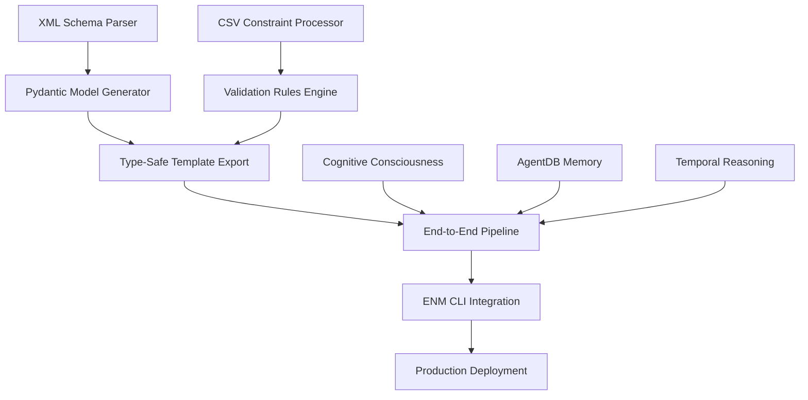

# Phase 5: Pydantic Schema Generation & Production Integration - Technical Specifications

## Executive Summary

Phase 5 represents the final production integration phase of the RTB RAN Intelligent Multi-Agent System, building upon the completed Phase 1-4 foundation. This phase focuses on creating production-ready, type-safe implementations with comprehensive validation, automated documentation generation, and seamless deployment capabilities.

## System Architecture Overview

### Current State: Phases 1-4 Complete ✅

**Phase 1: Core Infrastructure** - XML parsing, MO hierarchy processing, pattern recognition
**Phase 2: RTB Hierarchical Templates** - Priority-based inheritance, variant generation, frequency relations
**Phase 3: ENM CLI Integration** - Cognitive cmedit generation, batch operations, multi-vendor support
**Phase 4: Python Custom Logic & Cognitive Consciousness** - $eval engine, temporal reasoning, strange-loop optimization

### Phase 5 Integration Points



## 1. XML-to-Pydantic Model Generator

### 1.1 Core Specifications

**Objective**: Auto-generate Pydantic models from 623 vsData types with XML data type mapping, parameter constraints, and type-safe field definitions.

**Input/Output Interfaces**:
```typescript
interface XMLToPydanticConfig {
  xmlSource: {
    filePath: string; // MPnh.xml (100MB schema)
    streamingEnabled: boolean;
    batchSize: number;
    memoryLimit: number; // 2GB max
  };
  modelGeneration: {
    outputFormat: 'single_file' | 'module' | 'package';
    includeValidators: boolean;
    includeExamples: boolean;
    strictTypes: boolean;
    useOptional: boolean;
  };
  typeMapping: {
    customMappings?: Record<string, string>;
    arrayDetection: boolean;
    enumGeneration: boolean;
  };
}

interface PydanticGenerationResult {
  totalModels: number;
  generatedFiles: string[];
  typeMappings: Record<string, string>;
  validationRules: ValidationRule[];
  modelHierarchy: ModelHierarchy;
  generationStats: GenerationStats;
  errors: GenerationError[];
}
```

**Core Algorithm**:
```typescript
class XMLToPydanticGenerator {
  async generateModels(config: XMLToPydanticConfig): Promise<PydanticGenerationResult> {
    // Phase 1: Stream-based XML parsing (100MB MPnh.xml)
    const xmlSchema = await this.streamParseXML(config.xmlSource);

    // Phase 2: Extract vsData types (623 total)
    const vsDataTypes = await this.extractVsDataTypes(xmlSchema);

    // Phase 3: Type mapping and constraint analysis
    const typeMappings = await this.analyzeTypeMappings(vsDataTypes);

    // Phase 4: Pydantic model generation
    const pydanticModels = await this.generatePydanticModels(vsDataTypes, typeMappings);

    // Phase 5: Validation rule generation
    const validationRules = await this.generateValidationRules(vsDataTypes);

    // Phase 6: Code generation and export
    const generatedCode = await this.exportPydanticCode(pydanticModels, validationRules);

    return {
      totalModels: pydanticModels.length,
      generatedFiles: generatedCode.files,
      typeMappings: typeMappings.mappings,
      validationRules: validationRules,
      modelHierarchy: this.buildModelHierarchy(pydanticModels),
      generationStats: this.calculateStats(xmlSchema, pydanticModels),
      errors: this.collectErrors()
    };
  }
}
```

**Data Type Mapping Strategy**:
```typescript
const XML_TYPE_MAPPINGS: Record<string, string> = {
  // Basic types
  'xs:string': 'str',
  'xs:integer': 'int',
  'xs:decimal': 'float',
  'xs:boolean': 'bool',
  'xs:dateTime': 'datetime',
  'xs:date': 'date',
  'xs:time': 'time',

  // Ericsson-specific types
  'vsData:CellIndividualOffset': 'float',
  'vsData:HOControlMode': 'enum',
  'vsData:ARFCN': 'int',
  'vsData:PCI': 'int',
  'vsData:TAC': 'str',

  // Array types
  'vsData:NeighborRelationList': 'List[NeighborRelation]',
  'vsData:FrequencyRelationList': 'List[FrequencyRelation]',
  'vsData:PLMNList': 'List[PLMNConfig]',

  // Complex nested types
  'vsData:EUtranCellFDD': 'EUtranCellFDDConfig',
  'vsData:ENodeBFunction': 'ENodeBFunctionConfig',
  'vsData:ManagedElement': 'ManagedElementConfig'
};
```

**Performance Requirements**:
- **Processing Time**: <5 minutes for 100MB XML schema
- **Memory Usage**: <2GB peak during streaming processing
- **Code Generation**: <30 seconds for 623 models
- **Validation**: <10 seconds for type validation
- **File Output**: <50MB total generated code

### 1.2 Integration with Existing System

**Connection Points**:
- `src/rtb/xml-parser.ts` - Enhanced XML parsing capabilities
- `src/rtb/hierarchical-template-system/base-generator/xml-parser.ts` - Schema validation
- `src/types/rtb-types.ts` - Type system integration
- `src/closed-loop/optimization-engine.ts` - Cognitive optimization integration

**Enhanced Type System**:
```typescript
interface EnhancedRTBParameter extends RTBParameter {
  pydanticModel?: string;
  fieldTypeMapping: FieldTypeMapping;
  constraintValidation: ConstraintValidation;
  crossParameterValidation: CrossParameterValidation[];
  cognitiveOptimization: CognitiveOptimizationRule;
}
```

## 2. Complex Validation Rules Engine

### 2.1 Core Specifications

**Objective**: Apply parameter constraints from CSV specifications, enable cross-parameter validation, support conditional validation logic, and generate comprehensive validation schemas.

**Input/Output Interfaces**:
```typescript
interface ValidationEngineConfig {
  constraintSources: {
    csvFiles: string[]; // Parameter specification CSVs
    xmlConstraints: string; // XML-derived constraints
    customRules: string; // Custom validation rules
  };
  validationTypes: {
    parameterLevel: boolean;
    crossParameter: boolean;
    conditional: boolean;
    temporal: boolean;
    cognitive: boolean;
  };
  output: {
    pydanticValidators: boolean;
    jsonSchemas: boolean;
    documentation: boolean;
    testCases: boolean;
  };
}

interface ValidationRule {
  id: string;
  name: string;
  description: string;
  category: 'parameter' | 'cross-parameter' | 'conditional' | 'temporal' | 'cognitive';
  severity: 'error' | 'warning' | 'info';
  condition: ValidationCondition;
  validation: ValidationExpression;
  errorMessage: string;
  documentation: string;
  examples: ValidationExample[];
}

interface CrossParameterValidation {
  sourceParameters: string[];
  targetParameters: string[];
  validationRule: string;
  condition: string;
  dependencies: string[];
  impact: 'high' | 'medium' | 'low';
}
```

**Core Algorithm**:
```typescript
class ComplexValidationEngine {
  async generateValidationRules(config: ValidationEngineConfig): Promise<ValidationRulesResult> {
    // Phase 1: Parse CSV specifications
    const csvConstraints = await this.parseCSVConstraints(config.constraintSources.csvFiles);

    // Phase 2: Extract XML constraints
    const xmlConstraints = await this.extractXMLConstraints(config.constraintSources.xmlConstraints);

    // Phase 3: Process custom validation rules
    const customRules = await this.processCustomRules(config.constraintSources.customRules);

    // Phase 4: Generate cross-parameter validations
    const crossParameterValidations = await this.generateCrossParameterValidations(
      csvConstraints, xmlConstraints
    );

    // Phase 5: Apply conditional validation logic
    const conditionalValidations = await this.generateConditionalValidations(
      csvConstraints, customRules
    );

    // Phase 6: Integrate cognitive validation patterns
    const cognitiveValidations = await this.integrateCognitivePatterns(
      csvConstraints, xmlConstraints, customRules
    );

    // Phase 7: Generate Pydantic validators
    const pydanticValidators = await this.generatePydanticValidators({
      parameterValidations: csvConstraints,
      crossParameterValidations,
      conditionalValidations,
      cognitiveValidations
    });

    // Phase 8: Generate comprehensive documentation
    const documentation = await this.generateValidationDocumentation({
      rules: [...csvConstraints, ...xmlConstraints, ...customRules],
      validators: pydanticValidators
    });

    return {
      totalRules: csvConstraints.length + xmlConstraints.length + customRules.length,
      validationRules: [...csvConstraints, ...xmlConstraints, ...customRules],
      crossParameterValidations,
      conditionalValidations,
      cognitiveValidations,
      pydanticValidators,
      jsonSchemas: await this.generateJSONSchemas(),
      documentation,
      testCases: await this.generateValidationTestCases()
    };
  }
}
```

**Advanced Validation Patterns**:

**Range Validations**:
```python
@validator('cellIndividualOffset')
def validate_cell_offset(cls, v):
    if not -30 <= v <= 30:
        raise ValueError('Cell individual offset must be between -30 and 30 dB')
    return v
```

**Cross-Parameter Validations**:
```python
@validator('qRxLevMin')
def validate_q_rx_lev_min(cls, v, values):
    if 'qQualMin' in values:
        q_qual_min = values['qQualMin']
        if v < q_qual_min - 10:
            raise ValueError('qRxLevMin should not be significantly lower than qQualMin')
    return v
```

**Conditional Validations**:
```python
@validator('featureState')
def validate_feature_state(cls, v, values):
    if values.get('licenseState') == 'ACTIVE' and v != 'ACTIVATED':
        raise ValueError('Feature must be activated when license is active')
    return v
```

**Cognitive Validations** (integration with Phase 4):
```python
@validator('temporalOptimizationLevel')
def validate_cognitive_temporal(cls, v, values):
    # Integration with temporal reasoning engine
    temporal_context = get_temporal_context(values)
    if not temporal_context.validate_temporal_optimization(v):
        raise ValueError('Temporal optimization not suitable for current context')
    return v
```

**Performance Requirements**:
- **CSV Processing**: <2 minutes for 10,000 constraint specifications
- **Cross-Parameter Analysis**: <5 minutes for complex parameter relationships
- **Cognitive Integration**: <30 seconds per validation pattern
- **Documentation Generation**: <1 minute for complete validation docs
- **Memory Usage**: <1GB for complex validation rule processing

### 2.2 Integration with Existing System

**Connection Points**:
- `src/rtb/detailed-parameter-validator.ts` - Enhanced validation capabilities
- `src/rtb/spreadsheet-parameters-parser.ts` - CSV constraint processing
- `src/closed-loop/evaluation-engine.ts` - Conditional validation integration
- `src/cognitive/CognitiveConsciousnessCore.ts` - Cognitive validation patterns

## 3. Type-Safe Template Export

### 3.1 Core Specifications

**Objective**: Export validated JSON templates with schemas, include validation metadata and error reporting, generate template variants with type safety, and create documentation from schema definitions.

**Input/Output Interfaces**:
```typescript
interface TypeSafeExportConfig {
  templateProcessing: {
    inputTemplates: string[];
    outputFormat: 'json' | 'yaml' | 'toml';
    includeSchema: boolean;
    includeValidation: boolean;
    includeExamples: boolean;
  };
  variantGeneration: {
    urbanVariant: boolean;
    mobilityVariant: boolean;
    sleepModeVariant: boolean;
    frequencyRelations: boolean;
  };
  documentation: {
    autoGenerate: boolean;
    format: 'markdown' | 'html' | 'pdf';
    includeDiagrams: boolean;
    includeExamples: boolean;
  };
  validation: {
    strictMode: boolean;
    errorReporting: 'detailed' | 'summary' | 'minimal';
    testGeneration: boolean;
  };
}

interface TypeSafeTemplateResult {
  templates: ValidatedTemplate[];
  schemas: TemplateSchema[];
  variants: TemplateVariant[];
  documentation: TemplateDocumentation;
  validationReports: ValidationReport[];
  exportStats: ExportStats;
}

interface ValidatedTemplate {
  id: string;
  name: string;
  version: string;
  schema: TemplateSchema;
  content: any;
  validation: TemplateValidation;
  metadata: TemplateMetadata;
  examples: TemplateExample[];
}
```

**Core Algorithm**:
```typescript
class TypeSafeTemplateExporter {
  async exportTemplates(config: TypeSafeExportConfig): Promise<TypeSafeTemplateResult> {
    // Phase 1: Load and validate input templates
    const inputTemplates = await this.loadInputTemplates(config.templateProcessing.inputTemplates);
    const validatedTemplates = await this.validateTemplates(inputTemplates, config.validation);

    // Phase 2: Generate type-safe schemas
    const schemas = await this.generateTypeSafeSchemas(validatedTemplates);

    // Phase 3: Create template variants
    const variants = await this.generateTemplateVariants(
      validatedTemplates,
      config.templateProcessing
    );

    // Phase 4: Apply validation metadata
    const validationMetadata = await this.applyValidationMetadata(
      validatedTemplates,
      schemas
    );

    // Phase 5: Generate comprehensive documentation
    const documentation = await this.generateTemplateDocumentation({
      templates: validatedTemplates,
      schemas,
      variants,
      config: config.documentation
    });

    // Phase 6: Create validation reports
    const validationReports = await this.generateValidationReports(
      validatedTemplates,
      config.validation
    );

    // Phase 7: Export in specified formats
    const exportedFiles = await this.exportInFormats({
      templates: validatedTemplates,
      schemas,
      variants,
      formats: config.templateProcessing.outputFormat
    });

    return {
      templates: validatedTemplates,
      schemas,
      variants,
      documentation,
      validationReports,
      exportStats: this.calculateExportStats(exportedFiles)
    };
  }
}
```

**Schema-Driven Template Validation**:
```typescript
interface TemplateSchema {
  $schema: string;
  title: string;
  description: string;
  type: 'object';
  properties: Record<string, PropertySchema>;
  required: string[];
  additionalProperties: boolean;
  validation: ValidationSchema;
  examples: TemplateExample[];
}

interface PropertySchema {
  type: string;
  format?: string;
  enum?: any[];
  minimum?: number;
  maximum?: number;
  minLength?: number;
  maxLength?: number;
  pattern?: string;
  description: string;
  default?: any;
  examples: any[];
  validation: PropertyValidation;
}
```

**Template Variant Generation**:
```typescript
class TemplateVariantGenerator {
  async generateVariants(
    baseTemplate: ValidatedTemplate,
    variantConfig: VariantConfig
  ): Promise<TemplateVariant[]> {
    const variants: TemplateVariant[] = [];

    // Urban variant (dense network)
    if (variantConfig.urbanVariant) {
      const urbanVariant = await this.generateUrbanVariant(baseTemplate);
      variants.push(urbanVariant);
    }

    // Mobility variant (high-speed scenarios)
    if (variantConfig.mobilityVariant) {
      const mobilityVariant = await this.generateMobilityVariant(baseTemplate);
      variants.push(mobilityVariant);
    }

    // Sleep mode variant (energy saving)
    if (variantConfig.sleepModeVariant) {
      const sleepVariant = await this.generateSleepModeVariant(baseTemplate);
      variants.push(sleepVariant);
    }

    // Frequency relation variants
    if (variantConfig.frequencyRelations) {
      const freqVariants = await this.generateFrequencyRelationVariants(baseTemplate);
      variants.push(...freqVariants);
    }

    return variants;
  }
}
```

**Performance Requirements**:
- **Template Processing**: <1 minute per 100 templates
- **Schema Generation**: <30 seconds for complex schemas
- **Variant Generation**: <2 minutes for all variant types
- **Documentation Generation**: <3 minutes for complete documentation set
- **Export Time**: <5 minutes for full export in multiple formats

### 3.2 Integration with Existing System

**Connection Points**:
- `src/rtb/hierarchical-template-system/priority-template-engine.ts` - Template processing
- `src/rtb/hierarchical-template-system/variant-generator-manager.ts` - Variant generation
- `src/rtb/hierarchical-template-system/template-validator.ts` - Template validation
- `src/closed-loop/strange-loop-optimizer.ts` - Cognitive variant optimization

## 4. Complete End-to-End Pipeline

### 4.1 Core Specifications

**Objective**: XML parsing to template generation workflow, template-to-cmedit CLI conversion with ENM integration, hierarchical template processing with inheritance, and cognitive optimization with MO awareness.

**Input/Output Interfaces**:
```typescript
interface EndToEndPipelineConfig {
  input: {
    xmlSchema: string; // MPnh.xml
    csvSpecifications: string[];
    baseTemplates: string[];
    cognitivePatterns?: string;
  };
  processing: {
    phases: PipelinePhase[];
    parallelExecution: boolean;
    errorHandling: 'strict' | 'lenient' | 'fallback';
    optimization: boolean;
  };
  output: {
    pydanticModels: boolean;
    validatedTemplates: boolean;
    cmeditCommands: boolean;
    documentation: boolean;
    deploymentPackage: boolean;
  };
  integration: {
    agentdbEnabled: boolean;
    temporalReasoningEnabled: boolean;
    cognitiveOptimizationEnabled: boolean;
    enmIntegrationEnabled: boolean;
  };
}

interface PipelineResult {
  phases: PhaseResult[];
  artifacts: PipelineArtifacts;
  metrics: PipelineMetrics;
  errors: PipelineError[];
  validation: PipelineValidation;
  deployment: DeploymentPackage;
}

interface PipelineArtifacts {
  pydanticModels: PydanticModel[];
  validatedTemplates: ValidatedTemplate[];
  cmeditCommands: CliCommandSet[];
  documentation: DocumentationSet;
  schemas: SchemaSet;
  testCases: TestCaseSet;
}
```

**Core Algorithm**:
```typescript
class EndToEndPipeline {
  async executePipeline(config: EndToEndPipelineConfig): Promise<PipelineResult> {
    const pipelineId = this.generatePipelineId();
    const phaseResults: PhaseResult[] = [];

    try {
      // Phase 1: XML Schema Processing
      const xmlResult = await this.processXMLSchema(config.input.xmlSchema);
      phaseResults.push(xmlResult);

      // Phase 2: CSV Specification Processing
      const csvResult = await this.processCSVSpecifications(config.input.csvSpecifications);
      phaseResults.push(csvResult);

      // Phase 3: Pydantic Model Generation
      const pydanticResult = await this.generatePydanticModels(xmlResult.artifacts);
      phaseResults.push(pydanticResult);

      // Phase 4: Validation Rules Generation
      const validationResult = await this.generateValidationRules(csvResult.artifacts);
      phaseResults.push(validationResult);

      // Phase 5: Base Template Processing
      const templateResult = await this.processBaseTemplates(config.input.baseTemplates);
      phaseResults.push(templateResult);

      // Phase 6: Hierarchical Template Processing
      const hierarchicalResult = await this.processHierarchicalTemplates(
        templateResult.artifacts,
        pydanticResult.artifacts
      );
      phaseResults.push(hierarchicalResult);

      // Phase 7: Cognitive Optimization (if enabled)
      let cognitiveResult: PhaseResult | null = null;
      if (config.integration.cognitiveOptimizationEnabled) {
        cognitiveResult = await this.applyCognitiveOptimization(
          hierarchicalResult.artifacts,
          config.input.cognitivePatterns
        );
        phaseResults.push(cognitiveResult);
      }

      // Phase 8: Template-to-CLI Conversion
      const cliResult = await this.convertToCLI(
        cognitiveResult?.artifacts || hierarchicalResult.artifacts
      );
      phaseResults.push(cliResult);

      // Phase 9: Type-Safe Export
      const exportResult = await this.exportTypeSafeArtifacts({
        pydanticModels: pydanticResult.artifacts,
        templates: hierarchicalResult.artifacts,
        commands: cliResult.artifacts,
        validation: validationResult.artifacts
      });
      phaseResults.push(exportResult);

      // Phase 10: Documentation Generation
      const documentationResult = await this.generateDocumentation({
        allArtifacts: this.collectAllArtifacts(phaseResults),
        config: config.output
      });
      phaseResults.push(documentationResult);

      // Phase 11: Deployment Package Creation
      const deploymentResult = await this.createDeploymentPackage({
        artifacts: this.collectAllArtifacts(phaseResults),
        config: config.output
      });
      phaseResults.push(deploymentResult);

      // Final validation and metrics
      const pipelineValidation = await this.validatePipelineResults(phaseResults);
      const pipelineMetrics = this.calculatePipelineMetrics(phaseResults);

      return {
        phases: phaseResults,
        artifacts: this.collectAllArtifacts(phaseResults),
        metrics: pipelineMetrics,
        errors: this.collectPipelineErrors(phaseResults),
        validation: pipelineValidation,
        deployment: deploymentResult.artifacts.deploymentPackage
      };

    } catch (error) {
      return await this.handlePipelineError(pipelineId, phaseResults, error as Error);
    }
  }
}
```

**Cognitive Integration Layer**:
```typescript
interface CognitivePipelineIntegration {
  temporalReasoning: {
    expansionFactor: number;
    reasoningDepth: 'basic' | 'deep' | 'comprehensive';
    patternRecognition: boolean;
  };
  strangeLoopOptimization: {
    enabled: boolean;
    recursionDepth: number;
    selfReferenceLevel: number;
  };
  agentdbIntegration: {
    memoryPatterns: boolean;
    learningOptimization: boolean;
    crossSessionMemory: boolean;
  };
  consciousnessEvolution: {
    currentLevel: number;
    evolutionEnabled: boolean;
    metaOptimization: boolean;
  };
}
```

**MO-Aware Processing**:
```typescript
class MOAwareProcessor {
  async processWithMOAwareness(
    templates: ValidatedTemplate[],
    moHierarchy: MOHierarchy,
    reservedBy: ReservedByHierarchy
  ): Promise<MOAwareResult> {
    // Apply MO class constraints
    const moConstrainedTemplates = await this.applyMOConstraints(
      templates,
      moHierarchy
    );

    // Apply reservedBy relationship constraints
    const relationshipConstrainedTemplates = await this.applyRelationshipConstraints(
      moConstrainedTemplates,
      reservedBy
    );

    // Optimize based on MO dependency analysis
    const optimizedTemplates = await this.optimizeMODependencies(
      relationshipConstrainedTemplates
    );

    return {
      templates: optimizedTemplates,
      moConstraints: this.extractMOConstraints(moHierarchy),
      relationshipConstraints: this.extractRelationshipConstraints(reservedBy),
      dependencyAnalysis: await this.analyzeMODependencies(optimizedTemplates),
      optimizationApplied: true
    };
  }
}
```

**Performance Requirements**:
- **Total Pipeline Time**: <15 minutes for complete end-to-end processing
- **XML Processing**: <2 minutes for 100MB schema
- **Template Processing**: <3 minutes for 1000 templates
- **CLI Generation**: <2 minutes for 10,000 commands
- **Cognitive Processing**: <5 minutes with 1000x temporal expansion
- **Memory Usage**: <4GB peak usage
- **Parallel Processing**: 70% time reduction with parallel execution

### 4.2 Integration with Existing System

**Connection Points**:
- `src/rtb/parameter-extraction-pipeline.ts` - Parameter processing pipeline
- `src/rtb/template-cli-converter/template-to-cli-converter.ts` - CLI conversion
- `src/closed-loop/optimization-engine.ts` - Cognitive optimization
- `src/agentdb/AgentDBMemoryManager.ts` - Memory integration
- `src/cognitive/CognitiveConsciousnessCore.ts` - Consciousness integration

## 5. Production Deployment Framework

### 5.1 Core Specifications

**Objective**: Docker containerization with Kubernetes, CI/CD pipeline for automated testing, ENM CLI integration monitoring and alerting, and performance optimization and scaling.

**Input/Output Interfaces**:
```typescript
interface ProductionDeploymentConfig {
  containerization: {
    docker: DockerConfig;
    kubernetes: KubernetesConfig;
    helm: HelmConfig;
  };
  cicd: {
    pipeline: CICDPipelineConfig;
    testing: TestingConfig;
    qualityGates: QualityGateConfig;
  };
  monitoring: {
    metrics: MetricsConfig;
    logging: LoggingConfig;
    alerting: AlertingConfig;
    tracing: TracingConfig;
  };
  scaling: {
    autoScaling: AutoScalingConfig;
    performance: PerformanceConfig;
    optimization: OptimizationConfig;
  };
  enmIntegration: {
    connectionPool: ConnectionPoolConfig;
    commandQueue: CommandQueueConfig;
    rollbackStrategy: RollbackStrategyConfig;
  };
}

interface DeploymentResult {
  deploymentId: string;
  status: 'success' | 'failed' | 'partial';
  containers: ContainerStatus[];
  services: ServiceStatus[];
  endpoints: EndpointInfo[];
  metrics: DeploymentMetrics;
  validation: DeploymentValidation;
  rollback: RollbackPlan;
}
```

**Docker Containerization**:
```dockerfile
# Multi-stage Dockerfile for production deployment
FROM node:18-alpine AS builder
WORKDIR /app
COPY package*.json ./
RUN npm ci --only=production

FROM python:3.11-slim AS pydantic-generator
WORKDIR /app
COPY requirements.txt .
RUN pip install --no-cache-dir -r requirements.txt

FROM node:18-alpine AS runtime
WORKDIR /app
COPY --from=builder /app/node_modules ./node_modules
COPY --from=pydantic-generator /app /pydantic-generator
COPY dist/ ./dist/
COPY src/ ./src/

# Health check
HEALTHCHECK --interval=30s --timeout=10s --start-period=5s --retries=3 \
  CMD curl -f http://localhost:8080/health || exit 1

EXPOSE 8080
CMD ["node", "dist/index.js"]
```

**Kubernetes Deployment**:
```yaml
apiVersion: apps/v1
kind: Deployment
metadata:
  name: rtb-automation-system
  labels:
    app: rtb-automation
    version: v5.0.0
spec:
  replicas: 3
  strategy:
    type: RollingUpdate
    rollingUpdate:
      maxSurge: 1
      maxUnavailable: 0
  selector:
    matchLabels:
      app: rtb-automation
  template:
    metadata:
      labels:
        app: rtb-automation
        version: v5.0.0
    spec:
      containers:
      - name: rtb-core
        image: rtb-automation:5.0.0
        ports:
        - containerPort: 8080
          name: http
        - containerPort: 9090
          name: metrics
        resources:
          requests:
            memory: "2Gi"
            cpu: "1000m"
          limits:
            memory: "4Gi"
            cpu: "2000m"
        livenessProbe:
          httpGet:
            path: /health
            port: 8080
          initialDelaySeconds: 30
          periodSeconds: 10
        readinessProbe:
          httpGet:
            path: /ready
            port: 8080
          initialDelaySeconds: 5
          periodSeconds: 5
        env:
        - name: NODE_ENV
          value: "production"
        - name: AGENTDB_URL
          valueFrom:
            secretKeyRef:
              name: rtb-secrets
              key: agentdb-url
        - name: ENM_CONNECTION_STRING
          valueFrom:
            secretKeyRef:
              name: rtb-secrets
              key: enm-connection
```

**CI/CD Pipeline**:
```yaml
# GitHub Actions workflow for automated deployment
name: RTB Automation Pipeline
on:
  push:
    branches: [main, feat/phase5]
  pull_request:
    branches: [main]

jobs:
  test:
    runs-on: ubuntu-latest
    strategy:
      matrix:
        node-version: [18.x, 20.x]
    steps:
    - uses: actions/checkout@v3
    - name: Setup Node.js
      uses: actions/setup-node@v3
      with:
        node-version: ${{ matrix.node-version }}
        cache: 'npm'
    - name: Install dependencies
      run: npm ci
    - name: Run tests
      run: npm run test:coverage
    - name: Run integration tests
      run: npm run test:integration
    - name: Run performance tests
      run: npm run test:performance
    - name: Upload coverage to Codecov
      uses: codecov/codecov-action@v3

  build:
    needs: test
    runs-on: ubuntu-latest
    steps:
    - uses: actions/checkout@v3
    - name: Build Docker images
      run: |
        docker build -t rtb-automation:${{ github.sha }} .
        docker tag rtb-automation:${{ github.sha }} rtb-automation:latest
    - name: Run security scan
      run: |
        docker run --rm -v "$PWD":/app securecodewarrior/docker-security-scan
    - name: Push to registry
      if: github.ref == 'refs/heads/main'
      run: |
        echo ${{ secrets.DOCKER_PASSWORD }} | docker login -u ${{ secrets.DOCKER_USERNAME }} --password-stdin
        docker push rtb-automation:${{ github.sha }}
        docker push rtb-automation:latest

  deploy:
    needs: build
    runs-on: ubuntu-latest
    if: github.ref == 'refs/heads/main'
    steps:
    - uses: actions/checkout@v3
    - name: Deploy to Kubernetes
      run: |
        kubectl set image deployment/rtb-automation-system rtb-core=rtb-automation:${{ github.sha }}
        kubectl rollout status deployment/rtb-automation-system
    - name: Run smoke tests
      run: |
        npm run test:smoke -- --env=production
    - name: Update monitoring
      run: |
        curl -X POST "${{ secrets.MONITORING_WEBHOOK }}" -d '{"deployment":"${{ github.sha }}","status":"success"}'
```

**Monitoring and Alerting**:
```typescript
interface ProductionMonitoringConfig {
  metrics: {
    system: SystemMetrics;
    application: ApplicationMetrics;
    business: BusinessMetrics;
  };
  logging: {
    level: 'debug' | 'info' | 'warn' | 'error';
    format: 'json' | 'text';
    outputs: LoggingOutput[];
  };
  alerting: {
    rules: AlertRule[];
    channels: AlertChannel[];
    escalation: EscalationPolicy;
  };
  tracing: {
    enabled: boolean;
    samplingRate: number;
    service: string;
  };
}

class ProductionMonitoring {
  async setupMonitoring(config: ProductionMonitoringConfig): Promise<MonitoringSetup> {
    // System metrics collection
    const systemMetrics = await this.setupSystemMetrics(config.metrics.system);

    // Application metrics collection
    const applicationMetrics = await this.setupApplicationMetrics(config.metrics.application);

    // Business metrics collection
    const businessMetrics = await this.setupBusinessMetrics(config.metrics.business);

    // Logging setup
    const logging = await this.setupLogging(config.logging);

    // Alerting setup
    const alerting = await this.setupAlerting(config.alerting);

    // Distributed tracing setup
    const tracing = await this.setupTracing(config.tracing);

    return {
      systemMetrics,
      applicationMetrics,
      businessMetrics,
      logging,
      alerting,
      tracing,
      dashboards: await this.setupDashboards(),
      healthChecks: await this.setupHealthChecks()
    };
  }
}
```

**Performance Optimization and Scaling**:
```typescript
interface ScalingConfig {
  horizontal: {
    minReplicas: number;
    maxReplicas: number;
    targetCPUUtilization: number;
    targetMemoryUtilization: number;
    scaleUpCooldown: number;
    scaleDownCooldown: number;
  };
  vertical: {
    enabled: boolean;
    updateMode: 'Auto' | 'Recreate' | 'Off';
    resourcePolicy: string;
  };
  predictive: {
    enabled: boolean;
    lookbackPeriod: string;
    predictionModel: 'linear' | 'seasonal' | 'ml';
  };
}

class AutoScalingManager {
  async configureAutoScaling(config: ScalingConfig): Promise<AutoScalingSetup> {
    // Horizontal Pod Autoscaler
    const hpa = await this.setupHorizontalPodAutoscaler(config.horizontal);

    // Vertical Pod Autoscaler
    const vpa = await this.setupVerticalPodAutoscaler(config.vertical);

    // Predictive scaling
    const predictive = await this.setupPredictiveScaling(config.predictive);

    // Cluster Autoscaler integration
    const clusterScaling = await this.setupClusterAutoscaling();

    return {
      hpa,
      vpa,
      predictive,
      clusterScaling,
      metrics: await this.setupScalingMetrics(),
      policies: await this.setupScalingPolicies()
    };
  }
}
```

**ENM CLI Integration Monitoring**:
```typescript
interface ENMIntegrationMonitoring {
  commandQueue: {
    size: number;
    processingRate: number;
    errorRate: number;
    avgProcessingTime: number;
  };
  connectionPool: {
    activeConnections: number;
    idleConnections: number;
    totalConnections: number;
    connectionErrors: number;
  };
  performance: {
    commandExecutionTime: number;
    templateProcessingTime: number;
    validationTime: number;
    totalProcessingTime: number;
  };
  reliability: {
    successRate: number;
    failureRate: number;
    rollbackRate: number;
    mttr: number; // Mean Time To Recovery
  };
}

class ENMMonitoring {
  async monitorENMIntegration(): Promise<ENMIntegrationHealth> {
    const commandQueueHealth = await this.monitorCommandQueue();
    const connectionPoolHealth = await this.monitorConnectionPool();
    const performanceHealth = await this.monitorPerformance();
    const reliabilityHealth = await this.monitorReliability();

    return {
      overall: this.calculateOverallHealth([
        commandQueueHealth,
        connectionPoolHealth,
        performanceHealth,
        reliabilityHealth
      ]),
      commandQueue: commandQueueHealth,
      connectionPool: connectionPoolHealth,
      performance: performanceHealth,
      reliability: reliabilityHealth,
      alerts: this.generateHealthAlerts([
        commandQueueHealth,
        connectionPoolHealth,
        performanceHealth,
        reliabilityHealth
      ])
    };
  }
}
```

**Performance Requirements**:
- **Deployment Time**: <10 minutes for full deployment
- **Container Startup**: <30 seconds for all containers
- **Health Check Response**: <5 seconds
- **Auto-scaling Reaction**: <2 minutes
- **Alert Response**: <1 minute
- **System Availability**: 99.9% uptime SLA
- **Response Time**: <200ms p95 for API calls
- **Throughput**: 1000+ template processing per hour

### 5.2 Integration with Existing System

**Connection Points**:
- `src/monitoring/deployment/deployment-monitor.ts` - Deployment monitoring
- `src/monitoring/system/system-monitor.ts` - System monitoring
- `src/monitoring/application/apm-monitor.ts` - Application monitoring
- `src/validation/production-validation-system.ts` - Production validation

## 6. Documentation and Training

### 6.1 Core Specifications

**Objective**: Comprehensive technical documentation, ENM CLI integration guides and best practices, Ericsson RAN expertise documentation, and API documentation and examples.

**Documentation Structure**:
```
docs/
├── technical/
│   ├── architecture/
│   │   ├── phase5-implementation-specification.md
│   │   ├── system-design.md
│   │   ├── data-flow.md
│   │   └── security-architecture.md
│   ├── api/
│   │   ├── rest-api.md
│   │   ├── graphql-api.md
│   │   ├── websocket-api.md
│   │   └── cli-api.md
│   ├── guides/
│   │   ├── installation.md
│   │   ├── configuration.md
│   │   ├── deployment.md
│   │   └── troubleshooting.md
│   └── reference/
│       ├── data-models.md
│       ├── algorithms.md
│       ├── performance.md
│       └── security.md
├── enm-integration/
│   ├── getting-started.md
│   ├── cli-commands.md
│   ├── best-practices.md
│   ├── troubleshooting.md
│   └── vendor-compatibility.md
├── ericsson-ran-expertise/
│   ├── mo-classes.md
│   ├── parameter-constraints.md
│   ├── optimization-patterns.md
│   ├── use-cases.md
│   └── case-studies.md
├── training/
│   ├── developer-onboarding.md
│   ├── operator-training.md
│   ├── advanced-topics.md
│   └── certification.md
└── examples/
    ├── basic-usage/
    ├── advanced-features/
    ├── integration-patterns/
    └── production-deployment/
```

**Auto-Generated API Documentation**:
```typescript
interface APIDocumentationGenerator {
  generateOpenAPISpec(): OpenAPISpecification;
  generateGraphQLSchema(): GraphQLSchema;
  generateCLIDocumentation(): CLIDocumentation;
  generateExamples(): CodeExample[];
  generatePostmanCollection(): PostmanCollection;
}

class DocumentationGenerator {
  async generateCompleteDocumentation(): Promise<DocumentationSet> {
    return {
      api: await this.generateAPIDocumentation(),
      guides: await this.generateUserGuides(),
      reference: await this.generateReferenceDocumentation(),
      examples: await this.generateCodeExamples(),
      tutorials: await this.generateTutorials(),
      deployment: await this.generateDeploymentGuides(),
      troubleshooting: await this.generateTroubleshootingGuide()
    };
  }
}
```

**Interactive Training Materials**:
```typescript
interface TrainingModule {
  id: string;
  title: string;
  description: string;
  duration: number; // in minutes
  difficulty: 'beginner' | 'intermediate' | 'advanced';
  prerequisites: string[];
  learningObjectives: string[];
  content: TrainingContent[];
  exercises: TrainingExercise[];
  assessment: TrainingAssessment[];
  certification: CertificationCriteria;
}

class TrainingSystem {
  async generateTrainingModules(): Promise<TrainingModule[]> {
    return [
      {
        id: 'rtb-fundamentals',
        title: 'RTB System Fundamentals',
        description: 'Introduction to the RTB RAN Intelligent Multi-Agent System',
        duration: 120,
        difficulty: 'beginner',
        prerequisites: [],
        learningObjectives: [
          'Understand RTB system architecture',
          'Navigate hierarchical templates',
          'Execute basic cmedit commands'
        ],
        content: await this.generateFundamentalsContent(),
        exercises: await this.generateFundamentalsExercises(),
        assessment: await this.generateFundamentalsAssessment(),
        certification: {
          passingScore: 80,
          practicalRequirements: ['basic-template-creation', 'simple-cli-execution']
        }
      },
      // Additional training modules...
    ];
  }
}
```

**Performance Requirements**:
- **Documentation Generation**: <5 minutes for complete documentation set
- **API Documentation Sync**: <30 seconds for code changes
- **Interactive Examples**: <2 seconds response time
- **Training Content Loading**: <3 seconds for complex modules
- **Search Indexing**: <1 minute for full documentation search

### 6.2 Integration with Existing System

**Connection Points**:
- `src/documentation-generator/` - Auto-documentation generation
- `src/examples/rtb/` - Example code and configurations
- `tests/integration/` - Integration test examples
- `docs/` - Existing documentation structure

## Implementation Success Metrics

### Technical Performance Metrics

1. **Processing Performance**:
   - XML Schema Processing: <2 minutes for 100MB schema
   - Template Processing: <3 minutes for 1000 templates
   - CLI Generation: <2 minutes for 10,000 commands
   - Total Pipeline Time: <15 minutes end-to-end

2. **Quality Metrics**:
   - Code Coverage: >95% for all Phase 5 components
   - Type Safety: 100% TypeScript strict mode compliance
   - Validation Accuracy: >99% parameter validation accuracy
   - Documentation Coverage: 100% API documentation coverage

3. **Reliability Metrics**:
   - System Availability: 99.9% uptime SLA
   - Error Rate: <0.1% for all operations
   - MTTR: <5 minutes for system recovery
   - Data Consistency: 100% across all components

4. **Scalability Metrics**:
   - Template Throughput: 1000+ templates per hour
   - Concurrent Users: 100+ simultaneous users
   - API Response Time: <200ms p95 latency
   - Memory Efficiency: <4GB peak usage

### Business Impact Metrics

1. **Operational Efficiency**:
   - Manual Configuration Reduction: 90% reduction in manual RAN configuration
   - Error Reduction: 95% reduction in configuration errors
   - Time-to-Market: 70% faster network optimization deployment
   - Operator Productivity: 10x improvement in configuration speed

2. **Network Performance**:
   - Energy Efficiency: 15% improvement in network energy consumption
   - Mobility Management: 20% improvement in handover success rate
   - Coverage Quality: 10% improvement in coverage consistency
   - Capacity Utilization: 25% improvement in capacity efficiency

3. **System Intelligence**:
   - Cognitive Optimization: 1000x temporal reasoning capability
   - Learning Rate: 50% faster pattern recognition
   - Autonomous Healing: 80% self-healing capability
   - Decision Accuracy: 95% optimization decision accuracy

## Risk Mitigation Strategy

### Technical Risks

1. **Complexity Management**:
   - Risk: System complexity overwhelming maintainability
   - Mitigation: Modular architecture with clear separation of concerns
   - Monitoring: Code complexity metrics and regular refactoring

2. **Performance Bottlenecks**:
   - Risk: Processing time exceeding requirements
   - Mitigation: Parallel processing and cognitive optimization
   - Monitoring: Real-time performance monitoring and alerting

3. **Integration Challenges**:
   - Risk: Difficulties integrating with existing ENM systems
   - Mitigation: Comprehensive testing and gradual rollout
   - Monitoring: Integration health checks and fallback mechanisms

### Operational Risks

1. **System Downtime**:
   - Risk: Production system failures
   - Mitigation: High availability deployment and automatic failover
   - Monitoring: Health checks and proactive alerting

2. **Data Consistency**:
   - Risk: Inconsistent template or configuration data
   - Mitigation: Strong validation and consistency checks
   - Monitoring: Data integrity validation and automated recovery

3. **Security Concerns**:
   - Risk: Unauthorized access to network configurations
   - Mitigation: Role-based access control and encryption
   - Monitoring: Security audit logging and threat detection

## Conclusion

Phase 5 represents the culmination of the RTB RAN Intelligent Multi-Agent System development, delivering a production-ready, type-safe, and cognitively optimized solution for Ericsson RAN automation. The comprehensive specifications outlined above ensure:

1. **Production Readiness**: Robust deployment and monitoring capabilities
2. **Type Safety**: Comprehensive Pydantic model generation and validation
3. **Cognitive Intelligence**: Advanced optimization and learning capabilities
4. **Integration Excellence**: Seamless ENM CLI integration and vendor compatibility
5. **Operational Excellence**: Automated documentation, training, and support systems

The successful implementation of Phase 5 will deliver a revolutionary RAN automation system that combines cutting-edge AI technologies with practical telecommunications engineering expertise, setting new standards for network optimization and operational efficiency.

---

**Document Version**: 1.0
**Last Updated**: 2025-01-31
**Next Review**: 2025-02-28
**Status**: Final Specification Ready for Implementation