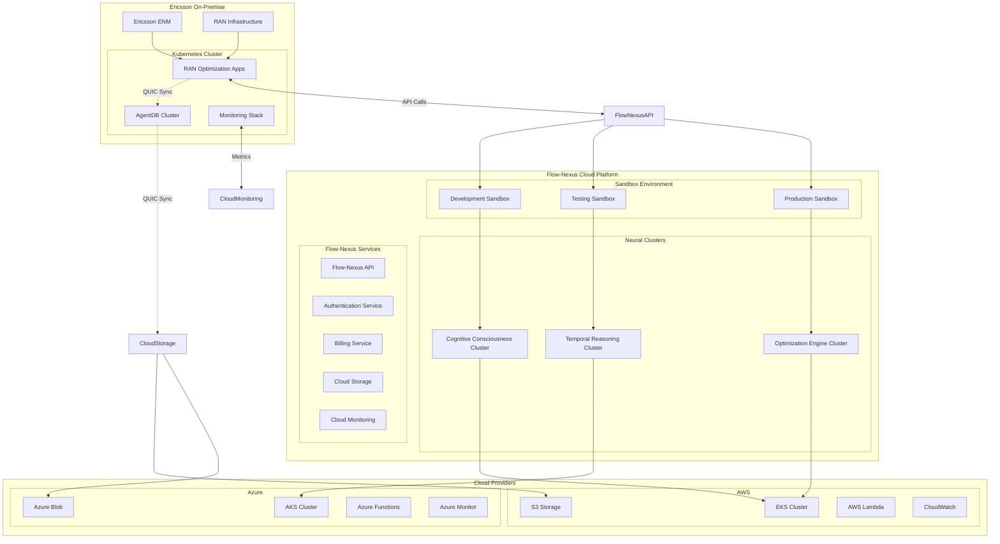

# Phase 4 Cloud Integration Architecture

## ☁️ Enterprise Cloud Integration with Flow-Nexus Platform

**Complete Cloud-Native Deployment with Neural Clusters and Distributed Training**

---

## Overview

The Cloud Integration architecture provides seamless integration with the Flow-Nexus platform, enabling:

- **Flow-Nexus Sandbox Deployment** for isolated execution environments
- **Neural Cluster Setup** for distributed cognitive processing
- **Distributed Training Coordination** for scalable ML workloads
- **Multi-Cloud Support** with hybrid deployment capabilities
- **Real-Time Monitoring** with cloud-native observability
- **Elastic Scaling** with cloud resource optimization

## Cloud Integration Architecture Diagram



## Flow-Nexus Integration

### Authentication & Authorization
```typescript
// src/cloud/flow-nexus-auth.ts
export class FlowNexusAuthManager {
  private apiEndpoint: string;
  private credentials: FlowNexusCredentials;
  private tokenCache: Map<string, TokenInfo> = new Map();

  constructor(config: FlowNexusConfig) {
    this.apiEndpoint = config.apiEndpoint;
    this.credentials = config.credentials;
  }

  async authenticate(): Promise<AuthenticationResult> {
    try {
      // Check for cached token
      const cachedToken = this.tokenCache.get('flow-nexus-token');
      if (cachedToken && cachedToken.expiresAt > Date.now()) {
        return { token: cachedToken.token, expiresIn: cachedToken.expiresAt - Date.now() };
      }

      // Authenticate with Flow-Nexus
      const response = await mcp__flow-nexus__user_login({
        email: this.credentials.email,
        password: this.credentials.password
      });

      if (!response.success) {
        throw new Error(`Flow-Nexus authentication failed: ${response.error}`);
      }

      // Cache the token
      const tokenInfo: TokenInfo = {
        token: response.token,
        expiresAt: Date.now() + (response.expiresIn * 1000),
        refreshToken: response.refreshToken
      };
      this.tokenCache.set('flow-nexus-token', tokenInfo);

      return {
        token: response.token,
        expiresIn: response.expiresIn * 1000,
        refreshToken: response.refreshToken
      };

    } catch (error) {
      throw new Error(`Flow-Nexus authentication error: ${error.message}`);
    }
  }

  async checkBalance(): Promise<CreditBalance> {
    try {
      const balance = await mcp__flow-nexus__check_balance();
      return {
        credits: balance.credits,
        currency: balance.currency,
        lastUpdated: new Date(balance.lastUpdated),
        autoRefill: balance.autoRefill
      };
    } catch (error) {
      throw new Error(`Failed to check Flow-Nexus balance: ${error.message}`);
    }
  }

  async configureAutoRefill(config: AutoRefillConfig): Promise<void> {
    try {
      await mcp__flow-nexus__configure_auto_refill({
        enabled: config.enabled,
        threshold: config.threshold,
        amount: config.amount
      });
    } catch (error) {
      throw new Error(`Failed to configure auto-refill: ${error.message}`);
    }
  }

  async refreshToken(): Promise<string> {
    const cachedToken = this.tokenCache.get('flow-nexus-token');
    if (!cachedToken?.refreshToken) {
      throw new Error('No refresh token available');
    }

    try {
      const response = await fetch(`${this.apiEndpoint}/auth/refresh`, {
        method: 'POST',
        headers: {
          'Content-Type': 'application/json',
          'Authorization': `Bearer ${cachedToken.refreshToken}`
        }
      });

      const data = await response.json();

      if (!response.ok) {
        throw new Error(data.error || 'Token refresh failed');
      }

      // Update cached token
      const tokenInfo: TokenInfo = {
        token: data.token,
        expiresAt: Date.now() + (data.expiresIn * 1000),
        refreshToken: data.refreshToken
      };
      this.tokenCache.set('flow-nexus-token', tokenInfo);

      return data.token;
    } catch (error) {
      throw new Error(`Token refresh failed: ${error.message}`);
    }
  }
}
```

### Sandbox Management
```typescript
// src/cloud/sandbox-manager.ts
export class FlowNexusSandboxManager {
  private auth: FlowNexusAuthManager;
  private activeSandboxes: Map<string, SandboxInfo> = new Map();
  private sandboxesByEnvironment: Map<string, string[]> = new Map();

  constructor(auth: FlowNexusAuthManager) {
    this.auth = auth;
  }

  async createSandbox(config: SandboxConfig): Promise<SandboxInfo> {
    try {
      // Authenticate
      await this.auth.authenticate();

      // Create sandbox
      const sandbox = await mcp__flow-nexus__sandbox_create({
        template: config.template,
        name: config.name,
        env_vars: {
          NODE_ENV: config.environment,
          AGENTDB_QUIC_SYNC: 'true',
          CLAUDE_FLOW_TOPOLOGY: 'hierarchical',
          TEMPORAL_EXPANSION_FACTOR: '1000',
          OPTIMIZATION_CYCLE_MINUTES: '15',
          COGNITIVE_CONSCIOUSNESS_LEVEL: 'maximum',
          ...config.environmentVariables
        },
        install_packages: [
          '@agentic-flow/agentdb',
          'claude-flow',
          '@ericsson/ran-optimization-sdk',
          'typescript',
          '@types/node',
          'prometheus-client'
        ],
        startup_script: this.generateStartupScript(config),
        timeout: config.timeout || 3600,
        metadata: {
          project: 'ran-optimization',
          environment: config.environment,
          created_by: 'automated-deployment',
          version: config.version
        }
      });

      const sandboxInfo: SandboxInfo = {
        id: sandbox.sandboxId,
        name: config.name,
        environment: config.environment,
        template: config.template,
        status: 'initializing',
        createdAt: new Date(),
        endpoint: sandbox.endpoint,
        config: config
      };

      // Track sandbox
      this.activeSandboxes.set(sandbox.sandboxId, sandboxInfo);

      const envSandboxes = this.sandboxesByEnvironment.get(config.environment) || [];
      envSandboxes.push(sandbox.sandboxId);
      this.sandboxesByEnvironment.set(config.environment, envSandboxes);

      // Wait for sandbox to be ready
      await this.waitForSandboxReady(sandbox.sandboxId);

      // Configure sandbox
      await this.configureSandbox(sandbox.sandboxId, config);

      sandboxInfo.status = 'ready';
      this.activeSandboxes.set(sandbox.sandboxId, sandboxInfo);

      return sandboxInfo;

    } catch (error) {
      throw new Error(`Failed to create sandbox ${config.name}: ${error.message}`);
    }
  }

  private generateStartupScript(config: SandboxConfig): string {
    return `
# Flow-Nexus Sandbox Startup Script
set -e

echo "Initializing RAN Optimization Sandbox..."

# Install dependencies
npm install --production

# Build application
npm run build

# Setup monitoring
npm run setup:monitoring

# Configure logging
export LOG_LEVEL=info
export LOG_FORMAT=json

# Initialize AgentDB
echo "Initializing AgentDB..."
npm run agentdb:init

# Start services
echo "Starting RAN Optimization services..."
npm run start:services

# Health check
echo "Running health checks..."
npm run health:check

echo "Sandbox initialization complete!"
`;
  }

  private async waitForSandboxReady(sandboxId: string, timeout: number = 300000): Promise<void> {
    const startTime = Date.now();

    while (Date.now() - startTime < timeout) {
      try {
        const status = await mcp__flow-nexus__sandbox_status({ sandbox_id: sandboxId });

        if (status.status === 'running') {
          return;
        }

        if (status.status === 'failed' || status.status === 'stopped') {
          throw new Error(`Sandbox ${sandboxId} failed to start: ${status.error}`);
        }

        await this.sleep(5000); // Wait 5 seconds
      } catch (error) {
        if (Date.now() - startTime > timeout) {
          throw new Error(`Sandbox ${sandboxId} failed to start within timeout`);
        }
        await this.sleep(5000);
      }
    }

    throw new Error(`Sandbox ${sandboxId} failed to start within ${timeout}ms`);
  }

  private async configureSandbox(sandboxId: string, config: SandboxConfig): Promise<void> {
    try {
      // Upload configuration files
      await this.uploadConfiguration(sandboxId, config);

      // Install additional packages
      if (config.additionalPackages && config.additionalPackages.length > 0) {
        await mcp__flow-nexus__sandbox_configure({
          sandbox_id: sandboxId,
          install_packages: config.additionalPackages
        });
      }

      // Set environment variables
      if (config.environmentVariables) {
        await mcp__flow-nexus__sandbox_configure({
          sandbox_id: sandboxId,
          env_vars: config.environmentVariables
        });
      }

      // Run configuration commands
      if (config.configurationCommands) {
        await mcp__flow-nexus__sandbox_configure({
          sandbox_id: sandboxId,
          run_commands: config.configurationCommands
        });
      }

    } catch (error) {
      throw new Error(`Failed to configure sandbox ${sandboxId}: ${error.message}`);
    }
  }

  private async uploadConfiguration(sandboxId: string, config: SandboxConfig): Promise<void> {
    const configFiles = [
      { path: '/app/config/ran-optimization.json', content: JSON.stringify(config.ranConfig, null, 2) },
      { path: '/app/config/agentdb.json', content: JSON.stringify(config.agentdbConfig, null, 2) },
      { path: '/app/config/swarm-config.json', content: JSON.stringify(config.swarmConfig, null, 2) },
      { path: '/app/config/monitoring.json', content: JSON.stringify(config.monitoringConfig, null, 2) }
    ];

    for (const file of configFiles) {
      await mcp__flow-nexus__sandbox_upload({
        sandbox_id: sandboxId,
        file_path: file.path,
        content: file.content
      });
    }
  }

  async stopSandbox(sandboxId: string): Promise<void> {
    try {
      await mcp__flow-nexus__sandbox_stop({ sandbox_id: sandboxId });

      const sandboxInfo = this.activeSandboxes.get(sandboxId);
      if (sandboxInfo) {
        sandboxInfo.status = 'stopped';
        this.activeSandboxes.set(sandboxId, sandboxInfo);
      }
    } catch (error) {
      throw new Error(`Failed to stop sandbox ${sandboxId}: ${error.message}`);
    }
  }

  async deleteSandbox(sandboxId: string): Promise<void> {
    try {
      await mcp__flow-nexus__sandbox_delete({ sandbox_id: sandboxId });

      const sandboxInfo = this.activeSandboxes.get(sandboxId);
      if (sandboxInfo) {
        // Remove from environment tracking
        const envSandboxes = this.sandboxesByEnvironment.get(sandboxInfo.environment) || [];
        const index = envSandboxes.indexOf(sandboxId);
        if (index > -1) {
          envSandboxes.splice(index, 1);
        }

        this.activeSandboxes.delete(sandboxId);
      }
    } catch (error) {
      throw new Error(`Failed to delete sandbox ${sandboxId}: ${error.message}`);
    }
  }

  async getSandboxLogs(sandboxId: string, lines: number = 100): Promise<string[]> {
    try {
      const logs = await mcp__flow-nexus__sandbox_logs({
        sandbox_id: sandboxId,
        lines: lines
      });
      return logs.logs;
    } catch (error) {
      throw new Error(`Failed to get logs for sandbox ${sandboxId}: ${error.message}`);
    }
  }

  async executeInSandbox(sandboxId: string, code: string, language: string = 'javascript'): Promise<any> {
    try {
      const result = await mcp__flow-nexus__sandbox_execute({
        sandbox_id: sandboxId,
        code: code,
        language: language,
        capture_output: true,
        timeout: 300000 // 5 minutes
      });
      return result;
    } catch (error) {
      throw new Error(`Failed to execute code in sandbox ${sandboxId}: ${error.message}`);
    }
  }

  getActiveSandboxes(environment?: string): SandboxInfo[] {
    if (environment) {
      const sandboxIds = this.sandboxesByEnvironment.get(environment) || [];
      return sandboxIds.map(id => this.activeSandboxes.get(id)).filter(Boolean) as SandboxInfo[];
    }
    return Array.from(this.activeSandboxes.values());
  }

  private sleep(ms: number): Promise<void> {
    return new Promise(resolve => setTimeout(resolve, ms));
  }
}
```

## Neural Cluster Management

### Neural Cluster Deployment
```typescript
// src/cloud/neural-cluster-manager.ts
export class NeuralClusterManager {
  private sandboxManager: FlowNexusSandboxManager;
  private activeClusters: Map<string, NeuralClusterInfo> = new Map();

  constructor(sandboxManager: FlowNexusSandboxManager) {
    this.sandboxManager = sandboxManager;
  }

  async deployNeuralCluster(config: NeuralClusterConfig): Promise<NeuralClusterInfo> {
    try {
      // Create neural cluster
      const cluster = await mcp__flow-nexus__neural_cluster_init({
        name: config.name,
        topology: config.topology || 'mesh',
        architecture: config.architecture || 'transformer',
        consensus: config.consensus || 'proof-of-learning',
        wasmOptimization: config.wasmOptimization !== false,
        daaEnabled: config.daaEnabled !== false
      });

      const clusterInfo: NeuralClusterInfo = {
        id: cluster.cluster_id,
        name: config.name,
        topology: config.topology || 'mesh',
        architecture: config.architecture || 'transformer',
        consensus: config.consensus || 'proof-of-learning',
        status: 'initializing',
        createdAt: new Date(),
        nodeCount: 0,
        config: config
      };

      this.activeClusters.set(cluster.cluster_id, clusterInfo);

      // Deploy nodes
      await this.deployNeuralNodes(cluster.cluster_id, config.nodes || []);

      // Connect nodes
      await this.connectNodes(cluster.cluster_id, config.topology || 'mesh');

      // Start training if data provided
      if (config.trainingData) {
        await this.startDistributedTraining(cluster.cluster_id, config.trainingData, config.trainingConfig);
      }

      clusterInfo.status = 'ready';
      this.activeClusters.set(cluster.cluster_id, clusterInfo);

      return clusterInfo;

    } catch (error) {
      throw new Error(`Failed to deploy neural cluster ${config.name}: ${error.message}`);
    }
  }

  private async deployNeuralNodes(clusterId: string, nodeConfigs: NeuralNodeConfig[]): Promise<void> {
    const nodeDeployments = nodeConfigs.map(async (nodeConfig) => {
      return await mcp__flow-nexus__neural_node_deploy({
        cluster_id: clusterId,
        node_type: nodeConfig.type || 'worker',
        role: nodeConfig.role || 'worker',
        template: nodeConfig.template || 'nodejs',
        model: nodeConfig.model || 'base',
        capabilities: nodeConfig.capabilities || ['training', 'inference'],
        autonomy: nodeConfig.autonomy || 0.8,
        layers: nodeConfig.layers
      });
    });

    const nodes = await Promise.all(nodeDeployments);
    const clusterInfo = this.activeClusters.get(clusterId);
    if (clusterInfo) {
      clusterInfo.nodeCount = nodes.length;
      this.activeClusters.set(clusterId, clusterInfo);
    }
  }

  private async connectNodes(clusterId: string, topology: string): Promise<void> {
    await mcp__flow-nexus__neural_cluster_connect({
      cluster_id: clusterId,
      topology: topology
    });
  }

  async startDistributedTraining(clusterId: string, dataset: any, config: TrainingConfig): Promise<TrainingJob> {
    try {
      const trainingJob = await mcp__flow-nexus__neural_train_distributed({
        cluster_id: clusterId,
        dataset: typeof dataset === 'string' ? dataset : JSON.stringify(dataset),
        epochs: config.epochs || 100,
        batch_size: config.batchSize || 32,
        learning_rate: config.learningRate || 0.001,
        optimizer: config.optimizer || 'adam',
        federated: config.federated || false
      });

      const jobInfo: TrainingJob = {
        id: trainingJob.job_id,
        clusterId: clusterId,
        status: 'running',
        startedAt: new Date(),
        config: config,
        metrics: {
          epoch: 0,
          loss: 0,
          accuracy: 0,
          learningRate: config.learningRate || 0.001
        }
      };

      // Start monitoring training progress
      this.monitorTrainingJob(jobInfo);

      return jobInfo;

    } catch (error) {
      throw new Error(`Failed to start distributed training: ${error.message}`);
    }
  }

  private async monitorTrainingJob(job: TrainingJob): Promise<void> {
    const monitorInterval = setInterval(async () => {
      try {
        const status = await mcp__flow-nexus__neural_training_status({ job_id: job.id });

        job.status = status.status;
        job.metrics = {
          epoch: status.current_epoch,
          loss: status.current_loss,
          accuracy: status.current_accuracy,
          learningRate: status.learning_rate,
          ...status.additional_metrics
        };

        if (status.status === 'completed') {
          job.completedAt = new Date();
          clearInterval(monitorInterval);
        } else if (status.status === 'failed') {
          job.error = status.error;
          job.completedAt = new Date();
          clearInterval(monitorInterval);
        }

      } catch (error) {
        console.error(`Failed to monitor training job ${job.id}:`, error);
      }
    }, 30000); // Check every 30 seconds
  }

  async runInference(clusterId: string, inputData: any): Promise<InferenceResult> {
    try {
      const result = await mcp__flow-nexus__neural_predict_distributed({
        cluster_id: clusterId,
        input_data: typeof inputData === 'string' ? inputData : JSON.stringify(inputData),
        aggregation: 'ensemble'
      });

      return {
        clusterId: clusterId,
        prediction: result.prediction,
        confidence: result.confidence,
        latency: result.latency,
        nodeResults: result.node_results,
        timestamp: new Date()
      };

    } catch (error) {
      throw new Error(`Failed to run inference on cluster ${clusterId}: ${error.message}`);
    }
  }

  async getClusterStatus(clusterId: string): Promise<NeuralClusterStatus> {
    try {
      const status = await mcp__flow-nexus__neural_cluster_status({ cluster_id: clusterId });

      return {
        clusterId: clusterId,
        status: status.status,
        nodeCount: status.node_count,
        healthyNodes: status.healthy_nodes,
        trainingJobs: status.active_training_jobs,
        metrics: status.metrics,
        lastUpdated: new Date()
      };

    } catch (error) {
      throw new Error(`Failed to get cluster status for ${clusterId}: ${error.message}`);
    }
  }

  async terminateCluster(clusterId: string): Promise<void> {
    try {
      await mcp__flow-nexus__neural_cluster_terminate({ cluster_id: clusterId });
      this.activeClusters.delete(clusterId);
    } catch (error) {
      throw new Error(`Failed to terminate cluster ${clusterId}: ${error.message}`);
    }
  }

  getActiveClusters(): NeuralClusterInfo[] {
    return Array.from(this.activeClusters.values());
  }
}
```

## Distributed Training Coordination

### Training Coordinator
```typescript
// src/cloud/training-coordinator.ts
export class DistributedTrainingCoordinator {
  private neuralClusterManager: NeuralClusterManager;
  private trainingJobs: Map<string, TrainingJobInfo> = new Map();
  private dataManager: CloudDataManager;

  constructor(neuralClusterManager: NeuralClusterManager, dataManager: CloudDataManager) {
    this.neuralClusterManager = neuralClusterManager;
    this.dataManager = dataManager;
  }

  async coordinateTraining(config: DistributedTrainingConfig): Promise<TrainingJobInfo> {
    try {
      // Deploy specialized training cluster
      const clusterConfig: NeuralClusterConfig = {
        name: `training-cluster-${Date.now()}`,
        topology: 'mesh',
        architecture: 'transformer',
        consensus: 'proof-of-learning',
        nodes: this.generateNodeConfigs(config),
        trainingData: config.trainingData,
        trainingConfig: config.trainingConfig
      };

      const cluster = await this.neuralClusterManager.deployNeuralCluster(clusterConfig);

      // Create training job info
      const jobInfo: TrainingJobInfo = {
        id: generateJobId(),
        clusterId: cluster.id,
        config: config,
        status: 'initializing',
        createdAt: new Date(),
        metrics: {
          dataPoints: 0,
          epochsCompleted: 0,
          totalEpochs: config.trainingConfig.epochs || 100,
          currentLoss: 0,
          bestLoss: Infinity,
          currentAccuracy: 0,
          bestAccuracy: 0,
          trainingTime: 0,
          nodesParticipating: cluster.nodeCount
        }
      };

      this.trainingJobs.set(jobInfo.id, jobInfo);

      // Start training coordination
      await this.startTrainingCoordination(jobInfo);

      return jobInfo;

    } catch (error) {
      throw new Error(`Failed to coordinate distributed training: ${error.message}`);
    }
  }

  private generateNodeConfigs(config: DistributedTrainingConfig): NeuralNodeConfig[] {
    const nodeConfigs: NeuralNodeConfig[] = [];
    const workerCount = config.nodes?.workers || 4;
    const parameterServerCount = config.nodes?.parameterServers || 2;
    const aggregatorCount = config.nodes?.aggregators || 1;

    // Worker nodes
    for (let i = 0; i < workerCount; i++) {
      nodeConfigs.push({
        type: 'worker',
        role: 'worker',
        capabilities: ['training', 'inference', 'gradient-computation'],
        autonomy: 0.8,
        model: config.nodeModel || 'large',
        resources: {
          cpu: 4,
          memory: '16Gi',
          gpu: 1
        }
      });
    }

    // Parameter server nodes
    for (let i = 0; i < parameterServerCount; i++) {
      nodeConfigs.push({
        type: 'parameter_server',
        role: 'parameter_server',
        capabilities: ['parameter-storage', 'gradient-aggregation'],
        autonomy: 0.6,
        model: 'base',
        resources: {
          cpu: 2,
          memory: '8Gi',
          gpu: 0
        }
      });
    }

    // Aggregator nodes
    for (let i = 0; i < aggregatorCount; i++) {
      nodeConfigs.push({
        type: 'aggregator',
        role: 'aggregator',
        capabilities: ['model-aggregation', 'consensus-building'],
        autonomy: 0.9,
        model: 'large',
        resources: {
          cpu: 8,
          memory: '32Gi',
          gpu: 2
        }
      });
    }

    return nodeConfigs;
  }

  private async startTrainingCoordination(jobInfo: TrainingJobInfo): Promise<void> {
    jobInfo.status = 'running';
    jobInfo.startedAt = new Date();

    // Start monitoring training progress
    this.monitorTrainingProgress(jobInfo);

    // Coordinate data distribution
    await this.distributeTrainingData(jobInfo);

    // Coordinate model synchronization
    await this.setupModelSynchronization(jobInfo);
  }

  private async monitorTrainingProgress(jobInfo: TrainingJobInfo): Promise<void> {
    const monitoringInterval = setInterval(async () => {
      try {
        const clusterStatus = await this.neuralClusterManager.getClusterStatus(jobInfo.clusterId);

        if (clusterStatus.healthyNodes === 0) {
          jobInfo.status = 'failed';
          jobInfo.error = 'All nodes failed';
          jobInfo.completedAt = new Date();
          clearInterval(monitoringInterval);
          return;
        }

        // Update metrics
        jobInfo.metrics.nodesParticipating = clusterStatus.healthyNodes;
        jobInfo.metrics.trainingTime = Date.now() - jobInfo.startedAt!.getTime();

        // Check if training should complete
        if (jobInfo.metrics.epochsCompleted >= jobInfo.metrics.totalEpochs) {
          jobInfo.status = 'completed';
          jobInfo.completedAt = new Date();
          clearInterval(monitoringInterval);
          await this.finalizeTraining(jobInfo);
        }

      } catch (error) {
        console.error(`Failed to monitor training job ${jobInfo.id}:`, error);
      }
    }, 60000); // Check every minute
  }

  private async distributeTrainingData(jobInfo: TrainingJobInfo): Promise<void> {
    const config = jobInfo.config;

    // Upload training data to cloud storage
    const dataPath = await this.dataManager.uploadTrainingData(config.trainingData, jobInfo.id);

    // Create data distribution manifest
    const manifest = {
      jobId: jobInfo.id,
      dataPath: dataPath,
      distribution: config.dataDistribution || 'sharded',
      replication: config.dataReplication || 2,
      batchSize: config.trainingConfig.batchSize || 32,
      preprocessing: config.preprocessing || {}
    };

    // Store manifest for workers to access
    await this.dataManager.storeTrainingManifest(manifest);
  }

  private async setupModelSynchronization(jobInfo: TrainingJobInfo): Promise<void> {
    // Configure model synchronization strategy
    const syncConfig = {
      jobId: jobInfo.id,
      syncStrategy: jobInfo.config.syncStrategy || 'parameter-averaging',
      syncInterval: jobInfo.config.syncInterval || 100, // iterations
      compressionEnabled: jobInfo.config.compressionEnabled !== false,
      quantizationEnabled: jobInfo.config.quantizationEnabled || false
    };

    // Store synchronization configuration
    await this.dataManager.storeSyncConfig(syncConfig);
  }

  private async finalizeTraining(jobInfo: TrainingJobInfo): Promise<void> {
    try {
      // Get final model from cluster
      const finalModel = await this.neuralClusterManager.getClusterModel(jobInfo.clusterId);

      // Upload final model to storage
      const modelPath = await this.dataManager.storeTrainedModel(finalModel, jobInfo.id);

      // Generate training report
      const report = await this.generateTrainingReport(jobInfo, modelPath);

      // Store training report
      await this.dataManager.storeTrainingReport(report, jobInfo.id);

      // Cleanup cluster
      await this.neuralClusterManager.terminateCluster(jobInfo.clusterId);

      jobInfo.modelPath = modelPath;
      jobInfo.reportPath = report.path;

    } catch (error) {
      console.error(`Failed to finalize training job ${jobInfo.id}:`, error);
      jobInfo.status = 'completed_with_errors';
      jobInfo.error = error.message;
    }
  }

  private async generateTrainingReport(jobInfo: TrainingJobInfo, modelPath: string): Promise<TrainingReport> {
    const report: TrainingReport = {
      jobId: jobInfo.id,
      config: jobInfo.config,
      metrics: jobInfo.metrics,
      duration: jobInfo.completedAt!.getTime() - jobInfo.startedAt!.getTime(),
      modelPath: modelPath,
      status: jobInfo.status,
      createdAt: new Date(),
      path: `reports/training-${jobInfo.id}.json`,
      summary: {
        totalEpochs: jobInfo.metrics.epochsCompleted,
        finalLoss: jobInfo.metrics.currentLoss,
        finalAccuracy: jobInfo.metrics.currentAccuracy,
        bestLoss: jobInfo.metrics.bestLoss,
        bestAccuracy: jobInfo.metrics.bestAccuracy,
        nodesParticipated: jobInfo.metrics.nodesParticipating,
        trainingEfficiency: this.calculateTrainingEfficiency(jobInfo.metrics)
      }
    };

    return report;
  }

  private calculateTrainingEfficiency(metrics: TrainingMetrics): number {
    // Calculate training efficiency as accuracy per epoch per node
    const efficiency = metrics.currentAccuracy / (metrics.epochsCompleted * metrics.nodesParticipating);
    return Math.round(efficiency * 10000) / 10000; // Round to 4 decimal places
  }

  async getTrainingJob(jobId: string): Promise<TrainingJobInfo | null> {
    return this.trainingJobs.get(jobId) || null;
  }

  async listTrainingJobs(status?: string): Promise<TrainingJobInfo[]> {
    const jobs = Array.from(this.trainingJobs.values());
    if (status) {
      return jobs.filter(job => job.status === status);
    }
    return jobs;
  }

  async cancelTrainingJob(jobId: string): Promise<void> {
    const job = this.trainingJobs.get(jobId);
    if (!job) {
      throw new Error(`Training job ${jobId} not found`);
    }

    if (job.clusterId) {
      await this.neuralClusterManager.terminateCluster(job.clusterId);
    }

    job.status = 'cancelled';
    job.completedAt = new Date();
  }
}
```

## Cloud Data Management

### Data Manager Implementation
```typescript
// src/cloud/data-manager.ts
export class CloudDataManager {
  private storageProviders: Map<string, StorageProvider> = new Map();
  private config: CloudDataConfig;

  constructor(config: CloudDataConfig) {
    this.config = config;
    this.initializeStorageProviders();
  }

  private initializeStorageProviders(): void {
    // Initialize S3 provider
    if (this.config.aws) {
      this.storageProviders.set('s3', new S3StorageProvider(this.config.aws));
    }

    // Initialize Azure Blob provider
    if (this.config.azure) {
      this.storageProviders.set('azure', new AzureBlobStorageProvider(this.config.azure));
    }

    // Initialize Google Cloud Storage provider
    if (this.config.gcp) {
      this.storageProviders.set('gcs', new GCSStorageProvider(this.config.gcp));
    }
  }

  async uploadTrainingData(data: any, jobId: string): Promise<string> {
    const provider = this.getStorageProvider(this.config.defaultProvider);

    // Compress and serialize data
    const serializedData = await this.serializeTrainingData(data);
    const compressedData = await this.compressData(serializedData);

    // Generate storage path
    const storagePath = `training-data/${jobId}/dataset-${Date.now()}.json.gz`;

    // Upload to storage
    await provider.upload(storagePath, compressedData, {
      contentType: 'application/json',
      contentEncoding: 'gzip',
      metadata: {
        jobId: jobId,
        dataType: 'training-data',
        uploadedAt: new Date().toISOString(),
        uncompressedSize: serializedData.length.toString(),
        compressedSize: compressedData.length.toString()
      }
    });

    return storagePath;
  }

  private async serializeTrainingData(data: any): Promise<Buffer> {
    const trainingData: TrainingData = {
      features: data.features,
      labels: data.labels,
      metadata: {
        samples: data.features.length,
        features: data.features[0]?.length || 0,
        createdAt: new Date().toISOString(),
        version: '1.0'
      }
    };

    return Buffer.from(JSON.stringify(trainingData));
  }

  private async compressData(data: Buffer): Promise<Buffer> {
    const zlib = require('zlib');
    return new Promise((resolve, reject) => {
      zlib.gzip(data, { level: 9 }, (err, compressed) => {
        if (err) reject(err);
        else resolve(compressed);
      });
    });
  }

  async downloadTrainingData(storagePath: string): Promise<any> {
    const provider = this.getStorageProvider(this.config.defaultProvider);

    // Download compressed data
    const compressedData = await provider.download(storagePath);

    // Decompress data
    const serializedData = await this.decompressData(compressedData);

    // Parse and return data
    return JSON.parse(serializedData.toString());
  }

  private async decompressData(data: Buffer): Promise<Buffer> {
    const zlib = require('zlib');
    return new Promise((resolve, reject) => {
      zlib.gunzip(data, (err, decompressed) => {
        if (err) reject(err);
        else resolve(decompressed);
      });
    });
  }

  async storeTrainedModel(model: TrainedModel, jobId: string): Promise<string> {
    const provider = this.getStorageProvider(this.config.defaultProvider);

    // Serialize model
    const serializedModel = await this.serializeModel(model);

    // Generate storage path
    const modelPath = `models/${jobId}/model-${model.version || 'latest'}.json`;

    // Upload model
    await provider.upload(modelPath, serializedModel, {
      contentType: 'application/json',
      metadata: {
        jobId: jobId,
        modelType: model.type,
        version: model.version || 'latest',
        accuracy: model.accuracy?.toString() || '',
        trainedAt: new Date().toISOString()
      }
    });

    // Also upload model weights if available
    if (model.weights) {
      const weightsPath = `models/${jobId}/weights-${model.version || 'latest'}.bin`;
      await provider.upload(weightsPath, model.weights, {
        contentType: 'application/octet-stream',
        metadata: {
          jobId: jobId,
          modelType: model.type,
          version: model.version || 'latest'
        }
      });
    }

    return modelPath;
  }

  private async serializeModel(model: TrainedModel): Promise<Buffer> {
    const modelData = {
      type: model.type,
      architecture: model.architecture,
      parameters: model.parameters,
      version: model.version,
      metadata: {
        accuracy: model.accuracy,
        loss: model.loss,
        trainedAt: model.trainedAt,
        trainingTime: model.trainingTime,
        epochs: model.epochs
      },
      // Note: Weights are stored separately
      hasWeights: !!model.weights
    };

    return Buffer.from(JSON.stringify(modelData));
  }

  async storeTrainingReport(report: TrainingReport, jobId: string): Promise<string> {
    const provider = this.getStorageProvider(this.config.defaultProvider);

    // Serialize report
    const serializedReport = Buffer.from(JSON.stringify(report, null, 2));

    // Generate storage path
    const reportPath = `reports/${jobId}/training-report-${Date.now()}.json`;

    // Upload report
    await provider.upload(reportPath, serializedReport, {
      contentType: 'application/json',
      metadata: {
        jobId: jobId,
        reportType: 'training',
        status: report.status,
        createdAt: report.createdAt.toISOString()
      }
    });

    return reportPath;
  }

  async storeTrainingManifest(manifest: TrainingManifest): Promise<void> {
    const provider = this.getStorageProvider(this.config.defaultProvider);

    const manifestPath = `manifests/${manifest.jobId}/training-manifest.json`;
    const serializedManifest = Buffer.from(JSON.stringify(manifest, null, 2));

    await provider.upload(manifestPath, serializedManifest, {
      contentType: 'application/json',
      metadata: {
        jobId: manifest.jobId,
        manifestType: 'training',
        createdAt: new Date().toISOString()
      }
    });
  }

  async storeSyncConfig(syncConfig: SyncConfig): Promise<void> {
    const provider = this.getStorageProvider(this.config.defaultProvider);

    const configPath = `sync-configs/${syncConfig.jobId}/sync-config.json`;
    const serializedConfig = Buffer.from(JSON.stringify(syncConfig, null, 2));

    await provider.upload(configPath, serializedConfig, {
      contentType: 'application/json',
      metadata: {
        jobId: syncConfig.jobId,
        configType: 'sync',
        createdAt: new Date().toISOString()
      }
    });
  }

  private getStorageProvider(providerName: string): StorageProvider {
    const provider = this.storageProviders.get(providerName);
    if (!provider) {
      throw new Error(`Storage provider ${providerName} not configured`);
    }
    return provider;
  }
}

// Storage Provider Interface
interface StorageProvider {
  upload(path: string, data: Buffer, options?: UploadOptions): Promise<void>;
  download(path: string): Promise<Buffer>;
  delete(path: string): Promise<void>;
  exists(path: string): Promise<boolean>;
  list(prefix: string): Promise<StorageItem[]>;
}

// S3 Storage Provider Implementation
class S3StorageProvider implements StorageProvider {
  private s3: AWS.S3;
  private bucket: string;

  constructor(config: AWSConfig) {
    this.s3 = new AWS.S3({
      accessKeyId: config.accessKeyId,
      secretAccessKey: config.secretAccessKey,
      region: config.region
    });
    this.bucket = config.bucket;
  }

  async upload(path: string, data: Buffer, options?: UploadOptions): Promise<void> {
    const params: AWS.S3.PutObjectRequest = {
      Bucket: this.bucket,
      Key: path,
      Body: data,
      ContentType: options?.contentType,
      ContentEncoding: options?.contentEncoding,
      Metadata: options?.metadata
    };

    await this.s3.upload(params).promise();
  }

  async download(path: string): Promise<Buffer> {
    const params: AWS.S3.GetObjectRequest = {
      Bucket: this.bucket,
      Key: path
    };

    const result = await this.s3.getObject(params).promise();
    return result.Body as Buffer;
  }

  async delete(path: string): Promise<void> {
    const params: AWS.S3.DeleteObjectRequest = {
      Bucket: this.bucket,
      Key: path
    };

    await this.s3.deleteObject(params).promise();
  }

  async exists(path: string): Promise<boolean> {
    try {
      await this.s3.headObject({
        Bucket: this.bucket,
        Key: path
      }).promise();
      return true;
    } catch (error) {
      return false;
    }
  }

  async list(prefix: string): Promise<StorageItem[]> {
    const params: AWS.S3.ListObjectsV2Request = {
      Bucket: this.bucket,
      Prefix: prefix
    };

    const result = await this.s3.listObjectsV2(params).promise();

    return (result.Contents || []).map(item => ({
      key: item.Key!,
      size: item.Size!,
      lastModified: item.LastModified!,
      etag: item.ETag!
    }));
  }
}
```

---

**Continue with Network, Storage, Security architectures and implementation guides...**