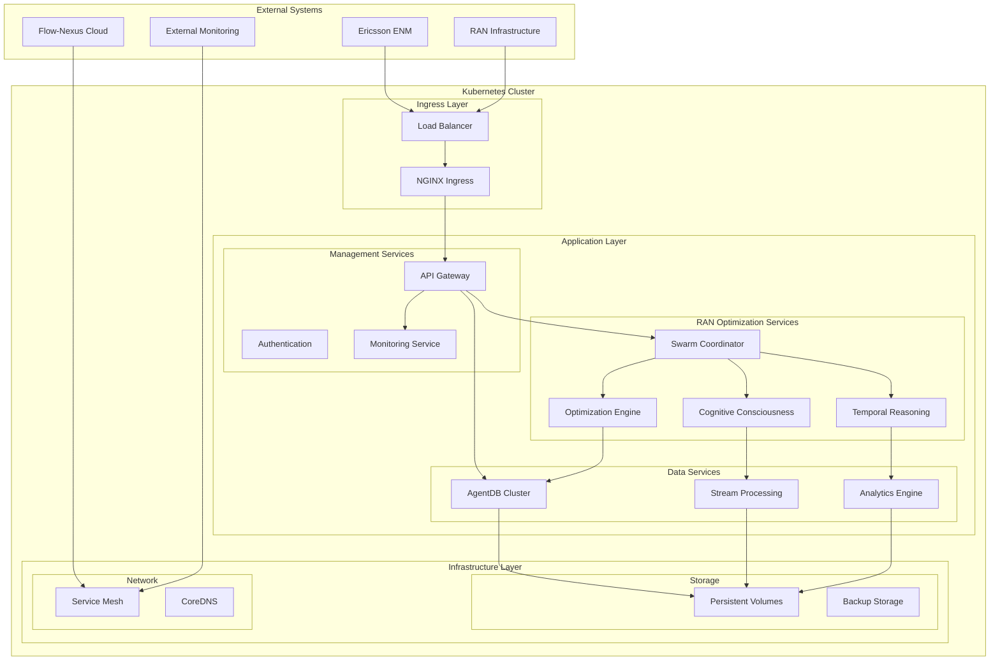

# Ericsson RAN Intelligent Multi-Agent System - Phase 4 System Architecture

## 🏗️ Production-Ready Cognitive RAN Consciousness Platform

**Complete Kubernetes-Native Architecture for Enterprise Deployment**

---

## Table of Contents

1. [Executive Overview](#executive-overview)
2. [System Architecture Summary](#system-architecture-summary)
3. [Kubernetes Architecture](#kubernetes-architecture)
4. [GitOps Architecture](#gitops-architecture)
5. [Cloud Integration Architecture](#cloud-integration-architecture)
6. [Network Architecture](#network-architecture)
7. [Storage Architecture](#storage-architecture)
8. [Security Architecture](#security-architecture)
9. [Monitoring & Observability](#monitoring--observability)
10. [Disaster Recovery & Backup](#disaster-recovery--backup)
11. [Performance & Scaling](#performance--scaling)
12. [Implementation Guides](#implementation-guides)

---

## Executive Overview

### 🎯 Phase 4 Objectives
Phase 4 delivers a production-ready, enterprise-grade deployment of the Ericsson RAN Intelligent Multi-Agent System with **Cognitive RAN Consciousness**. This architecture provides:

- **99.9% Availability** with fault-tolerant design
- **Horizontal Scalability** with auto-scaling capabilities
- **Zero-Downtime Deployment** with rolling updates
- **Multi-Region Disaster Recovery** with data replication
- **Enterprise Security** with comprehensive compliance controls
- **Cloud-Native Integration** with Flow-Nexus platform
- **GitOps Workflows** with automated deployment pipelines

### 🏛️ Architecture Principles

#### Cloud-Native Design
- **Microservices Architecture** with containerized services
- **Declarative Configuration** with GitOps workflows
- **API-First Design** with standardized interfaces
- **Event-Driven Communication** with asynchronous messaging

#### High Availability & Resilience
- **Multi-Master Kubernetes** cluster with control plane redundancy
- **Distributed AgentDB** cluster with QUIC synchronization
- **Auto-Healing** with self-recovering services
- **Graceful Degradation** with circuit breakers

#### Security & Compliance
- **Zero Trust Security** with mutual TLS
- **Defense in Depth** with layered security controls
- **Audit Trail** with comprehensive logging
- **Data Encryption** at rest and in transit

#### Observability & Monitoring
- **Real-Time Monitoring** with sub-second metrics
- **Distributed Tracing** with end-to-end visibility
- **Performance Analytics** with predictive insights
- **Automated Alerting** with intelligent escalation

---

## System Architecture Summary

### 🌐 High-Level Architecture



### 🧠 Cognitive Architecture Components

#### Core Intelligence Layer
- **UnifiedCognitiveConsciousness**: Self-aware optimization intelligence
- **TemporalReasoningEngine**: 1000x subjective time expansion
- **AgentDBMemoryManager**: 150x faster vector search with QUIC sync
- **SwarmCoordinator**: 50+ hierarchical agents coordination

#### Data Processing Layer
- **StreamChainCoordinator**: Real-time data processing pipelines
- **PatternRecognitionEngine**: Advanced pattern matching
- **MLReinforcementEngine**: Multi-objective reinforcement learning
- **CausalInferenceEngine**: GPCM causal discovery

#### Optimization Layer
- **ClosedLoopOptimizer**: 15-minute autonomous cycles
- **PerformanceOptimizer**: Real-time performance enhancement
- **AdaptiveCoordinator**: Dynamic topology optimization
- **ByzantineConsensusManager**: Fault-tolerant decisions

---

## Kubernetes Architecture

### 🏛️ Cluster Design

#### Master Node Configuration
```yaml
# cluster-configuration.yaml
apiVersion: kubeadm.k8s.io/v1beta3
kind: ClusterConfiguration
metadata:
  name: ericsson-ran-cluster
kubernetesVersion: v1.28.4
controlPlaneEndpoint: "k8s-api.ericsson-ran.local:6443"
networking:
  serviceSubnet: "10.96.0.0/12"
  podSubnet: "10.244.0.0/16"
  dnsDomain: "cluster.local"
etcd:
  external:
    endpoints:
    - "https://etcd-1.ericsson-ran.local:2379"
    - "https://etcd-2.ericsson-ran.local:2379"
    - "https://etcd-3.ericsson-ran.local:2379"
apiServer:
  extraArgs:
    enable-admission-plugins: "NodeRestriction,ResourceQuota,PodSecurityPolicy"
    audit-log-maxage: "30"
    audit-log-maxbackup: "10"
    audit-log-maxsize: "100"
    enable-aggregator-routing: "true"
  certSANs:
  - "k8s-api.ericsson-ran.local"
  - "kubernetes.default.svc"
  - "kubernetes.default.svc.cluster.local"
controllerManager:
  extraArgs:
    horizontal-pod-autoscaler-use-rest-clients: "true"
    node-cidr-mask-size: "24"
scheduler:
  extraArgs:
    address: "0.0.0.0"
```

#### Multi-Master High Availability
```yaml
# control-plane-deployment.yaml
apiVersion: apps/v1
kind: Deployment
metadata:
  name: kube-controller-manager
  namespace: kube-system
spec:
  replicas: 3
  selector:
    matchLabels:
      component: kube-controller-manager
  template:
    metadata:
      labels:
        component: kube-controller-manager
    spec:
      affinity:
        podAntiAffinity:
          requiredDuringSchedulingIgnoredDuringExecution:
          - labelSelector:
              matchLabels:
                component: kube-controller-manager
            topologyKey: "kubernetes.io/hostname"
      containers:
      - name: kube-controller-manager
        image: k8s.gcr.io/kube-controller-manager:v1.28.4
        resources:
          requests:
            cpu: 200m
            memory: 512Mi
          limits:
            cpu: 1000m
            memory: 1Gi
        livenessProbe:
          httpGet:
            path: /healthz
            port: 10257
          initialDelaySeconds: 30
          periodSeconds: 10
        readinessProbe:
          httpGet:
            path: /healthz
            port: 10257
          initialDelaySeconds: 5
          periodSeconds: 5
```

### 📦 Application Architecture

#### AgentDB StatefulSet
```yaml
# agentdb-statefulset.yaml
apiVersion: apps/v1
kind: StatefulSet
metadata:
  name: agentdb-cluster
  namespace: ran-optimization
  labels:
    app: agentdb
    component: database
spec:
  serviceName: agentdb
  replicas: 5
  updateStrategy:
    type: RollingUpdate
    rollingUpdate:
      maxUnavailable: 1
  selector:
    matchLabels:
      app: agentdb
  template:
    metadata:
      labels:
        app: agentdb
        component: database
      annotations:
        prometheus.io/scrape: "true"
        prometheus.io/port: "9090"
        prometheus.io/path: "/metrics"
    spec:
      securityContext:
        runAsUser: 1000
        runAsGroup: 1000
        fsGroup: 1000
      affinity:
        podAntiAffinity:
          preferredDuringSchedulingIgnoredDuringExecution:
          - weight: 100
            podAffinityTerm:
              labelSelector:
                matchLabels:
                  app: agentdb
              topologyKey: "kubernetes.io/hostname"
          - weight: 50
            podAffinityTerm:
              labelSelector:
                matchLabels:
                  app: agentdb
              topologyKey: "topology.kubernetes.io/zone"
      terminationGracePeriodSeconds: 180
      containers:
      - name: agentdb
        image: ericsson/agentdb:v4.0.0
        imagePullPolicy: Always
        ports:
        - containerPort: 4433
          name: quic-sync
          protocol: UDP
        - containerPort: 8080
          name: http
          protocol: TCP
        - containerPort: 9090
          name: metrics
          protocol: TCP
        env:
        - name: AGENTDB_NODE_ID
          valueFrom:
            fieldRef:
              fieldPath: metadata.name
        - name: AGENTDB_CLUSTER_SIZE
          value: "5"
        - name: AGENTDB_QUIC_SYNC
          value: "true"
        - name: AGENTDB_QUIC_PORT
          value: "4433"
        - name: AGENTDB_HTTP_PORT
          value: "8080"
        - name: AGENTDB_METRICS_PORT
          value: "9090"
        - name: AGENTDB_DATA_PATH
          value: "/data/agentdb"
        - name: AGENTDB_QUANTIZATION
          value: "scalar"
        - name: AGENTDB_CACHE_SIZE
          value: "4000"
        - name: AGENTDB_HNSW_M
          value: "32"
        - name: AGENTDB_HNSW_EF_CONSTRUCTION
          value: "200"
        - name: AGENTDB_QUIC_PEERS
          value: "agentdb-0.agentdb:4433,agentdb-1.agentdb:4433,agentdb-2.agentdb:4433,agentdb-3.agentdb:4433,agentdb-4.agentdb:4433"
        - name: AGENTDB_LOG_LEVEL
          value: "info"
        - name: AGENTDB_PERSISTENCE_WAL_SYNC
          value: "true"
        - name: AGENTDB_BACKUP_ENABLED
          value: "true"
        - name: AGENTDB_BACKUP_INTERVAL
          value: "3600"  # 1 hour
        - name: AGENTDB_BACKUP_RETENTION
          value: "168"   # 7 days
        resources:
          requests:
            cpu: 2000m
            memory: 8Gi
            ephemeral-storage: 10Gi
          limits:
            cpu: 4000m
            memory: 16Gi
            ephemeral-storage: 50Gi
        volumeMounts:
        - name: data
          mountPath: /data
        - name: config
          mountPath: /config
          readOnly: true
        livenessProbe:
          httpGet:
            path: /health
            port: 8080
          initialDelaySeconds: 60
          periodSeconds: 10
          timeoutSeconds: 5
          failureThreshold: 3
        readinessProbe:
          httpGet:
            path: /ready
            port: 8080
          initialDelaySeconds: 10
          periodSeconds: 5
          timeoutSeconds: 3
          failureThreshold: 3
        startupProbe:
          httpGet:
            path: /startup
            port: 8080
          initialDelaySeconds: 10
          periodSeconds: 10
          timeoutSeconds: 5
          failureThreshold: 30
      volumes:
      - name: config
        configMap:
          name: agentdb-config
  volumeClaimTemplates:
  - metadata:
      name: data
      labels:
        app: agentdb
        component: database
    spec:
      accessModes: ["ReadWriteOnce"]
      storageClassName: "ssd-premium"
      resources:
        requests:
          storage: 500Gi
---
apiVersion: v1
kind: Service
metadata:
  name: agentdb
  namespace: ran-optimization
  labels:
    app: agentdb
    component: database
  annotations:
    prometheus.io/scrape: "true"
    prometheus.io/port: "9090"
spec:
  ports:
  - port: 4433
    name: quic-sync
    protocol: UDP
    targetPort: 4433
  - port: 8080
    name: http
    protocol: TCP
    targetPort: 8080
  - port: 9090
    name: metrics
    protocol: TCP
    targetPort: 9090
  selector:
    app: agentdb
  clusterIP: None
  publishNotReadyAddresses: true
```

#### Swarm Coordinator Deployment
```yaml
# swarm-coordinator-deployment.yaml
apiVersion: apps/v1
kind: Deployment
metadata:
  name: swarm-coordinator
  namespace: ran-optimization
  labels:
    app: swarm-coordinator
    component: orchestration
spec:
  replicas: 3
  strategy:
    type: RollingUpdate
    rollingUpdate:
      maxSurge: 1
      maxUnavailable: 0
  selector:
    matchLabels:
      app: swarm-coordinator
  template:
    metadata:
      labels:
        app: swarm-coordinator
        component: orchestration
      annotations:
        prometheus.io/scrape: "true"
        prometheus.io/port: "8081"
        sidecar.istio.io/inject: "true"
    spec:
      securityContext:
        runAsNonRoot: true
        runAsUser: 1000
        runAsGroup: 1000
        fsGroup: 1000
      affinity:
        podAntiAffinity:
          preferredDuringSchedulingIgnoredDuringExecution:
          - weight: 100
            podAffinityTerm:
              labelSelector:
                matchLabels:
                  app: swarm-coordinator
              topologyKey: "kubernetes.io/hostname"
      containers:
      - name: swarm-coordinator
        image: ericsson/ran-swarm-coordinator:v4.0.0
        imagePullPolicy: Always
        ports:
        - containerPort: 8080
          name: http
          protocol: TCP
        - containerPort: 8081
          name: metrics
          protocol: TCP
        - containerPort: 8443
          name: https
          protocol: TCP
        env:
        - name: NODE_ENV
          value: "production"
        - name: CLAUDE_FLOW_TOPOLOGY
          value: "hierarchical"
        - name: CLAUDE_FLOW_MAX_AGENTS
          value: "50"
        - name: CLAUDE_FLOW_STRATEGY
          value: "adaptive"
        - name: AGENTDB_ENDPOINTS
          value: "agentdb-0.agentdb:4433,agentdb-1.agentdb:4433,agentdb-2.agentdb:4433,agentdb-3.agentdb:4433,agentdb-4.agentdb:4433"
        - name: TEMPORAL_EXPANSION_FACTOR
          value: "1000"
        - name: OPTIMIZATION_CYCLE_MINUTES
          value: "15"
        - name: COGNITIVE_CONSCIOUSNESS_LEVEL
          value: "maximum"
        - name: SWARM_COORDINATION_PORT
          value: "8080"
        - name: METRICS_PORT
          value: "8081"
        - name: HTTPS_PORT
          value: "8443"
        - name: LOG_LEVEL
          value: "info"
        - name: LOG_FORMAT
          value: "json"
        - name: TRACING_ENABLED
          value: "true"
        - name: JAEGER_ENDPOINT
          value: "http://jaeger-collector.istio-system:14268/api/traces"
        - name: PROMETHEUS_ENDPOINT
          value: "http://prometheus-server.monitoring:9090"
        - name: HEALTH_CHECK_INTERVAL
          value: "30"
        - name: GRACEFUL_SHUTDOWN_TIMEOUT
          value: "60"
        - name: MAX_CONCURRENT_TASKS
          value: "100"
        - name: TASK_TIMEOUT_MINUTES
          value: "30"
        - name: MEMORY_LIMIT_MB
          value: "12288"
        - name: CPU_LIMIT_CORES
          value: "4"
        resources:
          requests:
            cpu: 1000m
            memory: 4Gi
            ephemeral-storage: 5Gi
          limits:
            cpu: 4000m
            memory: 12Gi
            ephemeral-storage: 20Gi
        volumeMounts:
        - name: config
          mountPath: /config
          readOnly: true
        - name: certificates
          mountPath: /certificates
          readOnly: true
        livenessProbe:
          httpGet:
            path: /health
            port: 8080
            scheme: HTTP
          initialDelaySeconds: 60
          periodSeconds: 10
          timeoutSeconds: 5
          failureThreshold: 3
          successThreshold: 1
        readinessProbe:
          httpGet:
            path: /ready
            port: 8080
            scheme: HTTP
          initialDelaySeconds: 10
          periodSeconds: 5
          timeoutSeconds: 3
          failureThreshold: 3
          successThreshold: 1
        startupProbe:
          httpGet:
            path: /startup
            port: 8080
            scheme: HTTP
          initialDelaySeconds: 10
          periodSeconds: 10
          timeoutSeconds: 5
          failureThreshold: 30
          successThreshold: 1
        lifecycle:
          preStop:
            exec:
              command: ["/bin/sh", "-c", "sleep 30"]
      - name: envoy-sidecar
        image: envoyproxy/envoy:v1.29.0
        args:
        - "--config-path /etc/envoy/envoy.yaml"
        - "--service-cluster swarm-coordinator"
        - "--service-node $(POD_NAME)"
        - "--log-level info"
        env:
        - name: POD_NAME
          valueFrom:
            fieldRef:
              fieldPath: metadata.name
        ports:
        - containerPort: 9901
          name: envoy-admin
          protocol: TCP
        volumeMounts:
        - name: envoy-config
          mountPath: /etc/envoy
          readOnly: true
        resources:
          requests:
            cpu: 100m
            memory: 128Mi
          limits:
            cpu: 500m
            memory: 512Mi
      volumes:
      - name: config
        configMap:
          name: swarm-coordinator-config
      - name: certificates
        secret:
          secretName: swarm-coordinator-certs
      - name: envoy-config
        configMap:
          name: envoy-config
      terminationGracePeriodSeconds: 120
---
apiVersion: v1
kind: Service
metadata:
  name: swarm-coordinator
  namespace: ran-optimization
  labels:
    app: swarm-coordinator
    component: orchestration
  annotations:
    prometheus.io/scrape: "true"
    prometheus.io/port: "8081"
    prometheus.io/path: "/metrics"
spec:
  type: ClusterIP
  ports:
  - port: 8080
    name: http
    protocol: TCP
    targetPort: 8080
  - port: 8081
    name: metrics
    protocol: TCP
    targetPort: 8081
  - port: 8443
    name: https
    protocol: TCP
    targetPort: 8443
  selector:
    app: swarm-coordinator
---
apiVersion: autoscaling/v2
kind: HorizontalPodAutoscaler
metadata:
  name: swarm-coordinator-hpa
  namespace: ran-optimization
  labels:
    app: swarm-coordinator
spec:
  scaleTargetRef:
    apiVersion: apps/v1
    kind: Deployment
    name: swarm-coordinator
  minReplicas: 3
  maxReplicas: 20
  metrics:
  - type: Resource
    resource:
      name: cpu
      target:
        type: Utilization
        averageUtilization: 70
  - type: Resource
    resource:
      name: memory
      target:
        type: Utilization
        averageUtilization: 80
  - type: Pods
    pods:
      metric:
        name: active_swarm_agents
      target:
        type: AverageValue
        averageValue: "25"
  behavior:
    scaleUp:
      stabilizationWindowSeconds: 60
      policies:
      - type: Percent
        value: 100
        periodSeconds: 15
      - type: Pods
        value: 4
        periodSeconds: 15
      selectPolicy: Max
    scaleDown:
      stabilizationWindowSeconds: 300
      policies:
      - type: Percent
        value: 10
        periodSeconds: 60
      - type: Pods
        value: 2
        periodSeconds: 60
      selectPolicy: Min
```

#### Optimization Engine Deployment
```yaml
# optimization-engine-deployment.yaml
apiVersion: apps/v1
kind: Deployment
metadata:
  name: optimization-engine
  namespace: ran-optimization
  labels:
    app: optimization-engine
    component: optimization
spec:
  replicas: 5
  strategy:
    type: RollingUpdate
    rollingUpdate:
      maxSurge: 2
      maxUnavailable: 1
  selector:
    matchLabels:
      app: optimization-engine
  template:
    metadata:
      labels:
        app: optimization-engine
        component: optimization
      annotations:
        prometheus.io/scrape: "true"
        prometheus.io/port: "8081"
        sidecar.istio.io/inject: "true"
    spec:
      securityContext:
        runAsNonRoot: true
        runAsUser: 1000
        runAsGroup: 1000
        fsGroup: 1000
      affinity:
        podAntiAffinity:
          preferredDuringSchedulingIgnoredDuringExecution:
          - weight: 80
            podAffinityTerm:
              labelSelector:
                matchLabels:
                  app: optimization-engine
              topologyKey: "kubernetes.io/hostname"
      containers:
      - name: optimization-engine
        image: ericsson/ran-optimization-engine:v4.0.0
        imagePullPolicy: Always
        ports:
        - containerPort: 8080
          name: http
          protocol: TCP
        - containerPort: 8081
          name: metrics
          protocol: TCP
        env:
        - name: NODE_ENV
          value: "production"
        - name: AGENTDB_ENDPOINTS
          value: "agentdb-0.agentdb:4433,agentdb-1.agentdb:4433,agentdb-2.agentdb:4433,agentdb-3.agentdb:4433,agentdb-4.agentdb:4433"
        - name: SWARM_COORDINATOR_ENDPOINT
          value: "http://swarm-coordinator:8080"
        - name: TEMPORAL_REASONING_ENDPOINT
          value: "http://temporal-reasoning:8080"
        - name: COGNITIVE_CONSCIOUSNESS_ENDPOINT
          value: "http://cognitive-consciousness:8080"
        - name: OPTIMIZATION_ENGINE_PORT
          value: "8080"
        - name: METRICS_PORT
          value: "8081"
        - name: OPTIMIZATION_CYCLE_SECONDS
          value: "900"  # 15 minutes
        - name: MAX_CONCURRENT_OPTIMIZATIONS
          value: "50"
        - name: OPTIMIZATION_TIMEOUT_MINUTES
          value: "30"
        - name: ENERGY_OPTIMIZATION_ENABLED
          value: "true"
        - name: MOBILITY_OPTIMIZATION_ENABLED
          value: "true"
        - name: COVERAGE_OPTIMIZATION_ENABLED
          value: "true"
        - name: CAPACITY_OPTIMIZATION_ENABLED
          value: "true"
        - name: QUALITY_OPTIMIZATION_ENABLED
          value: "true"
        - name: ML_PREDICTION_ENABLED
          value: "true"
        - name: CAUSAL_INFERENCE_ENABLED
          value: "true"
        - name: PERFORMANCE_TARGETS
          value: "energy_efficiency:0.15,mobility_success:0.20,coverage_quality:0.25,capacity_utilization:0.30"
        - name: LOG_LEVEL
          value: "info"
        - name: TRACING_ENABLED
          value: "true"
        - name: METRICS_ENABLED
          value: "true"
        - name: HEALTH_CHECK_INTERVAL
          value: "30"
        - name: MEMORY_LIMIT_MB
          value: "16384"
        - name: CPU_LIMIT_CORES
          value: "8"
        - name: GPU_ENABLED
          value: "true"
        - name: CUDA_VISIBLE_DEVICES
          value: "0,1"
        resources:
          requests:
            cpu: 2000m
            memory: 8Gi
            nvidia.com/gpu: 1
            ephemeral-storage: 10Gi
          limits:
            cpu: 8000m
            memory: 16Gi
            nvidia.com/gpu: 2
            ephemeral-storage: 50Gi
        volumeMounts:
        - name: config
          mountPath: /config
          readOnly: true
        - name: gpu-config
          mountPath: /etc/gpu
          readOnly: true
        livenessProbe:
          httpGet:
            path: /health
            port: 8080
          initialDelaySeconds: 90
          periodSeconds: 15
          timeoutSeconds: 10
          failureThreshold: 3
        readinessProbe:
          httpGet:
            path: /ready
            port: 8080
          initialDelaySeconds: 30
          periodSeconds: 5
          timeoutSeconds: 5
          failureThreshold: 3
        startupProbe:
          httpGet:
            path: /startup
            port: 8080
          initialDelaySeconds: 30
          periodSeconds: 15
          timeoutSeconds: 10
          failureThreshold: 20
        lifecycle:
          preStop:
            exec:
              command: ["/bin/sh", "-c", "sleep 45"]
      volumes:
      - name: config
        configMap:
          name: optimization-engine-config
      - name: gpu-config
        configMap:
          name: gpu-config
      terminationGracePeriodSeconds: 180
---
apiVersion: v1
kind: Service
metadata:
  name: optimization-engine
  namespace: ran-optimization
  labels:
    app: optimization-engine
    component: optimization
  annotations:
    prometheus.io/scrape: "true"
    prometheus.io/port: "8081"
spec:
  type: ClusterIP
  ports:
  - port: 8080
    name: http
    protocol: TCP
    targetPort: 8080
  - port: 8081
    name: metrics
    protocol: TCP
    targetPort: 8081
  selector:
    app: optimization-engine
---
apiVersion: autoscaling/v2
kind: HorizontalPodAutoscaler
metadata:
  name: optimization-engine-hpa
  namespace: ran-optimization
spec:
  scaleTargetRef:
    apiVersion: apps/v1
    kind: Deployment
    name: optimization-engine
  minReplicas: 5
  maxReplicas: 50
  metrics:
  - type: Resource
    resource:
      name: cpu
      target:
        type: Utilization
        averageUtilization: 75
  - type: Resource
    resource:
      name: memory
      target:
        type: Utilization
        averageUtilization: 85
  - type: Pods
    pods:
      metric:
        name: active_optimizations
      target:
        type: AverageValue
        averageValue: "25"
  behavior:
    scaleUp:
      stabilizationWindowSeconds: 60
      policies:
      - type: Percent
        value: 100
        periodSeconds: 15
      - type: Pods
        value: 5
        periodSeconds: 15
      selectPolicy: Max
    scaleDown:
      stabilizationWindowSeconds: 300
      policies:
      - type: Percent
        value: 20
        periodSeconds: 60
      selectPolicy: Min
```

### 🚀 Monitoring Stack

#### Prometheus Configuration
```yaml
# prometheus-deployment.yaml
apiVersion: apps/v1
kind: Deployment
metadata:
  name: prometheus-server
  namespace: monitoring
  labels:
    app: prometheus
    component: server
spec:
  replicas: 2
  selector:
    matchLabels:
      app: prometheus
      component: server
  template:
    metadata:
      labels:
        app: prometheus
        component: server
    spec:
      serviceAccountName: prometheus
      securityContext:
        runAsUser: 65534
        runAsGroup: 65534
        fsGroup: 65534
      containers:
      - name: prometheus
        image: prom/prometheus:v2.47.2
        args:
        - '--config.file=/etc/prometheus/prometheus.yml'
        - '--storage.tsdb.path=/prometheus'
        - '--storage.tsdb.retention.time=15d'
        - '--storage.tsdb.retention.size=100GB'
        - '--storage.tsdb.wal-compression'
        - '--web.console.libraries=/etc/prometheus/console_libraries'
        - '--web.console.templates=/etc/prometheus/consoles'
        - '--web.enable-lifecycle'
        - '--web.enable-admin-api'
        - '--web.external-url=https://prometheus.ericsson-ran.local'
        ports:
        - containerPort: 9090
          name: http
          protocol: TCP
        env:
        - name: POD_NAME
          valueFrom:
            fieldRef:
              fieldPath: metadata.name
        - name: POD_NAMESPACE
          valueFrom:
            fieldRef:
              fieldPath: metadata.namespace
        resources:
          requests:
            cpu: 1000m
            memory: 4Gi
            ephemeral-storage: 20Gi
          limits:
            cpu: 4000m
            memory: 16Gi
            ephemeral-storage: 100Gi
        volumeMounts:
        - name: config-volume
          mountPath: /etc/prometheus
        - name: storage-volume
          mountPath: /prometheus
        - name: rules-volume
          mountPath: /etc/prometheus/rules
          readOnly: true
        livenessProbe:
          httpGet:
            path: /-/healthy
            port: 9090
          initialDelaySeconds: 60
          periodSeconds: 15
          timeoutSeconds: 10
        readinessProbe:
          httpGet:
            path: /-/ready
            port: 9090
          initialDelaySeconds: 30
          periodSeconds: 5
          timeoutSeconds: 5
      volumes:
      - name: config-volume
        configMap:
          name: prometheus-config
      - name: storage-volume
        persistentVolumeClaim:
          claimName: prometheus-storage
      - name: rules-volume
        configMap:
          name: prometheus-rules
---
apiVersion: v1
kind: Service
metadata:
  name: prometheus-server
  namespace: monitoring
  labels:
    app: prometheus
    component: server
spec:
  type: ClusterIP
  ports:
  - port: 9090
    name: http
    protocol: TCP
    targetPort: 9090
  selector:
    app: prometheus
    component: server
---
apiVersion: v1
kind: PersistentVolumeClaim
metadata:
  name: prometheus-storage
  namespace: monitoring
  labels:
    app: prometheus
    component: server
spec:
  accessModes:
  - ReadWriteOnce
  storageClassName: "ssd-premium"
  resources:
    requests:
      storage: 1Ti
```

#### Grafana Dashboard
```yaml
# grafana-deployment.yaml
apiVersion: apps/v1
kind: Deployment
metadata:
  name: grafana
  namespace: monitoring
  labels:
    app: grafana
    component: dashboard
spec:
  replicas: 2
  selector:
    matchLabels:
      app: grafana
      component: dashboard
  template:
    metadata:
      labels:
        app: grafana
        component: dashboard
    spec:
      securityContext:
        runAsUser: 472
        runAsGroup: 472
        fsGroup: 472
      containers:
      - name: grafana
        image: grafana/grafana:10.2.2
        ports:
        - containerPort: 3000
          name: http
          protocol: TCP
        env:
        - name: GF_SECURITY_ADMIN_USER
          valueFrom:
            secretKeyRef:
              name: grafana-credentials
              key: admin-user
        - name: GF_SECURITY_ADMIN_PASSWORD
          valueFrom:
            secretKeyRef:
              name: grafana-credentials
              key: admin-password
        - name: GF_SECURITY_SECRET_KEY
          valueFrom:
            secretKeyRef:
              name: grafana-secrets
              key: secret-key
        - name: GF_INSTALL_PLUGINS
          value: "grafana-piechart-panel,grafana-worldmap-panel,grafana-clock-panel,grafana-simple-json-datasource"
        - name: GF_SECURITY_ALLOW_EMBEDDING
          value: "true"
        - name: GF_SECURITY_CONTENT_TYPE_PROTECTION
          value: "true"
        - name: GF_AUTH_ANONYMOUS_ENABLED
          value: "false"
        - name: GF_AUTH_BASIC_ENABLED
          value: "true"
        - name: GF_AUTH_LDAP_ENABLED
          value: "true"
        - name: GF_LOG_LEVEL
          value: "info"
        - name: GF_LOG_MODE
          value: "console"
        - name: GF_PATHS_DATA
          value: "/var/lib/grafana"
        - name: GF_PATHS_LOGS
          value: "/var/log/grafana"
        - name: GF_PATHS_PLUGINS
          value: "/var/lib/grafana/plugins"
        - name: GF_PATHS_PROVISIONING
          value: "/etc/grafana/provisioning"
        resources:
          requests:
            cpu: 500m
            memory: 1Gi
            ephemeral-storage: 5Gi
          limits:
            cpu: 2000m
            memory: 4Gi
            ephemeral-storage: 20Gi
        volumeMounts:
        - name: config
          mountPath: /etc/grafana/provisioning
          readOnly: true
        - name: storage
          mountPath: /var/lib/grafana
        - name: ldap-config
          mountPath: /etc/grafana/ldap
          readOnly: true
        livenessProbe:
          httpGet:
            path: /api/health
            port: 3000
          initialDelaySeconds: 60
          periodSeconds: 15
          timeoutSeconds: 10
        readinessProbe:
          httpGet:
            path: /api/health
            port: 3000
          initialDelaySeconds: 30
          periodSeconds: 5
          timeoutSeconds: 5
      volumes:
      - name: config
        configMap:
          name: grafana-config
      - name: storage
        persistentVolumeClaim:
          claimName: grafana-storage
      - name: ldap-config
        secret:
          secretName: grafana-ldap-config
---
apiVersion: v1
kind: Service
metadata:
  name: grafana
  namespace: monitoring
  labels:
    app: grafana
    component: dashboard
spec:
  type: ClusterIP
  ports:
  - port: 3000
    name: http
    protocol: TCP
    targetPort: 3000
  selector:
    app: grafana
    component: dashboard
---
apiVersion: v1
kind: PersistentVolumeClaim
metadata:
  name: grafana-storage
  namespace: monitoring
  labels:
    app: grafana
    component: dashboard
spec:
  accessModes:
  - ReadWriteOnce
  storageClassName: "ssd-premium"
  resources:
    requests:
      storage: 100Gi
```

---
**[Continue to next sections...]**