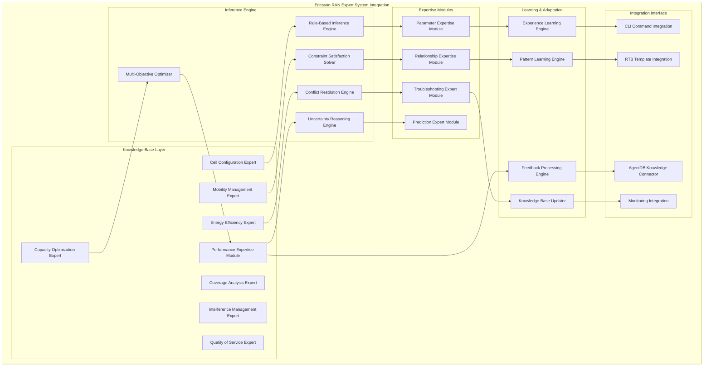

# Ericsson RAN Expert System Integration - Architecture Design

## Overview

The Ericsson RAN Expert System Integration layer provides intelligent, knowledge-based decision making for RAN configuration optimization. This system incorporates deep Ericsson RAN expertise across multiple domains including cell configuration, mobility management, capacity planning, energy efficiency, and performance optimization.

## Expert System Architecture



## Component 1: Knowledge Base Layer

### 1.1 Cell Configuration Expert

```typescript
interface CellConfigurationExpert {
  // Core cell configuration expertise
  getOptimalCellParameters: (cellContext: CellContext) -> Promise<CellConfiguration>;
  validateCellConfiguration: (config: CellConfiguration, context: ValidationContext) -> Promise<ConfigurationValidation>;
  optimizeCellParameters: (config: CellConfiguration, goals: OptimizationGoal[]) -> Promise<OptimizedCellConfiguration>;
  detectConfigurationAnomalies: (config: CellConfiguration, performanceData: PerformanceData) -> Promise<ConfigurationAnomaly[]>;

  // Advanced cell optimization
  optimizeAntennaParameters: (antennaConfig: AntennaConfiguration, environment: EnvironmentData) -> Promise<OptimizedAntennaConfig>;
  optimizePowerParameters: (powerConfig: PowerConfiguration, coverageGoals: CoverageGoal[]) -> Promise<OptimizedPowerConfig>;
  optimizeFrequencyParameters: (frequencyConfig: FrequencyConfiguration, interferenceData: InterferenceData) -> Promise<OptimizedFrequencyConfig>;

  // Cell-specific troubleshooting
  troubleshootCoverageIssues: (coverageData: CoverageData, complaints: ServiceComplaint[]) -> Promise<CoverageTroubleshootingResult>;
  troubleshootCapacityIssues: (capacityData: CapacityData, trafficDemand: TrafficDemand) -> Promise<CapacityTroubleshootingResult>;
  troubleshootQualityIssues: (qualityData: QualityData, kpiTargets: KPITarget[]) -> Promise<QualityTroubleshootingResult>;
}

interface CellContext {
  cellId: string;
  cellType: CellType;
  technology: '4G' | '5G' | '4G5G_Interop';
  environmentType: EnvironmentType;
  location: GeographicLocation;
  antennaConfiguration: AntennaConfiguration;
  currentConfiguration: CellConfiguration;
  performanceHistory: PerformanceHistory;
  neighborCells: NeighborCell[];
  trafficPatterns: TrafficPattern[];
}

interface CellConfiguration {
  basicParameters: BasicCellParameters;
  antennaParameters: AntennaParameters;
  powerParameters: PowerParameters;
  frequencyParameters: FrequencyParameters;
  mobilityParameters: MobilityParameters;
  qualityParameters: QualityParameters;
  featureParameters: FeatureParameters[];
  customParameters: CustomParameter[];
}

interface BasicCellParameters {
  cellId: string;
  physicalCellId: number;
  trackingAreaCode: number;
  eNodeBId: string;
  sectorId: string;
  cellName: string;
  cellIndividualOffset: number;
  qRxLevMin: number;
  qQualMin: number;
  pMax: number;
  referenceSignalPower: number;
}

interface AntennaParameters {
  antennaId: string;
  antennaGain: number;
  electricalTilt: number;
  mechanicalTilt: number;
  azimuth: number;
  height: number;
  beamWidth: BeamWidth;
  polarization: PolarizationType;
  antennaPattern: AntennaPattern;
}

interface ConfigurationValidation {
  isValid: boolean;
  validationErrors: ConfigurationError[];
  validationWarnings: ConfigurationWarning[];
  recommendations: ConfigurationRecommendation[];
  complianceScore: number;
  bestPracticeAlignment: BestPracticeAlignment[];
}

interface ConfigurationAnomaly {
  id: string;
  type: AnomalyType;
  severity: AnomalySeverity;
  description: string;
  affectedParameters: string[];
  detectedValue: any;
  expectedValue: any;
  impactAssessment: ImpactAssessment;
  recommendedAction: RecommendedAction;
  confidence: number;
}
```

### 1.2 Mobility Management Expert

```typescript
interface MobilityManagementExpert {
  // Handover optimization expertise
  optimizeHandoverParameters: (mobilityContext: MobilityContext) -> Promise<HandoverOptimization>;
  validateHandoverConfiguration: (config: HandoverConfiguration, performanceData: HandoverPerformanceData) -> Promise<HandoverValidation>;
  predictHandoverPerformance: (config: HandoverConfiguration, trafficForecast: TrafficForecast) -> Promise<HandoverPerformancePrediction>;

  // Neighbor relationship management
  optimizeNeighborRelations: (neighborContext: NeighborContext) -> Promise<NeighborRelationOptimization>;
  validateNeighborRelations: (relations: NeighborRelation[], performanceData: NeighborPerformanceData) -> Promise<NeighborValidation>;
  detectNeighborAnomalies: (relations: NeighborRelation[], kpiData: NeighborKPIData) -> Promise<NeighborAnomaly[]>;

  // Mobility robustness optimization
  optimizeMobilityRobustness: (mroContext: MROContext) -> Promise<MROOptimization>;
  analyzeMobilityIssues: (mobilityData: MobilityData, complaints: MobilityComplaint[]) -> Promise<MobilityIssueAnalysis>;
  predictMobilityTrends: (historicalData: HistoricalMobilityData, context: MobilityContext) -> Promise<MobilityTrendPrediction>;
}

interface MobilityContext {
  servingCell: CellReference;
  neighborCells: NeighborCell[];
  handoverPerformance: HandoverPerformanceMetrics;
  trafficData: MobilityTrafficData;
  environmentData: MobilityEnvironmentData;
  userBehaviorData: UserBehaviorData;
  networkTopology: NetworkTopology;
}

interface HandoverOptimization {
  optimizedParameters: OptimizedHandoverParameters;
  expectedImprovements: HandoverImprovementPrediction;
  implementationPlan: HandoverImplementationPlan;
  riskAssessment: HandoverRiskAssessment;
  monitoringRecommendations: HandoverMonitoringRecommendation[];
}

interface OptimizedHandoverParameters {
  hysteresisValues: HysteresisValue[];
  timeToTriggerValues: TimeToTriggerValue[];
  offsetValues: OffsetValue[];
  cellIndividualOffsets: CellIndividualOffset[];
  handoverMargins: HandoverMargin[];
  eventTriggers: HandoverEventTrigger[];
}

interface HandoverImprovementPrediction {
  handoverSuccessRate: MetricImprovement;
  pingPongReduction: MetricImprovement;
  callDropReduction: MetricImprovement;
  throughputImprovement: MetricImprovement;
  latencyImprovement: MetricImprovement;
  userExperienceImprovement: UserExperienceImprovement;
}

interface NeighborRelationOptimization {
  optimizedNeighborRelations: OptimizedNeighborRelation[];
  newNeighborRelations: NewNeighborRelation[];
  removedNeighborRelations: RemovedNeighborRelation[];
  relationPrioritization: NeighborRelationPrioritization;
  expectedBenefits: NeighborRelationBenefits;
}

interface OptimizedNeighborRelation {
  sourceCell: string;
  targetCell: string;
  relationType: NeighborRelationType;
  priority: NeighborRelationPriority;
  handoverParameters: HandoverParameters;
  performancePrediction: NeighborPerformancePrediction;
}
```

### 1.3 Capacity Optimization Expert

```typescript
interface CapacityOptimizationExpert {
  // Capacity planning and analysis
  analyzeCurrentCapacity: (capacityContext: CapacityContext) -> Promise<CapacityAnalysis>;
  forecastCapacityNeeds: (capacityContext: CapacityContext, forecastPeriod: Duration) -> Promise<CapacityForecast>;
  optimizeCapacityConfiguration: (capacityConfig: CapacityConfiguration, goals: CapacityOptimizationGoal[]) -> Promise<OptimizedCapacityConfiguration>;

  // Resource optimization
  optimizeResourceAllocation: (resourceContext: ResourceContext) -> Promise<ResourceAllocationOptimization>;
  optimizeLoadBalancing: (loadBalancingContext: LoadBalancingContext) -> Promise<LoadBalancingOptimization>;
  optimizeCarrierAggregation: (caContext: CarrierAggregationContext) -> Promise<CarrierAggregationOptimization>;

  // Advanced capacity features
  optimizeMassiveMIMO: (mimoContext: MassiveMIMOContext) -> Promise<MassiveMIMOOptimization>;
  optimizeBeamforming: (beamformingContext: BeamformingContext) -> Promise<BeamformingOptimization>;
  optimizeDynamicSpectrumSharing: (dssContext: DynamicSpectrumSharingContext) -> Promise<DynamicSpectrumSharingOptimization];
}

interface CapacityContext {
  cellReference: CellReference;
  currentCapacity: CurrentCapacityMetrics;
  trafficDemand: TrafficDemandMetrics;
  userDistribution: UserDistributionMetrics;
  serviceMix: ServiceMixMetrics;
  qosRequirements: QoSRequirements[];
  resourceUtilization: ResourceUtilizationMetrics;
  performanceKPIs: CapacityPerformanceKPIs;
}

interface CapacityAnalysis {
  currentUtilization: CapacityUtilizationAnalysis;
  bottlenecks: CapacityBottleneck[];
  opportunities: CapacityOptimizationOpportunity[];
  growthProjection: CapacityGrowthProjection;
  investmentRequirements: CapacityInvestmentRequirements;
  riskAssessment: CapacityRiskAssessment;
}

interface CapacityOptimizationGoal {
  goalType: CapacityOptimizationGoalType;
  targetValue: number;
  priority: GoalPriority;
  constraints: OptimizationConstraint[];
  timeFrame: Duration;
  businessImpact: BusinessImpact;
}

enum CapacityOptimizationGoalType {
  INCREASE_THROUGHPUT = 'increase_throughput',
  IMPROVE_COVERAGE = 'improve_coverage',
  REDUCE_CONGESTION = 'reduce_congestion',
  IMPROVE_USER_EXPERIENCE = 'improve_user_experience',
  REDUCE_OPEX = 'reduce_opex',
  MAXIMIZE_REVENUE = 'maximize_revenue'
}

interface OptimizedCapacityConfiguration {
  cellConfiguration: OptimizedCellConfiguration;
  carrierConfiguration: OptimizedCarrierConfiguration;
  resourceConfiguration: OptimizedResourceConfiguration;
  featureConfiguration: OptimizedFeatureConfiguration;
  expectedBenefits: CapacityOptimizationBenefits;
  implementationPhases: ImplementationPhase[];
}
```

### 1.4 Energy Efficiency Expert

```typescript
interface EnergyEfficiencyExpert {
  // Energy consumption analysis
  analyzeEnergyConsumption: (energyContext: EnergyContext) -> Promise<EnergyConsumptionAnalysis>;
  identifyEnergySavingOpportunities: (energyContext: EnergyContext) -> Promise<EnergySavingOpportunity[]>;
  optimizeEnergyEfficiency: (energyConfig: EnergyConfiguration, goals: EnergyEfficiencyGoal[]) -> Promise<OptimizedEnergyConfiguration>;

  // Advanced energy saving features
  optimizeSleepModeConfiguration: (sleepModeContext: SleepModeContext) -> Promise<SleepModeOptimization>;
  optimizeCellZooming: (cellZoomingContext: CellZoomingContext) -> Promise<CellZoomingOptimization>;
  optimizeAdaptiveMIMO: (adaptiveMIMOContext: AdaptiveMIMOContext) -> Promise<AdaptiveMIMOOptimization];

  // Green network features
  optimizeRenewableEnergyIntegration: (renewableContext: RenewableEnergyContext) -> Promise<RenewableEnergyOptimization>;
  optimizeBatteryStorage: (batteryContext: BatteryStorageContext) -> Promise<BatteryStorageOptimization>;
  optimizeSmartGridIntegration: (smartGridContext: SmartGridContext) -> Promise<SmartGridOptimization>;
}

interface EnergyContext {
  cellReference: CellReference;
  currentEnergyConsumption: EnergyConsumptionMetrics;
  trafficPatterns: EnergyTrafficPatterns;
  environmentalConditions: EnvironmentalConditions;
  powerSupplyConfiguration: PowerSupplyConfiguration;
  energyContracts: EnergyContract[];
  carbonFootprint: CarbonFootprintMetrics;
  costStructure: EnergyCostStructure;
}

interface EnergyConsumptionAnalysis {
  totalConsumption: TotalEnergyConsumption;
  consumptionBreakdown: EnergyConsumptionBreakdown;
  consumptionPatterns: EnergyConsumptionPattern[];
  efficiencyMetrics: EnergyEfficiencyMetrics;
  costAnalysis: EnergyCostAnalysis;
  carbonAnalysis: CarbonAnalysis;
  benchmarking: EnergyBenchmarking[];
}

interface EnergySavingOpportunity {
  id: string;
  type: EnergySavingOpportunityType;
  description: string;
  potentialSavings: PotentialEnergySavings;
  implementationRequirements: ImplementationRequirements;
  costBenefitAnalysis: CostBenefitAnalysis;
  riskAssessment: EnergySavingRiskAssessment;
  priority: OpportunityPriority;
  timeToImplement: Duration;
}

enum EnergySavingOpportunityType {
  SLEEP_MODE_ACTIVATION = 'sleep_mode_activation',
  CELL_ZOOMING = 'cell_zooming',
  ADAPTIVE_MIMO = 'adaptive_mimo',
  DYNAMIC_POWER_CONTROL = 'dynamic_power_control',
  COOLING_OPTIMIZATION = 'cooling_optimization',
  RENEWABLE_ENERGY_INTEGRATION = 'renewable_energy_integration'
}

interface SleepModeOptimization {
  sleepModeStrategy: SleepModeStrategy;
  activationCriteria: SleepModeActivationCriteria[];
  deactivationCriteria: SleepModeDeactivationCriteria[];
  cellZoningPlan: CellZoningPlan;
  performanceImpact: SleepModePerformanceImpact;
  energySavings: SleepModeEnergySavings;
  implementationPlan: SleepModeImplementationPlan;
}
```

## Component 2: Inference Engine

### 2.1 Rule-Based Inference Engine

```typescript
interface RuleBasedInferenceEngine {
  // Core inference capabilities
  applyRules: (facts: Fact[], rules: ExpertRule[], context: InferenceContext) -> Promise<InferenceResult>;
  resolveConflicts: (conflictingRules: ExpertRule[], context: ConflictResolutionContext) -> Promise<ConflictResolution>;
  optimizeRuleExecution: (rules: ExpertRule[], facts: Fact[]) -> Promise<OptimizedRuleExecution>;

  // Advanced reasoning
  performForwardChaining: (initialFacts: Fact[], rules: ExpertRule[]) -> Promise<ForwardChainingResult>;
  performBackwardChaining: (goal: Goal, rules: ExpertRule[], facts: Fact[]) -> Promise<BackwardChainingResult>;
  performUncertainReasoning: (facts: UncertainFact[], rules: UncertainRule[]) -> Promise<UncertainReasoningResult>;

  // Rule management
  validateRules: (rules: ExpertRule[]) -> Promise<RuleValidationResult>;
  optimizeRules: (rules: ExpertRule[], performanceData: RulePerformanceData[]) -> Promise<OptimizedRules>;
  learnNewRules: (examples: RuleExample[], domainKnowledge: DomainKnowledge) -> Promise<LearnedRule[]>;
}

interface ExpertRule {
  id: string;
  name: string;
  description: string;
  category: RuleCategory;
  priority: RulePriority;
  confidence: number;
  condition: RuleCondition;
  action: RuleAction;
  exceptions: RuleException[];
  metadata: RuleMetadata;
  lastValidated: Date;
  usageStatistics: RuleUsageStatistics;
}

interface RuleCondition {
  type: ConditionType;
  operator: LogicalOperator;
  operands: ConditionOperand[];
  constraints: ConditionConstraint[];
  temporalConstraints: TemporalConstraint[];
  contextConstraints: ContextConstraint[];
  uncertainty: UncertaintyLevel;
}

interface RuleAction {
  type: ActionType;
  parameterAdjustments: ParameterAdjustment[];
  commandGeneration: CommandGenerationAction[];
  validationChecks: ValidationCheckAction[];
  notifications: NotificationAction[];
  learningActions: LearningAction[];
}

interface InferenceResult {
  conclusions: Conclusion[];
  derivedFacts: DerivedFact[];
  appliedRules: AppliedRule[];
  confidenceScores: ConfidenceScore[];
  reasoningPath: ReasoningPath[];
  alternativeConclusions: AlternativeConclusion[];
  uncertaintyAnalysis: UncertaintyAnalysis;
}

interface Conclusion {
  id: string;
  statement: string;
  confidence: number;
  supportingFacts: Fact[];
  supportingRules: AppliedRule[];
  conflictingEvidence: ConflictingEvidence[];
  implications: ConclusionImplication[];
  recommendations: ConclusionRecommendation[];
}
```

### 2.2 Constraint Satisfaction Solver

```typescript
interface ConstraintSatisfactionSolver {
  // Core solving capabilities
  solveConstraints: (variables: Variable[], constraints: Constraint[], domain: Domain) -> Promise<Solution>;
  findOptimalSolution: (variables: Variable[], constraints: Constraint[], objectives: Objective[]) -> Promise<OptimalSolution>;
  generateAllSolutions: (variables: Variable[], constraints: Constraint[]) -> Promise<Solution[]>;

  // Advanced solving techniques
  applyHeuristics: (problem: ConstraintProblem, heuristics: Heuristic[]) -> Promise<HeuristicApplicationResult>;
  performLocalSearch: (initialSolution: Solution, neighborhood: NeighborhoodFunction) -> Promise<LocalSearchResult>;
  applyMetaheuristics: (problem: ConstraintProblem, metaheuristic: Metaheuristic) -> Promise<MetaheuristicResult>;

  // Constraint management
  analyzeConstraintComplexity: (constraints: Constraint[]) -> Promise<ComplexityAnalysis>;
  optimizeConstraintNetwork: (constraints: Constraint[]) -> Promise<OptimizedConstraintNetwork>;
  detectConstraintConflicts: (constraints: Constraint[]) -> Promise<ConstraintConflict[]>;
}

interface Constraint {
  id: string;
  name: string;
  type: ConstraintType;
  variables: VariableReference[];
  relation: ConstraintRelation;
  parameters: ConstraintParameter[];
  priority: ConstraintPriority;
  isHard: boolean;
  relaxationStrategy: RelaxationStrategy;
  metadata: ConstraintMetadata;
}

enum ConstraintType {
  EQUALITY = 'equality',
  INEQUALITY = 'inequality',
  ARITHMETIC = 'arithmetic',
  LOGICAL = 'logical',
  TEMPORAL = 'temporal',
  SPATIAL = 'spatial',
  RESOURCE = 'resource',
  PERFORMANCE = 'performance'
}

interface Solution {
  variableAssignments: VariableAssignment[];
  objectiveValue: number;
  constraintSatisfaction: ConstraintSatisfaction;
  feasibility: FeasibilityAssessment;
  qualityMetrics: SolutionQualityMetrics;
  computationTime: Duration;
  solvingMethod: SolvingMethod;
}

interface OptimalSolution extends Solution {
  optimalityProof: OptimalityProof;
  sensitivityAnalysis: SensitivityAnalysis[];
  tradeoffAnalysis: TradeoffAnalysis[];
  paretoFrontier: ParetoFrontierPoint[];
  robustnessAnalysis: RobustnessAnalysis;
}
```

### 2.3 Multi-Objective Optimizer

```typescript
interface MultiObjectiveOptimizer {
  // Core optimization capabilities
  optimizeMultipleObjectives: (objectives: Objective[], constraints: Constraint[], decisionVariables: DecisionVariable[]) -> Promise<ParetoOptimalSolutions>;
  findCompromiseSolution: (paretoSolutions: ParetoOptimalSolutions, preferences: DecisionMakerPreferences) -> Promise<CompromiseSolution>;
  performSensitivityAnalysis: (solution: Solution, objectives: Objective[]) -> Promise<SensitivityAnalysisResult>;

  // Advanced optimization techniques
  applyEvolutionaryAlgorithms: (problem: MultiObjectiveProblem, algorithm: EvolutionaryAlgorithm) -> Promise<EvolutionaryResult>;
  applySwarmIntelligence: (problem: MultiObjectiveProblem, algorithm: SwarmIntelligenceAlgorithm) -> Promise<SwarmIntelligenceResult>;
  applyMathematicalProgramming: (problem: MultiObjectiveProblem, algorithm: MathematicalProgrammingAlgorithm) -> Promise<MathematicalProgrammingResult>;

  // Decision support
  generateDecisionRecommendations: (paretoSolutions: ParetoOptimalSolutions, context: DecisionContext) -> Promise<DecisionRecommendation[]>;
  visualizeTradeoffs: (paretoSolutions: ParetoOptimalSolutions) -> Promise<TradeoffVisualization>;
  explainOptimizationResults: (solutions: ParetoOptimalSolutions) -> Promise<OptimizationExplanation>;
}

interface Objective {
  id: string;
  name: string;
  type: ObjectiveType;
  direction: OptimizationDirection;
  targetValue?: number;
  weight: number;
  priority: ObjectivePriority;
  function: ObjectiveFunction;
  constraints: ObjectiveConstraint[];
  uncertainty: ObjectiveUncertainty;
}

enum ObjectiveType {
  THROUGHPUT_MAXIMIZATION = 'throughput_maximization',
  LATENCY_MINIMIZATION = 'latency_minimization',
  COVERAGE_MAXIMIZATION = 'coverage_maximization',
  ENERGY_MINIMIZATION = 'energy_minimization',
  CAPACITY_MAXIMIZATION = 'capacity_maximization',
  QUALITY_MAXIMIZATION = 'quality_maximization',
  COST_MINIMIZATION = 'cost_minimization'
}

interface ParetoOptimalSolutions {
  solutions: ParetoOptimalSolution[];
  paretoFront: ParetoFront;
  convergenceMetrics: ConvergenceMetrics;
  diversityMetrics: DiversityMetrics;
  hypervolume: HypervolumeMetric;
  generationStatistics: GenerationStatistics;
}

interface ParetoOptimalSolution {
  decisionVariables: DecisionVariableAssignment[];
  objectiveValues: ObjectiveValue[];
  rank: ParetoRank;
  crowdingDistance: CrowdingDistance;
  dominanceCount: number;
  dominatedSolutions: string[];
  feasibility: FeasibilityStatus;
  robustness: RobustnessMetrics;
}
```

## Component 3: Expertise Modules

### 3.1 Parameter Expertise Module

```typescript
interface ParameterExpertiseModule {
  // Parameter recommendation and optimization
  recommendParameterValues: (parameterContext: ParameterContext) -> Promise<ParameterRecommendation[]>;
  optimizeParameterSettings: (parameters: Parameter[], goals: OptimizationGoal[]) -> Promise<OptimizedParameters>;
  validateParameterSettings: (parameters: Parameter[], context: ValidationContext) -> Promise<ParameterValidationResult>;

  // Parameter relationship analysis
  analyzeParameterDependencies: (parameters: Parameter[]) -> Promise<ParameterDependencyAnalysis>;
  detectParameterConflicts: (parameters: Parameter[]) -> Promise<ParameterConflict[]>;
  resolveParameterConflicts: (conflicts: ParameterConflict[], resolutionStrategy: ConflictResolutionStrategy) -> Promise<ParameterConflictResolution>;

  // Advanced parameter expertise
  learnOptimalParameterSettings: (historicalData: HistoricalParameterData, performanceData: PerformanceData) -> Promise<LearnedParameterSettings>;
  generateParameterTuningStrategies: (goals: TuningGoal[], constraints: TuningConstraint[]) -> Promise<ParameterTuningStrategy[]>;
  predictParameterImpact: (parameterChanges: ParameterChange[], context: ImpactPredictionContext) -> Promise<ParameterImpactPrediction>;
}

interface ParameterContext {
  cellReference: CellReference;
  technology: TechnologyType;
  environment: EnvironmentType;
  currentParameters: CurrentParameterSettings;
  performanceData: CurrentPerformanceData;
  trafficConditions: TrafficConditions;
  optimizationGoals: OptimizationGoal[];
  constraints: ParameterConstraint[];
}

interface ParameterRecommendation {
  parameterName: string;
  recommendedValue: any;
  currentValue: any;
  changeReason: ParameterChangeReason;
  expectedImpact: ParameterImpact;
  confidence: number;
  supportingEvidence: SupportingEvidence[];
  alternativeValues: AlternativeParameterValue[];
  implementationComplexity: ImplementationComplexity;
  rollbackRequirements: RollbackRequirements;
}

interface ParameterImpact {
  performanceImpact: PerformanceParameterImpact;
  resourceImpact: ResourceParameterImpact;
  businessImpact: BusinessParameterImpact;
  userExperienceImpact: UserExperienceParameterImpact;
  networkImpact: NetworkParameterImpact;
  riskAssessment: ParameterRiskAssessment;
}

interface ParameterDependencyAnalysis {
  directDependencies: DirectParameterDependency[];
  indirectDependencies: IndirectParameterDependency[];
  dependencyGroups: ParameterDependencyGroup[];
  criticalParameters: CriticalParameter[];
  dependencyGraph: ParameterDependencyGraph;
  optimizationOpportunities: ParameterOptimizationOpportunity[];
}
```

### 3.2 Performance Expertise Module

```typescript
interface PerformanceExpertiseModule {
  // Performance analysis and prediction
  analyzeCurrentPerformance: (performanceContext: PerformanceContext) -> Promise<PerformanceAnalysis>;
  predictFuturePerformance: (performanceContext: PerformanceContext, changes: ProposedChange[]) -> Promise<PerformancePrediction>;
  identifyPerformanceBottlenecks: (performanceData: PerformanceData) -> Promise<PerformanceBottleneck[]>;

  // Performance optimization
  optimizePerformanceSettings: (performanceContext: PerformanceContext, goals: PerformanceGoal[]) -> Promise<PerformanceOptimization>;
  generatePerformanceImprovementPlans: (bottlenecks: PerformanceBottleneck[], constraints: OptimizationConstraint[]) -> Promise<PerformanceImprovementPlan[]>;
  validatePerformanceOptimizations: (optimizations: PerformanceOptimization[], expectedImpact: ExpectedImpact) -> Promise<PerformanceOptimizationValidation>;

  // Advanced performance expertise
  correlatePerformanceWithConfiguration: (performanceData: PerformanceData, configurationData: ConfigurationData) -> Promise<PerformanceConfigurationCorrelation>;
  learnPerformancePatterns: (historicalData: HistoricalPerformanceData) -> Promise<LearnedPerformancePattern[]];
  generatePerformanceBenchmarks: (cellContext: CellContext, industryBenchmarks: IndustryBenchmark[]) -> Promise<CellPerformanceBenchmark>;
}

interface PerformanceContext {
  cellReference: CellReference;
  timeRange: TimeRange;
  kpiData: KPIData;
  counters: PerformanceCounters;
  alarms: AlarmData;
  callDetailRecords: CallDetailRecord[];
  userEquipmentData: UserEquipmentData[];
  networkConditions: NetworkConditions;
  environmentalFactors: EnvironmentalFactor[];
}

interface PerformanceAnalysis {
  overallAssessment: OverallPerformanceAssessment;
  kpiAnalysis: KPIAnalysis[];
  trendAnalysis: PerformanceTrendAnalysis[];
  comparativeAnalysis: ComparativePerformanceAnalysis[];
  bottleneckAnalysis: PerformanceBottleneckAnalysis[];
  rootCauseAnalysis: PerformanceRootCauseAnalysis[];
  improvementPotential: PerformanceImprovementPotential;
}

interface PerformanceBottleneck {
  id: string;
  type: BottleneckType;
  severity: BottleneckSeverity;
  description: string;
  affectedKPIs: KPIReference[];
  contributingFactors: ContributingFactor[];
  impactAssessment: BottleneckImpactAssessment;
  recommendedActions: RecommendedAction[];
  implementationPriority: ImplementationPriority;
  expectedImprovement: ExpectedImprovement;
}

interface PerformanceOptimization {
  optimizationId: string;
  optimizationType: PerformanceOptimizationType;
  description: string;
  targetBottlenecks: BottleneckReference[];
  configurationChanges: ConfigurationChange[];
  expectedBenefits: ExpectedOptimizationBenefits;
  implementationPlan: OptimizationImplementationPlan;
  riskAssessment: OptimizationRiskAssessment;
  monitoringRequirements: OptimizationMonitoringRequirements;
}
```

## Component 4: Learning & Adaptation

### 4.1 Experience Learning Engine

```typescript
interface ExperienceLearningEngine {
  // Experience capture and storage
  captureOperationalExperience: (operation: OperationalExperience) -> Promise<ExperienceCaptureResult>;
  storeExperienceInKnowledgeBase: (experience: CapturedExperience) -> Promise<ExperienceStorageResult>;
  updateExpertiseFromExperience: (experience: CapturedExperience) -> Promise<ExpertiseUpdateResult>;

  // Experience analysis and learning
  analyzeExperiencePatterns: (experiences: CapturedExperience[]) -> Promise<ExperiencePatternAnalysis>;
  learnFromSuccesses: (successfulExperiences: SuccessfulExperience[]) -> Promise<SuccessLearningResult>;
  learnFromFailures: (failedExperiences: FailedExperience[]) -> Promise<FailureLearningResult>;

  // Knowledge refinement
  refineRulesFromExperience: (rules: ExpertRule[], experiences: CapturedExperience[]) -> Promise<RefinedRules>;
  improveParameterRecommendations: (parameterRecommendations: ParameterRecommendation[], experiences: CapturedExperience[]) -> Promise<ImprovedParameterRecommendations>;
  updateConfidenceScores: (expertiseItems: ExpertiseItem[], performanceData: PerformanceData) -> Promise<UpdatedExpertiseItems>;
}

interface OperationalExperience {
  id: string;
  timestamp: Date;
  operationType: OperationType;
  context: OperationContext;
  decisions: OperationalDecision[];
  outcomes: OperationOutcome[];
  performanceMetrics: PerformanceMetrics;
  userFeedback: UserFeedback[];
  environmentalConditions: EnvironmentalConditions;
  lessonsLearned: LessonsLearned[];
}

interface OperationalDecision {
  decisionId: string;
  decisionType: DecisionType;
  context: DecisionContext;
  reasoning: DecisionReasoning;
  alternativesConsidered: AlternativeConsidered[];
  chosenAlternative: ChosenAlternative;
  confidence: number;
  expertiseSource: ExpertiseSource;
}

interface OperationOutcome {
  outcomeId: string;
  outcomeType: OutcomeType;
  successCriteria: SuccessCriteria[];
  actualResults: ActualResults;
  unexpectedConsequences: UnexpectedConsequence[];
  performanceImpact: PerformanceImpact;
  businessImpact: BusinessImpact;
  userImpact: UserImpact;
}

interface ExperiencePatternAnalysis {
  patterns: ExperiencePattern[];
  correlations: ExperienceCorrelation[];
  causalRelationships: CausalRelationship[];
  predictiveModels: PredictiveModel[];
  improvementOpportunities: ImprovementOpportunity[];
  knowledgeGaps: KnowledgeGap[];
}
```

### 4.2 Pattern Learning Engine

```typescript
interface PatternLearningEngine {
  // Pattern discovery and recognition
  discoverPatterns: (data: OperationalData[], patternTypes: PatternType[]) -> Promise<DiscoveredPattern[]>;
  recognizePatterns: (currentSituation: CurrentSituation, knownPatterns: KnownPattern[]) -> Promise<RecognizedPattern[]>;
  validatePatterns: (patterns: DiscoveredPattern[], validationData: ValidationData) -> Promise<PatternValidationResult>;

  // Pattern analysis and classification
  classifyPatterns: (patterns: DiscoveredPattern[], classificationScheme: PatternClassificationScheme) -> Promise<ClassifiedPattern[]>;
  analyzePatternEvolution: (patterns: PatternHistory[]) -> Promise<PatternEvolutionAnalysis>;
  comparePatterns: (pattern1: Pattern, pattern2: Pattern) -> Promise<PatternComparisonResult>;

  // Pattern application and adaptation
  applyPatternsToNewSituations: (newSituation: NewSituation, applicablePatterns: ApplicablePattern[]) -> Promise<PatternApplicationResult>;
  adaptPatterns: (patterns: ExistingPattern[], newContext: AdaptationContext) -> Promise<AdaptedPattern[]>;
  generatePatternRecommendations: (situation: Situation, patterns: Pattern[]) -> Promise<PatternRecommendation[]>;
}

interface DiscoveredPattern {
  id: string;
  name: string;
  description: string;
  patternType: PatternType;
  conditions: PatternCondition[];
  outcomes: PatternOutcome[];
  frequency: PatternFrequency;
  confidence: number;
  supportingData: SupportingData[];
  discoveredAt: Date;
  discoveredBy: PatternDiscoveryMethod;
  validationStatus: PatternValidationStatus;
}

interface PatternCondition {
  conditionId: string;
  parameterName: string;
  operator: ComparisonOperator;
  value: any;
  weight: number;
  necessity: NecessityLevel;
  uncertainty: UncertaintyLevel;
}

interface PatternOutcome {
  outcomeId: string;
  outcomeType: OutcomeType;
  probability: number;
  impact: OutcomeImpact;
  duration: OutcomeDuration;
  dependencies: OutcomeDependency[];
  confidence: number;
}

interface PatternApplicationResult {
  appliedPatterns: AppliedPattern[];
  applicationSuccess: boolean;
  predictedOutcomes: PredictedOutcome[];
  confidenceAssessment: ConfidenceAssessment;
  alternativeApplications: AlternativeApplication[];
  learningOpportunities: LearningOpportunity[];
}
```

## Component 5: Integration Interface

### 5.1 CLI Command Integration

```typescript
interface CLICommandIntegration {
  // Command generation from expertise
  generateCLICommandsFromRecommendations: (recommendations: ExpertRecommendation[]) -> Promise<cmeditCommand[]>;
  optimizeCLICommandsWithExpertise: (commands: cmeditCommand[], expertiseContext: ExpertiseContext) -> Promise<OptimizedCommand[]>;
  validateCLICommandsWithExpertRules: (commands: cmeditCommand[], expertRules: ExpertRule[]) -> Promise<CommandValidationResult>;

  // Expertise-driven command optimization
  applyExpertParameterOptimization: (commands: cmeditCommand[], parameterExpertise: ParameterExpertise) -> Promise<ExpertOptimizedCommands>;
  incorporateSafetyRecommendations: (commands: cmeditCommand[], safetyExpertise: SafetyExpertise) -> Promise<SafetyEnhancedCommands>;
  addPerformanceOptimizations: (commands: cmeditCommand[], performanceExpertise: PerformanceExpertise) -> Promise<PerformanceOptimizedCommands>;

  // Command execution monitoring
  monitorCommandExecutionWithExpertise: (executionData: CommandExecutionData, expertiseContext: ExpertiseContext) -> Promise<ExpertMonitoringResult>;
  analyzeExecutionResults: (results: CommandExecutionResult, expectedResults: ExpectedResults) -> Promise<ExecutionAnalysisResult>;
  learnFromExecutionOutcomes: (executionData: ExecutionData, outcomes: ExecutionOutcome[]) -> Promise<ExecutionLearningResult>;
}

interface ExpertiseContext {
  expertiseDomain: ExpertiseDomain[];
  currentConditions: CurrentConditions;
  optimizationGoals: OptimizationGoal[];
  constraints: ExpertiseConstraint[];
  confidenceRequirements: ConfidenceRequirement[];
  learningEnabled: boolean;
}

interface ExpertOptimizedCommands {
  originalCommands: cmeditCommand[];
  optimizedCommands: cmeditCommand[];
  optimizationApplied: ExpertOptimization[];
  expectedImprovements: ExpectedCommandImprovement[];
  riskAssessment: CommandRiskAssessment[];
  implementationNotes: ImplementationNote[];
}

interface ExpertOptimization {
  optimizationId: string;
  type: ExpertOptimizationType;
  description: string;
  sourceExpertise: ExpertiseSource;
  changesApplied: ChangeApplied[];
  expectedBenefit: ExpectedBenefit;
  confidence: number;
}
```

## Knowledge Representation

### Rule Base Structure

```typescript
interface ExpertRuleBase {
  domains: ExpertiseDomain[];
  rules: ExpertRule[];
  facts: Fact[];
  constraints: KnowledgeBaseConstraint[];
  metadata: KnowledgeBaseMetadata;
}

interface ExpertiseDomain {
  domainId: string;
  name: string;
  description: string;
  parentDomain?: string;
  subdomains: ExpertiseDomain[];
  rules: ExpertRule[];
  facts: DomainFact[];
  relationships: DomainRelationship[];
  expertiseLevel: ExpertiseLevel;
}

interface ExpertRule {
  ruleId: string;
  name: string;
  description: string;
  domain: string;
  priority: RulePriority;
  confidence: number;
  conditions: RuleCondition[];
  actions: RuleAction[];
  exceptions: RuleException[];
  metadata: RuleMetadata;
  validationStatus: RuleValidationStatus;
  lastUpdated: Date;
  usageStatistics: RuleUsageStatistics;
}
```

### Knowledge Storage and Retrieval

```typescript
interface KnowledgeStorage {
  storeKnowledge: (knowledge: Knowledge) -> Promise<StorageResult>;
  retrieveKnowledge: (query: KnowledgeQuery) -> Promise<Knowledge[]>;
  updateKnowledge: (knowledgeId: string, updates: KnowledgeUpdate) -> Promise<UpdateResult>;
  deleteKnowledge: (knowledgeId: string) -> Promise<DeletionResult>;
}

interface KnowledgeQuery {
  domain?: string;
  knowledgeType?: KnowledgeType;
  context?: QueryContext;
  constraints?: QueryConstraint[];
  relevanceCriteria?: RelevanceCriteria[];
  limit?: number;
  offset?: number;
}

interface Knowledge {
  knowledgeId: string;
  type: KnowledgeType;
  domain: string;
  content: KnowledgeContent;
  metadata: KnowledgeMetadata;
  relationships: KnowledgeRelationship[];
  validationStatus: ValidationStatus;
  confidence: number;
  createdAt: Date;
  updatedAt: Date;
}
```

This comprehensive Ericsson RAN Expert System Integration architecture provides intelligent, knowledge-based decision making for RAN configuration optimization. The system incorporates deep Ericsson RAN expertise across multiple domains and includes advanced learning capabilities to continuously improve from operational experience.