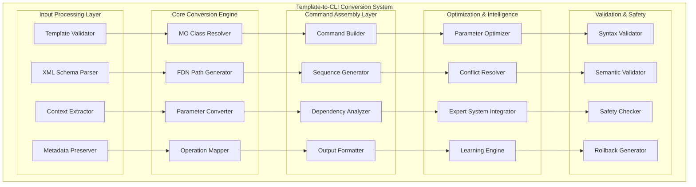

# Template-to-CLI Conversion System - Detailed Architecture

## Overview

The Template-to-CLI Conversion System is a critical component that transforms declarative RTB JSON templates into executable Ericsson ENM CLI commands (cmedit). This system bridges the gap between high-level configuration intent and low-level network commands while preserving semantic meaning and operational safety.

## System Architecture



## Component 1: Input Processing Layer

### 1.1 Template Validator

```typescript
interface TemplateValidator {
  validateTemplate: (template: RTBTemplate) => Promise<TemplateValidationResult>;
  checkSchemaCompliance: (template: RTBTemplate, schema: XMLSchema) -> Promise<SchemaComplianceResult>;
  validateBusinessRules: (template: RTBTemplate) -> Promise<BusinessRuleValidationResult>;
  extractValidationMetadata: (template: RTBTemplate) -> ValidationMetadata;
}

interface TemplateValidationResult {
  isValid: boolean;
  structuralErrors: StructuralError[];
  semanticErrors: SemanticError[];
  warnings: ValidationWarning[];
  suggestions: ImprovementSuggestion[];
  complianceScore: number;
  validationMetadata: ValidationMetadata;
}

interface StructuralError {
  errorCode: string;
  message: string;
  location: TemplateLocation;
  severity: 'error' | 'warning' | 'info';
  suggestedFix: string;
  affectedComponents: string[];
}

interface TemplateLocation {
  templateId: string;
  section: string;
  path: string;
  line?: number;
  column?: number;
}
```

### 1.2 XML Schema Parser

```typescript
interface XMLSchemaParser {
  parseMPnhSchema: (schemaContent: string) -> Promise<ParsedXMLSchema>;
  extractMOClassDefinitions: (schema: ParsedXMLSchema) -> MOClassDefinition[];
  buildTypeMapping: (schema: ParsedXMLSchema) -> TypeMapping;
  generateValidationRules: (schema: ParsedXMLSchema) -> ValidationRule[];
}

interface ParsedXMLSchema {
  targetNamespace: string;
  elementFormDefault: string;
  complexTypes: ComplexTypeDefinition[];
  simpleTypes: SimpleTypeDefinition[];
  elementDeclarations: ElementDeclaration[];
  attributeGroups: AttributeGroup[];
}

interface MOClassDefinition {
  className: string;
  baseClass?: string;
  attributes: MOAttributeDefinition[];
  relationships: MORelationshipDefinition[];
  constraints: MOConstraintDefinition[];
  documentation: string[];
}

interface MOAttributeDefinition {
  name: string;
  type: string;
  minOccurs: number;
  maxOccurs: string;
  use?: 'optional' | 'required' | 'prohibited';
  defaultValue?: string;
  fixedValue?: string;
  documentation: string;
  enumerationValues?: string[];
  pattern?: string;
}
```

### 1.3 Context Extractor

```typescript
interface ContextExtractor {
  extractNetworkContext: (template: RTBTemplate) -> NetworkContext;
  extractOperationalContext: (template: RTBTemplate) -> OperationalContext;
  extractTemporalContext: (template: RTBTemplate) -> TemporalContext;
  extractBusinessContext: (template: RTBTemplate) -> BusinessContext;
}

interface NetworkContext {
  networkTopology: NetworkTopology;
  technologyType: '4G' | '5G' | '4G5G_Interop';
  frequencyBands: FrequencyBand[];
  cellTypes: CellType[];
  neighborRelations: NeighborRelation[];
  capacityInformation: CapacityInformation;
}

interface OperationalContext {
  maintenanceWindow: MaintenanceWindow;
  serviceImpact: ServiceImpactAssessment;
  rollbackCapability: RollbackCapability;
  operatorExpertise: OperatorExpertiseLevel;
  environmentalConditions: EnvironmentalConditions;
}

interface TemporalContext {
  timeConstraints: TimeConstraint[];
  schedulingRequirements: SchedulingRequirement[];
  temporalDependencies: TemporalDependency[];
  seasonalConsiderations: SeasonalConsideration[];
}
```

## Component 2: Core Conversion Engine

### 2.1 MO Class Resolver

```typescript
interface MOClassResolver {
  resolveMOClass: (moReference: MOReference, schema: ParsedXMLSchema) -> Promise<ResolvedMOClass>;
  resolveInheritance: (moClass: MOClassDefinition) -> Promise<InheritanceChain>;
  resolveRelationships: (moClass: MOClassDefinition, context: ResolutionContext) -> Promise<ResolvedRelationship[]>;
  validateMOReference: (moReference: MOReference) -> Promise<MOReferenceValidation>;
}

interface ResolvedMOClass {
  className: string;
  namespace: string;
  inheritanceChain: InheritanceChain;
  resolvedAttributes: ResolvedAttribute[];
  resolvedRelationships: ResolvedRelationship[];
  constraints: ResolvedConstraint[];
  instantiationPattern: InstantiationPattern;
}

interface ResolvedAttribute {
  name: string;
  type: ResolvedType;
  value?: any;
  isRequired: boolean;
  isReadOnly: boolean;
  defaultValue?: any;
  validationRules: AttributeValidationRule[];
  sourceContext: AttributeSourceContext;
}

interface InstantiationPattern {
  pattern: string;
  variables: PatternVariable[];
  constraints: PatternConstraint[];
  examples: PatternExample[];
}
```

### 2.2 FDN Path Generator

```typescript
interface FDNPathGenerator {
  generateFDNPath: (moReference: MOReference, context: FDNContext) -> Promise<FDNPath>;
  validateFDNPath: (path: FDNPath) -> Promise<FDNValidationResult>;
  optimizeFDNPath: (path: FDNPath) -> Promise<OptimizedFDNPath>;
  generateFDNVariations: (path: FDNPath) -> Promise<FDNVariation[]>;
}

interface FDNPath {
  path: string;
  segments: FDNSegment[];
  isFullyQualified: boolean;
  namespace: string;
  metadata: FDNMetadata;
}

interface FDNSegment {
  name: string;
  type: SegmentType;
  value?: string;
  pattern?: string;
  isWildcard: boolean;
  attributes: SegmentAttributes;
}

interface SegmentType {
  name: string;
  namespace: string;
  pattern: string;
  validationRules: SegmentValidationRule[];
  examples: SegmentExample[];
}

interface FDNContext {
  subnetworkId: string;
  managedElementId: string;
  meContextId: string;
  nodeType: NodeType;
  resolutionHints: ResolutionHint[];
  namingConvention: NamingConvention;
}
```

### 2.3 Parameter Converter

```typescript
interface ParameterConverter {
  convertParameters: (rtbParameters: RTBParameter[], context: ConversionContext) -> Promise<ConvertedParameter[]>;
  applyTypeConversions: (parameters: RTBParameter[], typeMappings: TypeMapping) -> Promise<TypeConvertedParameter[]>;
  resolveParameterReferences: (parameters: RTBParameter[], referenceContext: ReferenceContext) -> Promise<ResolvedParameter[]>;
  optimizeParameterValues: (parameters: ConvertedParameter[], goals: OptimizationGoal[]) -> Promise<OptimizedParameter[]>;
}

interface ConvertedParameter {
  originalName: string;
  convertedName: string;
  value: any;
  type: ConvertedType;
  unit?: string;
  format: ParameterFormat;
  validation: ParameterValidation;
  source: ParameterSource;
  conversionMetadata: ConversionMetadata;
}

interface ConvertedType {
  name: string;
  category: TypeCategory;
  constraints: TypeConstraint[];
  format: TypeFormat;
  examples: TypeExample[];
}

interface ParameterFormat {
  stringFormat?: StringFormat;
  numericFormat?: NumericFormat;
  booleanFormat?: BooleanFormat;
  listFormat?: ListFormat;
  complexFormat?: ComplexFormat;
}

interface StringFormat {
  maxLength?: number;
  minLength?: number;
  pattern?: string;
  enumeration?: string[];
  caseSensitive: boolean;
  trimWhitespace: boolean;
}

interface NumericFormat {
  min?: number;
  max?: number;
  precision?: number;
  scale?: number;
  unit?: string;
  format: 'integer' | 'decimal' | 'scientific';
}
```

### 2.4 Operation Mapper

```typescript
interface OperationMapper {
  mapOperation: (templateAction: TemplateAction, context: MappingContext) -> Promise<MappedOperation>;
  resolveOperationType: (action: TemplateAction) -> Promise<OperationType>;
  generateCommandStructure: (operation: MappedOperation) -> Promise<CommandStructure>;
  validateOperationMapping: (mapping: OperationMapping) -> Promise<MappingValidationResult>;
}

interface MappedOperation {
  operationType: cmeditOperationType;
  targetPattern: string;
  parameters: MappedParameter[];
  options: CommandOption[];
  executionRequirements: ExecutionRequirement[];
  rollbackStrategy: RollbackStrategy;
}

interface CommandStructure {
  template: CommandTemplate;
  parameterBindings: ParameterBinding[];
  conditionalLogic: ConditionalLogic[];
  validationChecks: ValidationCheck[];
  errorHandling: ErrorHandlingStrategy;
}

interface CommandTemplate {
  baseCommand: string;
  targetPlaceholder: string;
  parameterPattern: string;
  optionPattern: string;
  formatTemplate: string;
}

interface ParameterBinding {
  sourceParameter: string;
  targetParameter: string;
  transformation: ParameterTransformation;
  validation: BindingValidation;
  defaultValue?: any;
}
```

## Component 3: Command Assembly Layer

### 3.1 Command Builder

```typescript
interface CommandBuilder {
  buildCommand: (mappedOperation: MappedOperation, context: BuildContext) -> Promise<cmeditCommand>;
  assembleCommandString: (command: cmeditCommand) -> Promise<string>;
  validateCommandStructure: (command: cmeditCommand) -> Promise<CommandValidationResult>;
  generateCommandDocumentation: (command: cmeditCommand) -> Promise<CommandDocumentation>;
}

interface BuildContext {
  targetEnvironment: TargetEnvironment;
  namingConventions: NamingConventions;
  formattingRules: FormattingRules;
  validationRules: BuildValidationRules[];
  optimizationHints: OptimizationHint[];
}

interface cmeditCommand {
  id: string;
  operation: cmeditOperationType;
  target: string;
  parameters: CommandParameter[];
  options: CommandOption[];
  commandString: string;
  metadata: CommandMetadata;
  validationResults: CommandValidationResult;
  rollbackCommand?: cmeditCommand;
}

interface CommandParameter {
  name: string;
  value: any;
  type: ParameterType;
  format: ParameterFormat;
  source: ParameterSource;
  validation: ParameterValidation;
  documentation: ParameterDocumentation;
}

interface CommandOption {
  name: string;
  value: any;
  description: string;
  isRequired: boolean;
  defaultValue?: any;
  conflictsWith: string[];
  dependsOn: string[];
}
```

### 3.2 Sequence Generator

```typescript
interface SequenceGenerator {
  generateExecutionSequence: (commands: cmeditCommand[], dependencies: CommandDependency[]) -> Promise<ExecutionSequence>;
  optimizeSequence: (sequence: ExecutionSequence, goals: OptimizationGoal[]) -> Promise<OptimizedSequence>;
  generateParallelGroups: (sequence: ExecutionSequence) -> Promise<ParallelGroup[]>;
  estimateExecutionTime: (sequence: ExecutionSequence) -> Promise<ExecutionTimeEstimate>;
}

interface ExecutionSequence {
  id: string;
  sequence: SequenceStep[];
  totalSteps: number;
  estimatedDuration: Duration;
  parallelismLevel: number;
  resourceRequirements: ResourceRequirement[];
  riskAssessment: SequenceRiskAssessment;
}

interface SequenceStep {
  id: string;
  commandId: string;
  stepNumber: number;
  dependencies: string[];
  estimatedDuration: Duration;
  resourceRequirements: ResourceRequirement;
  rollbackPlan: StepRollbackPlan;
  validationChecks: StepValidationCheck[];
}

interface ParallelGroup {
  id: string;
  name: string;
  commands: string[];
  maxConcurrency: number;
  resourceConstraints: ResourceConstraint[];
  synchronizationPoints: SynchronizationPoint[];
  estimatedDuration: Duration;
}
```

### 3.3 Dependency Analyzer

```typescript
interface DependencyAnalyzer {
  analyzeDependencies: (commands: cmeditCommand[]) -> Promise<DependencyAnalysisResult>;
  buildDependencyGraph: (dependencies: CommandDependency[]) -> Promise<DependencyGraph>;
  detectCircularDependencies: (graph: DependencyGraph) -> Promise<CircularDependencyResult>;
  optimizeDependencyResolution: (graph: DependencyGraph) -> Promise<OptimizedDependencyGraph>;
}

interface DependencyAnalysisResult {
  dependencies: CommandDependency[];
  dependencyGraph: DependencyGraph;
  circularDependencies: CircularDependency[];
  criticalPath: CriticalPath;
  optimizationOpportunities: OptimizationOpportunity[];
  dependencyMetrics: DependencyMetrics;
}

interface CommandDependency {
  id: string;
  sourceCommand: string;
  targetCommand: string;
  dependencyType: DependencyType;
  strength: DependencyStrength;
  condition: DependencyCondition;
  resolutionStrategy: ResolutionStrategy;
  metadata: DependencyMetadata;
}

interface DependencyCondition {
  parameterConditions: ParameterCondition[];
  stateConditions: StateCondition[];
  temporalConditions: TemporalCondition[];
  logicalOperator: LogicalOperator;
}

interface CriticalPath {
  path: string[];
  totalDuration: Duration;
  criticalDependencies: string[];
  bottlenecks: Bottleneck[];
  optimizationPotential: OptimizationPotential;
}
```

## Component 4: Optimization & Intelligence

### 4.1 Parameter Optimizer

```typescript
interface ParameterOptimizer {
  optimizeParameters: (parameters: ConvertedParameter[], context: OptimizationContext) -> Promise<OptimizedParameter[]>;
  applyExpertRules: (parameters: ConvertedParameter[], rules: ExpertRule[]) -> Promise<RuleOptimizedParameter[]>;
  performPredictiveOptimization: (parameters: ConvertedParameter[], predictions: PredictionData) -> Promise<PredictivelyOptimizedParameter[]>;
  validateOptimization: (original: ConvertedParameter[], optimized: OptimizedParameter[]) -> Promise<OptimizationValidationResult>;
}

interface OptimizationContext {
  goals: OptimizationGoal[];
  constraints: OptimizationConstraint[];
  networkConditions: NetworkConditions;
  performanceTargets: PerformanceTarget[];
  expertRecommendations: ExpertRecommendation[];
}

interface OptimizedParameter {
  originalParameter: ConvertedParameter;
  optimizedValue: any;
  optimizationReason: OptimizationReason;
  confidenceScore: number;
  expectedBenefits: ExpectedBenefits;
  potentialRisks: PotentialRisk[];
  rollbackValue: any;
}

interface OptimizationReason {
  type: OptimizationReasonType;
  description: string;
  supportingData: SupportingData[];
  expertSource: string;
  confidenceLevel: ConfidenceLevel;
}

enum OptimizationReasonType {
  EXPERT_RULE = 'expert_rule',
  PREDICTIVE_MODEL = 'predictive_model',
  HISTORICAL_ANALYSIS = 'historical_analysis',
  NETWORK_CONDITIONS = 'network_conditions',
  PERFORMANCE_TARGETS = 'performance_targets',
  COST_OPTIMIZATION = 'cost_optimization'
}
```

### 4.2 Conflict Resolver

```typescript
interface ConflictResolver {
  detectConflicts: (commands: cmeditCommand[]) -> Promise<ConflictDetectionResult>;
  analyzeConflictImpact: (conflicts: Conflict[]) -> Promise<ConflictImpactAnalysis>;
  resolveConflicts: (conflicts: Conflict[], resolutionStrategy: ConflictResolutionStrategy) -> Promise<ConflictResolutionResult>;
  validateConflictResolution: (resolution: ConflictResolution) -> Promise<ResolutionValidationResult>;
}

interface ConflictDetectionResult {
  conflicts: Conflict[];
  conflictCategories: ConflictCategory[];
  severityAssessment: ConflictSeverityAssessment;
  resolutionComplexity: ResolutionComplexity;
  recommendations: ConflictResolutionRecommendation[];
}

interface Conflict {
  id: string;
  type: ConflictType;
  involvedCommands: string[];
  conflictingParameters: ConflictingParameter[];
  severity: ConflictSeverity;
  description: string;
  detectionTime: Date;
  autoResolvable: boolean;
}

enum ConflictType {
  PARAMETER_CONFLICT = 'parameter_conflict',
  RESOURCE_CONFLICT = 'resource_conflict',
  TEMPORAL_CONFLICT = 'temporal_conflict',
  DEPENDENCY_CONFLICT = 'dependency_conflict',
  BUSINESS_RULE_CONFLICT = 'business_rule_conflict',
  SAFETY_CONFLICT = 'safety_conflict'
}

interface ConflictResolutionResult {
  resolvedConflicts: ResolvedConflict[];
  unresolvedConflicts: UnresolvedConflict[];
  resolutionStrategies: ResolutionStrategy[];
  modifications: CommandModification[];
  validationResults: ResolutionValidationResult[];
}
```

### 4.3 Expert System Integrator

```typescript
interface ExpertSystemIntegrator {
  consultExpertSystem: (query: ExpertQuery) -> Promise<ExpertConsultationResult>;
  applyExpertRecommendations: (commands: cmeditCommand[], recommendations: ExpertRecommendation[]) -> Promise<ExpertEnhancedCommand[]>;
  validateExpertAdvice: (advice: ExpertAdvice) -> Promise<ExpertAdviceValidation>;
  learnFromExpertFeedback: (feedback: ExpertFeedback) -> Promise<LearningResult>;
}

interface ExpertQuery {
  queryType: ExpertQueryType;
  context: ExpertContext;
  parameters: ExpertQueryParameter[];
  constraints: ExpertQueryConstraint[];
  priority: QueryPriority;
  deadline?: Date;
}

enum ExpertQueryType {
  PARAMETER_OPTIMIZATION = 'parameter_optimization',
  CONFIGURATION_VALIDATION = 'configuration_validation',
  PERFORMANCE_ANALYSIS = 'performance_analysis',
  TROUBLESHOOTING = 'troubleshooting',
  BEST_PRACTICES = 'best_practices',
  ANOMALY_DETECTION = 'anomaly_detection'
}

interface ExpertConsultationResult {
  consultationId: string;
  recommendations: ExpertRecommendation[];
  confidenceScore: number;
  reasoningChain: ReasoningStep[];
  supportingEvidence: SupportingEvidence[];
  alternativeOptions: AlternativeOption[];
  limitations: ExpertLimitation[];
}

interface ExpertRecommendation {
  id: string;
  type: RecommendationType;
  description: string;
  priority: RecommendationPriority;
  implementation: ImplementationGuidance;
  expectedOutcome: ExpectedOutcome;
  risksAndMitigations: RiskAndMitigation[];
  confidenceLevel: ConfidenceLevel;
}
```

## Component 5: Validation & Safety

### 5.1 Syntax Validator

```typescript
interface SyntaxValidator {
  validateSyntax: (command: cmeditCommand) -> Promise<SyntaxValidationResult>;
  checkCommandStructure: (command: cmeditCommand) -> Promise<CommandStructureValidationResult>;
  validateParameterSyntax: (parameters: CommandParameter[]) -> Promise<ParameterSyntaxValidationResult>;
  validateOptionSyntax: (options: CommandOption[]) -> Promise<OptionSyntaxValidationResult>;
}

interface SyntaxValidationResult {
  isValid: boolean;
  syntaxErrors: SyntaxError[];
  syntaxWarnings: SyntaxWarning[];
  suggestions: SyntaxImprovementSuggestion[];
  complianceScore: number;
  validationMetadata: SyntaxValidationMetadata;
}

interface SyntaxError {
  code: string;
  message: string;
  severity: 'error' | 'warning' | 'info';
  location: ErrorLocation;
  suggestedFix: string;
  examples: CorrectionExample[];
}

interface ErrorLocation {
  commandId: string;
  component: 'operation' | 'target' | 'parameter' | 'option';
  position?: number;
  context?: string;
}

interface CommandStructureValidationResult {
  structureValid: boolean;
  operationValid: boolean;
  targetValid: boolean;
  parameterCountValid: boolean;
  optionSyntaxValid: boolean;
  structuralErrors: StructuralSyntaxError[];
}
```

### 5.2 Semantic Validator

```typescript
interface SemanticValidator {
  validateSemantics: (command: cmeditCommand, context: ValidationContext) -> Promise<SemanticValidationResult>;
  checkBusinessRules: (command: cmeditCommand, rules: BusinessRule[]) -> Promise<BusinessRuleValidationResult>;
  validateParameterCoherence: (parameters: CommandParameter[]) -> Promise<ParameterCoherenceValidationResult>;
  checkOperationalSafety: (command: cmeditCommand, safetyRules: SafetyRule[]) -> Promise<SafetyValidationResult>;
}

interface SemanticValidationResult {
  isSemanticallyValid: boolean;
  semanticErrors: SemanticError[];
  semanticWarnings: SemanticWarning[];
  businessRuleViolations: BusinessRuleViolation[];
  safetyConcerns: SafetyConcern[];
  validationInsights: ValidationInsight[];
}

interface SemanticError {
  code: string;
  message: string;
  category: SemanticErrorCategory;
  severity: SemanticErrorSeverity;
  affectedParameters: string[];
  businessImpact: BusinessImpact;
  suggestedResolution: ResolutionSuggestion;
}

enum SemanticErrorCategory {
  PARAMETER_INCOHERENCE = 'parameter_incoherence',
  VIOLATES_BUSINESS_RULE = 'violates_business_rule',
  UNSAFE_OPERATION = 'unsafe_operation',
  RESOURCE_CONFLICT = 'resource_conflict',
  TEMPORAL_VIOLATION = 'temporal_violation',
  TECHNOLOGY_MISMATCH = 'technology_mismatch'
}

interface ValidationInsight {
  type: InsightType;
  description: string;
  confidence: number;
  supportingData: SupportingData[];
  recommendations: InsightRecommendation[];
  learningOpportunity: LearningOpportunity;
}
```

### 5.3 Safety Checker

```typescript
interface SafetyChecker {
  performSafetyCheck: (command: cmeditCommand, safetyContext: SafetyContext) -> Promise<SafetyCheckResult>;
  assessOperationalRisk: (command: cmeditCommand, riskContext: RiskContext) -> Promise<RiskAssessmentResult>;
  generateSafetyMeasures: (riskAssessment: RiskAssessmentResult) -> Promise<SafetyMeasure[]>;
  validateRollbackCapability: (command: cmeditCommand) -> Promise<RollbackCapabilityResult>;
}

interface SafetyCheckResult {
  isSafe: boolean;
  riskLevel: RiskLevel;
  identifiedRisks: IdentifiedRisk[];
  safetyMeasures: SafetyMeasure[];
  approvalRequirements: ApprovalRequirement[];
  monitoringRequirements: MonitoringRequirement[];
  rollbackRequirements: RollbackRequirement[];
}

interface IdentifiedRisk {
  id: string;
  type: RiskType;
  description: string;
  probability: ProbabilityLevel;
  impact: ImpactLevel;
  riskScore: number;
  mitigationStrategies: MitigationStrategy[];
  earlyWarningIndicators: EarlyWarningIndicator[];
}

enum RiskType {
  SERVICE_DISRUPTION = 'service_disruption',
  PERFORMANCE_DEGRADATION = 'performance_degradation',
  CONFIGURATION_ERROR = 'configuration_error',
  RESOURCE_EXHAUSTION = 'resource_exhaustion',
  SECURITY_VULNERABILITY = 'security_vulnerability',
  CAPACITY_OVERFLOW = 'capacity_overflow'
}

interface SafetyMeasure {
  id: string;
  type: SafetyMeasureType;
  description: string;
  implementation: ImplementationGuide;
  effectiveness: EffectivenessLevel;
  resourceRequirements: SafetyResourceRequirement[];
  monitoringIndicators: MonitoringIndicator[];
}
```

## Conversion Patterns and Templates

### Common Conversion Patterns

```typescript
interface ConversionPattern {
  id: string;
  name: string;
  description: string;
  category: PatternCategory;
  inputPattern: InputPattern;
  outputPattern: OutputPattern;
  transformationRules: TransformationRule[];
  examples: PatternExample[];
}

interface InputPattern {
  templateStructure: TemplateStructure;
  parameterPatterns: ParameterPattern[];
  constraintPatterns: ConstraintPattern[];
}

interface OutputPattern {
  commandStructure: CommandStructure;
  parameterMappings: ParameterMapping[];
  optionMappings: OptionMapping[];
}

interface TransformationRule {
  id: string;
  name: string;
  condition: TransformationCondition;
  action: TransformationAction;
  priority: number;
  applicabilityConditions: ApplicabilityCondition[];
}
```

### Template-to-CLI Mappings

```typescript
interface TemplateToCLIMapping {
  templateType: string;
  commandMappings: CommandMapping[];
  parameterMappings: ParameterMapping[];
  optionMappings: OptionMapping[];
  constraintMappings: ConstraintMapping[];
}

interface CommandMapping {
  templateAction: string;
  cmeditOperation: cmeditOperationType;
  targetPattern: string;
  parameterTemplate: string;
  optionTemplate: string;
  condition?: MappingCondition;
}

interface ParameterMapping {
  templateParameter: string;
  cmeditParameter: string;
  typeConversion: TypeConversionRule;
  valueTransformation: ValueTransformation;
  defaultValue?: any;
  validationRule: ValidationRule;
}

interface TypeConversionRule {
  sourceType: string;
  targetType: string;
  conversionFunction: string;
  validationRules: TypeValidationRule[];
  errorHandling: ErrorHandlingStrategy;
}
```

## Performance Optimization

### Caching Strategies

```typescript
interface ConversionCache {
  templateCache: TemplateCache;
  schemaCache: SchemaCache;
  patternCache: PatternCache;
  validationCache: ValidationCache;
}

interface TemplateCache {
  cacheKey: string;
  template: RTBTemplate;
  validationResult: TemplateValidationResult;
  conversionResult: ConversionResult;
  timestamp: Date;
  expiryTime: Date;
  accessCount: number;
}

interface CacheConfiguration {
  maxSize: number;
  evictionPolicy: EvictionPolicy;
  ttl: Duration;
  compressionEnabled: boolean;
  encryptionEnabled: boolean;
}
```

### Parallel Processing

```typescript
interface ParallelConversionEngine {
  parallelValidator: ParallelValidator;
  parallelConverter: ParallelConverter;
  parallelOptimizer: ParallelOptimizer;
  parallelValidator: ParallelValidator;
}

interface ParallelConversionTask {
  id: string;
  type: ConversionTaskType;
  input: ConversionTaskInput;
  dependencies: string[];
  priority: TaskPriority;
  estimatedDuration: Duration;
}

enum ConversionTaskType {
  TEMPLATE_VALIDATION = 'template_validation',
  SCHEMA_PARSING = 'schema_parsing',
  MO_RESOLUTION = 'mo_resolution',
  PARAMETER_CONVERSION = 'parameter_conversion',
  COMMAND_BUILDING = 'command_building',
  DEPENDENCY_ANALYSIS = 'dependency_analysis'
}
```

## Error Handling and Recovery

### Error Classification

```typescript
interface ConversionError {
  id: string;
  type: ConversionErrorType;
  severity: ErrorSeverity;
  message: string;
  location: ErrorLocation;
  cause: ErrorCause;
  suggestedActions: SuggestedAction[];
  recoveryStrategies: RecoveryStrategy[];
  relatedErrors: string[];
}

enum ConversionErrorType {
  TEMPLATE_PARSE_ERROR = 'template_parse_error',
  SCHEMA_VALIDATION_ERROR = 'schema_validation_error',
  TYPE_CONVERSION_ERROR = 'type_conversion_error',
  PARAMETER_RESOLUTION_ERROR = 'parameter_resolution_error',
  COMMAND_GENERATION_ERROR = 'command_generation_error',
  DEPENDENCY_ERROR = 'dependency_error'
}

interface RecoveryStrategy {
  strategyType: RecoveryStrategyType;
  description: string;
  implementation: RecoveryImplementation;
  successProbability: number;
  sideEffects: SideEffect[];
  prerequisites: Prerequisite[];
}

enum RecoveryStrategyType {
  AUTOMATIC_FIX = 'automatic_fix',
  MANUAL_INTERVENTION = 'manual_intervention',
  FALLBACK_PATTERN = 'fallback_pattern',
  ALTERNATIVE_CONVERSION = 'alternative_conversion',
  GRACEFUL_DEGRADATION = 'graceful_degradation'
}
```

## Integration Points

### RTB Template System Integration

```typescript
interface RTBTemplateSystemIntegration {
  templateRepository: RTBTemplateRepository;
  templateValidator: RTBTemplateValidator;
  inheritanceProcessor: InheritanceProcessor;
  metadataExtractor: MetadataExtractor;
}

interface RTBTemplateRepository {
  getTemplate: (templateId: string) -> Promise<RTBTemplate>;
  searchTemplates: (criteria: SearchCriteria) -> Promise<RTBTemplate[]>;
  getTemplateVersions: (templateId: string) -> Promise<TemplateVersion[]>;
  validateTemplate: (template: RTBTemplate) -> Promise<ValidationResult>;
}

interface InheritanceProcessor {
  processInheritance: (template: RTBTemplate) -> Promise<ProcessedTemplate>;
  resolvePriorityConflicts: (templates: RTBTemplate[]) -> Promise<ConflictResolution>;
  applyVariantOverrides: (baseTemplate: RTBTemplate, variant: RTBTemplate) -> Promise<MergedTemplate>;
  validateInheritanceChain: (template: RTBTemplate) -> Promise<InheritanceValidationResult>;
}
```

### AgentDB Integration

```typescript
interface AgentDBIntegration {
  patternStorage: AgentDBPatternStorage;
  conversionHistory: ConversionHistory;
  learningIntegration: LearningIntegration;
  similaritySearch: SimilaritySearch;
}

interface AgentDBPatternStorage {
  storeConversionPattern: (pattern: ConversionPattern) -> Promise<StorageResult>;
  retrieveSimilarPatterns: (query: PatternQuery) -> Promise<ConversionPattern[]>;
  updatePatternMetrics: (patternId: string, metrics: PatternMetrics) -> Promise<void>;
  deletePattern: (patternId: string) -> Promise<void>;
}

interface ConversionHistory {
  recordConversion: (conversion: ConversionRecord) -> Promise<void>;
  getConversionHistory: (templateId: string) -> Promise<ConversionRecord[]>;
  analyzeConversionPatterns: (history: ConversionRecord[]) -> Promise<PatternAnalysisResult>;
  learnFromConversions: (history: ConversionRecord[]) -> Promise<LearningResult>;
}
```

## Testing and Validation

### Test Strategy

```typescript
interface ConversionTestSuite {
  unitTests: ConversionUnitTest[];
  integrationTests: ConversionIntegrationTest[];
  performanceTests: ConversionPerformanceTest[];
  validationTests: ConversionValidationTest[];
}

interface ConversionUnitTest {
  id: string;
  name: string;
  description: string;
  input: TestInput;
  expectedOutput: TestOutput;
  testConditions: TestCondition[];
  validationRules: TestValidationRule[];
}

interface ConversionIntegrationTest {
  id: string;
  name: string;
  scenario: TestScenario;
  inputTemplates: RTBTemplate[];
  expectedCommands: cmeditCommand[];
  integrationPoints: IntegrationPoint[];
  validationCriteria: ValidationCriteria[];
}
```

This comprehensive Template-to-CLI Conversion System architecture provides a robust, intelligent, and scalable framework for transforming RTB templates into executable ENM CLI commands. The system incorporates advanced features such as cognitive processing, expert system integration, conflict resolution, and comprehensive validation to ensure accurate and safe command generation.