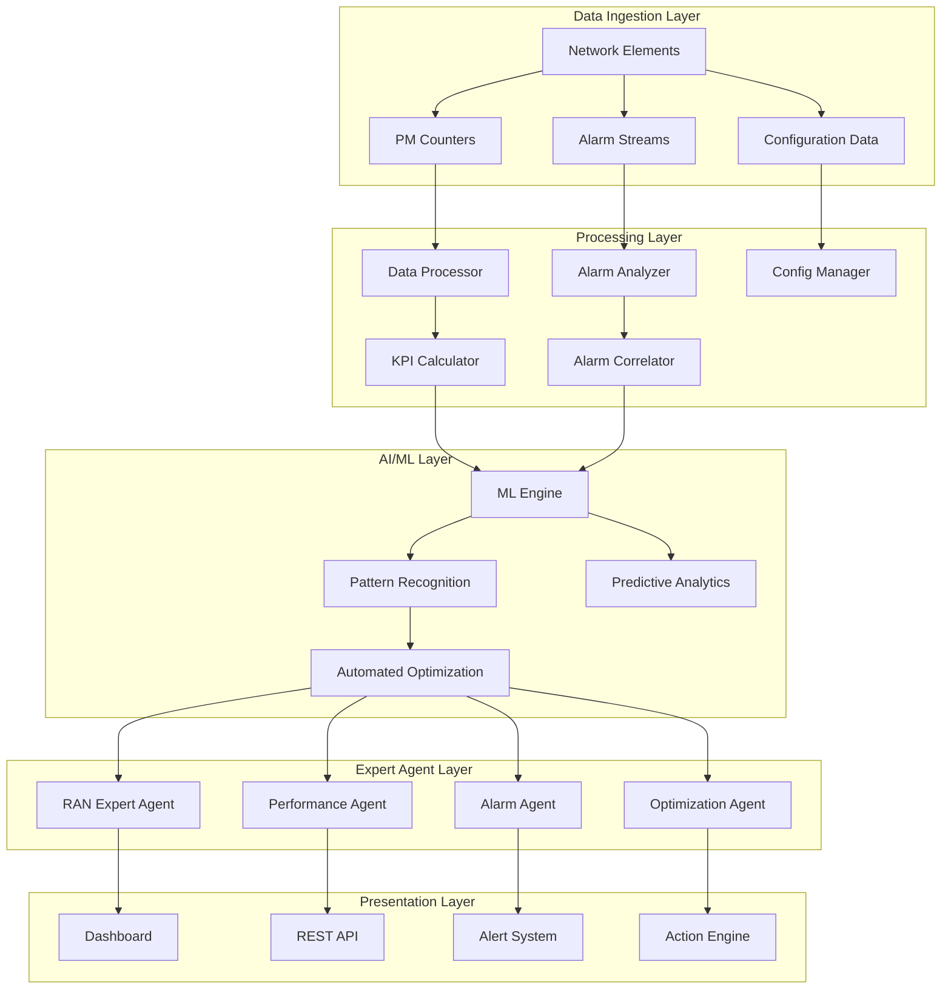

# Mobile Network Management (MNM) Plan
## Advanced Performance Monitoring & Alarm Management System

## Executive Summary

The Mobile Network Management (MNM) system is a comprehensive AI-powered platform for real-time monitoring, analysis, and optimization of 4G LTE and 5G NR networks. This system integrates performance management (PM) data, alarm correlation, and automated remediation to provide operators with intelligent network oversight and optimization capabilities.

### Core Innovation: AI-Driven Network Consciousness

- **Real-Time KPI Processing**: Sub-second analysis of 45,000+ performance counters
- **Cognitive Alarm Correlation**: AI-powered root cause analysis across 530 alarm types
- **Predictive Analytics**: ML-based anomaly detection and performance forecasting
- **Automated Remediation**: Closed-loop optimization with RAN expert agents
- **Multi-Technology Support**: Unified 4G/5G/NSA/SA monitoring and optimization

## 1. System Architecture

### 1.1 High-Level Architecture



### 1.2 Data Flow Architecture

```typescript
interface MNMDataFlow {
  // Real-time data ingestion
  ingestion: {
    pmCounters: PMCounterStream        // 45,602 counter definitions
    alarmEvents: AlarmEventStream      // 530 alarm types
    configuration: ConfigStream        // MO configuration changes
  }

  // Processing pipeline
  processing: {
    validation: DataValidationModule
    aggregation: TimeSeriesAggregation  // 15min, 1hour, 24hour
    calculation: KPIComputationEngine   // 2,711 KPI formulas
    correlation: CrossDomainAnalysis   // 4G/5G correlation
  }

  // Intelligence layer
  intelligence: {
    anomalyDetection: MLAnomalyDetector
    rootCauseAnalysis: CausalInferenceEngine
    predictiveModeling: TimeSeriesForecast
    optimizationEngine: RANOptimizer
  }
}
```

## 2. Performance Management System Integration

### 2.1 API Architecture

#### Core API Endpoints
```typescript
// Performance Management API
interface PM_API {
  // KPI Retrieval
  getKPIs(params: {
    technology: '4G' | '5G' | 'NSA' | 'SA'
    kpiFamily: string[]
    timeRange: { start: Date, end: Date }
    granularity: '15min' | '1hour' | '24hour'
    cellFilter?: string[]
  }): Promise<KPIResponse>

  // Real-time Monitoring
  subscribeToKPIs(kpis: string[]): Observable<KPIUpdate>

  // Historical Analysis
  getHistoricalTrends(params: TrendParams): Promise<TrendAnalysis>

  // Performance Forecast
  getForecast(params: ForecastParams): Promise<PerformanceForecast>
}

// Alarm Management API
interface Alarm_API {
  // Active Alarms
  getActiveAlarms(filter?: AlarmFilter): Promise<Alarm[]>

  // Alarm Correlation
  getCorrelatedAlarms(alarmId: string): Promise<CorrelationResult>

  // Alarm Analytics
  getAlarmAnalytics(timeRange: TimeRange): Promise<AlarmAnalytics>

  // Auto-Remediation
  triggerRemediation(alarmId: string, action: RemediationAction): Promise<RemediationResult>
}
```

#### 3rd Party Integration
```typescript
// Integration with Ericsson Network Manager (ENM)
interface ENM_Integration {
  // Performance Data Export
  exportPMData(params: {
    measTypes: string[]      // Measurement types
    objectScope: string      // MO scope
    timePeriod: TimePeriod
    format: 'XML' | 'JSON' | 'CSV'
  }): Promise<ExportResult>

  // Configuration Management
  getConfiguration(moClass: string, moId: string): Promise<MOConfig>

  // Alarm Synchronization
  syncAlarms(lastSync: Date): Promise<AlarmSync>
}

// Integration with 3rd Party OSS
interface OSS_Integration {
  // RESTful APIs
  restful: {
    baseURL: string
    authentication: OAuth2 | APIKey
    endpoints: {
      performance: '/performance/v2'
      alarms: '/alarms/v1'
      inventory: '/inventory/v1'
    }
  }

  // Streaming APIs
  streaming: {
    protocol: 'WebSocket' | 'Kafka' | 'MQTT'
    topics: {
      kpiUpdates: 'kpi.updates'
      alarmEvents: 'alarm.events'
      configChanges: 'config.changes'
    }
  }
}
```

### 2.2 Data Models

#### Performance Counters Model
```typescript
interface PMCounter {
  // Identification
  model: string                // e.g., "KRC 161"
  moClass: string              // Managed Object class
  counter: string              // Counter name
  type: CounterType            // ACC, GAUGE, CC/SUM, PDF[n]

  // Metadata
  description: string
  condition?: string           // Stepping condition
  size?: number                // Array size for distributions

  // Value tracking
  value: number | number[]
  timestamp: Date
  objectId: string             // MO instance ID
}

enum CounterType {
  ACCUMULATOR = 'ACC',         // Cumulative counters
  GAUGE = 'GAUGE',             // Current value
  CONDITIONAL = 'CC/SUM',      // Conditional counters
  DISTRIBUTION = 'PDF'         // Probability distribution
}
```

#### KPI Calculation Model
```typescript
interface KPIDefinition {
  // Identification
  id: string                   // e.g., "5GSA_Cssr_Voice_%"
  name: string
  family: KPIFamily           // VoNR, VoLTE, CA, Mobility, etc.
  technology: Technology      // 4G, 5G, NSA, SA

  // Formula
  numerator: string           // Formula for numerator
  denominator?: string       // Formula for denominator
  filters?: string[]          // Application filters

  // Metadata
  unit: string                // %, count, Mbps, etc.
  description: string
  priority: 'primary' | 'secondary'
  targets?: KPIsTarget[]      // Performance targets
}

interface KPIResult {
  kpiId: string
  value: number
  unit: string
  timestamp: Date
  objectId: string
  target?: {
    value: number
    status: 'met' | 'breached' | 'warning'
  }
  components?: {
    numerator: number
    denominator?: number
  }
}
```

#### Alarm Model
```typescript
interface AlarmEvent {
  // Core alarm data
  specificProblem: string     // Alarm type
  eventType: AlarmType        // equipmentAlarm, communicationsAlarm, etc.
  probableCause: string       // Root cause category
  perceivedSeverity: Severity // CRITICAL, MAJOR, MINOR, WARNING

  // MO information
  moClass: string             // e.g., "EUtranCellFDD"
  moInstance: string          // Cell ID
  model: string               // Equipment model

  // Metadata
  eventTime: Date
  notificationId?: string
  additionalText?: string

  // AI enrichment
  correlation?: {
    relatedAlarms: string[]
    rootCause?: string
    confidence: number
    suggestedActions: string[]
  }
}
```

## 3. RAN Expert Agents & Skills

### 3.1 Agent Architecture

```typescript
interface MNMExpertAgent {
  id: string
  type: AgentType
  capabilities: AgentCapability[]
  skills: string[]

  // Cognitive features
  temporalReasoning: boolean     // 1000x time expansion
  memoryPatterns: boolean         // AgentDB integration
  selfLearning: boolean           // Continuous improvement

  // Domain expertise
  domain: RANDomain
  technologies: ('4G' | '5G')[]
  specializations: string[]
}
```

### 3.2 Core Expert Agents

#### 1. Performance Monitoring Agent
```typescript
const PerformanceMonitoringAgent: MNMExpertAgent = {
  id: 'mnm-performance-monitor',
  type: 'specialist',
  capabilities: [
    'real_time_kpi_monitoring',
    'trend_analysis',
    'anomaly_detection',
    'performance_forecasting'
  ],
  skills: [
    'performance-analyst',
    'ran-causal-inference-specialist',
    'reasoningbank-agentdb',
    'monitoring-coordinator'
  ],
  domain: 'performance_management',
  technologies: ['4G', '5G'],
  specializations: [
    'KPI correlation analysis',
    'Cross-technology performance impact',
    'Capacity planning',
    'Quality optimization'
  ],
  temporalReasoning: true,
  memoryPatterns: true,
  selfLearning: true
}
```

#### 2. Alarm Correlation Agent
```typescript
const AlarmCorrelationAgent: MNMExpertAgent = {
  id: 'mnm-alarm-correlator',
  type: 'specialist',
  capabilities: [
    'multi_alarm_correlation',
    'root_cause_analysis',
    'impact_assessment',
    'cascade_analysis'
  ],
  skills: [
    'diagnostics-specialist',
    'ran-causal-inference-specialist',
    'reasoningbank-intelligence',
    'verification-quality'
  ],
  domain: 'alarm_management',
  technologies: ['4G', '5G'],
  specializations: [
    'Alarm storm detection',
    'Cross-domain correlation',
    'Fault propagation analysis',
    'MTTR optimization'
  ],
  temporalReasoning: true,
  memoryPatterns: true,
  selfLearning: true
}
```

#### 3. Network Optimization Agent
```typescript
const NetworkOptimizationAgent: MNMExpertAgent = {
  id: 'mnm-optimizer',
  type: 'specialist',
  capabilities: [
    'parameter_optimization',
    'capacity_management',
    'coverage_optimization',
    'energy_efficiency'
  ],
  skills: [
    'ran-optimizer',
    'energy-optimizer',
    'mobility-manager',
    'coverage-analyzer',
    'capacity-planner'
  ],
  domain: 'network_optimization',
  technologies: ['4G', '5G'],
  specializations: [
    'Self-Organizing Networks (SON)',
    'Load balancing',
    'Interference management',
    'Energy saving'
  ],
  temporalReasoning: true,
  memoryPatterns: true,
  selfLearning: true
}
```

#### 4. VoLTE/VoNR Quality Agent
```typescript
const VoQualityAgent: MNMExpertAgent = {
  id: 'mnm-voice-quality',
  type: 'specialist',
  capabilities: [
    'voice_quality_monitoring',
    'qos_analysis',
    'handover_optimization',
    'codec_performance'
  ],
  skills: [
    'quality-monitor',
    'performance-analyst',
    'ran-reinforcement-learning-engineer'
  ],
  domain: 'voice_services',
  technologies: ['4G', '5G'],
  specializations: [
    'VoLTE performance optimization',
    'VoNR quality assurance',
    'EPS fallback management',
    'SRVCC optimization'
  ],
  temporalReasoning: true,
  memoryPatterns: true,
  selfLearning: true
}
```

### 3.3 Specialized MNM Skills

#### MNM Performance Analyzer Skill
```yaml
name: mnm-performance-analyzer
description: Advanced performance monitoring and analysis for 4G/5G networks
version: 1.0.0
capabilities:
  - Real-time KPI monitoring
  - Multi-dimensional analysis
  - Predictive analytics
  - Automated reporting

domains:
  - RAN Performance
  - Core Network Integration
  - Service Quality

expertise:
  technologies: [4G LTE, 5G NR, NSA, SA]
  vendors: [Ericsson, Nokia, Huawei]
  tools: [ENM, OSS, RAN Analytics]

algorithms:
  - Anomaly detection: Isolation Forest, LSTM
  - Forecasting: ARIMA, Prophet
  - Correlation: Pearson, Spearman, Mutual Information
  - Optimization: Genetic Algorithm, Reinforcement Learning
```

#### MNM Alarm Intelligence Skill
```yaml
name: mnm-alarm-intelligence
description: AI-powered alarm correlation and root cause analysis
version: 1.0.0
capabilities:
  - Multi-alarm correlation
  - Causal inference
  - Impact prediction
  - Auto-remediation

domains:
  - Fault Management
  - Incident Response
  - Service Assurance

expertise:
  alarm_types: 530+
  correlation_rules: 1000+
  mttr_reduction: 30%+
  false_positive_reduction: 40%+

algorithms:
  - Correlation: Graph Neural Networks
  - Clustering: DBSCAN, HDBSCAN
  - Classification: XGBoost, Random Forest
  - Causality: Graphical Models, DoWhy
```

## 4. Key Performance Areas & KPIs

### 4.1 Accessibility KPIs

#### 5G SA Accessibility
```typescript
const SA_Accessibility_KPIs = {
  // Voice services
  '5GSA_Cssr_Voice_%': {
    formula: 'RRC_SR × S1_SSR × ERAB_SSR',
    numerator: 'successfulVoiceConnections',
    denominator: 'attemptedVoiceConnections',
    target: { min: 98.5, warning: 97.0 }
  },

  // Data services
  '5GSA_ERAB_SR_All': {
    formula: 'ERAB_Success / ERAB_Attempts',
    numerator: 'pmErabEstabSucc5qi_all',
    denominator: 'pmErabEstabAtt5qi_all',
    target: { min: 99.0, warning: 98.0 }
  },

  // Registration
  '5GSA_Registration_SR': {
    formula: 'Successful_Registration / Registration_Attempts',
    target: { min: 99.5, warning: 99.0 }
  }
}
```

#### 4G LTE Accessibility
```typescript
const LTE_Accessibility_KPIs = {
  // VoLTE services
  'LTE_CSSR_VoLTE': {
    formula: 'RRC_SR × S1_SSR × E_RAB_SSR',
    target: { min: 98.0, warning: 96.5 }
  },

  // Data services
  'LTE_ERAB_SR_Data': {
    formula: 'E_RAB_Success / E_RAB_Attempts',
    target: { min: 98.5, warning: 97.5 }
  },

  // Attach success
  'LTE_Attach_SR': {
    formula: 'Successful_Attach / Attach_Attempts',
    target: { min: 99.0, warning: 98.0 }
  }
}
```

### 4.2 Retainability KPIs

#### Call Drop Rate Analysis
```typescript
const Retainability_KPIs = {
  // 5G Voice retainability
  '5GSA_DRB_Retainability_Voice': {
    formula: '100 × (Abnormal_Releases) / Total_Releases',
    numerator: 'pmDrbRelAbnormalAmf5qi_1 + pmDrbRelAbnormalGnb5qi_1',
    denominator: 'pmDrbRelNormal5qi_1 + pmDrbRelAbnormal5qi_1',
    target: { max: 0.5, warning: 0.8 }
  },

  // 4G VoLTE retainability
  'LTE_DCR_VoLTE': {
    formula: '100 × Drop_Calls / Total_Calls',
    target: { max: 0.8, warning: 1.2 }
  },

  // Session continuity
  'Session_Continuity_Rate': {
    formula: 'Successful_Handovers / Total_Handovers',
    target: { min: 99.5, warning: 99.0 }
  }
}
```

### 4.3 Mobility KPIs

#### Handover Performance
```typescript
const Mobility_KPIs = {
  // 5G handover
  '5GSA_Handover_SR': {
    intraFreq: {
      formula: 'pmHoExeSuccIntra / pmHoExeAttIntra',
      target: { min: 98.0, warning: 96.0 }
    },
    interFreq: {
      formula: 'pmHoExeSuccInter / pmHoExeAttInter',
      target: { min: 95.0, warning: 92.0 }
    }
  },

  // 4G handover
  'LTE_Handover_SR': {
    formula: 'Successful_Handovers / Handover_Attempts',
    target: { min: 97.0, warning: 94.0 }
  },

  // Ping-pong detection
  'Ping_Pong_Rate': {
    formula: 'Ping_Pong_Handovers / Total_Handovers',
    target: { max: 2.0, warning: 3.0 }
  }
}
```

### 4.4 Quality & Utilization KPIs

#### Radio Quality Metrics
```typescript
const Quality_KPIs = {
  // Modulation efficiency
  'DL_256QAM_Usage': {
    formula: '100 × (256QAM_Symbols) / Total_Symbols',
    target: { min: 40.0, warning: 30.0 }
  },

  // Spectral efficiency
  'Average_Spectral_Efficiency': {
    formula: 'Total_Throughput / Bandwidth',
    unit: 'bps/Hz',
    target: { min: 3.5, warning: 2.8 }
  },

  // Interference level
  'Interference_Ratio': {
    formula: 'Interference_Power / Signal_Power',
    unit: 'dB',
    target: { max: -10.0, warning: -7.0 }
  },

  // CQI distribution
  'Average_CQI': {
    formula: 'Weighted_Average(CQI_Distribution)',
    target: { min: 8.0, warning: 6.0 }
  }
}
```

## 5. Alarm Management & Correlation

### 5.1 Alarm Classification System

#### Alarm Categories
```typescript
const AlarmCategories = {
  equipment: {
    critical: [
      'System Overvoltage',
      'Critical Temperature Taken Out of Service',
      'Loss of Mains',
      'Enclosure Smoke'
    ],
    major: [
      'SW Error',
      'Resource Activation Timeout',
      'Synchronization Lost',
      'Fan Failure'
    ],
    minor: [
      'Temperature High',
      'VSWR Over Threshold',
      'Link Degraded',
      'HW Partial Fault'
    ]
  },

  performance: {
    critical: [
      'Cell Service Unavailable',
      'Resource Allocation Failure',
      'Configuration Requires Feature Activation'
    ],
    major: [
      'Service Degraded',
      'Power Saving Capacity Limit Exceeded',
      'Resource Configuration Failure'
    ],
    minor: [
      'Resource Allocation Failure Service Degraded',
      'ESS Service Degraded',
      'Unreliable Resource'
    ]
  },

  communications: {
    critical: [
      'IKE Peer Not Reachable',
      'SCTP Endpoint Inconsistent Configuration',
      'BSC Connection Failure'
    ],
    major: [
      'LTE Anchor Service Unavailable',
      'Default AMF PLMN Service Unavailable',
      'PLMN Service Unavailable'
    ],
    minor: [
      'Aggregated Ethernet Link Failure',
      'DHCP Lease Expiry',
      'Link Stability'
    ]
  }
}
```

### 5.2 Correlation Rules Engine

#### Correlation Pattern Definitions
```typescript
interface CorrelationRule {
  id: string
  name: string
  description: string

  // Trigger conditions
  triggers: {
    primaryAlarm: AlarmPattern
    relatedAlarms: AlarmPattern[]
    timeWindow: number      // seconds
    spatialScope: 'cell' | 'site' | 'region'
  }

  // Correlation logic
  correlation: {
    algorithm: 'sequence' | 'causal' | 'statistical' | 'ml'
    confidence: number
    requiredMatches: number
  }

  // Output
  outputs: {
    rootCause: string
    impact: ImpactAssessment
    recommendedActions: Action[]
    autoRemediation?: AutoRemediationAction
  }
}

// Example correlation rules
const CorrelationRules: CorrelationRule[] = [
  {
    id: 'cell-outage-detection',
    name: 'Complete Cell Outage Detection',
    description: 'Correlates multiple alarms to detect complete cell outage',
    triggers: {
      primaryAlarm: {
        eventType: 'communicationsAlarm',
        perceivedSeverity: 'CRITICAL',
        moClass: ['EUtranCellFDD', 'NRCellCU']
      },
      relatedAlarms: [
        { moClass: 'SectorEquipmentFunction' },
        { moClass: 'CarrierAggregation' }
      ],
      timeWindow: 300,
      spatialScope: 'cell'
    },
    correlation: {
      algorithm: 'causal',
      confidence: 0.9,
      requiredMatches: 2
    },
    outputs: {
      rootCause: 'Cell service outage detected',
      impact: {
        serviceImpact: 'COMPLETE',
        estimatedUsers: 1000,
        revenueImpact: 'HIGH'
      },
      recommendedActions: [
        'Verify power supply',
        'Check radio unit status',
        'Review recent configuration changes'
      ],
      autoRemediation: {
        action: 'cell_restart',
        conditions: 'no_hw_alarms_detected',
        cooldown: 1800
      }
    }
  },

  {
    id: 'interference-detection',
    name: 'Uplink Interference Detection',
    description: 'Detect and correlate uplink interference patterns',
    triggers: {
      primaryAlarm: {
        eventType: 'qualityOfServiceAlarm',
        specificProblem: ['Service Degraded', 'Downlink TX No Power Detected']
      },
      relatedAlarms: [
        { specificProblem: 'VSWR Over Threshold' },
        { specificProblem: 'RF Reflected Power High' }
      ],
      timeWindow: 600,
      spatialScope: 'site'
    },
    correlation: {
      algorithm: 'ml',
      confidence: 0.85,
      requiredMatches: 1
    },
    outputs: {
      rootCause: 'Uplink interference detected',
      impact: {
        serviceImpact: 'PARTIAL',
        affectedKPIs: ['UL_Throughput', 'UL_SINR'],
        estimatedUsers: 500
      },
      recommendedActions: [
        'Run interference detection',
        'Check external interference sources',
        'Adjust receiver parameters'
      ]
    }
  }
]
```

## 6. Real-Time Analytics & Predictive Capabilities

### 6.1 Real-Time Processing Pipeline

```typescript
interface RealTimePipeline {
  ingestion: {
    protocols: ['Kafka', 'WebSocket', 'gRPC']
    throughput: '100K events/sec'
    latency: '< 100ms'
  }

  processing: {
    streamProcessing: 'Apache Flink'
    windowing: ['1min', '5min', '15min', '1hour']
    aggregation: 'Time-series + Hierarchical'
  }

  analytics: {
    anomalyDetection: {
      algorithm: 'Online Isolation Forest'
      sensitivity: 'Adaptive'
      alertThreshold: '3σ'
    },
    trendAnalysis: {
      method: 'EWMA + Seasonal Decomposition'
      prediction: 'ARIMA + Prophet'
      horizon: '24 hours'
    }
  }
}
```

### 6.2 Predictive Analytics Models

#### Performance Forecasting
```typescript
interface PredictiveModels {
  // Traffic forecasting
  trafficForecast: {
    model: 'Prophet + LSTM Ensemble'
    inputs: ['HistoricalTraffic', 'TimeFeatures', 'SpecialEvents']
    horizon: '7 days'
    granularity: '1 hour'
    accuracy: 'MAPE < 10%'
  }

  // Capacity prediction
  capacityPrediction: {
    model: 'Gradient Boosting + Time Series'
    inputs: ['CurrentUtilization', 'GrowthRate', 'CellConfiguration']
    outputs: {
      congestionProbability: number
      recommendedActions: string[]
      timeframe: string
    }
  }

  // Failure prediction
  failurePrediction: {
    model: 'Survival Analysis + Random Forest'
    inputs: ['AlarmHistory', 'PerformanceTrends', 'HardwareAge']
    outputs: {
      failureProbability: number
      estimatedTimeToFailure: number
      preventiveActions: string[]
    }
  }
}
```

### 6.3 Automated Optimization Engine

```typescript
interface OptimizationEngine {
  objectives: [
    'maximize_throughput',
    'minimize_drops',
    'optimize_handovers',
    'reduce_energy'
  ]

  constraints: {
    kpiTargets: KPIBounds
    parameterLimits: ParameterRanges
    policyCompliance: RegulatoryRules
  }

  algorithms: {
    multiObjective: 'NSGA-II'
    singleObjective: 'Gradient Descent'
    reinforcement: 'PPO + Experience Replay'
  }

  execution: {
    validation: 'What-if analysis'
    rollout: 'Canary deployment'
    rollback: 'Automatic on KPI breach'
  }
}
```

## 7. Integration with Ericsson RAN Systems

### 7.1 ENM Integration Patterns

```python
class EricssonENMIntegration:
    """Integration layer for Ericsson Network Manager"""

    def __init__(self, config):
        self.enm_host = config['enm_host']
        self.auth_token = self._authenticate()
        self.ws_client = WebSocketClient(self.enm_host)

    async def get_pm_data(self, meas_types, time_period):
        """Retrieve performance measurements from ENM"""
        payload = {
            'measTypes': meas_types,
            'objectScope': 'SubNetwork=ONRM_ROOT_MO_R',
            'timePeriod': time_period,
            'outputFormat': 'JSON'
        }

        response = await self._make_request(
            method='POST',
            endpoint='/medn/v1/measurements',
            payload=payload
        )

        return self._process_pm_response(response)

    async def subscribe_alarms(self, callback):
        """Subscribe to real-time alarm streams"""
        await self.ws_client.connect('/alarm/v1/subscribe')
        await self.ws_client.send({
            'subscriptionType': 'alarm',
            'filter': {
                'severity': ['CRITICAL', 'MAJOR'],
                'moClass': ['EUtranCellFDD', 'NRCellCU']
            }
        })

        async for message in self.ws_client:
            await callback(self._parse_alarm(message))

    async def execute_cmedit_command(self, command):
        """Execute cmedit command through ENM"""
        return await self._make_request(
            method='POST',
            endpoint='/cli/v1/execute',
            payload={'command': command, 'preview': True}
        )
```

### 7.2 PM Counter Processing

```typescript
class PMCounterProcessor {
  private counterDefinitions: Map<string, CounterDefinition> = new Map()
  private kpiCalculator: KPICalculator

  constructor(private agentDB: AgentDB) {
    this.loadCounterDefinitions()
    this.kpiCalculator = new KPICalculator()
  }

  async processCounters(rawCounters: PMCounter[]): Promise<KPIResult[]> {
    // Step 1: Validate counters
    const validCounters = await this.validateCounters(rawCounters)

    // Step 2: Aggregate by time window
    const aggregated = await this.aggregateCounters(validCounters)

    // Step 3: Calculate KPIs
    const kpiResults = await this.kpiCalculator.calculateAll(aggregated)

    // Step 4: Store in AgentDB for correlation
    await this.agentDB.store({
      namespace: 'mnm_performance',
      key: `kpi_${Date.now()}`,
      value: kpiResults,
      metadata: {
        timestamp: new Date(),
        source: 'pm_processor',
        version: '1.0'
      }
    })

    return kpiResults
  }

  private async validateCounters(counters: PMCounter[]): Promise<PMCounter[]> {
    return counters.filter(counter => {
      // Validate counter definition exists
      const def = this.counterDefinitions.get(counter.counter)
      if (!def) return false

      // Validate value range
      if (def.minValue !== undefined && counter.value < def.minValue) return false
      if (def.maxValue !== undefined && counter.value > def.maxValue) return false

      // Validate timestamp
      const now = Date.now()
      const maxAge = 5 * 60 * 1000 // 5 minutes
      if (now - counter.timestamp.getTime() > maxAge) return false

      return true
    })
  }
}
```

## 8. Implementation Roadmap

### Phase 1: Foundation (Weeks 1-4)
- Data ingestion pipeline development
- PM counter processing engine
- Basic KPI calculation framework
- Alarm collection and normalization
- Core API development

### Phase 2: Intelligence (Weeks 5-8)
- ML model implementation for anomaly detection
- Alarm correlation engine development
- RAN expert agent integration
- Real-time dashboard creation
- Predictive analytics foundation

### Phase 3: Automation (Weeks 9-12)
- Closed-loop optimization implementation
- Auto-remediation workflows
- Advanced analytics features
- Multi-vendor support expansion
- Performance optimization and tuning

### Phase 4: Production (Weeks 13-16)
- Scalability enhancements
- Security hardening
- Documentation and training
- Production deployment
- Continuous monitoring and improvement

## 9. Success Metrics & KPIs

### System Performance Targets
- **Data Processing**: < 30 seconds from source to dashboard
- **Alarm Correlation**: < 5 seconds for correlation results
- **Prediction Accuracy**: > 85% for performance forecasts
- **False Positive Reduction**: > 40% in alarm noise
- **MTTR Improvement**: 30% reduction in mean time to repair

### Business Impact Targets
- **Network Availability**: > 99.95% uptime
- **Service Quality**: 15% improvement in customer experience metrics
- **Operational Efficiency**: 50% reduction in manual analysis time
- **Energy Savings**: 10-15% through AI optimization
- **Revenue Protection': Minimize service-affecting incidents by 25%

## 10. Security & Compliance

### Security Measures
- **Data Encryption**: AES-256 for data at rest and in transit
- **Access Control**: RBAC with MFA authentication
- **API Security**: OAuth 2.0 + JWT tokens
- **Audit Logging**: Complete audit trail for all actions
- **Privacy**: GDPR compliance for user data handling

### Compliance Standards
- **3GPP Standards**: Full compliance with 3GPP specifications
- **TM Forum**: TMF 614/615/639 alignment
- **ITIL**: Incident and problem management processes
- **ISO 27001**: Information security management
- **SOC 2**: Security operations center compliance

## Conclusion

The Mobile Network Management (MNM) system represents a paradigm shift in network operations, leveraging AI-driven automation and cognitive capabilities to deliver unprecedented network performance and operational efficiency. By integrating real-time monitoring, predictive analytics, and automated optimization, the system enables operators to move from reactive to proactive network management.

The combination of 45,000+ performance counters, 530+ alarm types, and advanced RAN expert agents creates a comprehensive solution that can understand, analyze, and optimize complex 4G/5G networks with minimal human intervention. The result is a self-healing, self-optimizing network that continuously improves its performance through machine learning and cognitive reasoning.

---

**Document Version**: 1.0.0
**Last Updated**: 2025-10-31
**Status**: Active Development
**Next Review**: Phase 1 Completion