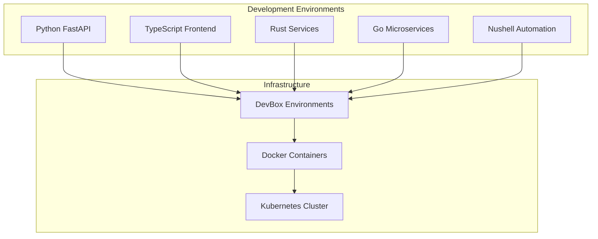

# /polyglot-docs

Generates comprehensive documentation understanding the polyglot project structure, creating unified documentation across languages with intelligent content generation and maintenance.

## Usage
```
/polyglot-docs [type] [--env <environment>] [--format <format>] [--update] [--interactive]
```

## Documentation Types
- `api` - Generate API documentation across all services
- `architecture` - Create system architecture documentation
- `setup` - Environment setup and onboarding guides
- `contributing` - Development workflow and contribution guidelines
- `changelog` - Generate changelog from git history and tasks
- `deployment` - Deployment and operations documentation
- `security` - Security practices and compliance documentation

## Features
- **Cross-language API documentation** with unified formatting
- **Architecture visualization** using Mermaid diagrams
- **Interactive setup guides** with environment validation
- **Automated changelog generation** from commits and tasks
- **Security documentation** with best practices and compliance
- **Performance documentation** with benchmarks and optimization guides
- **Integration documentation** for cross-environment workflows
- **Living documentation** that updates with code changes

## Documentation Generation by Language

### Python Documentation (`python-env/`)
- **API docs**: Sphinx with autodoc for FastAPI endpoints
- **Type documentation**: MyPy integration for type annotations
- **Code examples**: Interactive examples with pytest
- **Performance docs**: Profiling results and optimization guides

### TypeScript Documentation (`typescript-env/`)
- **API docs**: TypeDoc for comprehensive type documentation
- **Component docs**: Storybook integration for UI components
- **Interface documentation**: Type definitions and usage examples
- **Build documentation**: Webpack and bundling configuration

### Rust Documentation (`rust-env/`)
- **API docs**: `cargo doc` with comprehensive examples
- **Architecture docs**: Module structure and design patterns
- **Performance docs**: Benchmarking results and optimization
- **Safety documentation**: Memory safety and concurrency patterns

### Go Documentation (`go-env/`)
- **API docs**: `godoc` with package documentation
- **Service documentation**: Microservice architecture and APIs
- **Deployment docs**: Docker and Kubernetes deployment guides
- **Performance docs**: Profiling and optimization strategies

### Nushell Documentation (`nushell-env/`)
- **Script documentation**: Function and module documentation
- **Automation guides**: DevOps workflow and automation
- **Intelligence documentation**: Monitoring and analytics guides
- **Configuration docs**: Environment and tool configuration

## Instructions
1. **Project Analysis**:
   - Analyze project structure across all environments
   - Identify documentation gaps and requirements
   - Map cross-environment dependencies and integrations
   - Assess current documentation quality and coverage

2. **Content Generation Strategy**:
   - Extract documentation from code comments and docstrings
   - Generate API documentation from type definitions and schemas
   - Create architecture diagrams from project structure
   - Synthesize examples from existing tests and usage patterns

3. **Cross-Environment Documentation**:
   ```bash
   # Generate API documentation for all environments
   cd python-env && devbox run docs  # Sphinx/FastAPI docs
   cd typescript-env && devbox run docs  # TypeDoc/Storybook
   cd rust-env && cargo doc --open  # Rust documentation
   cd go-env && godoc -http=:6060  # Go documentation
   cd nushell-env && nu scripts/generate-docs.nu  # Script docs
   ```

4. **Unified Documentation Structure**:
   - Create consistent navigation and cross-references
   - Establish common formatting and style guidelines
   - Integrate environment-specific docs into unified structure
   - Generate cross-language integration examples

5. **Interactive Documentation**:
   - Create setup guides with validation steps
   - Generate runnable code examples
   - Include troubleshooting guides with solutions
   - Provide performance benchmarks and comparisons

6. **Maintenance and Updates**:
   - Detect documentation drift from code changes
   - Generate updates based on git history and task completion
   - Validate documentation accuracy with automated tests
   - Update architecture diagrams based on code structure

## Documentation Templates

### API Documentation Template
```markdown
# {Service Name} API Documentation

## Overview
{Service description and purpose}

## Architecture
```mermaid
graph TD
    A[Client] --> B[API Gateway]
    B --> C[{Service}]
    C --> D[Database]
```

## Endpoints

### Authentication
- `POST /auth/login` - User authentication
- `POST /auth/refresh` - Token refresh
- `DELETE /auth/logout` - User logout

### Core Operations
- `GET /api/v1/users` - List users
- `POST /api/v1/users` - Create user
- `GET /api/v1/users/{id}` - Get user details

## Data Models
```{language}
{Type definitions and schemas}
```

## Examples
```{language}
{Working code examples}
```

## Error Handling
{Error codes and troubleshooting}

## Performance
{Benchmarks and optimization notes}

## Security
{Authentication, authorization, and security practices}
```

### Architecture Documentation Template
```markdown
# Polyglot System Architecture

## System Overview
{High-level system description}

## Environment Architecture


## Service Boundaries
{Cross-language service interactions}

## Data Flow
{Information flow between environments}

## Integration Patterns
{Common integration approaches}

## Deployment Architecture
{Production deployment structure}

## Monitoring and Observability
{Intelligence and monitoring systems}
```

## Advanced Documentation Features

### Interactive Setup Guide
- **Environment validation**: Check prerequisites and configuration
- **Step-by-step setup**: Guided installation with verification
- **Troubleshooting**: Common issues with automated solutions
- **Performance validation**: Benchmark environment setup

### Living Changelog
- **Git history analysis**: Extract meaningful changes from commits
- **Task correlation**: Link completed tasks to changelog entries
- **Performance tracking**: Include performance improvements and regressions
- **Security updates**: Highlight security fixes and improvements

### Security Documentation
- **Threat modeling**: Document security architecture and risks
- **Best practices**: Language-specific security guidelines
- **Compliance documentation**: Regulatory and compliance requirements
- **Incident response**: Security incident handling procedures

## Integration Points
- **GitHub Pages**: Automated documentation deployment
- **Performance analytics**: Include performance data in documentation
- **Security scanner**: Document security findings and remediation
- **Test intelligence**: Include test coverage and quality metrics
- **Dependency monitoring**: Document dependency health and updates

## Output Formats
- **Markdown**: GitHub-compatible documentation
- **HTML**: Static site generation with navigation
- **PDF**: Comprehensive documentation exports
- **Interactive**: Web-based documentation with examples
- **API specs**: OpenAPI/Swagger documentation generation

## Automation and Maintenance
- **Documentation drift detection**: Alert when code changes affect docs
- **Automated updates**: Generate documentation updates from code changes
- **Quality validation**: Check documentation completeness and accuracy
- **Performance tracking**: Monitor documentation generation performance
- **User feedback**: Collect and integrate documentation feedback

## Advanced Features
- **Multi-language support**: Documentation in multiple languages
- **Version management**: Track documentation versions with code releases
- **Search integration**: Full-text search across all documentation
- **Analytics**: Track documentation usage and effectiveness
- **Collaboration**: Enable community contributions and improvements

## Error Handling and Recovery
- Graceful handling of missing documentation sources
- Fallback content generation for incomplete information
- Validation of generated documentation for accuracy
- Recovery from documentation generation failures
- Backup and versioning of generated documentation