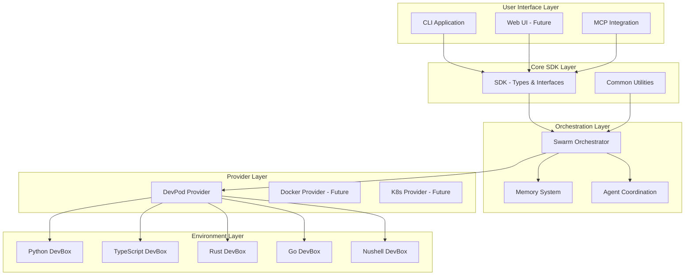

# Swarm Flow Technical Architecture

## System Architecture Overview



## Package Dependency Graph

```mermaid
graph TD
    SDK[SDK<br/>@swarm-flow/sdk]
    Common[Common<br/>@swarm-flow/common]
    Memory[Memory<br/>@swarm-flow/memory]
    Provider[DevPod Provider<br/>@swarm-flow/provider-devpod]
    Orchestrator[Orchestrator<br/>@swarm-flow/orchestrator]
    CLI[CLI<br/>@swarm-flow/cli]
    McpIntegration[MCP Integration<br/>@swarm-flow/mcp-integration]
    
    Common --> SDK
    Memory --> SDK
    Memory --> Common
    Provider --> SDK
    Provider --> Common
    Orchestrator --> SDK
    Orchestrator --> Common
    Orchestrator --> Memory
    Orchestrator --> Provider
    CLI --> SDK
    CLI --> Orchestrator
    CLI --> Common
    McpIntegration --> SDK
    McpIntegration --> Orchestrator
```

## Detailed Component Design

### 1. Core SDK (@swarm-flow/sdk)

#### Agent System
```typescript
export interface Agent {
  readonly id: AgentId;
  readonly name: string;
  readonly type: AgentType;
  readonly capabilities: Capability[];
  readonly environment: EnvironmentId;
  
  execute(task: Task, context: ExecutionContext): Promise<TaskResult>;
  getStatus(): Promise<AgentStatus>;
  terminate(): Promise<void>;
}

export interface AgentFactory {
  createAgent(config: AgentConfig): Promise<Agent>;
  getAvailableTypes(): AgentType[];
}

export enum AgentType {
  CODER = 'coder',
  TESTER = 'tester',
  REVIEWER = 'reviewer',
  COORDINATOR = 'coordinator',
  SPECIALIST = 'specialist'
}
```

#### Task System
```typescript
export interface Task {
  readonly id: TaskId;
  readonly type: TaskType;
  readonly description: string;
  readonly requirements: TaskRequirement[];
  readonly constraints: TaskConstraint[];
  readonly priority: Priority;
  readonly dependencies: TaskId[];
}

export interface TaskResult {
  readonly taskId: TaskId;
  readonly status: TaskStatus;
  readonly output: TaskOutput;
  readonly metrics: ExecutionMetrics;
  readonly artifacts: Artifact[];
}

export enum TaskType {
  CODE_GENERATION = 'code_generation',
  CODE_REVIEW = 'code_review',
  TESTING = 'testing',
  DOCUMENTATION = 'documentation',
  REFACTORING = 'refactoring',
  ANALYSIS = 'analysis'
}
```

#### Swarm System
```typescript
export interface Swarm {
  readonly id: SwarmId;
  readonly name: string;
  readonly agents: Agent[];
  readonly coordinator: SwarmCoordinator;
  readonly strategy: SwarmStrategy;
  
  execute(task: Task): Promise<SwarmResult>;
  addAgent(agent: Agent): Promise<void>;
  removeAgent(agentId: AgentId): Promise<void>;
  getMetrics(): Promise<SwarmMetrics>;
}

export interface SwarmCoordinator {
  assignTask(task: Task, availableAgents: Agent[]): Promise<TaskAssignment[]>;
  monitorExecution(assignments: TaskAssignment[]): Promise<ExecutionStatus>;
  handleFailure(failure: ExecutionFailure): Promise<RecoveryAction>;
}

export enum SwarmStrategy {
  PARALLEL = 'parallel',
  SEQUENTIAL = 'sequential',
  HIERARCHICAL = 'hierarchical',
  COLLABORATIVE = 'collaborative'
}
```

### 2. Environment Provider (@swarm-flow/provider-devpod)

#### DevPod Integration
```typescript
export class DevPodProvider implements EnvironmentProvider {
  private readonly devPodClient: DevPodClient;
  private readonly workspaceManager: WorkspaceManager;
  
  async provision(config: EnvironmentConfig): Promise<Environment> {
    const workspace = await this.workspaceManager.create({
      name: config.name,
      image: this.getImageForLanguage(config.language),
      resources: config.resources,
      volumes: config.volumes
    });
    
    await this.setupEnvironment(workspace, config);
    return new DevPodEnvironment(workspace, this.devPodClient);
  }
  
  async destroy(environmentId: string): Promise<void> {
    await this.workspaceManager.delete(environmentId);
  }
  
  async execute(environmentId: string, command: Command): Promise<ExecutionResult> {
    const workspace = await this.workspaceManager.get(environmentId);
    return await this.devPodClient.exec(workspace, command);
  }
  
  private getImageForLanguage(language: Language): string {
    const imageMap = {
      [Language.PYTHON]: 'python:3.12-devbox',
      [Language.TYPESCRIPT]: 'node:20-devbox',
      [Language.RUST]: 'rust:1.75-devbox',
      [Language.GO]: 'golang:1.21-devbox',
      [Language.NUSHELL]: 'nushell:latest-devbox'
    };
    return imageMap[language];
  }
}
```

#### Environment Management
```typescript
export class DevPodEnvironment implements Environment {
  constructor(
    private readonly workspace: DevPodWorkspace,
    private readonly client: DevPodClient
  ) {}
  
  async start(): Promise<void> {
    await this.client.start(this.workspace.id);
    await this.waitForReady();
  }
  
  async stop(): Promise<void> {
    await this.client.stop(this.workspace.id);
  }
  
  async execute(command: Command): Promise<ExecutionResult> {
    return await this.client.exec(this.workspace, command);
  }
  
  async getStatus(): Promise<EnvironmentStatus> {
    const status = await this.client.status(this.workspace.id);
    return {
      id: this.workspace.id,
      state: this.mapDevPodState(status.state),
      resources: status.resources,
      uptime: status.uptime
    };
  }
  
  async installPackages(packages: Package[]): Promise<void> {
    const devboxConfig = await this.getDevboxConfig();
    devboxConfig.packages.push(...packages.map(p => p.name));
    await this.updateDevboxConfig(devboxConfig);
    await this.execute(new Command('devbox', ['install']));
  }
}
```

### 3. Orchestrator (@swarm-flow/orchestrator)

#### Swarm Orchestration
```typescript
export class SwarmOrchestrator {
  constructor(
    private readonly environmentProvider: EnvironmentProvider,
    private readonly memoryProvider: MemoryProvider,
    private readonly agentFactory: AgentFactory
  ) {}
  
  async executeTask(task: Task): Promise<TaskResult> {
    const swarm = await this.createOptimalSwarm(task);
    const executionPlan = await this.planExecution(task, swarm);
    
    return await this.executeWithMonitoring(executionPlan);
  }
  
  private async createOptimalSwarm(task: Task): Promise<Swarm> {
    const requiredCapabilities = this.analyzeTaskRequirements(task);
    const agents = await this.selectAgents(requiredCapabilities);
    const strategy = this.determineStrategy(task, agents);
    
    return new SwarmImpl({
      id: generateSwarmId(),
      name: `swarm-${task.id}`,
      agents,
      strategy,
      coordinator: new SwarmCoordinatorImpl(this.memoryProvider)
    });
  }
  
  private async planExecution(task: Task, swarm: Swarm): Promise<ExecutionPlan> {
    const subtasks = await this.decomposeTask(task);
    const assignments = await swarm.coordinator.assignTask(task, swarm.agents);
    
    return new ExecutionPlan({
      task,
      subtasks,
      assignments,
      dependencies: this.analyzeDependencies(subtasks),
      timeline: this.estimateTimeline(assignments)
    });
  }
  
  private async executeWithMonitoring(plan: ExecutionPlan): Promise<TaskResult> {
    const monitor = new ExecutionMonitor(plan);
    
    try {
      const result = await this.executeParallel(plan);
      await this.memoryProvider.store(`task:${plan.task.id}`, result);
      return result;
    } catch (error) {
      return await this.handleExecutionFailure(error, plan, monitor);
    }
  }
}
```

#### Agent Coordination
```typescript
export class SwarmCoordinatorImpl implements SwarmCoordinator {
  constructor(private readonly memory: MemoryProvider) {}
  
  async assignTask(task: Task, agents: Agent[]): Promise<TaskAssignment[]> {
    const subtasks = await this.decomposeTask(task);
    const assignments: TaskAssignment[] = [];
    
    for (const subtask of subtasks) {
      const bestAgent = await this.selectBestAgent(subtask, agents);
      assignments.push({
        subtask,
        agent: bestAgent,
        priority: this.calculatePriority(subtask, task),
        estimatedDuration: await this.estimateDuration(subtask, bestAgent)
      });
    }
    
    return this.optimizeAssignments(assignments);
  }
  
  async monitorExecution(assignments: TaskAssignment[]): Promise<ExecutionStatus> {
    const statuses = await Promise.all(
      assignments.map(async (assignment) => {
        const agentStatus = await assignment.agent.getStatus();
        return {
          assignment,
          status: agentStatus,
          progress: await this.calculateProgress(assignment)
        };
      })
    );
    
    return {
      overall: this.calculateOverallStatus(statuses),
      individual: statuses,
      metrics: await this.gatherMetrics(assignments)
    };
  }
  
  private async selectBestAgent(subtask: Task, agents: Agent[]): Promise<Agent> {
    const scores = await Promise.all(
      agents.map(async (agent) => ({
        agent,
        score: await this.scoreAgentForTask(agent, subtask)
      }))
    );
    
    return scores.sort((a, b) => b.score - a.score)[0].agent;
  }
}
```

### 4. Memory System (@swarm-flow/memory)

#### Memory Architecture
```typescript
export interface MemoryProvider {
  store(key: string, value: any, metadata?: MemoryMetadata): Promise<void>;
  retrieve(key: string): Promise<any>;
  search(query: SearchQuery): Promise<SearchResult[]>;
  delete(key: string): Promise<void>;
  list(pattern?: string): Promise<MemoryEntry[]>;
}

export class HybridMemoryProvider implements MemoryProvider {
  constructor(
    private readonly shortTerm: InMemoryProvider,
    private readonly longTerm: SqliteProvider,
    private readonly vectorStore: VectorStoreProvider
  ) {}
  
  async store(key: string, value: any, metadata?: MemoryMetadata): Promise<void> {
    // Store in short-term for quick access
    await this.shortTerm.store(key, value, metadata);
    
    // Store in long-term for persistence
    await this.longTerm.store(key, value, metadata);
    
    // Store embeddings for semantic search
    if (metadata?.searchable) {
      await this.vectorStore.embed(key, value, metadata);
    }
  }
  
  async search(query: SearchQuery): Promise<SearchResult[]> {
    if (query.type === 'semantic') {
      return await this.vectorStore.search(query);
    } else {
      return await this.longTerm.search(query);
    }
  }
}
```

### 5. CLI Application (@swarm-flow/cli)

#### Command Structure
```typescript
// Using oclif framework
export class SwarmFlowCLI extends Command {
  static description = 'Swarm Flow - AI Agent Orchestration System';
  
  static examples = [
    '$ swarm-flow task create "Build a REST API"',
    '$ swarm-flow swarm spawn --agents=3 --strategy=parallel',
    '$ swarm-flow env provision python --count=2'
  ];
  
  async run(): Promise<void> {
    const { args, flags } = await this.parse(SwarmFlowCLI);
    // Main CLI logic
  }
}

export class TaskCommand extends Command {
  static description = 'Task management commands';
  
  static examples = [
    '$ swarm-flow task create "Implement user authentication"',
    '$ swarm-flow task status <task-id>',
    '$ swarm-flow task list --status=running'
  ];
  
  async run(): Promise<void> {
    const orchestrator = new SwarmOrchestrator(
      new DevPodProvider(),
      new HybridMemoryProvider(),
      new AgentFactoryImpl()
    );
    
    // Task execution logic
  }
}
```

## Integration Points

### DevBox Configuration Enhancement
```json
{
  "packages": ["python@3.12", "uv", "ruff", "mypy"],
  "shell": {
    "init_hook": [
      "echo 'Python Development Environment'",
      "swarm-flow env register python --workspace=$DEVPOD_WORKSPACE_ID",
      "swarm-flow agent spawn python-dev --auto-start"
    ],
    "scripts": {
      "swarm:task": "swarm-flow task create",
      "swarm:spawn": "swarm-flow swarm spawn python-dev-swarm",
      "swarm:status": "swarm-flow status --env=python",
      "swarm:monitor": "swarm-flow monitor --follow"
    }
  },
  "env": {
    "SWARM_FLOW_ENV": "python",
    "SWARM_FLOW_WORKSPACE": "$DEVPOD_WORKSPACE_ID"
  }
}
```

### MCP Integration Bridge
```typescript
export class McpSwarmBridge {
  constructor(
    private readonly orchestrator: SwarmOrchestrator,
    private readonly mcpServer: McpServer
  ) {}
  
  async registerTools(): Promise<void> {
    await this.mcpServer.registerTool({
      name: 'swarm_execute_task',
      description: 'Execute a task using AI agent swarm',
      inputSchema: {
        type: 'object',
        properties: {
          task: { type: 'string', description: 'Task description' },
          environment: { type: 'string', description: 'Target environment' },
          strategy: { type: 'string', enum: ['parallel', 'sequential'] }
        }
      }
    }, this.handleSwarmTask.bind(this));
  }
  
  private async handleSwarmTask(args: any): Promise<any> {
    const task = new TaskImpl({
      id: generateTaskId(),
      type: TaskType.CODE_GENERATION,
      description: args.task,
      requirements: this.parseRequirements(args),
      constraints: this.parseConstraints(args)
    });
    
    const result = await this.orchestrator.executeTask(task);
    return this.formatMcpResponse(result);
  }
}
```

## Performance Optimizations

### 1. Incremental Builds
```json
{
  "compilerOptions": {
    "composite": true,
    "incremental": true,
    "tsBuildInfoFile": "./dist/.tsbuildinfo"
  },
  "references": [
    { "path": "../common" },
    { "path": "../sdk" }
  ]
}
```

### 2. Parallel Execution
```typescript
export class ParallelExecutor {
  async executeParallel<T>(
    tasks: Task[],
    executor: (task: Task) => Promise<T>,
    concurrency: number = 4
  ): Promise<T[]> {
    const semaphore = new Semaphore(concurrency);
    
    return await Promise.all(
      tasks.map(async (task) => {
        await semaphore.acquire();
        try {
          return await executor(task);
        } finally {
          semaphore.release();
        }
      })
    );
  }
}
```

### 3. Caching Strategy
```typescript
export class CacheManager {
  private readonly cache = new Map<string, CacheEntry>();
  
  async get<T>(key: string, factory: () => Promise<T>): Promise<T> {
    const cached = this.cache.get(key);
    if (cached && !this.isExpired(cached)) {
      return cached.value;
    }
    
    const value = await factory();
    this.cache.set(key, {
      value,
      timestamp: Date.now(),
      ttl: 300000 // 5 minutes
    });
    
    return value;
  }
}
```

## Testing Strategy

### Unit Testing
```typescript
describe('SwarmOrchestrator', () => {
  let orchestrator: SwarmOrchestrator;
  let mockEnvironmentProvider: jest.Mocked<EnvironmentProvider>;
  let mockMemoryProvider: jest.Mocked<MemoryProvider>;
  
  beforeEach(() => {
    mockEnvironmentProvider = createMockEnvironmentProvider();
    mockMemoryProvider = createMockMemoryProvider();
    orchestrator = new SwarmOrchestrator(
      mockEnvironmentProvider,
      mockMemoryProvider,
      new MockAgentFactory()
    );
  });
  
  it('should create optimal swarm for task', async () => {
    const task = createMockTask();
    const swarm = await orchestrator.createOptimalSwarm(task);
    
    expect(swarm.agents).toHaveLength(3);
    expect(swarm.strategy).toBe(SwarmStrategy.PARALLEL);
  });
});
```

### Integration Testing
```typescript
describe('DevPod Integration', () => {
  let provider: DevPodProvider;
  
  beforeAll(async () => {
    provider = new DevPodProvider();
    await provider.initialize();
  });
  
  it('should provision Python environment', async () => {
    const config = {
      name: 'test-python-env',
      language: Language.PYTHON,
      resources: { cpu: 2, memory: '4Gi' }
    };
    
    const environment = await provider.provision(config);
    expect(environment.id).toBeDefined();
    
    const status = await environment.getStatus();
    expect(status.state).toBe(EnvironmentState.RUNNING);
    
    await provider.destroy(environment.id);
  });
});
```

## Monitoring and Observability

### Metrics Collection
```typescript
export class MetricsCollector {
  private readonly metrics = new Map<string, Metric>();
  
  recordTaskExecution(task: Task, duration: number, success: boolean): void {
    this.metrics.set(`task.${task.type}.duration`, {
      value: duration,
      timestamp: Date.now(),
      labels: { success: success.toString() }
    });
  }
  
  recordSwarmPerformance(swarm: Swarm, metrics: SwarmMetrics): void {
    this.metrics.set(`swarm.${swarm.id}.efficiency`, {
      value: metrics.efficiency,
      timestamp: Date.now(),
      labels: { strategy: swarm.strategy }
    });
  }
}
```

### Health Checks
```typescript
export class HealthChecker {
  async checkSystem(): Promise<HealthStatus> {
    const checks = await Promise.allSettled([
      this.checkEnvironmentProvider(),
      this.checkMemoryProvider(),
      this.checkAgentFactory()
    ]);
    
    return {
      overall: this.calculateOverallHealth(checks),
      components: this.mapComponentHealth(checks),
      timestamp: Date.now()
    };
  }
}
```

This technical architecture provides a solid foundation for implementing the refactored Swarm Flow system with clear separation of concerns, strong typing, and comprehensive testing strategies.