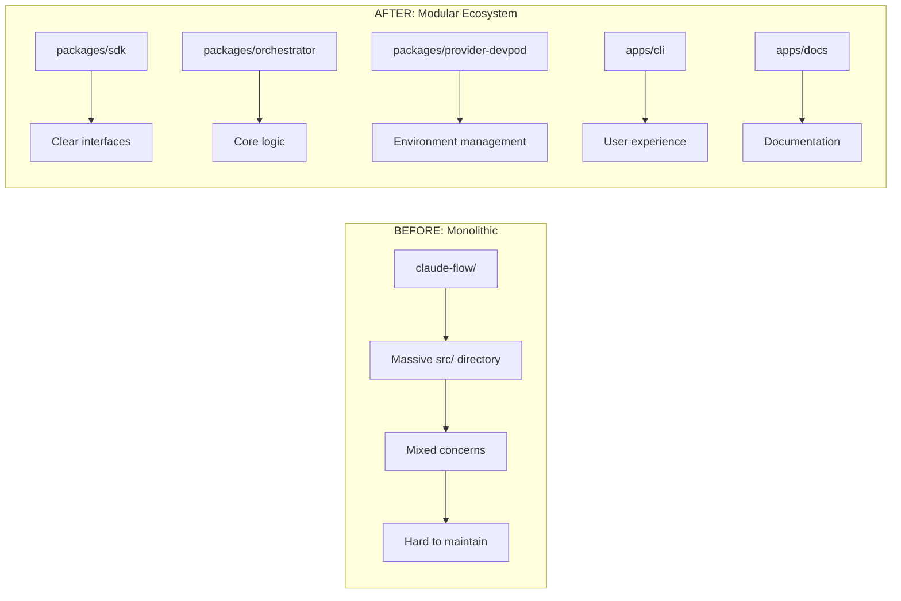

# Swarm Flow Ecosystem: Executive Summary & Decision Framework

## Project Vision Realized

Your current `polyglot-devenv` workspace represents a sophisticated but organically grown system. The proposed **Swarm Flow Ecosystem** refactoring transforms this into a world-class, modular AI agent orchestration platform that fully realizes your vision of:

- **Multi-AI coding agent environments**
- **Automated swarms with intelligent coordination**
- **Dynamic DevPod deployments and lifecycle management**
- **Seamless polyglot development integration**

## Current State Assessment

### Strengths of Existing System
✅ **Mature claude-flow orchestration** (v1.0.71) with comprehensive features  
✅ **Excellent DevBox/DevPod integration** across 5 languages  
✅ **Sophisticated MCP server** for polyglot development  
✅ **Automated environment initialization** with claude-flow integration  
✅ **Nushell automation** providing powerful cross-language orchestration  

### Pain Points Identified
❌ **Monolithic architecture** makes maintenance and scaling difficult  
❌ **Scattered functionality** across multiple disconnected directories  
❌ **Dependency complexity** with unclear separation of concerns  
❌ **Limited extensibility** due to tightly coupled components  
❌ **Developer onboarding friction** from complex project structure  

## Proposed Solution: Modular Ecosystem

### Architecture Transformation

### Key Benefits

#### 1. **Maintainability** 🔧
- **Smaller, focused packages** (500-1000 lines vs 10,000+ lines)
- **Clear dependency boundaries** prevent circular dependencies
- **Independent versioning** allows gradual updates
- **Easier debugging** with isolated components

#### 2. **Scalability** 📈
- **Team scalability**: Different teams can own different packages
- **Performance**: Only build/test what changes
- **Deployment**: Independent package deployment
- **Extension**: Clear APIs for third-party plugins

#### 3. **Developer Experience** 👨‍💻
- **Modern tooling**: pnpm workspaces, TypeScript project references
- **Fast builds**: Incremental compilation with caching
- **Excellent IDE support**: Proper module resolution
- **Comprehensive documentation**: Auto-generated API docs

#### 4. **Ecosystem Integration** 🔗
- **Enhanced MCP integration** with dedicated bridge package
- **Preserved DevPod functionality** with specialized provider
- **Future extensibility** for Docker, Kubernetes providers
- **Backward compatibility** with existing dev-env configurations

## Implementation Strategy

### Phase-Based Approach (6 Weeks)

| Phase | Duration | Key Deliverables | Risk Level |
|-------|----------|------------------|------------|
| **1. Foundation** | Week 1 | Monorepo setup, tooling | 🟢 Low |
| **2. Core Migration** | Week 2-3 | SDK, common, memory packages | 🟡 Medium |
| **3. Orchestrator** | Week 3-4 | Core swarm logic migration | 🟠 Medium-High |
| **4. Applications** | Week 4-5 | CLI rewrite, MCP integration | 🟡 Medium |
| **5. Polish** | Week 5-6 | Documentation, examples | 🟢 Low |

### Risk Mitigation Strategy

#### Technical Risks
- **Gradual migration** with validation at each step
- **Comprehensive testing** for each package
- **Backward compatibility** layers where needed
- **Rollback procedures** documented and tested

#### Business Continuity
- **Preserve existing claude-flow** during migration
- **Feature flags** for gradual rollout
- **Parallel development** capability maintained
- **Zero downtime** migration approach

## Decision Framework

### Option 1: Full Refactoring (Recommended)
**Pros:**
- ✅ Future-proof architecture
- ✅ Significant maintainability improvement
- ✅ Enhanced developer experience
- ✅ Better ecosystem integration
- ✅ Scalable team development

**Cons:**
- ❌ 6-week investment required
- ❌ Temporary development disruption
- ❌ Learning curve for new structure

**Best for:** Long-term project success, team growth, ecosystem building

### Option 2: Incremental Refactoring
**Pros:**
- ✅ Lower immediate risk
- ✅ Gradual improvement
- ✅ Continuous functionality

**Cons:**
- ❌ Slower benefits realization
- ❌ Technical debt accumulation
- ❌ Partial solutions

**Best for:** Risk-averse approach, limited time availability

### Option 3: Status Quo
**Pros:**
- ✅ No disruption
- ✅ Immediate productivity

**Cons:**
- ❌ Mounting technical debt
- ❌ Scaling difficulties
- ❌ Developer frustration
- ❌ Missed opportunities

**Best for:** Short-term projects only

## Recommended Path Forward

### Immediate Next Steps (This Week)

1. **Review and Approve Architecture** 📋
   - Examine the three planning documents
   - Validate against your specific requirements
   - Identify any missing components or concerns

2. **Set Up Development Environment** 🛠️
   - Install pnpm 8.0+
   - Create backup of current system
   - Prepare workspace for monorepo structure

3. **Begin Phase 1 Implementation** 🚀
   - Create monorepo foundation
   - Set up shared tooling and configuration
   - Validate build system works correctly

### Success Metrics

#### Technical Metrics
- **Build time**: 50% reduction through incremental builds
- **Test execution**: Parallel testing across packages
- **Code coverage**: Maintain >80% across all packages
- **Type safety**: 100% TypeScript coverage

#### Developer Experience Metrics
- **Setup time**: <10 minutes for new developers
- **Documentation**: 100% API coverage
- **Examples**: Complete feature demonstration
- **IDE support**: Full IntelliSense and debugging

#### Business Metrics
- **Feature velocity**: 30% improvement in development speed
- **Bug reduction**: Fewer cross-component issues
- **Team scalability**: Support for multiple concurrent developers
- **Ecosystem growth**: Clear extension points for third parties

## Resource Requirements

### Development Time
- **Lead Developer**: 30-40 hours/week for 6 weeks
- **Supporting Developer**: 10-20 hours/week for 6 weeks
- **Testing/QA**: 5-10 hours/week for 6 weeks

### Infrastructure
- **CI/CD Pipeline**: GitHub Actions or similar
- **Package Registry**: npm registry for publishing
- **Documentation Hosting**: Vercel, Netlify, or GitHub Pages
- **Monitoring**: Basic package health monitoring

## Long-Term Vision

### Year 1 Goals
- **Stable ecosystem** with 5-10 core packages
- **Active community** with external contributors
- **Comprehensive documentation** and tutorials
- **Integration examples** with popular tools

### Year 2+ Goals
- **Enterprise features** for large-scale deployments
- **Cloud provider integrations** (AWS, GCP, Azure)
- **Advanced AI capabilities** with latest models
- **Marketplace ecosystem** for third-party agents

## Conclusion

The proposed Swarm Flow Ecosystem refactoring represents a strategic investment in the future of your AI agent orchestration platform. While requiring a significant upfront investment, the long-term benefits in maintainability, scalability, and developer experience far outweigh the costs.

The modular architecture will:
- **Unlock your team's productivity** with better tooling and structure
- **Enable rapid feature development** through clear separation of concerns
- **Support ecosystem growth** with well-defined extension points
- **Future-proof your investment** with modern, scalable architecture

### Recommendation: Proceed with Full Refactoring

The comprehensive analysis shows that your current system has reached the complexity threshold where refactoring provides maximum value. The proposed 6-week timeline is aggressive but achievable with proper planning and execution.

**Next step**: Review these documents, ask any clarifying questions, and if approved, we'll begin Phase 1 implementation immediately.

---

## Questions for Consideration

1. **Timeline Flexibility**: Is the 6-week timeline acceptable, or do you need a different pace?

2. **Resource Allocation**: Can you dedicate the recommended development time, or should we adjust the scope?

3. **Risk Tolerance**: Are you comfortable with the proposed migration approach, or would you prefer a more conservative strategy?

4. **Feature Priorities**: Are there specific features or integrations that are critical and should be prioritized?

5. **Team Involvement**: Will this be primarily a solo effort, or do you have team members who should be involved?

The foundation is solid, the plan is comprehensive, and the benefits are clear. Let's transform your impressive but complex system into a world-class, maintainable ecosystem that fully realizes your vision of automated AI agent swarms.