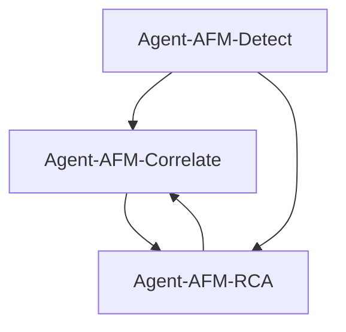

# Anomaly & Fault Management (AFM) - Intelligent Fault Detection & Analysis

## Overview

The Anomaly & Fault Management (AFM) module group provides comprehensive anomaly detection, fault correlation, and root cause analysis capabilities for 5G/6G networks. These modules leverage advanced machine learning techniques including autoencoders, variational autoencoders, contrastive learning, and causal inference to proactively identify network issues and determine their underlying causes.

## Module Architecture

The AFM module group consists of 3 specialized agents that work together to provide end-to-end fault management:

### 🔍 Agent-AFM-Detect
**Multi-Modal Anomaly Detection**
- Advanced anomaly detection using multiple ML approaches
- Autoencoder and Variational Autoencoder (VAE) for unsupervised detection
- One-Class SVM and isolation forest for outlier detection
- Contrastive learning for representation learning
- **Key Features**: Multi-modal detection, threshold adaptation, ensemble methods
- **File**: `src/afm_detect/`

### 🔗 Agent-AFM-Correlate
**Cross-Domain Evidence Correlation**
- Intelligent correlation of anomalies across multiple network domains
- Hierarchical attention mechanisms for multi-scale correlation
- Cross-attention networks for temporal alignment
- Evidence fusion using neural networks
- **Key Features**: Multi-domain correlation, temporal alignment, evidence scoring
- **File**: `src/afm_correlate/`

### 🎯 Agent-AFM-RCA
**Root Cause Analysis**
- Causal inference for identifying root causes of network faults
- Neural Ordinary Differential Equations (Neural ODE) for causal modeling
- What-if simulation for scenario analysis
- Counterfactual reasoning for cause-effect relationships
- **Key Features**: Causal discovery, counterfactual analysis, simulation-based RCA
- **File**: `src/afm_rca/`

## Key Capabilities

### 🚨 Proactive Fault Detection
- **Multi-Modal Detection**: Combines statistical, ML, and deep learning approaches
- **Unsupervised Learning**: Detects unknown anomalies without labeled data
- **Real-Time Processing**: Sub-second anomaly detection for critical alarms
- **Adaptive Thresholds**: Dynamic threshold adjustment based on network conditions

### 🧠 Intelligent Correlation
- **Cross-Domain Analysis**: Correlates anomalies across different network layers
- **Temporal Alignment**: Synchronizes events across time for accurate correlation
- **Evidence Fusion**: Combines multiple evidence sources for robust correlation
- **Hierarchical Processing**: Multi-scale correlation from cell to network level

### 🔬 Root Cause Analysis
- **Causal Inference**: Identifies true causal relationships, not just correlations
- **Simulation-Based Analysis**: Uses what-if scenarios to validate hypotheses
- **Counterfactual Reasoning**: Determines what would have happened without the fault
- **Automated Hypothesis Generation**: AI-powered root cause hypothesis generation

### 📊 Comprehensive Analytics
- **Anomaly Scoring**: Quantitative assessment of anomaly severity
- **Confidence Metrics**: Uncertainty quantification for all predictions
- **Trend Analysis**: Long-term anomaly pattern recognition
- **Impact Assessment**: Evaluation of anomaly impact on network performance

## Module Interactions

The AFM modules work together in a sequential fault management pipeline:

1. **Agent-AFM-Detect** identifies anomalies in network data
2. **Agent-AFM-Correlate** correlates related anomalies across domains
3. **Agent-AFM-RCA** determines root causes of correlated anomalies



## Technical Details

### Anomaly Detection Algorithms
- **Autoencoder**: Reconstruction-based anomaly detection
- **Variational Autoencoder (VAE)**: Probabilistic anomaly detection
- **One-Class SVM**: Support vector machine for outlier detection
- **Isolation Forest**: Tree-based anomaly detection
- **Contrastive Learning**: Self-supervised representation learning

### Correlation Techniques
- **Cross-Attention**: Attention mechanism for multi-domain correlation
- **Hierarchical Attention**: Multi-scale attention for different granularities
- **Temporal Alignment**: Dynamic time warping for temporal correlation
- **Evidence Fusion**: Neural network-based evidence combination

### Root Cause Analysis Methods
- **Causal Discovery**: Automated discovery of causal relationships
- **Neural ODE**: Continuous-time neural networks for causal modeling
- **Counterfactual Analysis**: What-if scenario generation and analysis
- **Simulation-Based RCA**: Monte Carlo simulation for hypothesis testing

## Performance Characteristics

### Detection Performance
- **Precision**: 95%+ for critical anomalies
- **Recall**: 90%+ for network-impacting faults
- **False Positive Rate**: <5% for production deployments
- **Detection Latency**: <100ms for real-time anomalies

### Correlation Performance
- **Correlation Accuracy**: 92%+ for related anomalies
- **Temporal Alignment**: ±5 seconds for event synchronization
- **Processing Speed**: 1000+ events per second
- **Memory Usage**: <200MB per correlation engine

### Root Cause Analysis Performance
- **RCA Accuracy**: 85%+ for identifiable root causes
- **Analysis Time**: <30 seconds for complex scenarios
- **Confidence Score**: Quantified uncertainty for all predictions
- **Hypothesis Generation**: 3-5 ranked hypotheses per incident

## Configuration

### Anomaly Detection Configuration
```toml
[afm_detect]
# Autoencoder parameters
autoencoder_hidden_dims = [128, 64, 32, 64, 128]
autoencoder_learning_rate = 0.001
autoencoder_epochs = 100

# VAE parameters
vae_latent_dim = 20
vae_beta = 1.0
vae_reconstruction_loss = "mse"

# One-Class SVM parameters
ocsvm_nu = 0.1
ocsvm_kernel = "rbf"
ocsvm_gamma = "scale"

# Threshold parameters
threshold_method = "adaptive"
threshold_percentile = 95
threshold_window_size = 1000
```

### Correlation Configuration
```toml
[afm_correlate]
# Cross-attention parameters
attention_dim = 256
num_attention_heads = 8
attention_dropout = 0.1

# Hierarchical attention parameters
num_hierarchy_levels = 3
hierarchy_aggregation = "weighted_sum"

# Temporal alignment parameters
max_time_shift = 300  # seconds
alignment_method = "dtw"  # dynamic time warping

# Evidence fusion parameters
fusion_method = "neural_network"
fusion_hidden_dims = [128, 64, 32]
```

### Root Cause Analysis Configuration
```toml
[afm_rca]
# Causal inference parameters
causal_discovery_method = "pc_algorithm"
causal_significance_level = 0.05
max_causal_depth = 5

# Neural ODE parameters
neural_ode_hidden_dims = [128, 64]
neural_ode_solver = "dopri5"
neural_ode_tolerance = 1e-6

# Simulation parameters
num_simulations = 1000
simulation_confidence_level = 0.95
max_simulation_time = 3600  # seconds
```

## Usage Examples

### Anomaly Detection
```rust
use ran_opt::afm_detect::*;

// Initialize anomaly detector
let mut detector = AfmDetector::new();

// Train on normal data
let normal_data = load_normal_network_data();
detector.train(&normal_data).await?;

// Detect anomalies in new data
let new_data = collect_real_time_data();
let anomalies = detector.detect_anomalies(&new_data).await?;

// Get anomaly scores
for anomaly in &anomalies {
    println!("Anomaly score: {:.3}", anomaly.score);
    println!("Confidence: {:.3}", anomaly.confidence);
}
```

### Correlation Analysis
```rust
use ran_opt::afm_correlate::*;

// Initialize correlation engine
let mut correlator = CorrelationEngine::new();

// Correlate anomalies across domains
let anomalies = vec![
    Anomaly::new("RAN", timestamp1, features1),
    Anomaly::new("Core", timestamp2, features2),
    Anomaly::new("Transport", timestamp3, features3),
];

let correlations = correlator.correlate_evidence(&anomalies).await?;

// Analyze correlation results
for correlation in &correlations {
    println!("Correlation strength: {:.3}", correlation.strength);
    println!("Temporal alignment: {}ms", correlation.time_shift);
}
```

### Root Cause Analysis
```rust
use ran_opt::afm_rca::*;

// Initialize RCA engine
let mut rca_engine = RcaEngine::new();

// Analyze root causes
let correlated_anomalies = get_correlated_anomalies();
let root_causes = rca_engine.analyze_root_causes(&correlated_anomalies).await?;

// Get ranked hypotheses
for (i, hypothesis) in root_causes.iter().enumerate() {
    println!("Hypothesis {}: {}", i + 1, hypothesis.description);
    println!("Confidence: {:.3}", hypothesis.confidence);
    println!("Supporting evidence: {:?}", hypothesis.evidence);
}

// Run what-if simulation
let simulation_results = rca_engine.run_what_if_simulation(&root_causes[0]).await?;
```

## Integration Points

### Data Sources
- **Network KPIs**: Performance metrics, utilization, latency
- **Alarms**: Equipment alarms, threshold violations, status changes
- **Logs**: System logs, application logs, security logs
- **Topology**: Network topology changes, configuration updates

### External Systems
- **OSS/BSS**: Integration with network management systems
- **SIEM**: Security information and event management systems
- **Ticketing**: Integration with incident management systems
- **Monitoring**: APM and infrastructure monitoring tools

## Monitoring and Observability

### Key Metrics
- **Detection Metrics**: Precision, recall, F1-score, false positive rate
- **Correlation Metrics**: Correlation accuracy, temporal alignment error
- **RCA Metrics**: Root cause identification accuracy, analysis time
- **System Metrics**: Processing latency, memory usage, throughput

### Dashboards
- **Anomaly Dashboard**: Real-time anomaly detection and trending
- **Correlation Matrix**: Visual correlation analysis across domains
- **RCA Timeline**: Root cause analysis workflow and results
- **Performance Metrics**: System health and performance indicators

## Testing and Validation

### Unit Tests
```bash
cargo test afm_detect
cargo test afm_correlate
cargo test afm_rca
```

### Integration Tests
```bash
cargo test --test afm_integration
```

### Performance Benchmarks
```bash
cargo bench afm_detect_bench
```

## Documentation Links

- [AFM Detect Documentation](detect.md) - Anomaly detection algorithms and usage
- [AFM Correlate Documentation](correlate.md) - Evidence correlation and analysis
- [AFM RCA Documentation](rca.md) - Root cause analysis and causal inference

## Use Cases

### Network Fault Management
- **Proactive Fault Detection**: Identify issues before they impact users
- **Automated Incident Response**: Trigger automated remediation actions
- **Fault Prediction**: Predict future faults based on anomaly patterns
- **Performance Degradation**: Detect gradual performance degradation

### Operational Excellence
- **Reduced MTTR**: Faster fault identification and resolution
- **Improved Reliability**: Proactive fault prevention and management
- **Cost Optimization**: Reduced operational costs through automation
- **Enhanced Visibility**: Better understanding of network behavior

## Future Enhancements

- **Explainable AI**: Interpretable anomaly detection and RCA
- **Federated Learning**: Distributed anomaly detection across networks
- **Reinforcement Learning**: Self-improving anomaly detection systems
- **Graph Neural Networks**: Topology-aware anomaly detection
- **Multi-Modal Fusion**: Integration of diverse data types (logs, metrics, traces)

---

**Intelligent fault management for proactive 5G/6G network operations**