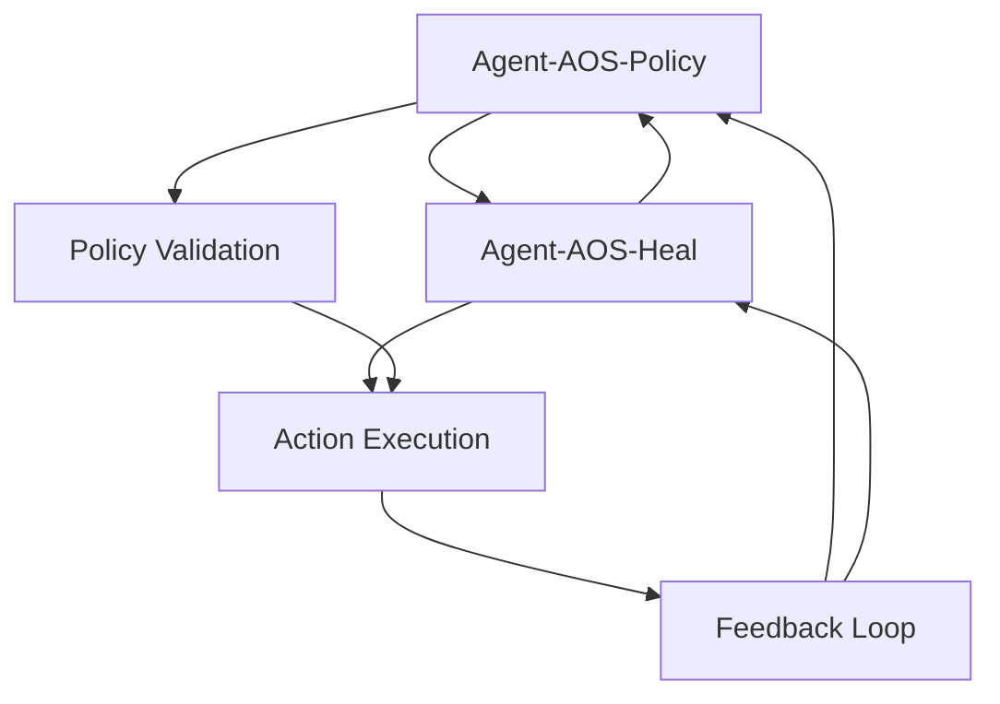

# Autonomous Operations & Self-Healing (AOS) - Automated Network Recovery

## Overview

The Autonomous Operations & Self-Healing (AOS) module group provides intelligent automation capabilities for 5G/6G network operations, focusing on policy enforcement, automated fault remediation, and self-healing actions. These modules leverage advanced AI techniques including reinforcement learning, game theory, and neural decision systems to enable fully autonomous network operations with minimal human intervention.

## Module Architecture

The AOS module group consists of 2 specialized agents that work together to provide comprehensive autonomous operations:

### 🛡️ Agent-AOS-Policy
**Policy Enforcement and Neural Decision Systems**
- Intelligent policy management and enforcement
- Neural network-based decision making for complex scenarios
- Multi-objective optimization for conflicting policies
- Game theory-based policy conflict resolution
- **Key Features**: Dynamic policy adaptation, conflict resolution, decision optimization
- **File**: `src/aos_policy/`

### 🔧 Agent-AOS-Heal
**Self-Healing Action Generation**
- Automated healing action generation using beam search algorithms
- ENM (Ericsson Network Manager) integration for automated remediation
- Machine learning-based action selection and optimization
- Intelligent rollback and recovery mechanisms
- **Key Features**: Automated remediation, action optimization, rollback capabilities
- **File**: `src/aos_heal/`

## Key Capabilities

### 🤖 Autonomous Decision Making
- **Neural Decision Systems**: AI-powered decision making for complex scenarios
- **Multi-Objective Optimization**: Balancing multiple conflicting objectives
- **Context-Aware Policies**: Dynamic policy adaptation based on network state
- **Predictive Actions**: Proactive actions based on predicted future states

### 🔄 Self-Healing Operations
- **Automated Remediation**: Fully automated fault resolution actions
- **Intelligent Action Selection**: ML-based selection of optimal healing actions
- **Rollback Mechanisms**: Safe rollback of failed remediation attempts
- **Learning from Actions**: Continuous improvement through action feedback

### 🎯 Policy Management
- **Dynamic Policy Enforcement**: Real-time policy adaptation and enforcement
- **Conflict Resolution**: Intelligent resolution of conflicting policies
- **Policy Optimization**: Continuous optimization of policy effectiveness
- **Compliance Monitoring**: Automated compliance checking and reporting

### 🔒 Safety and Reliability
- **Fail-Safe Operations**: Safe defaults and fallback mechanisms
- **Human Override**: Always-available human intervention capabilities
- **Audit Trail**: Complete logging and traceability of all actions
- **Risk Assessment**: Automated risk evaluation before action execution

## Module Interactions

The AOS modules work together in a coordinated autonomous operations pipeline:

1. **Agent-AOS-Policy** evaluates network state and determines required actions
2. **Agent-AOS-Heal** generates specific healing actions based on policy decisions
3. Both modules coordinate to ensure safe and effective autonomous operations



## Technical Details

### Policy Enforcement Architecture
- **Neural Decision Networks**: Deep learning models for policy decisions
- **Multi-Objective Optimization**: Pareto-optimal solution finding
- **Game Theory**: Nash equilibrium for policy conflicts
- **Reinforcement Learning**: Continuous policy improvement

### Self-Healing Components
- **Beam Search Algorithm**: Optimal action sequence generation
- **ENM Integration**: Direct integration with Ericsson Network Manager
- **Action Templates**: Pre-defined action patterns for common scenarios
- **Machine Learning**: Action effectiveness prediction and optimization

### Safety Mechanisms
- **Pre-Action Validation**: Comprehensive safety checks before execution
- **Rollback Capabilities**: Automatic rollback on action failure
- **Human Approval**: Optional human approval for critical actions
- **Impact Assessment**: Predicted impact analysis before action execution

## Performance Characteristics

### Decision Making Performance
- **Decision Latency**: <5 seconds for critical decisions
- **Policy Evaluation**: <1 second for standard policy checks
- **Optimization Time**: <10 seconds for multi-objective optimization
- **Accuracy**: 95%+ for action selection decisions

### Self-Healing Performance
- **Action Generation**: <30 seconds for complex scenarios
- **Execution Time**: Variable based on action complexity
- **Success Rate**: 90%+ for automated healing actions
- **Rollback Time**: <60 seconds for failed actions

### Resource Utilization
- **Memory Usage**: <300MB per agent under normal load
- **CPU Usage**: <20% during peak operations
- **Network Overhead**: Minimal additional network traffic
- **Storage**: <1GB for policy and action history

## Configuration

### Policy Engine Configuration
```toml
[aos_policy]
# Neural decision network parameters
decision_network_hidden_dims = [256, 128, 64]
decision_network_learning_rate = 0.001
decision_network_dropout = 0.1

# Multi-objective optimization
optimization_method = "nsga2"
population_size = 100
max_generations = 50
mutation_rate = 0.1

# Policy parameters
policy_update_interval = 300  # seconds
policy_conflict_resolution = "game_theory"
max_policy_depth = 10

# Safety parameters
require_human_approval = false
max_impact_threshold = 0.1
safety_check_timeout = 30  # seconds
```

### Healing Engine Configuration
```toml
[aos_heal]
# Beam search parameters
beam_width = 5
max_search_depth = 10
search_timeout = 60  # seconds

# ENM integration
enm_endpoint = "https://enm.example.com"
enm_username = "aos_user"
enm_connection_timeout = 30  # seconds
enm_retry_attempts = 3

# Action parameters
max_concurrent_actions = 5
action_timeout = 300  # seconds
rollback_timeout = 120  # seconds

# Learning parameters
action_feedback_enabled = true
learning_rate = 0.01
experience_replay_size = 10000
```

## Usage Examples

### Policy Enforcement
```rust
use ran_opt::aos_policy::*;

// Initialize policy engine
let mut policy_engine = PolicyEngine::new();

// Define network policies
let policy = NetworkPolicy::new()
    .with_rule("traffic_threshold", 0.8)
    .with_action("scale_up", ScaleUpAction::new())
    .with_priority(PolicyPriority::High);

policy_engine.add_policy(policy).await?;

// Evaluate policies against current network state
let network_state = get_current_network_state();
let policy_decisions = policy_engine.evaluate_policies(&network_state).await?;

// Resolve policy conflicts
let resolved_decisions = policy_engine.resolve_conflicts(&policy_decisions).await?;
```

### Self-Healing Operations
```rust
use ran_opt::aos_heal::*;

// Initialize healing engine
let mut healing_engine = HealingEngine::new();

// Generate healing actions for detected faults
let detected_faults = get_detected_faults();
let healing_actions = healing_engine.generate_healing_actions(&detected_faults).await?;

// Execute healing actions
for action in &healing_actions {
    let result = healing_engine.execute_action(action).await?;
    
    if result.success {
        println!("Action executed successfully: {}", action.description);
    } else {
        println!("Action failed, initiating rollback: {}", result.error);
        healing_engine.rollback_action(action).await?;
    }
}

// Learn from action results
healing_engine.update_action_model(&healing_actions).await?;
```

### Integrated Autonomous Operations
```rust
use ran_opt::aos_policy::*;
use ran_opt::aos_heal::*;

// Initialize both engines
let mut policy_engine = PolicyEngine::new();
let mut healing_engine = HealingEngine::new();

// Autonomous operations loop
loop {
    // Get current network state
    let network_state = monitor_network_state().await?;
    
    // Evaluate policies
    let policy_decisions = policy_engine.evaluate_policies(&network_state).await?;
    
    // Generate healing actions if needed
    if policy_decisions.requires_healing() {
        let healing_actions = healing_engine.generate_healing_actions(
            &policy_decisions.get_issues()
        ).await?;
        
        // Execute actions with policy validation
        for action in &healing_actions {
            if policy_engine.validate_action(action).await? {
                healing_engine.execute_action(action).await?;
            }
        }
    }
    
    // Wait for next iteration
    tokio::time::sleep(Duration::from_secs(60)).await;
}
```

## Integration Points

### Data Sources
- **Network State**: Real-time network KPIs and status information
- **Fault Information**: Detected anomalies and fault reports
- **Policy Definitions**: Network policies and operational rules
- **Historical Data**: Past actions and their outcomes

### External Systems
- **ENM (Ericsson Network Manager)**: Direct integration for automated actions
- **OSS/BSS**: Integration with operational support systems
- **ITSM**: Integration with IT service management systems
- **Monitoring Systems**: Integration with network monitoring platforms

## Monitoring and Observability

### Key Metrics
- **Policy Metrics**: Policy compliance, conflict resolution success rate
- **Healing Metrics**: Action success rate, healing time, rollback frequency
- **Decision Metrics**: Decision accuracy, decision latency
- **Safety Metrics**: Safety violation rate, human intervention frequency

### Dashboards
- **Autonomous Operations**: Real-time view of autonomous operations
- **Policy Dashboard**: Policy enforcement and conflict resolution
- **Healing Actions**: Self-healing action tracking and results
- **Safety Monitoring**: Safety metrics and compliance tracking

## Testing and Validation

### Unit Tests
```bash
cargo test aos_policy
cargo test aos_heal
```

### Integration Tests
```bash
cargo test --test aos_integration
```

### Safety Tests
```bash
cargo test --test aos_safety
```

## Documentation Links

- [AOS Policy Documentation](policy.md) - Policy enforcement and neural decision systems
- [AOS Heal Documentation](heal.md) - Self-healing action generation and execution

## Use Cases

### Network Fault Recovery
- **Automated Fault Resolution**: Immediate response to network faults
- **Preventive Actions**: Proactive actions to prevent service degradation
- **Cascading Failure Prevention**: Intelligent handling of complex fault scenarios
- **Service Restoration**: Rapid restoration of degraded services

### Operational Efficiency
- **Reduced Manual Intervention**: Minimize human operator workload
- **24/7 Operations**: Continuous autonomous network operations
- **Consistent Response**: Standardized response to common issues
- **Cost Optimization**: Reduced operational costs through automation

### Compliance and Governance
- **Policy Compliance**: Automated enforcement of network policies
- **Audit Trail**: Complete documentation of all autonomous actions
- **Risk Management**: Automated risk assessment and mitigation
- **Regulatory Compliance**: Adherence to regulatory requirements

## Safety Considerations

### Risk Mitigation
- **Graduated Autonomy**: Progressively increase autonomy with proven reliability
- **Human Oversight**: Always-available human intervention capabilities
- **Impact Assessment**: Thorough impact analysis before action execution
- **Fallback Mechanisms**: Safe defaults and fallback procedures

### Validation and Testing
- **Simulation Testing**: Extensive testing in simulated environments
- **Gradual Rollout**: Phased deployment with careful monitoring
- **Continuous Validation**: Ongoing validation of autonomous decisions
- **Safety Metrics**: Continuous monitoring of safety-related metrics

## Future Enhancements

- **Advanced AI**: Integration of large language models for decision explanations
- **Federated Learning**: Distributed learning across multiple networks
- **Quantum Computing**: Quantum-enhanced optimization algorithms
- **Digital Twin**: Integration with network digital twin for simulation
- **Explainable AI**: Interpretable decision making and action selection

---

**Enabling fully autonomous 5G/6G network operations through intelligent automation**