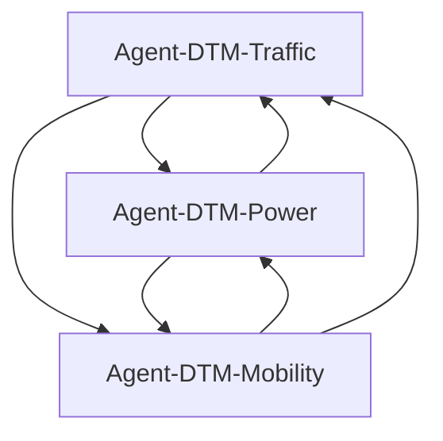

# Dynamic Traffic & Mobility Management (DTM) - Traffic Optimization Modules

## Overview

The Dynamic Traffic & Mobility Management (DTM) module group provides intelligent traffic prediction, mobility pattern analysis, and energy optimization capabilities for 5G/6G networks. These modules leverage advanced machine learning techniques including LSTM/GRU networks, spatial indexing, and graph attention mechanisms to optimize network performance in real-time while minimizing energy consumption.

## Module Architecture

The DTM module group consists of 3 specialized agents that work together to provide comprehensive traffic and mobility management:

### 📈 Agent-DTM-Traffic
**Traffic Prediction and Optimization**
- Advanced traffic forecasting using LSTM/GRU neural networks
- CUDA-accelerated model inference for real-time predictions
- AMOS (Adaptive Multi-Objective Optimization System) for traffic steering
- Custom neural architectures optimized for telecom traffic patterns
- **Key Features**: Time series forecasting, multi-variate analysis, GPU acceleration
- **File**: `src/dtm_traffic/`

### ⚡ Agent-DTM-Power
**Energy Optimization and Power Management**
- Intelligent power consumption optimization for network elements
- Dynamic power scaling based on traffic patterns and QoS requirements
- Machine learning-based energy efficiency prediction
- Integration with renewable energy sources and grid management
- **Key Features**: Power profiling, energy forecasting, green networking
- **File**: `src/dtm_power/`

### 🚶 Agent-DTM-Mobility
**Mobility Pattern Recognition and Handover Optimization**
- Spatial-temporal mobility pattern analysis using graph attention networks
- Intelligent handover prediction and optimization
- User trajectory modeling and clustering
- Real-time mobility KPI processing and analytics
- **Key Features**: Trajectory prediction, handover optimization, spatial indexing
- **File**: `src/dtm_mobility/`

## Key Capabilities

### 🔮 Predictive Analytics
- **Traffic Forecasting**: Multi-horizon prediction from minutes to hours
- **Mobility Prediction**: User movement pattern analysis and prediction
- **Energy Forecasting**: Power consumption optimization and prediction
- **Demand Prediction**: Proactive resource allocation based on predicted demand

### 🎯 Real-Time Optimization
- **Traffic Steering**: Dynamic traffic routing and load balancing
- **Handover Optimization**: Intelligent handover decision making
- **Resource Allocation**: Dynamic spectrum and power allocation
- **QoS Management**: Adaptive quality of service optimization

### 🌐 Spatial Intelligence
- **Geographic Analysis**: Location-based traffic and mobility patterns
- **Spatial Indexing**: Efficient spatial data structures for fast queries
- **Clustering**: User and traffic pattern clustering for optimization
- **Hotspot Detection**: Automatic identification of high-traffic areas

### 🔋 Energy Efficiency
- **Green Networking**: Minimizing energy consumption while maintaining QoS
- **Smart Scheduling**: Traffic-aware power management
- **Renewable Integration**: Coordination with renewable energy sources
- **Carbon Footprint**: Tracking and optimizing network carbon emissions

## Module Interactions

The DTM modules work together in a coordinated fashion:

1. **Agent-DTM-Traffic** predicts future traffic patterns and volumes
2. **Agent-DTM-Mobility** analyzes user movement and handover patterns
3. **Agent-DTM-Power** optimizes energy consumption based on traffic and mobility predictions



## Technical Details

### Traffic Prediction Architecture
- **LSTM/GRU Networks**: Recurrent neural networks for temporal modeling
- **Attention Mechanisms**: Focus on relevant temporal patterns
- **Multi-scale Analysis**: From cell-level to network-level predictions
- **Feature Engineering**: Advanced feature extraction from KPIs

### Mobility Analysis Components
- **Graph Attention Networks**: Modeling spatial relationships between cells
- **Trajectory Clustering**: K-means and DBSCAN for movement pattern analysis
- **Handover Prediction**: Machine learning-based handover decision support
- **Spatial Indexing**: R-tree and KD-tree for efficient spatial queries

### Power Optimization Techniques
- **Dynamic Scaling**: Adaptive power scaling based on traffic load
- **Sleep Mode Management**: Intelligent cell sleep/wake decisions
- **Load Balancing**: Traffic distribution for energy efficiency
- **Renewable Integration**: Coordination with solar/wind power sources

## Performance Characteristics

### Prediction Accuracy
- **Traffic Prediction**: 95%+ accuracy for short-term (5-30 min) forecasts
- **Mobility Prediction**: 90%+ accuracy for handover predictions
- **Energy Prediction**: 92%+ accuracy for power consumption forecasts

### Processing Performance
- **Real-time Inference**: <50ms for traffic predictions
- **Batch Processing**: 10K+ predictions per second
- **Memory Usage**: <500MB per agent under normal load
- **GPU Acceleration**: 10-20x speedup for neural network operations

### Optimization Results
- **Energy Savings**: 15-30% reduction in power consumption
- **Handover Success**: 98%+ successful handover rate
- **Quality of Service**: 99.9% SLA compliance
- **Resource Efficiency**: 25%+ improvement in spectrum utilization

## Configuration

### Traffic Prediction Configuration
```toml
[dtm_traffic]
# Model parameters
sequence_length = 168  # 1 week of hourly data
hidden_size = 128
num_layers = 3
dropout = 0.1

# Training parameters
batch_size = 64
learning_rate = 0.001
epochs = 100

# Prediction parameters
prediction_horizon = 24  # hours
update_interval = 300    # seconds
```

### Mobility Configuration
```toml
[dtm_mobility]
# Spatial indexing
spatial_index_type = "rtree"
max_points_per_node = 100
grid_resolution = 100  # meters

# Clustering parameters
min_cluster_size = 10
max_cluster_radius = 500  # meters
clustering_algorithm = "dbscan"

# Handover parameters
handover_threshold = -90  # dBm
handover_hysteresis = 3   # dB
handover_time_to_trigger = 200  # ms
```

### Power Optimization Configuration
```toml
[dtm_power]
# Power management
min_power_level = 0.1  # 10% of max power
max_power_level = 1.0  # 100% of max power
power_adjustment_step = 0.05  # 5% steps

# Sleep mode parameters
sleep_threshold = 0.05  # 5% traffic threshold
wake_threshold = 0.15   # 15% traffic threshold
sleep_timer = 300       # seconds

# Energy efficiency
target_energy_efficiency = 0.8  # 80% efficiency
carbon_emission_factor = 0.5    # kg CO2/kWh
```

## Usage Examples

### Traffic Prediction
```rust
use ran_opt::dtm_traffic::*;

// Initialize traffic predictor
let mut predictor = TrafficPredictor::new();

// Train on historical data
let training_data = load_historical_traffic_data();
predictor.train(&training_data).await?;

// Make predictions
let current_features = extract_current_features();
let predictions = predictor.predict(&current_features, 24).await?;

// Get traffic steering recommendations
let steering_actions = predictor.generate_steering_actions(&predictions).await?;
```

### Mobility Analysis
```rust
use ran_opt::dtm_mobility::*;

// Initialize mobility analyzer
let mut mobility = DTMMobility::new();

// Process mobility data
let mobility_data = collect_mobility_kpis();
mobility.process_kpis(&mobility_data).await?;

// Analyze trajectory patterns
let trajectories = mobility.extract_trajectories(&mobility_data).await?;
let clusters = mobility.cluster_trajectories(&trajectories).await?;

// Predict handovers
let handover_predictions = mobility.predict_handovers(&trajectories).await?;
```

### Power Optimization
```rust
use ran_opt::dtm_power::*;

// Initialize power optimizer
let mut power_optimizer = PowerOptimizer::new();

// Optimize power consumption
let current_load = get_current_traffic_load();
let weather_data = get_weather_forecast();
let power_actions = power_optimizer.optimize_power(&current_load, &weather_data).await?;

// Apply power management policies
power_optimizer.apply_power_policies(&power_actions).await?;
```

## Integration Points

### Data Sources
- **Network KPIs**: Traffic volume, latency, throughput metrics
- **Mobility Data**: Handover events, user location, movement patterns
- **Power Data**: Energy consumption, power levels, renewable energy
- **Environmental Data**: Weather conditions, time of day, seasonality

### External Systems
- **Network Management**: Integration with OSS/BSS systems
- **Energy Management**: Smart grid and renewable energy systems
- **Weather Services**: Meteorological data for predictions
- **Traffic Management**: Urban traffic and transportation systems

## Monitoring and Observability

### Key Metrics
- **Prediction Accuracy**: MAE, RMSE, MAPE for forecasting models
- **Processing Latency**: End-to-end processing time
- **Energy Efficiency**: Power consumption per bit transferred
- **Handover Performance**: Success rate, call drop rate

### Dashboards
- **Traffic Patterns**: Real-time traffic visualization and trends
- **Mobility Heatmaps**: User movement patterns and hotspots
- **Energy Consumption**: Power usage and efficiency metrics
- **Performance KPIs**: System health and optimization results

## Testing and Validation

### Unit Tests
```bash
cargo test dtm_traffic
cargo test dtm_mobility
cargo test dtm_power
```

### Integration Tests
```bash
cargo test --test dtm_integration
```

### Performance Benchmarks
```bash
cargo bench dtm_traffic_bench
cargo bench dtm_power_bench
```

## Documentation Links

- [DTM Traffic Documentation](traffic.md) - Traffic prediction and optimization
- [DTM Mobility Documentation](mobility.md) - Mobility pattern analysis
- [DTM Power Documentation](power.md) - Energy optimization and management

## Future Enhancements

- **6G Integration**: Support for 6G network architectures and use cases
- **AI/ML Advances**: Integration of transformer models and reinforcement learning
- **Edge Computing**: Distributed processing at network edge for ultra-low latency
- **Digital Twin**: Integration with network digital twin for simulation
- **Sustainability**: Advanced green networking and carbon optimization

---

**Optimizing 5G/6G networks through intelligent traffic and mobility management**