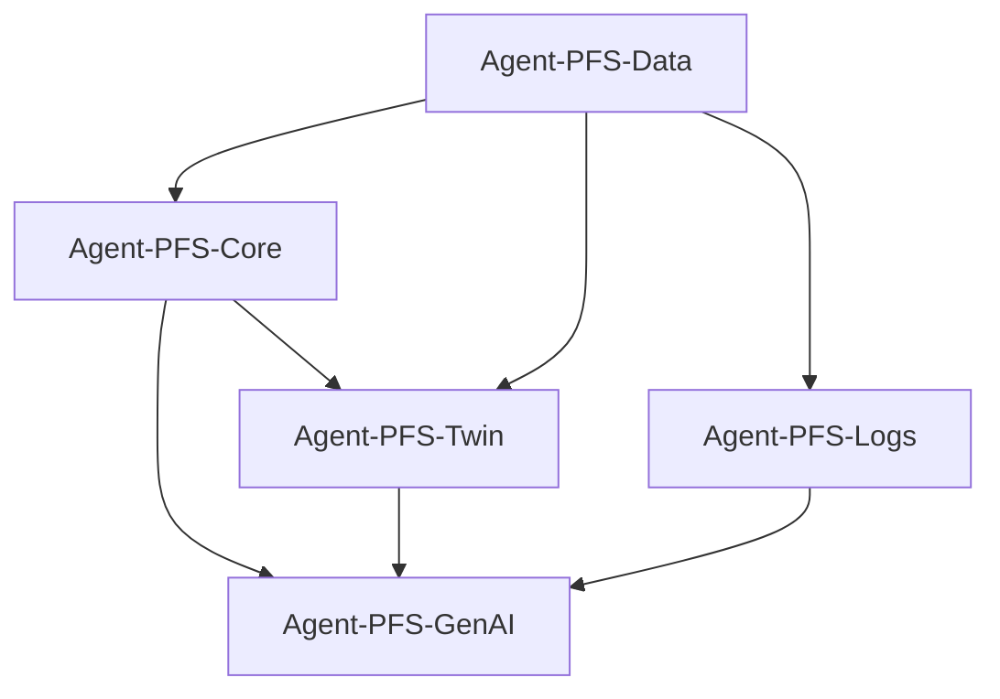

# Platform Foundation Services (PFS) - Core Infrastructure Modules

## Overview

The Platform Foundation Services (PFS) module group provides the core infrastructure and foundational capabilities for the RAN-OPT platform. These modules form the backbone of the system, handling data ingestion, processing, storage, AI/ML operations, and digital twin functionality. PFS modules are designed for maximum performance, reliability, and scalability to support the entire platform's operations.

## Module Architecture

The PFS module group consists of 5 specialized agents that work together to provide comprehensive platform foundation services:

### 🧠 Agent-PFS-Core
**High-Performance Neural Network Infrastructure**
- Custom SIMD-optimized tensor operations and neural network implementations
- Zero-cost abstractions with explicit memory management
- GPU acceleration support with CUDA kernels
- Advanced profiling and performance monitoring
- **Key Features**: Custom allocators, cache-friendly algorithms, vectorized operations
- **File**: `src/pfs_core/`

### 📊 Agent-PFS-Data
**Data Ingestion and Processing Pipeline**
- Multi-vendor data ingestion with primary focus on Ericsson ENM
- Real-time KPI processing and streaming analytics
- Apache Arrow/Parquet-based data storage and retrieval
- ETL pipeline orchestration with fault tolerance
- **Key Features**: XML/JSON parsing, data validation, batch processing
- **File**: `src/pfs_data/`

### 🔗 Agent-PFS-Twin
**Digital Twin with Graph Neural Networks**
- Network topology modeling using Graph Neural Networks (GNNs)
- Real-time network state representation and updates
- Spatial-temporal convolutions for dynamic network analysis
- CUDA-accelerated graph operations and message passing
- **Key Features**: Hierarchical topology, incremental updates, GPU optimization
- **File**: `src/pfs_twin/`

### 🤖 Agent-PFS-GenAI
**GenAI Abstraction Layer**
- Multi-provider LLM integration and management
- Intelligent prompt engineering and optimization
- Caching and compression for efficient AI model interactions
- Streaming inference support with batching optimization
- **Key Features**: Provider agnostic, response caching, metrics collection
- **File**: `src/pfs_genai/`

### 📝 Agent-PFS-Logs
**Log Anomaly Detection**
- Transformer-based log analysis and anomaly detection
- Real-time log parsing and semantic analysis
- Attention mechanisms for pattern recognition
- Automated log correlation and clustering
- **Key Features**: Natural language processing, anomaly scoring, pattern extraction
- **File**: `src/pfs_logs/`

## Key Capabilities

### 🚀 Performance Excellence
- **Sub-millisecond Inference**: Optimized neural network operations
- **SIMD Acceleration**: Vectorized computations for maximum throughput
- **Memory Efficiency**: Custom allocators and memory pooling
- **GPU Acceleration**: CUDA support for compute-intensive operations

### 🔄 Real-Time Processing
- **Streaming Analytics**: Continuous data processing pipelines
- **Event-Driven Architecture**: Reactive system design
- **Low-Latency Operations**: Optimized for real-time network management
- **Batch Processing**: Efficient batch operations for bulk data

### 🛡️ Reliability & Scalability
- **Fault Tolerance**: Comprehensive error handling and recovery
- **Horizontal Scaling**: Distributed processing capabilities
- **Data Consistency**: ACID compliance and transaction support
- **Monitoring**: Built-in observability and health checks

### 🎯 AI/ML Integration
- **Neural Network Optimization**: Custom implementations for specific use cases
- **Transfer Learning**: Pre-trained models for network domain
- **AutoML Support**: Automated model selection and tuning
- **Federated Learning**: Distributed training capabilities

## Module Interactions

The PFS modules work together in a coordinated fashion:

1. **Agent-PFS-Data** ingests and preprocesses network data from multiple sources
2. **Agent-PFS-Core** provides the computational infrastructure for ML operations
3. **Agent-PFS-Twin** maintains the digital representation of the network topology
4. **Agent-PFS-GenAI** provides intelligent analysis and natural language interfaces
5. **Agent-PFS-Logs** monitors system health and detects operational anomalies



## Integration Points

### Data Flow
- **Input**: Network KPIs, alarms, topology data, configuration files
- **Processing**: Real-time analytics, ML inference, graph computations
- **Output**: Processed features, embeddings, predictions, insights

### External Interfaces
- **ENM Integration**: Ericsson Network Manager connectivity
- **Database Systems**: PostgreSQL, ClickHouse, Redis
- **Message Queues**: Apache Kafka, RabbitMQ
- **Monitoring Systems**: Prometheus, Grafana, Jaeger

## Performance Characteristics

### Throughput Metrics
- **Data Ingestion**: 50K+ events/sec per agent
- **Neural Network Inference**: <1ms per forward pass
- **Graph Processing**: 10K+ nodes processed in <100ms
- **Log Analysis**: 100K+ log entries/sec

### Resource Utilization
- **Memory**: Efficient memory pooling with <2GB baseline
- **CPU**: Multi-core utilization with work-stealing algorithms
- **GPU**: CUDA acceleration for compute-intensive operations
- **Storage**: Compressed data formats with 10:1 compression ratios

## Configuration

### Core Configuration
```toml
[pfs]
# Core neural network settings
gpu_enabled = true
batch_size = 1024
worker_threads = 16

# Data processing settings
max_connections = 100
buffer_size = 4096
compression_enabled = true

# Digital twin settings
graph_cache_size = 1000000
update_interval = 100

# GenAI settings
max_tokens = 4096
temperature = 0.7
provider = "openai"

# Log processing settings
log_buffer_size = 10000
anomaly_threshold = 0.95
```

## Quick Start

### Basic Usage
```rust
use ran_opt::pfs_core::*;
use ran_opt::pfs_data::*;
use ran_opt::pfs_twin::*;

// Initialize PFS modules
let pfs_core = PfsCore::new();
let pfs_data = DataProcessor::new();
let pfs_twin = PfsTwin::new(64, 128, 32);

// Process network data
let processed_data = pfs_data.process_enm_data(xml_data).await?;
let embeddings = pfs_twin.process_topology(&processed_data).await?;
let predictions = pfs_core.neural_network_inference(&embeddings).await?;
```

### Advanced Configuration
```rust
use ran_opt::pfs_genai::*;
use ran_opt::pfs_logs::*;

// Configure GenAI with custom settings
let genai_config = GenAIConfig {
    provider: "claude",
    max_tokens: 8192,
    temperature: 0.3,
    caching_enabled: true,
};
let pfs_genai = PfsGenAI::new_with_config(genai_config).await?;

// Setup log anomaly detection
let log_detector = LogAnomalyDetector::new();
let anomalies = log_detector.detect_anomalies(&log_entries).await?;
```

## Documentation Links

- [PFS Core Documentation](core.md) - Neural network infrastructure details
- [PFS Data Documentation](data.md) - Data ingestion and processing
- [PFS Twin Documentation](twin.md) - Graph neural networks and digital twin
- [PFS GenAI Documentation](genai.md) - AI/ML integration and GenAI services
- [PFS Logs Documentation](logs.md) - Log analysis and anomaly detection

## Testing and Validation

### Unit Tests
```bash
cargo test pfs_core
cargo test pfs_data
cargo test pfs_twin
cargo test pfs_genai
cargo test pfs_logs
```

### Integration Tests
```bash
cargo test --test pfs_integration
```

### Performance Benchmarks
```bash
cargo bench pfs_core_bench
cargo bench pfs_data_bench
cargo bench pfs_logs_bench
```

## Monitoring and Observability

### Metrics Collection
- **Performance Metrics**: Latency, throughput, error rates
- **Resource Metrics**: Memory usage, CPU utilization, GPU utilization
- **Business Metrics**: Model accuracy, data quality, processing volumes

### Health Checks
- **Service Health**: Component availability and responsiveness
- **Data Health**: Data quality and freshness validation
- **Model Health**: ML model performance and drift detection

## Future Enhancements

- **Quantum Computing**: Integration with quantum ML algorithms
- **Edge Computing**: Distributed processing at network edge
- **Federated Learning**: Privacy-preserving distributed training
- **AutoML**: Automated model architecture search and optimization
- **Real-time Analytics**: Stream processing with sub-second latency

---

**Built with Rust for maximum performance and safety in mission-critical 5G/6G networks**