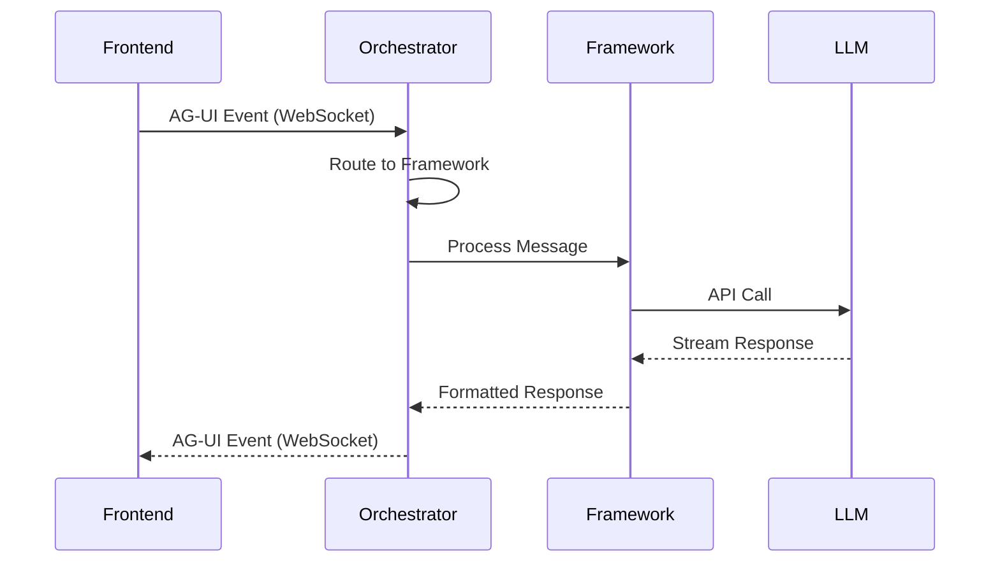
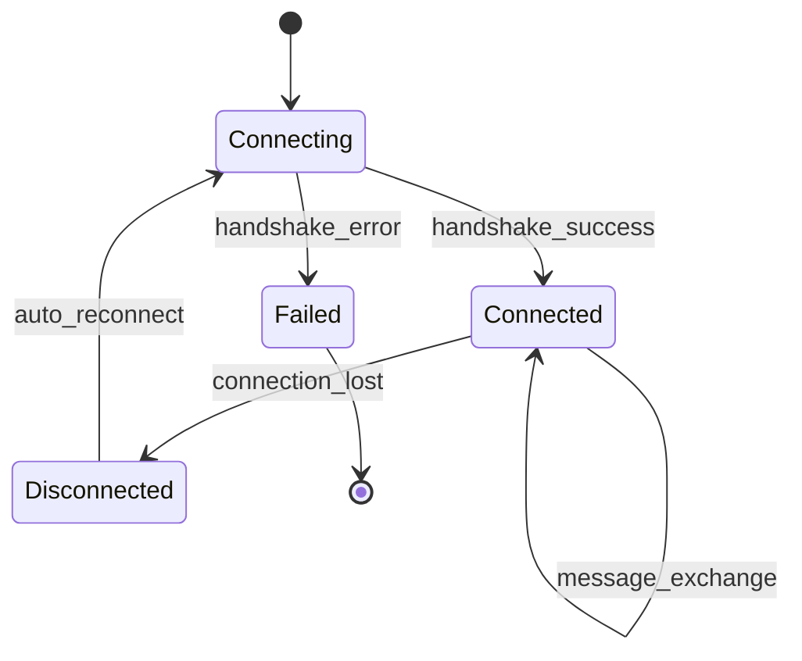
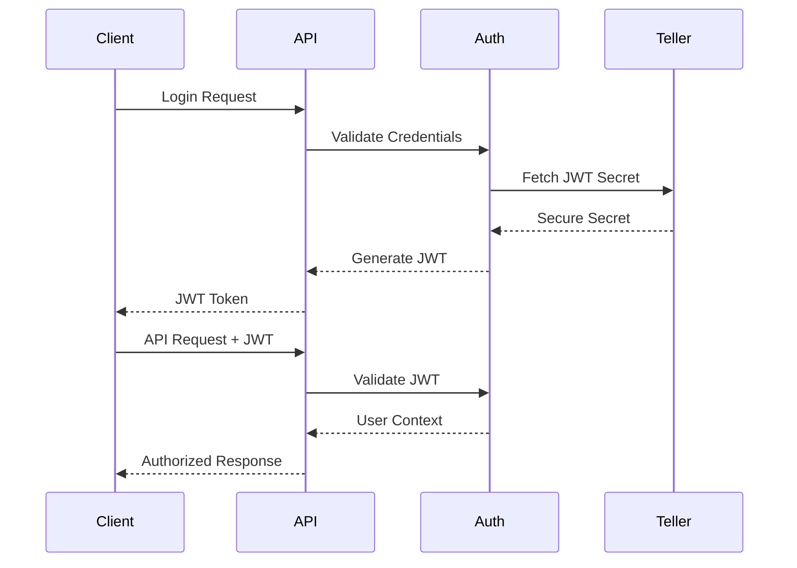
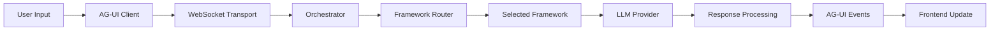

# UAP System Architecture Blueprint

## Overview

The Unified Agentic Platform (UAP) is designed as a modern, scalable, and secure platform for building, deploying, and operating multi-agent AI systems. This document outlines the complete system architecture based on the specifications in `plan.md`.

## High-Level Architecture

```mermaid
graph TB
    subgraph "Frontend Layer"
        A[React + Vite.js App]
        B[AG-UI Client SDK]
        C[CopilotKit UI Components]
        D[Tailwind CSS + Radix UI]
    end
    
    subgraph "Protocol Layer"
        E[AG-UI Protocol]
        F[WebSocket/SSE Transport]
        G[Authentication & Security]
    end
    
    subgraph "Backend Services (Python)"
        H[CopilotKit Backend]
        I[Agno Agent Framework]
        J[Mastra AI Framework]
        K[Agent Orchestration Service]
    end
    
    subgraph "Infrastructure Layer"
        L[SkyPilot Cloud Orchestration]
        M[Teller Secrets Management]
        N[Vector Database (RAG)]
        O[Model Services (MLX/Ray)]
    end
    
    subgraph "Development Environment"
        P[Devbox Environment]
        Q[Nushell Scripting]
        R[Local LLM Daemon]
    end
    
    A --> B
    B --> E
    E --> F
    F --> K
    K --> H
    K --> I
    K --> J
    H & I & J --> N
    H & I & J --> O
    O --> L
    M --injects secrets--> K
    M --injects secrets--> O
    P --runs--> A
    P --runs--> K
```

## 1. Backend Service Architecture

### 1.1 Core Components

- **FastAPI Main Server** (`main.py`)
  - CORS-enabled HTTP server
  - WebSocket endpoint management
  - JWT authentication middleware
  - Health monitoring endpoints

- **Agent Orchestration Service** (`agent_orchestrator.py`)
  - Central routing and message processing
  - Framework lifecycle management
  - Connection state management
  - Intelligent framework selection

- **Framework Managers**
  - CopilotKit Manager: General-purpose AI interactions
  - Agno Manager: Document processing and analysis
  - Mastra Manager: Workflow-based operations

### 1.2 Communication Patterns



### 1.3 Routing Algorithm

```python
def route_message(message: str, context: dict) -> str:
    """Intelligent framework routing based on content analysis"""
    if 'document' in message.lower() or 'analyze' in message.lower():
        return 'agno'  # Document processing
    elif 'support' in message.lower() or 'help' in message.lower():
        return 'mastra'  # Workflow-based support
    else:
        return 'copilot'  # Default general-purpose
```

## 2. Frontend Architecture

### 2.1 Technology Stack

- **React 18+** with TypeScript for type safety
- **Vite.js** for fast development and optimized builds
- **Tailwind CSS + Radix UI** for modern, accessible styling
- **Zustand** for lightweight state management

### 2.2 Component Hierarchy

```
App
├── Layout
│   └── AgentDashboard
│       └── AgentCard (multiple)
│           ├── Chat Interface
│           ├── Connection Status
│           └── Framework Badge
```

### 2.3 AG-UI Integration

```typescript
interface AGUIEvent {
  type: 'user_message' | 'text_message_content' | 'tool_call_start' | 'tool_call_end' | 'state_delta';
  content?: string;
  metadata?: Record<string, any>;
}

export function useAGUI(agentId: string) {
  // WebSocket connection management
  // Real-time message streaming
  // Connection state monitoring
  // Automatic reconnection
}
```

## 3. AG-UI Protocol Implementation

### 3.1 Event Types

| Event Type | Direction | Purpose |
|------------|-----------|---------|
| `user_message` | Frontend → Backend | User input messages |
| `text_message_content` | Backend → Frontend | Agent text responses |
| `tool_call_start` | Backend → Frontend | Tool execution begins |
| `tool_call_end` | Backend → Frontend | Tool execution completes |
| `state_delta` | Backend → Frontend | Agent state changes |

### 3.2 Message Format

```typescript
interface AGUIMessage {
  type: string;
  content: string;
  metadata: {
    framework?: 'copilot' | 'agno' | 'mastra';
    timestamp?: string;
    agent_id?: string;
    [key: string]: any;
  };
}
```

### 3.3 WebSocket Lifecycle



## 4. Multi-Framework Orchestration

### 4.1 Framework Manager Interface

```python
class BaseFrameworkManager(ABC):
    @abstractmethod
    async def process_message(self, message: str, context: dict) -> dict:
        """Process message and return standardized response"""
        pass
    
    @abstractmethod
    def get_status(self) -> dict:
        """Return framework health and statistics"""
        pass
    
    @abstractmethod
    async def initialize(self) -> bool:
        """Initialize framework-specific resources"""
        pass
```

### 4.2 Framework Capabilities

| Framework | Primary Use Cases | Strengths |
|-----------|-------------------|-----------|
| CopilotKit | General AI interactions, chat interfaces | Rapid prototyping, UI components |
| Agno | Document processing, data analysis | Multi-modal input, structured outputs |
| Mastra | Workflow automation, business logic | TypeScript support, enterprise features |

### 4.3 Load Balancing Strategy

```python
class FrameworkLoadBalancer:
    def select_instance(self, framework: str, load_metrics: dict) -> str:
        """Select optimal framework instance based on load"""
        # Round-robin with health checks
        # CPU/memory utilization
        # Response time optimization
```

## 5. Security and Authentication

### 5.1 Security Layers

1. **Transport Security**: TLS 1.3 for all communications
2. **Authentication**: JWT tokens with proper expiration
3. **Authorization**: RBAC for resource access control
4. **Secrets Management**: Teller for zero-trust secret handling
5. **Data Encryption**: AES-256 for data at rest

### 5.2 Authentication Flow



### 5.3 Secrets Management with Teller

```yaml
# .teller.yml configuration
providers:
  google_secret_manager:
    env_sync:
      path: secretmanager/projects/uap-prod/secrets/

env:
  OPENAI_API_KEY:
    provider: google_secret_manager
    path: openai-api-key/versions/latest
    redact_with: '***OPENAI***'
```

## 6. Infrastructure and Deployment

### 6.1 Development Environment

- **DevBox**: Reproducible development environments
- **Multi-platform support**: Apple Silicon (MLX) and x86_64
- **Hot reloading**: Frontend and backend development servers
- **Integrated tooling**: Nushell scripts for automation

### 6.2 Production Deployment

```yaml
# SkyPilot configuration
resources:
  accelerators: A100:1
  cloud: [gcp, aws, azure]
  use_spot: true
  spot_recovery: auto

setup: |
  curl -fsSL https://get.jetify.com/devbox | bash
  devbox install

run: |
  teller run -- devbox run dev
```

### 6.3 Scaling Strategy

- **Horizontal scaling**: Multiple agent framework instances
- **Load balancing**: Intelligent request distribution
- **Auto-scaling**: Based on CPU, memory, and connection metrics
- **Multi-region**: Deployment across geographic regions

## 7. Performance Requirements

### 7.1 Performance Targets

| Metric | Target | Measurement |
|--------|--------|-------------|
| Agent Response Time | <2s (95th percentile) | First token latency |
| Frontend Load Time | <1s TTI | Time to Interactive |
| Concurrent Users | 1000+ | WebSocket sessions |
| System Uptime | 99.9% | Monthly availability |

### 7.2 Optimization Strategies

- **Async/await patterns**: Non-blocking I/O operations
- **Connection pooling**: Efficient resource utilization
- **Code splitting**: Lazy loading for frontend performance
- **Caching**: Redis for frequently accessed data
- **CDN integration**: Global content delivery

## 8. Data Flow Architecture

### 8.1 Message Processing Pipeline



### 8.2 State Management

- **Frontend State**: Zustand stores for UI state
- **Backend State**: In-memory connection registry
- **Persistent State**: Database for user sessions and history
- **Shared State**: Redis for cross-instance communication

## 9. Integration Patterns

### 9.1 Plugin Architecture

```python
class PluginManager:
    def register_framework(self, framework: BaseFrameworkManager):
        """Register new framework with orchestrator"""
        
    def register_processor(self, processor: BaseProcessor):
        """Register document/data processor"""
        
    def register_transport(self, transport: BaseTransport):
        """Register communication transport"""
```

### 9.2 Extensibility Points

- **Custom frameworks**: Plugin interface for new AI frameworks
- **Transport layers**: Support for different communication protocols
- **Processors**: Document, image, and data processing plugins
- **Authentication providers**: OIDC, SAML, custom auth systems

## 10. Monitoring and Observability

### 10.1 Metrics Collection

- **Application metrics**: Response times, error rates, throughput
- **Infrastructure metrics**: CPU, memory, network, disk usage
- **Business metrics**: Active users, message volume, framework utilization
- **Security metrics**: Authentication failures, anomalous access patterns

### 10.2 Logging Strategy

```python
# Structured logging with context
logger.info("Agent response generated", {
    "agent_id": agent_id,
    "framework": framework_name,
    "response_time": response_time,
    "user_id": user_id,
    "message_length": len(message)
})
```

## 11. Error Handling and Resilience

### 11.1 Circuit Breaker Pattern

```python
class CircuitBreaker:
    def __init__(self, failure_threshold: int, recovery_timeout: int):
        self.failure_threshold = failure_threshold
        self.recovery_timeout = recovery_timeout
        self.state = 'CLOSED'  # CLOSED, OPEN, HALF_OPEN
```

### 11.2 Graceful Degradation

- **Framework fallback**: Route to alternative frameworks on failure
- **Cached responses**: Serve cached content when services are unavailable
- **Partial functionality**: Maintain core features during outages
- **User notification**: Clear communication about service status

## 12. Future Considerations

### 12.1 Planned Enhancements

- **Voice interface**: Speech-to-text and text-to-speech integration
- **Mobile support**: React Native or Progressive Web App
- **Multi-tenant**: Support for multiple organizations
- **Analytics dashboard**: Real-time system and usage analytics

### 12.2 Scalability Roadmap

- **Microservices**: Break down monolithic backend
- **Event sourcing**: Immutable event log for audit and replay
- **CQRS**: Separate read and write models for optimization
- **GraphQL**: Flexible data fetching for complex UI requirements

---

This architecture provides a solid foundation for the UAP platform, balancing complexity with maintainability, performance with security, and current requirements with future extensibility.