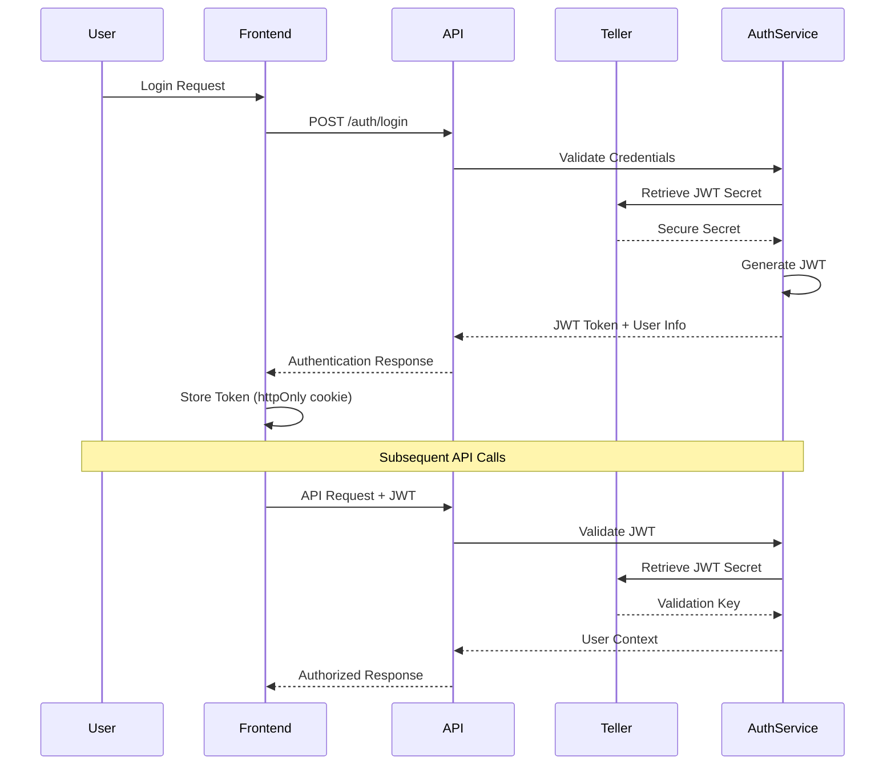

# UAP Security Design Specification

## Security Architecture Overview

The UAP platform implements a comprehensive security model based on zero-trust principles, with multiple layers of protection across authentication, authorization, data protection, and infrastructure security.

## 1. Authentication and Authorization

### 1.1 Authentication Flow



### 1.2 JWT Token Structure

```typescript
interface JWTPayload {
  sub: string;        // User ID
  email: string;      // User email
  username: string;   // Username
  roles: string[];    // User roles
  permissions: string[];  // Specific permissions
  iat: number;        // Issued at
  exp: number;        // Expiration
  aud: string;        // Audience (UAP platform)
  iss: string;        // Issuer
  jti: string;        // JWT ID for revocation
}
```

### 1.3 Role-Based Access Control (RBAC)

```python
from enum import Enum
from typing import List, Set

class Permission(Enum):
    # Agent management
    AGENT_CREATE = "agent:create"
    AGENT_READ = "agent:read"
    AGENT_UPDATE = "agent:update"
    AGENT_DELETE = "agent:delete"
    AGENT_EXECUTE = "agent:execute"
    
    # System management
    SYSTEM_CONFIG = "system:config"
    SYSTEM_METRICS = "system:metrics"
    SYSTEM_LOGS = "system:logs"
    
    # User management
    USER_CREATE = "user:create"
    USER_READ = "user:read"
    USER_UPDATE = "user:update"
    USER_DELETE = "user:delete"

class Role(Enum):
    ADMIN = "admin"
    DEVELOPER = "developer"
    USER = "user"
    READONLY = "readonly"

ROLE_PERMISSIONS = {
    Role.ADMIN: [
        Permission.AGENT_CREATE, Permission.AGENT_READ, 
        Permission.AGENT_UPDATE, Permission.AGENT_DELETE, 
        Permission.AGENT_EXECUTE, Permission.SYSTEM_CONFIG,
        Permission.SYSTEM_METRICS, Permission.SYSTEM_LOGS,
        Permission.USER_CREATE, Permission.USER_READ,
        Permission.USER_UPDATE, Permission.USER_DELETE
    ],
    Role.DEVELOPER: [
        Permission.AGENT_CREATE, Permission.AGENT_READ,
        Permission.AGENT_UPDATE, Permission.AGENT_EXECUTE,
        Permission.SYSTEM_METRICS
    ],
    Role.USER: [
        Permission.AGENT_READ, Permission.AGENT_EXECUTE
    ],
    Role.READONLY: [
        Permission.AGENT_READ, Permission.SYSTEM_METRICS
    ]
}

def check_permission(user_roles: List[Role], required_permission: Permission) -> bool:
    """Check if user has required permission based on roles"""
    user_permissions = set()
    for role in user_roles:
        user_permissions.update(ROLE_PERMISSIONS.get(role, []))
    return required_permission in user_permissions
```

## 2. Secrets Management with Teller

### 2.1 Teller Configuration

```yaml
# .teller.yml - Production secrets configuration
project: uap-production
opts:
  region: us-central1
  stage: production
  redact_with: '***REDACTED***'

providers:
  # Primary secret store - Google Secret Manager
  google_secret_manager:
    env_sync:
      path: secretmanager/projects/uap-prod/secrets/
    
  # Backup secret store - HashiCorp Vault  
  hashicorp_vault:
    env_sync:
      path: kv/data/uap/
      address: https://vault.company.com
      role_id: "{{ .Env.VAULT_ROLE_ID }}"
      secret_id: "{{ .Env.VAULT_SECRET_ID }}"

env:
  # Authentication secrets
  JWT_SECRET:
    provider: google_secret_manager
    path: jwt-secret/versions/latest
    redact_with: '***JWT***'
    
  # Database credentials
  DATABASE_URL:
    provider: google_secret_manager
    path: database-url/versions/latest
    redact_with: '***DB***'
    
  # LLM API Keys
  OPENAI_API_KEY:
    provider: google_secret_manager
    path: openai-api-key/versions/latest
    redact_with: '***OPENAI***'
    
  ANTHROPIC_API_KEY:
    provider: google_secret_manager
    path: anthropic-api-key/versions/latest
    redact_with: '***ANTHROPIC***'
    
  # External service keys
  TAVILY_API_KEY:
    provider: google_secret_manager
    path: tavily-api-key/versions/latest
    redact_with: '***TAVILY***'
    
  # Monitoring and observability
  SENTRY_DSN:
    provider: google_secret_manager
    path: sentry-dsn/versions/latest
    redact_with: '***SENTRY***'
```

### 2.2 Secret Rotation Strategy

```python
from datetime import datetime, timedelta
from typing import Dict, List

class SecretRotationManager:
    """Manages automatic secret rotation"""
    
    def __init__(self, teller_client, notification_service):
        self.teller_client = teller_client
        self.notification_service = notification_service
        self.rotation_schedule = {
            'JWT_SECRET': timedelta(days=30),
            'DATABASE_PASSWORD': timedelta(days=90),
            'API_KEYS': timedelta(days=180)
        }
    
    async def check_rotation_needed(self) -> List[str]:
        """Check which secrets need rotation"""
        secrets_to_rotate = []
        
        for secret_name, rotation_period in self.rotation_schedule.items():
            last_rotation = await self.get_last_rotation_date(secret_name)
            if datetime.utcnow() - last_rotation > rotation_period:
                secrets_to_rotate.append(secret_name)
        
        return secrets_to_rotate
    
    async def rotate_secret(self, secret_name: str) -> bool:
        """Rotate a specific secret"""
        try:
            # Generate new secret value
            new_value = self.generate_secure_value(secret_name)
            
            # Update in secret store
            await self.teller_client.update_secret(secret_name, new_value)
            
            # Trigger application restart if needed
            if secret_name in ['JWT_SECRET', 'DATABASE_PASSWORD']:
                await self.trigger_rolling_restart()
            
            # Log rotation event
            await self.log_rotation_event(secret_name)
            
            return True
        except Exception as e:
            await self.notification_service.alert(
                f"Failed to rotate secret {secret_name}: {str(e)}"
            )
            return False
```

## 3. Data Protection

### 3.1 Encryption at Rest

```python
from cryptography.fernet import Fernet
from cryptography.hazmat.primitives import hashes
from cryptography.hazmat.primitives.kdf.pbkdf2 import PBKDF2HMAC
import base64
import os

class DataEncryption:
    """Handles data encryption/decryption at rest"""
    
    def __init__(self, master_key: str):
        self.master_key = master_key.encode()
        self.cipher_suite = self._create_cipher_suite()
    
    def _create_cipher_suite(self) -> Fernet:
        """Create Fernet cipher suite from master key"""
        salt = os.urandom(16)
        kdf = PBKDF2HMAC(
            algorithm=hashes.SHA256(),
            length=32,
            salt=salt,
            iterations=100000,
        )
        key = base64.urlsafe_b64encode(kdf.derive(self.master_key))
        return Fernet(key)
    
    def encrypt_sensitive_data(self, data: str) -> str:
        """Encrypt sensitive data before storage"""
        encrypted_data = self.cipher_suite.encrypt(data.encode())
        return base64.urlsafe_b64encode(encrypted_data).decode()
    
    def decrypt_sensitive_data(self, encrypted_data: str) -> str:
        """Decrypt sensitive data after retrieval"""
        decoded_data = base64.urlsafe_b64decode(encrypted_data.encode())
        decrypted_data = self.cipher_suite.decrypt(decoded_data)
        return decrypted_data.decode()

# Database column encryption for sensitive fields
class EncryptedField:
    """SQLAlchemy field type for automatic encryption"""
    
    def __init__(self, encryption_service: DataEncryption):
        self.encryption_service = encryption_service
    
    def process_bind_param(self, value, dialect):
        if value is not None:
            return self.encryption_service.encrypt_sensitive_data(value)
        return value
    
    def process_result_value(self, value, dialect):
        if value is not None:
            return self.encryption_service.decrypt_sensitive_data(value)
        return value
```

### 3.2 Encryption in Transit

```python
from fastapi import FastAPI, Request
from fastapi.middleware.trustedhost import TrustedHostMiddleware
from fastapi.middleware.httpsredirect import HTTPSRedirectMiddleware
import ssl

def configure_tls_security(app: FastAPI):
    """Configure TLS security for the application"""
    
    # Force HTTPS in production
    if os.getenv("ENVIRONMENT") == "production":
        app.add_middleware(HTTPSRedirectMiddleware)
    
    # Restrict trusted hosts
    app.add_middleware(
        TrustedHostMiddleware, 
        allowed_hosts=[
            "uap.company.com",
            "api.uap.company.com",
            "*.uap.company.com"
        ]
    )
    
    # Security headers middleware
    @app.middleware("http")
    async def add_security_headers(request: Request, call_next):
        response = await call_next(request)
        
        # HSTS header
        response.headers["Strict-Transport-Security"] = (
            "max-age=31536000; includeSubDomains; preload"
        )
        
        # Content security policy
        response.headers["Content-Security-Policy"] = (
            "default-src 'self'; "
            "script-src 'self' 'unsafe-inline' https://cdn.jsdelivr.net; "
            "style-src 'self' 'unsafe-inline' https://fonts.googleapis.com; "
            "font-src 'self' https://fonts.gstatic.com; "
            "connect-src 'self' wss://api.uap.company.com; "
            "img-src 'self' data: https:;"
        )
        
        # Other security headers
        response.headers["X-Content-Type-Options"] = "nosniff"
        response.headers["X-Frame-Options"] = "DENY"
        response.headers["X-XSS-Protection"] = "1; mode=block"
        response.headers["Referrer-Policy"] = "strict-origin-when-cross-origin"
        
        return response

# TLS configuration for production
def create_ssl_context():
    """Create SSL context with strong security settings"""
    context = ssl.create_default_context(ssl.Purpose.CLIENT_AUTH)
    context.minimum_version = ssl.TLSVersion.TLSv1_3
    context.set_ciphers('ECDHE+AESGCM:ECDHE+CHACHA20:DHE+AESGCM:DHE+CHACHA20:!aNULL:!MD5:!DSS')
    context.load_cert_chain('/path/to/cert.pem', '/path/to/key.pem')
    return context
```

## 4. Input Validation and Sanitization

### 4.1 Request Validation

```python
from pydantic import BaseModel, validator, Field
from typing import Optional, List
import re
import html

class SecureAgentRequest(BaseModel):
    """Secure agent request with input validation"""
    
    message: str = Field(..., min_length=1, max_length=10000)
    framework: Optional[str] = Field(default="auto", regex="^(auto|copilot|agno|mastra)$")
    context: Optional[dict] = Field(default_factory=dict, max_items=20)
    
    @validator('message')
    def sanitize_message(cls, v):
        """Sanitize message content"""
        # Remove potentially dangerous HTML/script tags
        v = html.escape(v)
        
        # Remove excessive whitespace
        v = re.sub(r'\s+', ' ', v).strip()
        
        # Block SQL injection patterns
        sql_patterns = [
            r"union\s+select", r"drop\s+table", r"delete\s+from",
            r"insert\s+into", r"update\s+set", r"exec\s*\("
        ]
        for pattern in sql_patterns:
            if re.search(pattern, v, re.IGNORECASE):
                raise ValueError("Potentially malicious content detected")
        
        return v
    
    @validator('context')
    def validate_context(cls, v):
        """Validate context dictionary"""
        if not isinstance(v, dict):
            raise ValueError("Context must be a dictionary")
        
        # Check for dangerous keys
        dangerous_keys = ['__class__', '__globals__', 'eval', 'exec', 'import']
        for key in v.keys():
            if any(dangerous in str(key).lower() for dangerous in dangerous_keys):
                raise ValueError(f"Dangerous key detected: {key}")
        
        # Limit value sizes
        for key, value in v.items():
            if isinstance(value, str) and len(value) > 1000:
                raise ValueError(f"Context value too large for key: {key}")
        
        return v

class RateLimitedRequest:
    """Rate limiting for API requests"""
    
    def __init__(self, redis_client):
        self.redis = redis_client
        self.limits = {
            'default': (100, 3600),  # 100 requests per hour
            'agent_chat': (50, 300),  # 50 messages per 5 minutes
            'document_upload': (10, 3600)  # 10 uploads per hour
        }
    
    async def check_rate_limit(self, user_id: str, endpoint: str) -> bool:
        """Check if user has exceeded rate limit"""
        limit_key = f"rate_limit:{user_id}:{endpoint}"
        limit, window = self.limits.get(endpoint, self.limits['default'])
        
        current_count = await self.redis.get(limit_key)
        if current_count is None:
            await self.redis.setex(limit_key, window, 1)
            return True
        
        if int(current_count) >= limit:
            return False
        
        await self.redis.incr(limit_key)
        return True
```

## 5. WebSocket Security

### 5.1 WebSocket Authentication

```python
from fastapi import WebSocket, HTTPException, status
from typing import Optional
import jwt

class WebSocketAuthenticator:
    """Handles WebSocket authentication and authorization"""
    
    def __init__(self, jwt_secret: str):
        self.jwt_secret = jwt_secret
    
    async def authenticate_websocket(
        self, 
        websocket: WebSocket, 
        token: Optional[str] = None
    ) -> dict:
        """Authenticate WebSocket connection"""
        
        if not token:
            # Try to get token from query parameters
            token = websocket.query_params.get("token")
        
        if not token:
            await websocket.close(code=status.WS_1008_POLICY_VIOLATION)
            raise HTTPException(
                status_code=401, 
                detail="Authentication token required"
            )
        
        try:
            # Decode and verify JWT token
            payload = jwt.decode(
                token, 
                self.jwt_secret, 
                algorithms=["HS256"],
                options={"verify_exp": True}
            )
            
            return {
                "user_id": payload.get("sub"),
                "username": payload.get("username"),
                "roles": payload.get("roles", []),
                "permissions": payload.get("permissions", [])
            }
            
        except jwt.ExpiredSignatureError:
            await websocket.close(code=status.WS_1008_POLICY_VIOLATION)
            raise HTTPException(status_code=401, detail="Token expired")
        
        except jwt.InvalidTokenError:
            await websocket.close(code=status.WS_1008_POLICY_VIOLATION)
            raise HTTPException(status_code=401, detail="Invalid token")

class WebSocketRateLimiter:
    """Rate limiting for WebSocket messages"""
    
    def __init__(self, redis_client):
        self.redis = redis_client
        self.message_limit = 30  # messages per minute
        self.window_size = 60    # seconds
    
    async def check_message_rate(self, user_id: str) -> bool:
        """Check if user can send another message"""
        key = f"ws_rate_limit:{user_id}"
        
        # Use sliding window rate limiting
        now = time.time()
        pipeline = self.redis.pipeline()
        
        # Remove old entries
        pipeline.zremrangebyscore(key, 0, now - self.window_size)
        
        # Count current messages
        pipeline.zcard(key)
        
        # Add current message
        pipeline.zadd(key, {str(uuid.uuid4()): now})
        
        # Set expiration
        pipeline.expire(key, self.window_size)
        
        results = await pipeline.execute()
        current_count = results[1]
        
        return current_count < self.message_limit
```

## 6. Audit Logging and Monitoring

### 6.1 Security Event Logging

```python
import logging
import json
from datetime import datetime
from typing import Dict, Any, Optional

class SecurityAuditLogger:
    """Comprehensive security event logging"""
    
    def __init__(self, logger_name: str = "security_audit"):
        self.logger = logging.getLogger(logger_name)
        
        # Configure structured logging
        handler = logging.StreamHandler()
        formatter = logging.Formatter(
            '%(asctime)s - %(name)s - %(levelname)s - %(message)s'
        )
        handler.setFormatter(formatter)
        self.logger.addHandler(handler)
        self.logger.setLevel(logging.INFO)
    
    def log_authentication_event(
        self, 
        user_id: Optional[str], 
        username: Optional[str],
        event_type: str, 
        success: bool,
        ip_address: str,
        user_agent: str,
        additional_info: Dict[str, Any] = None
    ):
        """Log authentication-related events"""
        event = {
            "event_category": "authentication",
            "event_type": event_type,
            "success": success,
            "user_id": user_id,
            "username": username,
            "ip_address": ip_address,
            "user_agent": user_agent,
            "timestamp": datetime.utcnow().isoformat(),
            "additional_info": additional_info or {}
        }
        
        level = logging.INFO if success else logging.WARNING
        self.logger.log(level, json.dumps(event))
    
    def log_authorization_event(
        self, 
        user_id: str,
        resource: str,
        action: str,
        allowed: bool,
        reason: Optional[str] = None
    ):
        """Log authorization events"""
        event = {
            "event_category": "authorization",
            "user_id": user_id,
            "resource": resource,
            "action": action,
            "allowed": allowed,
            "reason": reason,
            "timestamp": datetime.utcnow().isoformat()
        }
        
        level = logging.INFO if allowed else logging.WARNING
        self.logger.log(level, json.dumps(event))
    
    def log_security_incident(
        self,
        incident_type: str,
        severity: str,
        description: str,
        user_id: Optional[str] = None,
        ip_address: Optional[str] = None,
        evidence: Dict[str, Any] = None
    ):
        """Log security incidents"""
        event = {
            "event_category": "security_incident",
            "incident_type": incident_type,
            "severity": severity,
            "description": description,
            "user_id": user_id,
            "ip_address": ip_address,
            "evidence": evidence or {},
            "timestamp": datetime.utcnow().isoformat()
        }
        
        self.logger.error(json.dumps(event))
```

### 6.2 Intrusion Detection

```python
import asyncio
from collections import defaultdict, deque
from datetime import datetime, timedelta
from typing import Dict, List

class IntrusionDetectionSystem:
    """Real-time intrusion detection and alerting"""
    
    def __init__(self, alert_service):
        self.alert_service = alert_service
        self.failed_attempts = defaultdict(deque)
        self.suspicious_patterns = defaultdict(list)
        
        # Detection thresholds
        self.max_failed_attempts = 5
        self.time_window = timedelta(minutes=15)
        self.sql_injection_patterns = [
            r"union\s+select", r"drop\s+table", r"';--",
            r"exec\s*\(", r"<script", r"javascript:"
        ]
    
    async def analyze_request(
        self, 
        user_id: Optional[str],
        ip_address: str,
        request_data: Dict[str, Any]
    ) -> List[str]:
        """Analyze request for suspicious patterns"""
        alerts = []
        
        # Check for SQL injection attempts
        if self._detect_sql_injection(request_data):
            alerts.append("sql_injection_attempt")
            await self._log_incident(
                "sql_injection_attempt",
                user_id, ip_address, request_data
            )
        
        # Check for XSS attempts
        if self._detect_xss_attempt(request_data):
            alerts.append("xss_attempt")
            await self._log_incident(
                "xss_attempt", 
                user_id, ip_address, request_data
            )
        
        # Check for excessive failed login attempts
        if user_id and self._check_failed_attempts(user_id):
            alerts.append("brute_force_attempt")
            await self._log_incident(
                "brute_force_attempt",
                user_id, ip_address, {"attempt_count": len(self.failed_attempts[user_id])}
            )
        
        return alerts
    
    def _detect_sql_injection(self, data: Dict[str, Any]) -> bool:
        """Detect SQL injection patterns"""
        for value in self._flatten_dict_values(data):
            if isinstance(value, str):
                for pattern in self.sql_injection_patterns:
                    if re.search(pattern, value, re.IGNORECASE):
                        return True
        return False
    
    def _detect_xss_attempt(self, data: Dict[str, Any]) -> bool:
        """Detect XSS attack patterns"""
        xss_patterns = [r"<script", r"javascript:", r"onload=", r"onerror="]
        
        for value in self._flatten_dict_values(data):
            if isinstance(value, str):
                for pattern in xss_patterns:
                    if re.search(pattern, value, re.IGNORECASE):
                        return True
        return False
    
    async def _log_incident(
        self,
        incident_type: str,
        user_id: Optional[str],
        ip_address: str,
        evidence: Dict[str, Any]
    ):
        """Log security incident and send alert"""
        incident = {
            "type": incident_type,
            "user_id": user_id,
            "ip_address": ip_address,
            "timestamp": datetime.utcnow(),
            "evidence": evidence
        }
        
        # Send immediate alert for critical incidents
        if incident_type in ["sql_injection_attempt", "xss_attempt"]:
            await self.alert_service.send_critical_alert(incident)
```

## 7. Infrastructure Security

### 7.1 Container Security

```dockerfile
# Secure Docker image for production
FROM python:3.11-slim-bookworm

# Create non-root user
RUN groupadd -r uapuser && useradd -r -g uapuser uapuser

# Install only necessary packages
RUN apt-get update && \
    apt-get install -y --no-install-recommends \
    curl \
    && rm -rf /var/lib/apt/lists/*

# Set up application directory
WORKDIR /app
COPY requirements.txt .

# Install Python dependencies
RUN pip install --no-cache-dir --upgrade pip && \
    pip install --no-cache-dir -r requirements.txt

# Copy application code
COPY --chown=uapuser:uapuser . .

# Remove unnecessary files
RUN find /app -name "*.pyc" -delete && \
    find /app -name "__pycache__" -delete

# Switch to non-root user
USER uapuser

# Health check
HEALTHCHECK --interval=30s --timeout=10s --start-period=5s --retries=3 \
    CMD curl -f http://localhost:8000/health || exit 1

# Expose port
EXPOSE 8000

# Run application
CMD ["uvicorn", "backend.main:app", "--host", "0.0.0.0", "--port", "8000"]
```

### 7.2 Kubernetes Security Policies

```yaml
# Pod Security Policy
apiVersion: policy/v1beta1
kind: PodSecurityPolicy
metadata:
  name: uap-restricted
spec:
  privileged: false
  allowPrivilegeEscalation: false
  requiredDropCapabilities:
    - ALL
  volumes:
    - 'configMap'
    - 'emptyDir'
    - 'projected'
    - 'secret'
    - 'downwardAPI'
    - 'persistentVolumeClaim'
  runAsUser:
    rule: 'MustRunAsNonRoot'
  seLinux:
    rule: 'RunAsAny'
  fsGroup:
    rule: 'RunAsAny'

---
# Network Policy
apiVersion: networking.k8s.io/v1
kind: NetworkPolicy
metadata:
  name: uap-network-policy
spec:
  podSelector:
    matchLabels:
      app: uap-backend
  policyTypes:
  - Ingress
  - Egress
  ingress:
  - from:
    - podSelector:
        matchLabels:
          app: uap-frontend
    - namespaceSelector:
        matchLabels:
          name: uap-system
    ports:
    - protocol: TCP
      port: 8000
  egress:
  - to:
    - podSelector:
        matchLabels:
          app: postgres
    ports:
    - protocol: TCP
      port: 5432
  - to:
    - podSelector:
        matchLabels:
          app: redis
    ports:
    - protocol: TCP
      port: 6379
```

This security design provides comprehensive protection across all layers of the UAP platform, ensuring data confidentiality, integrity, and availability while maintaining usability and performance.