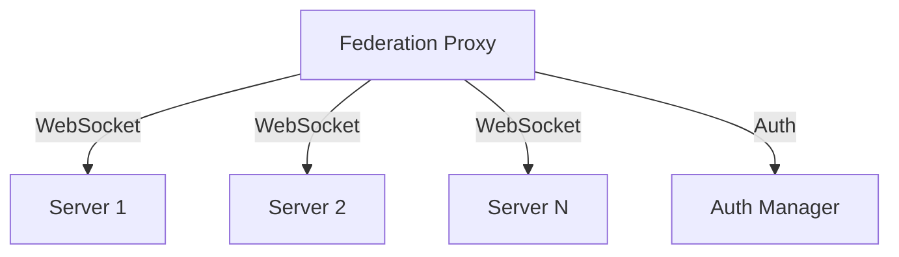

# Federated MCP Architecture

## System Overview

The Federated MCP (Message Control Protocol) is a distributed system that enables secure communication and coordination between multiple servers in a federated network. It uses WebSocket connections for real-time communication and JWT for authentication.

## Core Components

### 1. Federation Proxy

The Federation Proxy is the central component that manages connections between federated servers. It:
- Maintains WebSocket connections to multiple servers
- Handles authentication and authorization
- Manages server registration and removal
- Monitors connection health



### 2. Authentication Manager

The Authentication Manager handles security aspects:
- JWT token generation and validation
- Server authentication
- Session management
- Security policy enforcement

### 3. Server Registry

Maintains information about connected servers:
- Server configurations
- Connection states
- Endpoint information
- Authentication details

## Communication Flow

1. **Server Registration**
   ```mermaid
   sequenceDiagram
       Server->>Proxy: Registration Request
       Proxy->>AuthManager: Generate Token
       AuthManager->>Proxy: JWT Token
       Proxy->>Server: Establish WebSocket
       Server->>Proxy: Connection Confirmation
   ```

2. **Message Exchange**
   ```mermaid
   sequenceDiagram
       Server1->>Proxy: Send Message
       Proxy->>AuthManager: Validate Token
       Proxy->>Server2: Forward Message
       Server2->>Proxy: Acknowledgment
       Proxy->>Server1: Confirm Delivery
   ```

## Security Model

### Authentication

- JWT-based authentication
- Token structure:
  ```json
  {
    "serverId": "unique-server-id",
    "type": "federation",
    "iat": 1234567890,
    "exp": 1234567890
  }
  ```

### Connection Security

1. **Transport Layer**
   - Secure WebSocket (WSS) connections
   - TLS/SSL encryption
   - Certificate validation

2. **Application Layer**
   - Token-based authentication
   - Message signing
   - Rate limiting
   - Connection timeouts

## Data Flow

### 1. Control Channel (WebSocket)
- Server registration
- Connection management
- Health checks
- System messages

### 2. Data Channel (HTTP)
- Resource exchange
- Bulk data transfer
- File sharing
- API interactions

## System States

1. **Initialization**
   - Load configuration
   - Initialize components
   - Setup security

2. **Operation**
   - Active connections
   - Message routing
   - Health monitoring

3. **Error Handling**
   - Connection failures
   - Authentication errors
   - System recovery

## Scalability Considerations

### 1. Connection Management
- Connection pooling
- Load balancing
- Resource limits

### 2. Performance
- Message queuing
- Batch processing
- Caching strategies

### 3. Reliability
- Automatic reconnection
- Error recovery
- State persistence

## Implementation Guidelines

1. **Component Isolation**
   - Separate concerns
   - Clear interfaces
   - Modular design

2. **Error Handling**
   - Graceful degradation
   - Detailed logging
   - Recovery procedures

3. **Testing**
   - Unit tests
   - Integration tests
   - Load testing

## Future Considerations

1. **Scalability**
   - Horizontal scaling
   - Clustering support
   - Load distribution

2. **Features**
   - Enhanced security
   - Advanced monitoring
   - Additional protocols

3. **Integration**
   - Third-party systems
   - Additional authentication methods
   - Extended API support

## System Requirements

### Software
- Deno runtime
- WebSocket support
- JWT library

### Hardware
- Network connectivity
- Sufficient memory
- Processing power

### Network
- WebSocket support
- Stable connections
- Proper firewall configuration

## Monitoring and Maintenance

1. **Health Checks**
   - Connection status
   - System metrics
   - Performance monitoring

2. **Logging**
   - Operation logs
   - Error tracking
   - Audit trails

3. **Maintenance**
   - Regular updates
   - Security patches
   - Performance optimization
