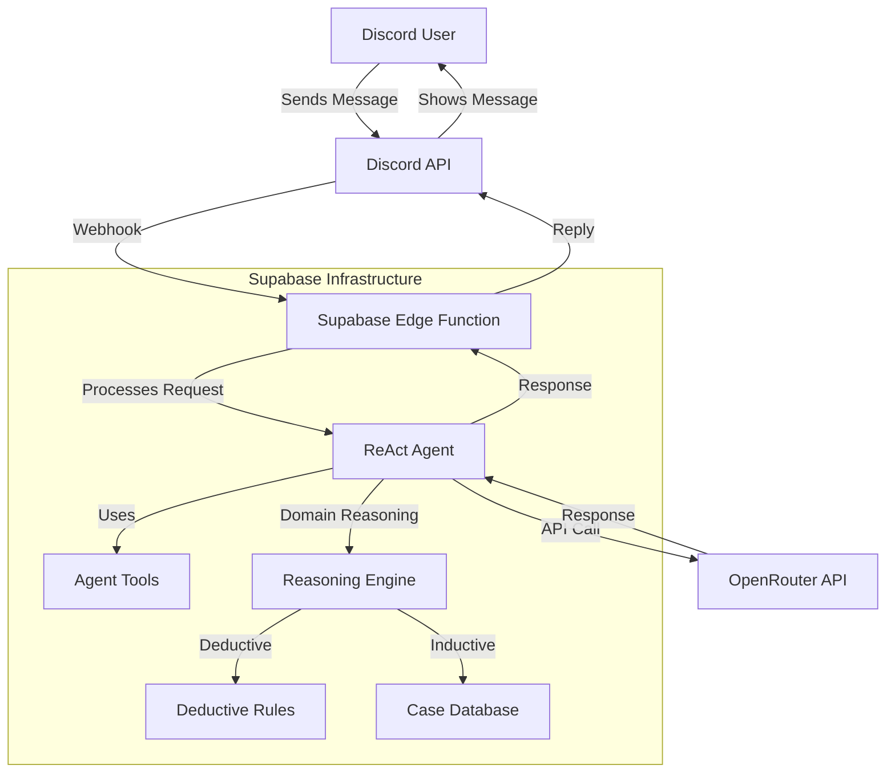
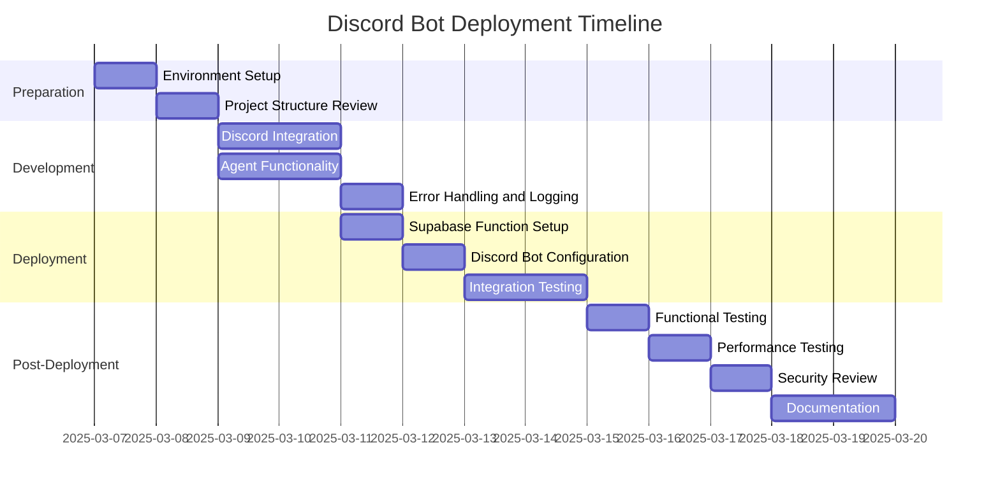

# Discord Bot Deployment Plan: Agentics Foundation Bot

## 1. Project Overview

The Agentics Foundation bot is a Discord bot implementation that uses a ReAct (Reasoning + Acting) agent powered by OpenRouter API for LLM interactions. The bot follows a reasoning and acting pattern to process user queries, with support for tools and domain-specific reasoning capabilities.

### Architecture Diagram



## 2. Preparation Steps

1. **Environment Setup**
   - Ensure Supabase CLI is installed and configured
   - Verify OpenRouter API key is available
   - Set up Discord Developer account and create a bot application

2. **Project Structure Review**
   - Confirm all necessary files are present
   - Verify dependencies and imports
   - Check for any security concerns in the code

## 3. Development Tasks

1. **Discord Integration**
   - Modify the HTTP handler in agent.ts to properly handle Discord interaction payloads
   - Implement Discord's interaction verification requirements
   - Add proper response formatting for Discord messages

2. **Agent Functionality**
   - Review and enhance the ReAct agent implementation
   - Ensure the reasoning engine is properly integrated
   - Verify tool implementations are working correctly

3. **Error Handling and Logging**
   - Implement comprehensive error handling
   - Add logging for monitoring and debugging
   - Create fallback responses for error scenarios

## 4. Deployment Process

1. **Supabase Edge Function Setup**
   - Create a new edge function in Supabase project
   - Configure environment variables (OpenRouter API key)
   - Deploy the function with appropriate settings

2. **Discord Bot Configuration**
   - Register slash commands for the bot
   - Set up the interaction endpoint URL
   - Configure necessary bot permissions

3. **Integration Testing**
   - Test the deployed function with sample Discord interactions
   - Verify the bot responds correctly to different query types
   - Test error scenarios and rate limiting

## 5. Testing and Verification

1. **Functional Testing**
   - Test basic queries and responses
   - Test tool usage scenarios
   - Test domain-specific reasoning capabilities

2. **Performance Testing**
   - Measure response times
   - Test under load conditions
   - Verify Supabase function execution limits

3. **Security Review**
   - Verify API key handling
   - Check for potential vulnerabilities
   - Ensure proper input validation

## 6. Maintenance and Monitoring

1. **Monitoring Setup**
   - Configure logging and alerting
   - Set up performance monitoring
   - Implement usage tracking

2. **Update Strategy**
   - Define process for deploying updates
   - Plan for handling breaking changes
   - Document rollback procedures

3. **Documentation**
   - Create user documentation
   - Document the deployment process
   - Provide troubleshooting guides

## 7. Implementation Timeline



## 8. Detailed Implementation Steps

### 8.1 Discord Integration

1. Modify the HTTP handler in agent.ts to handle Discord's interaction format:
   ```typescript
   serve(async (req: Request) => {
     if (req.method !== "POST") {
       return new Response("Method Not Allowed", { status: 405 });
     }

     const data = await req.json();
     
     // Discord Slash Command interaction handling
     const query = data?.data?.options?.[0]?.value;
     if (!query) {
       return new Response(JSON.stringify({ type: 4, data: { content: "No query provided." } }), {
         headers: { "Content-Type": "application/json" },
       });
     }

     try {
       const answer = await runAgent(query);
       return new Response(JSON.stringify({
         type: 4,
         data: { content: answer }
       }), {
         headers: { "Content-Type": "application/json" }
       });
     } catch (err) {
       console.error("Agent error:", err);
       return new Response(JSON.stringify({
         type: 4,
         data: { content: "Agent error: " + (err as Error).message }
       }), {
         headers: { "Content-Type": "application/json" },
       });
     }
   });
   ```

2. Implement Discord's interaction verification (if required):
   ```typescript
   // Add this before processing the request
   const signature = req.headers.get('x-signature-ed25519');
   const timestamp = req.headers.get('x-signature-timestamp');
   // Verify signature logic here
   ```

### 8.2 Supabase Deployment

1. Create a new edge function:
   ```bash
   supabase functions new discord-agent-bot
   ```

2. Copy the agent.ts file to the function directory:
   ```bash
   cp agent.ts .supabase/functions/discord-agent-bot/index.ts
   ```

3. Set the OpenRouter API key:
   ```bash
   supabase secrets set OPENROUTER_API_KEY=your_key
   ```

4. Deploy the function:
   ```bash
   supabase functions deploy discord-agent-bot --no-verify-jwt
   ```

### 8.3 Discord Bot Setup

1. Create a new application in the Discord Developer Portal
2. Add a bot to the application
3. Enable the Message Content Intent
4. Create a slash command for the bot
5. Set the Interactions Endpoint URL to the Supabase function URL
6. Generate an invite link and add the bot to your server

## 9. Potential Challenges and Mitigations

1. **Cold Start Latency**
   - Challenge: Supabase Edge Functions have cold start times
   - Mitigation: Optimize code for faster startup, consider keeping the function warm

2. **Rate Limiting**
   - Challenge: Discord and OpenRouter have rate limits
   - Mitigation: Implement rate limiting handling and queuing mechanisms

3. **Token Usage Costs**
   - Challenge: OpenRouter API usage incurs costs based on token usage
   - Mitigation: Monitor usage, implement token counting, set usage limits

4. **Error Handling**
   - Challenge: Various failure points in the system
   - Mitigation: Comprehensive error handling and fallback mechanisms