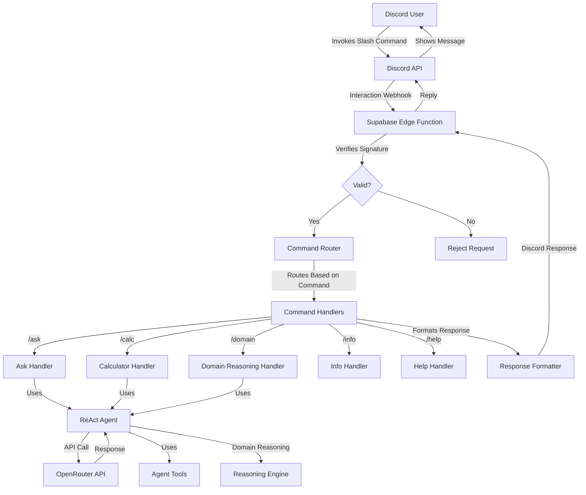
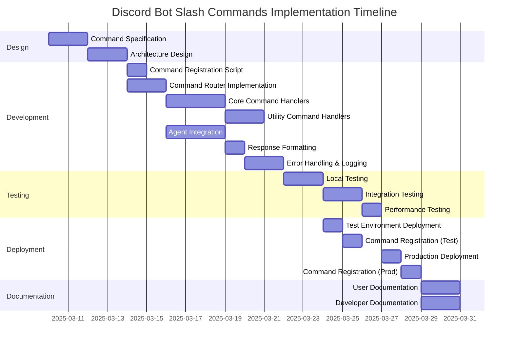

# Discord Bot Slash Commands Implementation Plan

## 1. Overview

This plan outlines the implementation of Discord slash commands for the Agentics Foundation Bot, which uses a ReAct (Reasoning + Acting) agent powered by OpenRouter API. The implementation will maintain all existing functionality while adding a variety of useful slash commands to enhance user interaction.

### Architecture Diagram



## 2. Slash Commands Specification

### Core Commands

1. **`/ask [query:string]`**
   - Description: Ask the agent any question or give it a task
   - Parameters: 
     - `query` (required): The question or task for the agent
   - Example: `/ask What is the capital of France?`

2. **`/calc [expression:string]`**
   - Description: Perform a calculation using the agent's calculator tool
   - Parameters:
     - `expression` (required): The mathematical expression to evaluate
   - Example: `/calc (15 * 4) / 2 + 10`

3. **`/domain [domain:string] [query:string] [reasoning_type:string]`**
   - Description: Use domain-specific reasoning for specialized queries
   - Parameters:
     - `domain` (required): The domain for reasoning (financial, medical, legal)
     - `query` (required): The question to answer
     - `reasoning_type` (optional): Type of reasoning to use (deductive, inductive, both)
   - Example: `/domain financial What should I invest in? deductive`

### Utility Commands

4. **`/info`**
   - Description: Get information about the bot, its capabilities, and usage statistics
   - No parameters
   - Example: `/info`

5. **`/help [command:string]`**
   - Description: Get help on how to use the bot or a specific command
   - Parameters:
     - `command` (optional): The specific command to get help for
   - Example: `/help domain`

### Advanced Commands (Future Implementation)

6. **`/memory [action:string] [key:string] [value:string]`**
   - Description: Manage the bot's memory for persistent information
   - Parameters:
     - `action` (required): The action to perform (store, retrieve, list, delete)
     - `key` (conditional): The key to store/retrieve/delete
     - `value` (conditional): The value to store (for store action)
   - Example: `/memory store favorite_color blue`

7. **`/tool [tool_name:string] [input:string]`**
   - Description: Directly use a specific tool without going through the agent
   - Parameters:
     - `tool_name` (required): The name of the tool to use
     - `input` (required): The input for the tool
   - Example: `/tool calculator 2+2*3`

## 3. Implementation Plan

### 3.1 Command Registration with Discord

1. **Define Command Schema**
   - Create JSON schema for each command following Discord's API format
   - Include name, description, and options with appropriate types
   - Example for `/ask` command:
   ```json
   {
     "name": "ask",
     "description": "Ask the agent any question or give it a task",
     "options": [
       {
         "name": "query",
         "description": "Your question or task",
         "type": 3,
         "required": true
       }
     ]
   }
   ```

2. **Register Commands with Discord API**
   - Create a registration script that uses Discord's API to register all commands
   - Support for both global commands and guild-specific commands for testing
   - Include proper error handling and validation

### 3.2 Command Handling Implementation

1. **Command Router**
   - Implement a router that inspects the incoming interaction and routes to the appropriate handler
   - Extract command name from `body.data.name`
   - Support for subcommands using `body.data.options`
   - Example:
   ```typescript
   function routeCommand(interaction: DiscordInteraction): Promise<Response> {
     const commandName = interaction.data.name;
     
     switch (commandName) {
       case "ask":
         return handleAskCommand(interaction);
       case "calc":
         return handleCalcCommand(interaction);
       case "domain":
         return handleDomainCommand(interaction);
       // Additional commands...
       default:
         return handleUnknownCommand(interaction);
     }
   }
   ```

2. **Command Handlers**
   - Create separate handler functions for each command
   - Extract parameters from the interaction data
   - Process the command and generate a response
   - Example for the `/ask` command:
   ```typescript
   async function handleAskCommand(interaction: DiscordInteraction): Promise<Response> {
     const query = interaction.data.options.find(opt => opt.name === "query")?.value;
     
     if (!query) {
       return createResponse("Please provide a query.", true);
     }
     
     try {
       const answer = await runAgent(query);
       return createResponse(answer);
     } catch (err) {
       console.error("Error in ask command:", err);
       return createResponse(`Error: ${(err as Error).message}`, true);
     }
   }
   ```

3. **Response Formatting**
   - Create utility functions for formatting responses according to Discord's API
   - Support for different response types (immediate, deferred, followup)
   - Handle message length limitations and formatting
   - Example:
   ```typescript
   function createResponse(content: string, isError = false): Response {
     // Truncate content if it exceeds Discord's limit
     if (content.length > 2000) {
       content = content.substring(0, 1997) + "...";
     }
     
     return new Response(
       JSON.stringify({
         type: 4, // CHANNEL_MESSAGE_WITH_SOURCE
         data: {
           content: isError ? `⚠️ ${content}` : content,
           // Add embeds, components, etc. as needed
         }
       }),
       { 
         headers: { "Content-Type": "application/json" },
         status: 200
       }
     );
   }
   ```

### 3.3 Integration with ReAct Agent

1. **Agent Interface**
   - Modify the agent interface to support different command types
   - Add context information about the command source
   - Example:
   ```typescript
   interface AgentContext {
     commandType: string;
     userId: string;
     guildId?: string;
     channelId?: string;
   }
   
   async function runAgent(query: string, context?: AgentContext): Promise<string> {
     // Existing agent code with added context
   }
   ```

2. **Tool Integration**
   - Enhance existing tools and add new ones to support slash commands
   - Create direct tool access for the `/tool` command
   - Example for calculator tool:
   ```typescript
   const calculatorTool: Tool = {
     name: "Calculator",
     description: "Performs arithmetic calculations",
     run: (input: string) => {
       try {
         if (!/^[0-9.+\-*\/()\s]+$/.test(input)) {
           return "Invalid expression";
         }
         const result = Function("return (" + input + ")")();
         return String(result);
       } catch (err) {
         return "Error: " + (err as Error).message;
       }
     }
   };
   
   // Direct access for /calc command
   async function handleCalcCommand(interaction: DiscordInteraction): Promise<Response> {
     const expression = interaction.data.options.find(opt => opt.name === "expression")?.value;
     
     if (!expression) {
       return createResponse("Please provide an expression to calculate.", true);
     }
     
     const result = calculatorTool.run(expression);
     return createResponse(`Calculation: ${expression}\nResult: ${result}`);
   }
   ```

3. **Domain-Specific Reasoning**
   - Enhance the domain reasoning capabilities for the `/domain` command
   - Support for different reasoning types
   - Example:
   ```typescript
   async function handleDomainCommand(interaction: DiscordInteraction): Promise<Response> {
     const domain = interaction.data.options.find(opt => opt.name === "domain")?.value;
     const query = interaction.data.options.find(opt => opt.name === "query")?.value;
     const reasoningType = interaction.data.options.find(opt => opt.name === "reasoning_type")?.value || "both";
     
     if (!domain || !query) {
       return createResponse("Please provide both domain and query parameters.", true);
     }
     
     // Validate domain and reasoning type
     if (!["financial", "medical", "legal"].includes(domain)) {
       return createResponse("Invalid domain. Supported domains: financial, medical, legal", true);
     }
     
     if (!["deductive", "inductive", "both"].includes(reasoningType)) {
       return createResponse("Invalid reasoning type. Supported types: deductive, inductive, both", true);
     }
     
     try {
       // Create a domain-specific query object
       const domainQuery = JSON.stringify({
         domain,
         query,
         reasoningType
       });
       
       const answer = await runAgent(domainQuery);
       return createResponse(answer);
     } catch (err) {
       console.error("Error in domain command:", err);
       return createResponse(`Error: ${(err as Error).message}`, true);
     }
   }
   ```

### 3.4 Edge Function Integration

1. **Main Handler**
   - Update the main handler to process Discord interactions
   - Verify signatures for all requests
   - Route to appropriate command handlers
   - Example:
   ```typescript
   Deno.serve(async (req) => {
     // Only handle POST requests
     if (req.method !== "POST") {
       return new Response("Method Not Allowed", { status: 405 });
     }
   
     try {
       // Get the signature and timestamp headers
       const signature = req.headers.get("X-Signature-Ed25519");
       const timestamp = req.headers.get("X-Signature-Timestamp");
       
       // Get the raw request body as text
       const bodyText = await req.text();
       
       // Verify the request signature
       if (signature && timestamp && DISCORD_PUBLIC_KEY) {
         const isValidRequest = await verifyDiscordRequest(
           DISCORD_PUBLIC_KEY,
           signature,
           timestamp,
           bodyText
         );
         
         if (!isValidRequest) {
           console.error("Invalid request signature");
           return new Response("Invalid request signature", { status: 401 });
         }
       } else {
         console.warn("Missing signature, timestamp, or public key - skipping verification");
       }
       
       // Parse the request body as JSON
       const interaction = JSON.parse(bodyText);
       
       // Handle Discord ping (verification) request
       if (interaction.type === 1) {
         return new Response(
           JSON.stringify({ type: 1 }),
           { 
             headers: { "Content-Type": "application/json" },
             status: 200
           }
         );
       }
       
       // Handle slash command interactions (type 2)
       if (interaction.type === 2) {
         return await routeCommand(interaction);
       }
       
       // Unhandled interaction type
       return new Response(
         JSON.stringify({ error: "Unhandled interaction type" }),
         { 
           headers: { "Content-Type": "application/json" },
           status: 400
         }
       );
     } catch (error) {
       console.error("Error processing request:", error);
       return new Response(
         JSON.stringify({ error: "Failed to process request" }),
         { 
           headers: { "Content-Type": "application/json" },
           status: 500
         }
       );
     }
   });
   ```

2. **Error Handling and Logging**
   - Implement comprehensive error handling for all commands
   - Add detailed logging for debugging and monitoring
   - Create user-friendly error messages

## 4. Testing Strategy

### 4.1 Local Testing

1. **Mock Discord Interactions**
   - Create mock interaction payloads for each command
   - Test with and without valid signatures
   - Verify response format and content

2. **Command Handler Testing**
   - Test each command handler with various inputs
   - Verify error handling for invalid inputs
   - Test edge cases and boundary conditions

### 4.2 Integration Testing

1. **End-to-End Testing**
   - Deploy to a test environment
   - Register commands with a test Discord server
   - Test each command with real Discord interactions

2. **Performance Testing**
   - Measure response times for different commands
   - Test under load conditions
   - Verify edge function execution limits

## 5. Deployment Process

### 5.1 Command Registration

1. **Development Registration**
   - Register commands to a test guild for development
   - Use Discord's API for quick updates during development
   - Example script:
   ```typescript
   async function registerCommands(guildId?: string) {
     const endpoint = guildId 
       ? `https://discord.com/api/v10/applications/${APPLICATION_ID}/guilds/${guildId}/commands`
       : `https://discord.com/api/v10/applications/${APPLICATION_ID}/commands`;
     
     const response = await fetch(endpoint, {
       method: 'PUT',
       headers: {
         'Authorization': `Bot ${BOT_TOKEN}`,
         'Content-Type': 'application/json',
       },
       body: JSON.stringify(commands),
     });
     
     if (!response.ok) {
       const text = await response.text();
       throw new Error(`Error registering commands: ${response.status} ${text}`);
     }
     
     return await response.json();
   }
   ```

2. **Production Registration**
   - Register global commands for production
   - Document the registration process
   - Include rollback procedures

### 5.2 Edge Function Deployment

1. **Supabase Deployment**
   - Deploy the updated edge function to Supabase
   - Set required environment variables
   - Test the deployed function

2. **Discord Integration**
   - Update the interaction URL in Discord Developer Portal
   - Verify the integration is working correctly

## 6. Monitoring and Maintenance

### 6.1 Usage Monitoring

1. **Command Usage Tracking**
   - Track usage of each command
   - Monitor error rates and response times
   - Identify popular commands and potential issues

2. **Resource Usage**
   - Monitor OpenRouter API usage and costs
   - Track edge function execution time and memory usage
   - Set up alerts for abnormal usage patterns

### 6.2 Maintenance Plan

1. **Regular Updates**
   - Schedule regular updates for bug fixes and improvements
   - Document update procedures and testing requirements
   - Maintain backward compatibility when possible

2. **Feature Expansion**
   - Plan for adding new commands and features
   - Gather user feedback for improvements
   - Prioritize features based on usage and impact

## 7. Implementation Timeline



## 8. Conclusion

This implementation plan provides a comprehensive approach to adding Discord slash commands to the Agentics Foundation Bot. By following this plan, we will create a robust, user-friendly interface for interacting with the ReAct agent through Discord, while maintaining all existing functionality and adding new useful components.

The modular design allows for easy expansion with new commands in the future, and the comprehensive testing strategy ensures a reliable user experience. The deployment process is designed to minimize disruption and provide a smooth transition to the new command system.