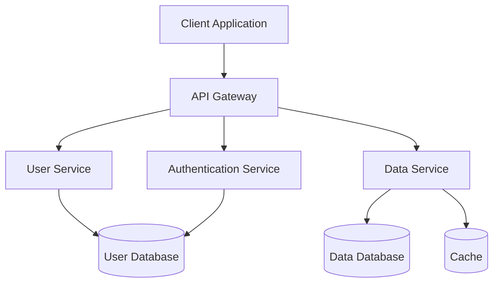
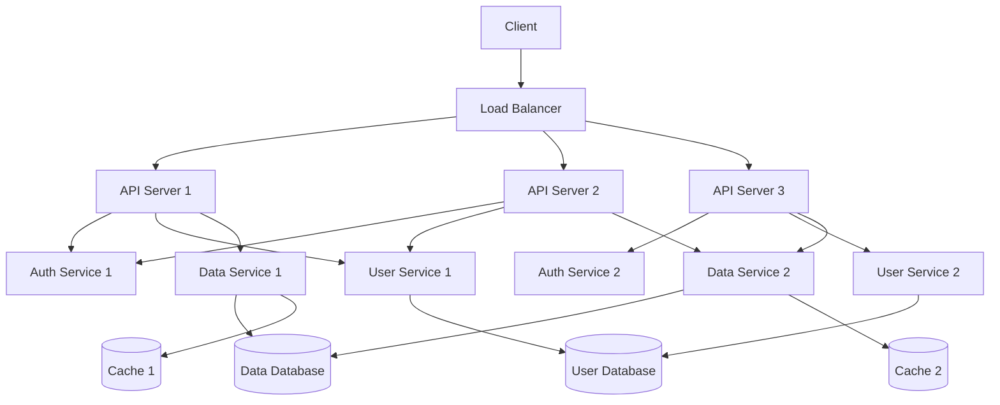

# Project Architecture

## System Overview

[Provide a high-level overview of the system architecture, including its major components, their relationships, and the overall design philosophy.]

## Architecture Diagram



## Component Descriptions

### Client Application

**Responsibility**: [Describe the responsibility of this component]

**Technologies**:
- [Technology 1]
- [Technology 2]
- [Technology 3]

**Key Features**:
- [Feature 1]
- [Feature 2]
- [Feature 3]

**Interfaces**:
- [Interface 1]: [Description]
- [Interface 2]: [Description]
- [Interface 3]: [Description]

### API Gateway

**Responsibility**: [Describe the responsibility of this component]

**Technologies**:
- [Technology 1]
- [Technology 2]
- [Technology 3]

**Key Features**:
- [Feature 1]
- [Feature 2]
- [Feature 3]

**Interfaces**:
- [Interface 1]: [Description]
- [Interface 2]: [Description]
- [Interface 3]: [Description]

### Authentication Service

**Responsibility**: [Describe the responsibility of this component]

**Technologies**:
- [Technology 1]
- [Technology 2]
- [Technology 3]

**Key Features**:
- [Feature 1]
- [Feature 2]
- [Feature 3]

**Interfaces**:
- [Interface 1]: [Description]
- [Interface 2]: [Description]
- [Interface 3]: [Description]

### User Service

**Responsibility**: [Describe the responsibility of this component]

**Technologies**:
- [Technology 1]
- [Technology 2]
- [Technology 3]

**Key Features**:
- [Feature 1]
- [Feature 2]
- [Feature 3]

**Interfaces**:
- [Interface 1]: [Description]
- [Interface 2]: [Description]
- [Interface 3]: [Description]

### Data Service

**Responsibility**: [Describe the responsibility of this component]

**Technologies**:
- [Technology 1]
- [Technology 2]
- [Technology 3]

**Key Features**:
- [Feature 1]
- [Feature 2]
- [Feature 3]

**Interfaces**:
- [Interface 1]: [Description]
- [Interface 2]: [Description]
- [Interface 3]: [Description]

## Data Architecture

### Data Models

#### User Model

```typescript
interface User {
  id: string;
  username: string;
  email: string;
  passwordHash: string;
  createdAt: Date;
  updatedAt: Date;
  roles: Role[];
  settings: UserSettings;
}

interface UserSettings {
  theme: 'light' | 'dark' | 'system';
  notifications: boolean;
  language: string;
}

enum Role {
  USER = 'user',
  ADMIN = 'admin',
  MODERATOR = 'moderator'
}
```

#### Data Model

```typescript
interface Data {
  id: string;
  userId: string;
  title: string;
  content: string;
  metadata: Record<string, any>;
  createdAt: Date;
  updatedAt: Date;
  isPublic: boolean;
  tags: string[];
}
```

### Database Schema

#### User Database

```
Table: users
- id: UUID (PK)
- username: VARCHAR(50) (UNIQUE)
- email: VARCHAR(100) (UNIQUE)
- password_hash: VARCHAR(255)
- created_at: TIMESTAMP
- updated_at: TIMESTAMP

Table: user_roles
- user_id: UUID (FK -> users.id)
- role: VARCHAR(20)
- PRIMARY KEY (user_id, role)

Table: user_settings
- user_id: UUID (FK -> users.id) (PK)
- theme: VARCHAR(20)
- notifications: BOOLEAN
- language: VARCHAR(10)
```

#### Data Database

```
Table: data
- id: UUID (PK)
- user_id: UUID (FK -> users.id)
- title: VARCHAR(255)
- content: TEXT
- metadata: JSONB
- created_at: TIMESTAMP
- updated_at: TIMESTAMP
- is_public: BOOLEAN

Table: data_tags
- data_id: UUID (FK -> data.id)
- tag: VARCHAR(50)
- PRIMARY KEY (data_id, tag)
```

## API Design

### RESTful Endpoints

#### Authentication API

```
POST /api/auth/login
- Request: { username, password }
- Response: { token, user }

POST /api/auth/register
- Request: { username, email, password }
- Response: { token, user }

POST /api/auth/logout
- Request: { token }
- Response: { success }

GET /api/auth/me
- Headers: { Authorization: Bearer <token> }
- Response: { user }
```

#### User API

```
GET /api/users
- Headers: { Authorization: Bearer <token> }
- Query: { page, limit, sort, filter }
- Response: { users, total, page, limit }

GET /api/users/:id
- Headers: { Authorization: Bearer <token> }
- Response: { user }

PUT /api/users/:id
- Headers: { Authorization: Bearer <token> }
- Request: { user }
- Response: { user }

DELETE /api/users/:id
- Headers: { Authorization: Bearer <token> }
- Response: { success }
```

#### Data API

```
GET /api/data
- Headers: { Authorization: Bearer <token> }
- Query: { page, limit, sort, filter }
- Response: { data, total, page, limit }

GET /api/data/:id
- Headers: { Authorization: Bearer <token> }
- Response: { data }

POST /api/data
- Headers: { Authorization: Bearer <token> }
- Request: { data }
- Response: { data }

PUT /api/data/:id
- Headers: { Authorization: Bearer <token> }
- Request: { data }
- Response: { data }

DELETE /api/data/:id
- Headers: { Authorization: Bearer <token> }
- Response: { success }
```

### GraphQL Schema

```graphql
type User {
  id: ID!
  username: String!
  email: String!
  createdAt: DateTime!
  updatedAt: DateTime!
  roles: [Role!]!
  settings: UserSettings!
  data: [Data!]!
}

type UserSettings {
  theme: Theme!
  notifications: Boolean!
  language: String!
}

enum Theme {
  LIGHT
  DARK
  SYSTEM
}

enum Role {
  USER
  ADMIN
  MODERATOR
}

type Data {
  id: ID!
  user: User!
  title: String!
  content: String!
  metadata: JSONObject
  createdAt: DateTime!
  updatedAt: DateTime!
  isPublic: Boolean!
  tags: [String!]!
}

type Query {
  me: User
  user(id: ID!): User
  users(page: Int, limit: Int, filter: UserFilter): UserConnection!
  data(id: ID!): Data
  allData(page: Int, limit: Int, filter: DataFilter): DataConnection!
}

type Mutation {
  login(username: String!, password: String!): AuthPayload!
  register(username: String!, email: String!, password: String!): AuthPayload!
  updateUser(id: ID!, input: UserInput!): User!
  deleteUser(id: ID!): Boolean!
  createData(input: DataInput!): Data!
  updateData(id: ID!, input: DataInput!): Data!
  deleteData(id: ID!): Boolean!
}

type AuthPayload {
  token: String!
  user: User!
}

input UserFilter {
  username: String
  email: String
  role: Role
}

input DataFilter {
  title: String
  content: String
  isPublic: Boolean
  tags: [String!]
}

type UserConnection {
  edges: [User!]!
  pageInfo: PageInfo!
  totalCount: Int!
}

type DataConnection {
  edges: [Data!]!
  pageInfo: PageInfo!
  totalCount: Int!
}

type PageInfo {
  hasNextPage: Boolean!
  hasPreviousPage: Boolean!
  startCursor: String
  endCursor: String
}
```

## Security Architecture

### Authentication

[Describe the authentication mechanism, including token-based authentication, OAuth, or other methods.]

### Authorization

[Describe the authorization mechanism, including role-based access control, permission-based access control, or other methods.]

### Data Protection

[Describe data protection measures, including encryption at rest, encryption in transit, and other security measures.]

## Deployment Architecture

### Infrastructure Diagram



### Deployment Strategy

[Describe the deployment strategy, including continuous integration, continuous deployment, blue-green deployment, or other methods.]

### Scaling Strategy

[Describe the scaling strategy, including horizontal scaling, vertical scaling, auto-scaling, or other methods.]

## Performance Considerations

[Describe performance considerations, including caching strategies, database optimization, and other performance-related aspects.]

## Monitoring and Logging

[Describe monitoring and logging strategies, including metrics collection, log aggregation, alerting, and other observability aspects.]

## Disaster Recovery

[Describe disaster recovery strategies, including backup and restore procedures, failover mechanisms, and other disaster recovery aspects.]

## Future Considerations

[Describe future considerations, including potential architecture changes, technology upgrades, and other forward-looking aspects.]