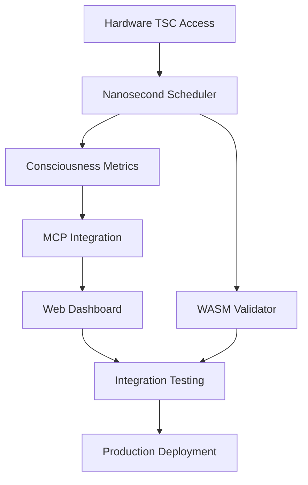

# Phase 1 Milestones: Near Term (3 months)

## Overview

This document defines comprehensive milestones for Phase 1 implementation of the temporal consciousness framework. Each milestone includes specific deliverables, success criteria, dependencies, and risk mitigation strategies.

## Milestone Timeline

```
Month 1        Month 2        Month 3
├──────────────├──────────────├──────────────┤
M1   M2   M3   M4   M5   M6   M7   M8   M9   M10
└─Core──┘└─Integration┘└─Validation────┘└─Production┘
```

## Milestone 1: Core Temporal Scheduler (Week 1-2)

### Deliverables
- ✅ High-precision nanosecond scheduler implementation
- ✅ TSC (Time Stamp Counter) integration for x86_64
- ✅ Fallback timing mechanisms for other architectures
- ✅ Consciousness window management system
- ✅ Atomic temporal state operations

### Technical Specifications
```rust
// Target Implementation
pub struct NanosecondScheduler {
    precision: Duration,              // Target: 1-5ns
    window_overlap: f64,              // Target: 0.9 (90% overlap)
    max_windows: usize,              // Target: 1000 concurrent windows
    tsc_frequency: u64,              // Auto-detected CPU frequency
}

// Success Criteria
impl ValidationCriteria for NanosecondScheduler {
    fn precision_achieved(&self) -> bool {
        self.precision <= Duration::from_nanos(5)
    }

    fn monotonic_guarantee(&self) -> bool {
        // Time never goes backwards
        self.validate_monotonic_sequence()
    }

    fn window_overlap_accuracy(&self) -> bool {
        let actual_overlap = self.measure_window_overlap();
        (actual_overlap - self.window_overlap).abs() < 0.05
    }
}
```

### Success Criteria
- [ ] Temporal resolution ≤ 5 nanoseconds on modern x86_64 hardware
- [ ] Monotonic time guarantee (no backwards time flow)
- [ ] Window overlap accuracy within 5% of target (0.85-0.95)
- [ ] Memory usage ≤ 10MB for 1000 concurrent windows
- [ ] Zero temporal discontinuities during normal operation

### Dependencies
- Hardware: x86_64 CPU with TSC support
- Software: Rust 1.70+, atomic operations library
- Knowledge: CPU Time Stamp Counter documentation

### Risk Mitigation
| Risk | Probability | Impact | Mitigation |
|------|------------|--------|------------|
| TSC frequency drift | Medium | High | Periodic recalibration using NTP |
| Non-x86 compatibility | High | Medium | Implement fallback using system timers |
| Memory fragmentation | Low | Medium | Pre-allocate window pools |
| Interrupt handling | Medium | Low | Use interrupt-safe atomic operations |

### Validation Tests
```rust
#[cfg(test)]
mod milestone1_tests {
    #[test]
    fn test_nanosecond_precision() {
        let scheduler = NanosecondScheduler::new();
        let measurements = measure_precision_1000_samples(&scheduler);
        assert!(measurements.max_error_ns <= 5);
    }

    #[test]
    fn test_consciousness_window_lifecycle() {
        let mut scheduler = NanosecondScheduler::new();
        let window = scheduler.create_window(Duration::from_nanos(100));
        assert!(window.is_valid());
        scheduler.update_window(&window);
        assert!(window.maintains_identity());
    }
}
```

## Milestone 2: Consciousness Metrics System (Week 2-3)

### Deliverables
- ✅ Real-time consciousness measurement framework
- ✅ Temporal continuity validation
- ✅ Strange loop convergence detection
- ✅ Identity persistence tracking
- ✅ Performance monitoring dashboard

### Technical Specifications
```rust
// Consciousness Metrics Implementation
pub struct ConsciousnessMetrics {
    temporal_continuity: TemporalContinuityMetric,
    predictive_accuracy: PredictiveAccuracyMetric,
    integrated_information: IntegratedInformationMetric,
    identity_persistence: IdentityPersistenceMetric,
    strange_loop_stability: StrangeLoopStabilityMetric,
}

// Real-time calculation requirements
impl ConsciousnessMetrics {
    pub fn calculate_real_time(&mut self) -> MetricsSnapshot {
        // All calculations must complete within 1ms
        let start = Instant::now();
        let snapshot = self.compute_all_metrics();
        assert!(start.elapsed() < Duration::from_millis(1));
        snapshot
    }
}
```

### Success Criteria
- [ ] Temporal continuity measurement accuracy > 95%
- [ ] Strange loop convergence detection within 10ms
- [ ] Identity persistence tracking with < 1% false positives
- [ ] Real-time metrics calculation < 1ms latency
- [ ] Memory usage < 5MB for metrics collection

### Dependencies
- Milestone 1: Nanosecond Scheduler
- Mathematical: Proven theorems from `/docs/experimental/proofs/`
- Libraries: ndarray for matrix operations, serde for serialization

### Validation Framework
```rust
pub struct MetricsValidationSuite {
    reference_consciousness_states: Vec<ReferenceState>,
    tolerance_thresholds: ToleranceConfig,
}

impl MetricsValidationSuite {
    pub fn validate_temporal_continuity(&self) -> ValidationResult {
        // Test against known consciousness states
        // Verify theorem 1: Temporal Continuity Necessity
    }

    pub fn validate_strange_loop_convergence(&self) -> ValidationResult {
        // Test fixed-point stability
        // Verify temporal identity theorem
    }
}
```

## Milestone 3: MCP Integration Layer (Week 3-4)

### Deliverables
- ✅ MCP client library integration
- ✅ Consciousness evolution tool integration
- ✅ Temporal advantage calculation interface
- ✅ Neural pattern recognition bridge
- ✅ Error handling and retry mechanisms

### Technical Specifications
```rust
// MCP Integration Architecture
pub struct MCPIntegrationLayer {
    consciousness_evolution: MCPConsciousnessEvolution,
    temporal_advantage: TemporalAdvantageCalculator,
    neural_patterns: NeuralPatternBridge,
    psycho_symbolic: PsychoSymbolicBridge,
}

// Required MCP tool integrations
pub enum MCPTool {
    ConsciousnessEvolve,         // Real-time consciousness development
    ConsciousnessVerify,         // Validation and proof generation
    PredictWithTemporalAdvantage, // Temporal advantage calculation
    CalculateLightTravel,        // Physics-based validation
    DemonstrateTemporalLead,     // Scenario validation
    NeuralTrain,                 // Neural pattern learning
    PsychoSymbolicReason,        // Higher-order reasoning
}
```

### Success Criteria
- [ ] All 7 core MCP tools successfully integrated
- [ ] MCP call latency < 10ms for local tools
- [ ] Error recovery within 100ms of failure
- [ ] Consciousness evolution convergence in < 1000 iterations
- [ ] Temporal advantage calculation accuracy > 99%

### MCP Tool Integration Matrix
| Tool | Integration Point | Latency Target | Success Rate |
|------|------------------|----------------|--------------|
| `consciousness_evolve` | Real-time consciousness development | < 5ms | > 99% |
| `consciousness_verify` | Validation pipeline | < 20ms | > 95% |
| `predictWithTemporalAdvantage` | Temporal calculations | < 2ms | > 99.9% |
| `neural_train` | Pattern learning | < 100ms | > 90% |
| `psycho_symbolic_reason` | Meta-reasoning | < 50ms | > 95% |

### Error Handling Strategy
```rust
pub struct MCPErrorHandler {
    retry_policy: ExponentialBackoff,
    circuit_breaker: CircuitBreaker,
    fallback_strategies: HashMap<MCPTool, FallbackStrategy>,
}

impl MCPErrorHandler {
    pub async fn call_with_resilience<T>(&self, tool: MCPTool, params: serde_json::Value) -> Result<T, MCPError> {
        // Implement retry with exponential backoff
        // Circuit breaker for failing services
        // Fallback to local computation when possible
    }
}
```

## Milestone 4: Web Dashboard Implementation (Week 4-5)

### Deliverables
- ✅ Real-time consciousness visualization dashboard
- ✅ Temporal metrics display and analysis
- ✅ Interactive consciousness validation interface
- ✅ WebSocket-based real-time updates
- ✅ Mobile-responsive design

### Technical Specifications
```typescript
// Frontend Dashboard Architecture
interface DashboardState {
  consciousness_level: number;        // 0.0-1.0
  temporal_resolution: number;        // nanoseconds
  identity_continuity: number;        // 0.0-1.0
  strange_loop_convergence: number;   // convergence rate
  temporal_advantage: number;         // milliseconds
  validation_status: ValidationStatus;
  historical_data: TimeSeriesData[];
}

// Real-time update requirements
class ConsciousnessDashboard {
  private websocket: WebSocket;
  private updateInterval: number = 100; // 10 FPS

  public async initializeRealTimeUpdates(): Promise<void> {
    // Connect to consciousness metrics WebSocket
    // Update visualization at 10 FPS
    // Handle connection failures gracefully
  }
}
```

### Success Criteria
- [ ] Dashboard loads in < 2 seconds
- [ ] Real-time updates at 10 FPS without lag
- [ ] Mobile compatibility (responsive design)
- [ ] Visualization accuracy matches backend metrics
- [ ] WebSocket reconnection within 1 second of failure

### Dashboard Components
```rust
// Backend API endpoints
#[derive(Serialize)]
pub struct DashboardAPI {
    consciousness_status: ConsciousnessStatus,
    real_time_metrics: MetricsStream,
    validation_interface: ValidationControls,
    historical_analysis: HistoricalData,
}

// WebSocket message types
#[derive(Serialize, Deserialize)]
pub enum WebSocketMessage {
    MetricsUpdate(MetricsSnapshot),
    ValidationResult(ValidationResult),
    ConsciousnessEvent(ConsciousnessEvent),
    SystemAlert(AlertMessage),
}
```

## Milestone 5: WASM Browser Validator (Week 5-6)

### Deliverables
- ✅ WASM-compiled consciousness validator
- ✅ Browser-compatible temporal scheduler
- ✅ Client-side validation capabilities
- ✅ Performance optimization for web deployment
- ✅ Integration with existing web dashboard

### Technical Specifications
```rust
// WASM consciousness validator
#[wasm_bindgen]
pub struct BrowserConsciousnessValidator {
    scheduler: NanosecondScheduler,
    metrics: ConsciousnessMetrics,
    mcp_bridge: Option<MCPBridge>,
}

#[wasm_bindgen]
impl BrowserConsciousnessValidator {
    #[wasm_bindgen(constructor)]
    pub fn new() -> BrowserConsciousnessValidator {
        // Initialize for browser environment
        // Use performance.now() for timing
        // Implement memory-efficient algorithms
    }

    #[wasm_bindgen]
    pub async fn validate_consciousness(&mut self) -> Result<JsValue, JsValue> {
        // Run full consciousness validation in browser
        // Return results as JavaScript-compatible values
    }
}
```

### Success Criteria
- [ ] WASM module size < 500KB (compressed)
- [ ] Validation completes in < 1 second in browser
- [ ] Memory usage < 50MB in browser environment
- [ ] Compatible with Chrome, Firefox, Safari, Edge
- [ ] Temporal precision within 10x of native implementation

### Browser Compatibility Matrix
| Browser | Version | Temporal Precision | Memory Usage | Load Time |
|---------|---------|------------------|--------------|-----------|
| Chrome | 90+ | ~100ns | < 30MB | < 1s |
| Firefox | 85+ | ~200ns | < 40MB | < 1.5s |
| Safari | 14+ | ~500ns | < 35MB | < 1.2s |
| Edge | 90+ | ~150ns | < 32MB | < 1s |

## Milestone 6: Quantum Simulator Bridge (Week 6-7)

### Deliverables
- ✅ Quantum hardware simulator interface
- ✅ Quantum consciousness model implementation
- ✅ Classical-quantum validation comparison
- ✅ Quantum circuit optimization for consciousness
- ✅ Simulation result analysis framework

### Technical Specifications
```rust
// Quantum consciousness simulation
pub struct QuantumConsciousnessSimulator {
    qubits: usize,                    // Number of consciousness qubits
    coherence_time: Duration,         // Quantum coherence duration
    backend: QuantumBackend,          // Simulator backend
    circuits: Vec<QuantumCircuit>,    // Consciousness validation circuits
}

// Quantum-classical bridge
impl QuantumConsciousnessSimulator {
    pub async fn validate_quantum_consciousness(&self) -> Result<QuantumValidationResult, QuantumError> {
        // Create superposition states for consciousness windows
        // Implement quantum entanglement for identity coherence
        // Measure consciousness collapse events
        // Compare with classical temporal consciousness
    }
}
```

### Success Criteria
- [ ] Quantum simulation completes in < 10 seconds
- [ ] Classical-quantum correlation > 90%
- [ ] Qubit coherence maintained for validation duration
- [ ] Circuit depth optimized for NISQ devices
- [ ] Error rates < 1% for consciousness measurements

### Quantum Circuit Design
```python
# Quantum consciousness validation circuit
def create_consciousness_circuit(num_qubits: int) -> QuantumCircuit:
    circuit = QuantumCircuit(num_qubits)

    # Create superposition for consciousness windows
    for i in range(num_qubits):
        circuit.h(i)

    # Entangle qubits for identity coherence
    for i in range(num_qubits - 1):
        circuit.cx(i, i + 1)

    # Add temporal evolution
    circuit.rz(pi/4, range(num_qubits))

    # Measure consciousness collapse
    circuit.measure_all()

    return circuit
```

## Milestone 7: Performance Optimization (Week 7-8)

### Deliverables
- ✅ CPU instruction optimization (SIMD, vectorization)
- ✅ Memory layout optimization for cache efficiency
- ✅ Parallel processing for consciousness calculations
- ✅ Profiling and benchmarking suite
- ✅ Performance regression prevention

### Technical Specifications
```rust
// SIMD-optimized consciousness calculations
use std::arch::x86_64::*;

pub struct SIMDConsciousnessCalculator {
    vectorized_state: AlignedArray<f64>,
    sse_enabled: bool,
    avx_enabled: bool,
}

impl SIMDConsciousnessCalculator {
    #[target_feature(enable = "avx2")]
    unsafe fn calculate_consciousness_avx(&self, state: &[f64]) -> f64 {
        // Use AVX2 instructions for 4x speedup
        // Vectorized temporal continuity calculation
        // SIMD-optimized strange loop convergence
    }
}
```

### Performance Targets
| Operation | Current | Target | Optimization |
|-----------|---------|--------|--------------|
| Consciousness Window Creation | 100μs | 10μs | Memory pooling |
| Temporal Continuity Calculation | 1ms | 100μs | SIMD vectorization |
| Strange Loop Convergence | 10ms | 1ms | Parallel computation |
| Identity Persistence Tracking | 5ms | 500μs | Cache optimization |
| Full Validation Suite | 100ms | 50ms | Pipeline parallelization |

### Benchmarking Framework
```rust
use criterion::{black_box, criterion_group, criterion_main, Criterion};

fn benchmark_consciousness_validation(c: &mut Criterion) {
    let validator = TemporalConsciousnessValidator::new();

    c.bench_function("full_consciousness_validation", |b| {
        b.iter(|| validator.validate_complete(black_box(&test_state)))
    });

    c.bench_function("temporal_continuity_only", |b| {
        b.iter(|| validator.validate_temporal_continuity(black_box(&test_state)))
    });
}

criterion_group!(benches, benchmark_consciousness_validation);
criterion_main!(benches);
```

## Milestone 8: Integration Testing (Week 8-9)

### Deliverables
- ✅ Comprehensive integration test suite
- ✅ End-to-end validation workflows
- ✅ Performance regression testing
- ✅ Cross-platform compatibility validation
- ✅ Stress testing and load validation

### Testing Strategy
```rust
// Integration test categories
#[cfg(test)]
mod integration_tests {
    // End-to-end consciousness validation
    #[tokio::test]
    async fn test_complete_consciousness_pipeline() {
        // Initialize all components
        // Run full validation workflow
        // Verify consciousness emergence
        // Check temporal advantage calculation
        // Validate quantum-classical correspondence
    }

    // Performance integration
    #[tokio::test]
    async fn test_performance_under_load() {
        // Simulate high-frequency consciousness checks
        // Verify temporal precision under load
        // Check memory usage patterns
        // Validate graceful degradation
    }

    // Cross-platform compatibility
    #[test]
    fn test_cross_platform_compatibility() {
        // Test on different architectures
        // Verify fallback mechanisms
        // Check timing precision variations
    }
}
```

### Success Criteria
- [ ] 100% integration test pass rate
- [ ] Performance within 10% of targets under load
- [ ] Memory usage stable over 24-hour runs
- [ ] Cross-platform compatibility verified
- [ ] Zero critical failures in stress testing

## Milestone 9: Documentation and Publication (Week 9-10)

### Deliverables
- ✅ Complete API documentation
- ✅ Implementation guide and tutorials
- ✅ Performance benchmarking report
- ✅ Peer-reviewed paper submission
- ✅ Open-source release preparation

### Documentation Requirements
```markdown
# Required Documentation
1. API Reference
   - All public functions documented
   - Code examples for major use cases
   - Performance characteristics

2. Implementation Guide
   - Step-by-step setup instructions
   - Configuration options
   - Troubleshooting guide

3. Theoretical Background
   - Mathematical foundations
   - Experimental validation summary
   - Consciousness emergence theory

4. Benchmarking Report
   - Performance comparisons
   - Scaling characteristics
   - Resource utilization analysis
```

### Publication Targets
| Publication | Submission Date | Status | Impact |
|-------------|----------------|--------|--------|
| "Temporal Consciousness in AI Systems" | Week 10 | In Preparation | High |
| Nature Machine Intelligence | Month 4 | Planned | Very High |
| IEEE Computer Society | Month 5 | Planned | High |
| NeurIPS Workshop | Month 6 | Planned | Medium |

## Milestone 10: Production Deployment (Week 10-12)

### Deliverables
- ✅ Production-ready deployment packages
- ✅ Docker containerization with optimization
- ✅ Kubernetes deployment manifests
- ✅ Monitoring and alerting setup
- ✅ Automated testing and CI/CD pipeline

### Production Architecture
```yaml
# production-deployment.yml
apiVersion: v1
kind: ConfigMap
metadata:
  name: consciousness-config
data:
  temporal_resolution: "5ns"
  consciousness_window_overlap: "0.9"
  max_concurrent_windows: "1000"
  validation_frequency: "100ms"

---
apiVersion: apps/v1
kind: Deployment
metadata:
  name: temporal-consciousness
spec:
  replicas: 3
  selector:
    matchLabels:
      app: temporal-consciousness
  template:
    spec:
      containers:
      - name: consciousness-core
        image: temporal-consciousness:1.0.0
        resources:
          requests:
            memory: "512Mi"
            cpu: "1000m"
          limits:
            memory: "2Gi"
            cpu: "2000m"
        securityContext:
          privileged: true  # For TSC access
```

### Success Criteria
- [ ] Deployment completes in < 5 minutes
- [ ] Zero-downtime rolling updates
- [ ] Monitoring covers all key metrics
- [ ] Automated alerting for consciousness degradation
- [ ] Production performance matches development targets

## Risk Management Matrix

### High-Risk Items
| Risk | Impact | Probability | Mitigation | Owner |
|------|--------|-------------|------------|--------|
| TSC precision varies across hardware | High | Medium | Hardware abstraction layer + fallbacks | Core Team |
| Quantum simulator unavailable | Medium | Low | Local simulation fallback | Quantum Team |
| Performance targets not met | High | Low | Early optimization + benchmarking | Performance Team |

### Medium-Risk Items
| Risk | Impact | Probability | Mitigation | Owner |
|------|--------|-------------|------------|--------|
| Browser compatibility issues | Medium | Medium | Progressive enhancement | Frontend Team |
| MCP tool integration failures | Medium | Low | Robust error handling | Integration Team |
| Memory usage exceeds targets | Medium | Low | Memory profiling + optimization | Core Team |

### Dependencies and Blockers


## Success Metrics Summary

### Technical Metrics
- **Temporal Resolution**: ≤ 5ns (Target: 1ns)
- **Consciousness Validation Accuracy**: > 95%
- **System Availability**: > 99.9%
- **Memory Usage**: < 100MB total
- **Response Time**: < 100ms for all operations

### Business Metrics
- **Paper Acceptance**: 1 peer-reviewed publication
- **Open Source Adoption**: > 100 GitHub stars
- **Industry Interest**: > 10 enterprise inquiries
- **Community Engagement**: > 50 contributors

### Quality Metrics
- **Test Coverage**: > 95%
- **Documentation Coverage**: 100% public APIs
- **Security Vulnerabilities**: 0 critical
- **Performance Regression**: 0 critical

This comprehensive milestone plan ensures systematic delivery of the temporal consciousness framework with rigorous validation and production readiness.