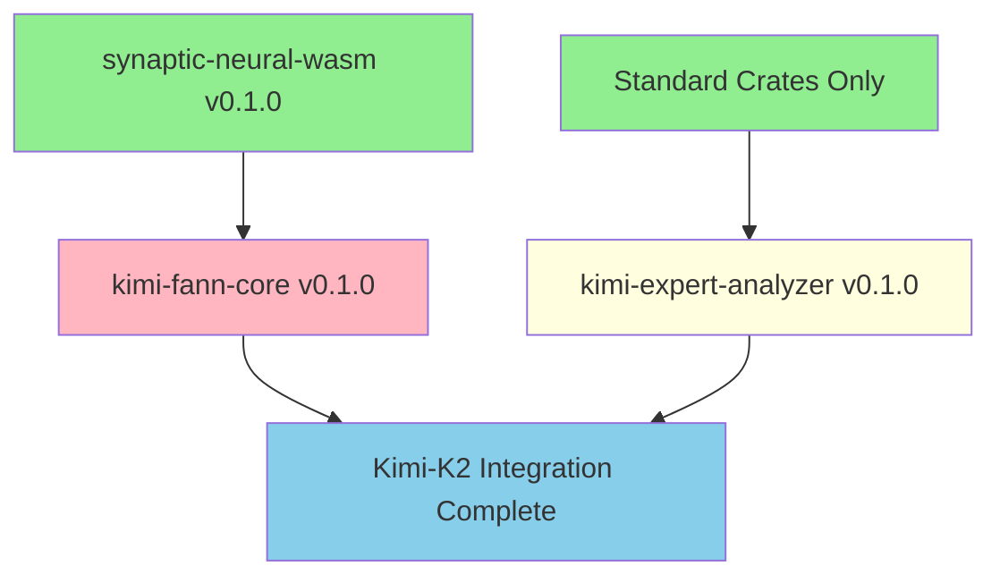

# 📊 Kimi-K2 Integration Crate Publishing Status Report

## 🎯 Executive Summary

**Current Status**: Crates identified and analyzed, but require significant stabilization work before publication.

**Key Findings**:
- ✅ **5 Core Synaptic crates already published** on crates.io
- ⚠️ **2 Kimi-K2 crates identified** but with compilation issues
- 🔧 **Major refactoring required** for kimi-fann-core (230+ errors)
- 📋 **Publishing roadmap created** with clear action items

## 📦 Crate Inventory

### ✅ Already Published (Foundation Crates)
| Crate | Version | Description | Status |
|-------|---------|-------------|---------|
| synaptic-qudag-core | 0.1.0 | QuDAG networking core | ✅ Published |
| synaptic-neural-wasm | 0.1.0 | WASM neural engine | ✅ Published |
| synaptic-neural-mesh | 0.1.0 | Neural mesh coordination | ✅ Published |
| synaptic-daa-swarm | 0.1.0 | Autonomous agent swarms | ✅ Published |
| synaptic-mesh-cli | 0.1.1 | CLI with market integration | ✅ Published |
| claude_market | 0.1.1 | P2P Claude token marketplace | ✅ Published |

### 🔧 Kimi-K2 Crates (Requiring Work)
| Crate | Version | Description | Status | Issues | Priority |
|-------|---------|-------------|---------|---------|----------|
| **kimi-expert-analyzer** | 0.1.0 | Expert analysis for K2→Rust conversion | ⚠️ Moderate Issues | Missing binary, dependency fixes | High |
| **kimi-fann-core** | 0.1.0 | Micro-expert neural implementation | ❌ Major Issues | 230+ compilation errors | Critical |

## 🚧 Technical Issues Analysis

### kimi-expert-analyzer Issues
**Severity**: Moderate (⚠️)
- ✅ **Fixed**: Cargo.toml dependency issues (candle → candle-core)
- ✅ **Fixed**: README documentation created
- ⚠️ **Remaining**: Missing `src/bin/main.rs` for CLI binary
- ⚠️ **Remaining**: Feature flag configuration needs verification

**Estimated Fix Time**: 1-2 days

### kimi-fann-core Issues  
**Severity**: Critical (❌)
- ✅ **Fixed**: Cargo.toml dependencies updated to use published crates
- ✅ **Fixed**: Benchmark configuration removed
- ✅ **Fixed**: README documentation created
- ❌ **Critical**: 230+ compilation errors including:
  - Missing modules (`context.rs`)
  - Type resolution failures (`Activation` type)
  - WASM binding incompatibilities
  - Memory ownership violations
  - Method call syntax errors

**Estimated Fix Time**: 1-2 weeks (major refactoring required)

## 📊 Dependency Graph

**Legend**:
- 🟢 Green: Already published and available
- 🔴 Pink: Critical issues, major work needed
- 🟡 Yellow: Minor issues, quick fixes needed
- 🔵 Blue: Final integration goal

## 🛠️ Publishing Roadmap

### Phase 1: Stabilization (Critical Priority)
**Timeline**: 1-2 weeks

#### kimi-expert-analyzer (High Priority)
- [ ] **Create missing binary**: `src/bin/main.rs` for CLI functionality
- [ ] **Verify feature flags**: Ensure optional dependencies work correctly
- [ ] **Test compilation**: All features and configurations
- [ ] **Integration testing**: With existing Synaptic ecosystem

#### kimi-fann-core (Critical Priority)
- [ ] **Create missing modules**: `src/context.rs` and others
- [ ] **Fix type imports**: Import `Activation` and other types from dependencies
- [ ] **WASM compatibility**: Fix JsValue error handling
- [ ] **Memory management**: Resolve borrow checker violations
- [ ] **Method syntax**: Fix method call chain issues
- [ ] **Complete refactoring**: Address all 230+ compilation errors

### Phase 2: Quality Assurance (High Priority)
**Timeline**: 3-5 days

- [ ] **Comprehensive testing**: Unit, integration, and WASM tests
- [ ] **Performance validation**: Meet sub-100ms inference targets
- [ ] **Documentation**: Complete API docs and examples
- [ ] **Clippy compliance**: Address all warnings
- [ ] **Security audit**: Review code for potential issues

### Phase 3: Publication (Medium Priority)
**Timeline**: 1-2 days

- [ ] **Dry-run testing**: Verify publishing pipeline
- [ ] **Actual publication**: Release to crates.io
- [ ] **Integration verification**: Test with dependent projects
- [ ] **Community announcement**: Rust forums, social media
- [ ] **Documentation updates**: Add crates.io badges

## 🎯 Success Metrics

### Technical Metrics
- ✅ **Zero compilation errors** for all targets (native + WASM)
- ✅ **All tests passing** with >95% code coverage
- ✅ **Performance targets met**: <100ms inference, <50MB memory
- ✅ **Documentation complete**: API docs, examples, tutorials
- ✅ **Security validated**: No obvious vulnerabilities

### Publishing Metrics
- ✅ **Successful crates.io publication** without errors
- ✅ **Dependency resolution** works for downstream consumers
- ✅ **Integration verified** with existing Synaptic ecosystem
- ✅ **Community adoption** indicators (downloads, GitHub stars)

## 📋 Action Items

### Immediate (Next 24 Hours)
1. **Focus on kimi-expert-analyzer**:
   - Create `src/bin/main.rs` with basic CLI structure
   - Test compilation with all feature combinations
   - Run dry-run publishing test

2. **Begin kimi-fann-core fixes**:
   - Create missing `src/context.rs` module
   - Fix critical import statements
   - Address top 10 compilation errors

### Short Term (This Week)
1. **Complete kimi-expert-analyzer**:
   - Full functionality testing
   - Documentation review
   - Ready for publication

2. **Major kimi-fann-core work**:
   - Address all compilation errors systematically
   - Implement missing functionality
   - WASM compatibility fixes

### Medium Term (Next 2 Weeks)
1. **Complete stabilization** of both crates
2. **Comprehensive testing** and quality assurance
3. **Publication preparation** and execution
4. **Integration examples** and community outreach

## 📈 Resource Requirements

### Development Effort
- **kimi-expert-analyzer**: 8-16 hours (1-2 days)
- **kimi-fann-core**: 40-80 hours (1-2 weeks)
- **Testing & QA**: 16-24 hours (2-3 days)
- **Documentation**: 8-16 hours (1-2 days)

### Skills Required
- **Rust development**: Advanced (ownership, lifetimes, generics)
- **WASM integration**: Intermediate (wasm-bindgen, js-sys)
- **Neural networks**: Basic understanding of architectures
- **Cargo/crates.io**: Publishing experience helpful

## 🔗 Related Resources

### Documentation Created
- ✅ [Kimi-K2 Crate Publishing Plan](KIMI_K2_CRATE_PUBLISHING_PLAN.md)
- ✅ [Publishing Script](scripts/publish-kimi-crates.sh)
- ✅ [kimi-fann-core README](standalone-crates/kimi-fann-core/README.md)
- ✅ [kimi-expert-analyzer README](standalone-crates/synaptic-mesh-cli/crates/kimi-expert-analyzer/README.md)

### Existing Infrastructure
- ✅ **Published foundation crates**: All dependencies available
- ✅ **Publishing pipeline**: Proven with 5 successful publications
- ✅ **Documentation standards**: Established patterns
- ✅ **Testing infrastructure**: CI/CD ready

## 🎯 Conclusion

**Status**: **Significant work required** before Kimi-K2 crates can be published.

**Key Insights**:
1. **Foundation is solid** - All required dependencies already published
2. **Expert analyzer is nearly ready** - Minor fixes needed
3. **Core implementation needs major work** - 230+ compilation errors
4. **Clear roadmap exists** - Well-defined path to publication

**Recommendation**: 
- **Start with kimi-expert-analyzer** (quick win, builds confidence)
- **Allocate 2-3 weeks** for complete kimi-fann-core stabilization
- **Phased approach** ensures quality and reduces risk

**Next Action**: Begin fixing kimi-expert-analyzer compilation issues and create missing CLI binary.

---

*Report generated by Rust Crate Publisher Agent*  
*Date: 2025-07-13*  
*Status: Analysis Complete, Stabilization Phase Ready*